Docker 是一种容器技术，它可以在操作系统上创建多个相互隔离的容器。容器内独立安装软件、运行服务。

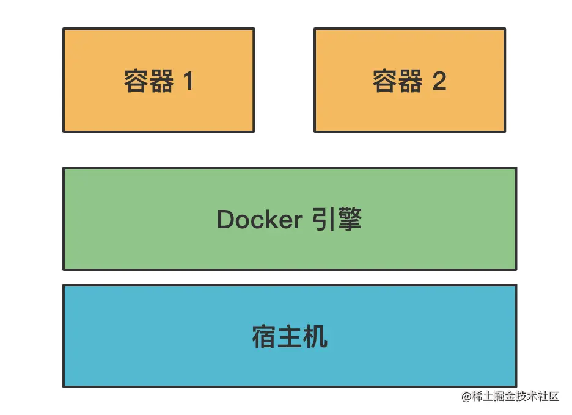

但是，这个容器和宿主机还是有关联的，比如可以把宿主机的端口映射到容器内的端口、宿主机某个目录挂载到容器内的目录

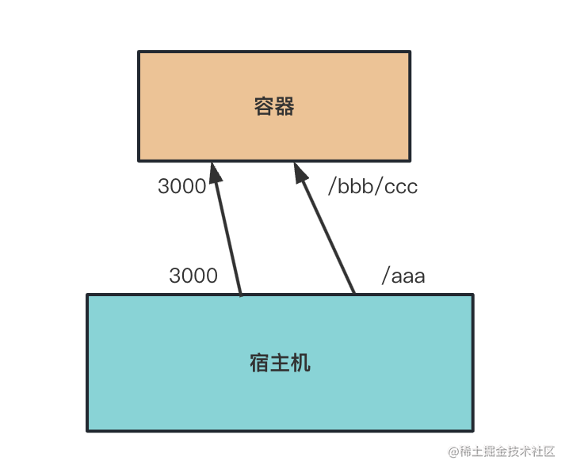

比如映射了3000端口，那容器内3000端口的服务，就可以在宿主机的3000端口访问了。

比如挂载了/aaa到容器的/bbb/ccc,那容器内读写/bbb/ccc目录的时候，改的就是宿主机的/aaa目录，反过来，改宿主机/aaa目录，容器内的/bbb/ccc也会改，这两同一个。

这分别叫做<span style="color: red;font-weight:bold">端口映射、数据卷(volume)挂载</span>

这个容器是通过镜像起来的，通过docker run images-name

比如
```shell
docker run -p 3000:3000 -v /aaa:/bbb/ccc --name xxx-container xx-image
```
通过xx-image 镜像跑起来一个叫做xxx-container的容器。

-p 指定端口映射，映射宿主机的3000到容器的3000端口

-v 指定数据卷挂载，挂载宿主机的/aaa到容器的/bbb/ccc目录。

这个镜像是通过 Dockerfiler 经过build产生的

也就是这样的流程

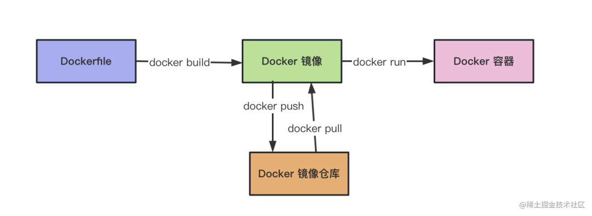

一般在项目里维护dockerfile，然后执行docker build构建出镜像、push到镜像仓库，部署的的时候pull下来用docker run跑起来。

基本CI/CD也是这样的流程：

CI 的时候git clone 项目，根据dockerfile构建出镜像，打上tag，push到仓库

CD 的时候把打 tag的镜像下载下来，docker run 跑起来。

这个 Dokcerfile 是在项目里维护的，虽然CI/CD流程不用自己搞，但是Dockerfile还是要开发者自己写的。

比如我创建了一个nest项目
```shell
npx nest new dockerfile-test -p npm
```
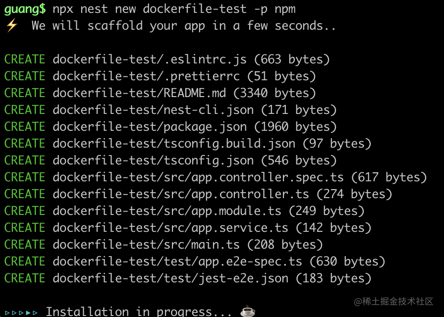

然后执行npm run build，之后把它跑起来
```js
npm run build
node ./dist/main.js
```
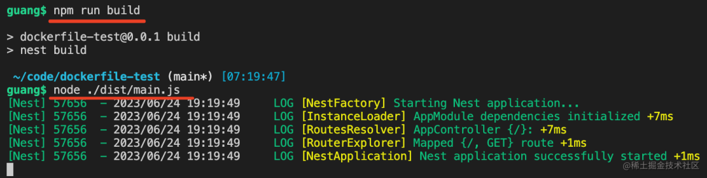

这时候访问http://localhost:3000 可以看到hello world，说明服务器跑成功了


那如何通过Docker部署这个服务呢？

首先，如果你没安装docker,可以从docker.com下载docker desktop，它自带了docker 命令

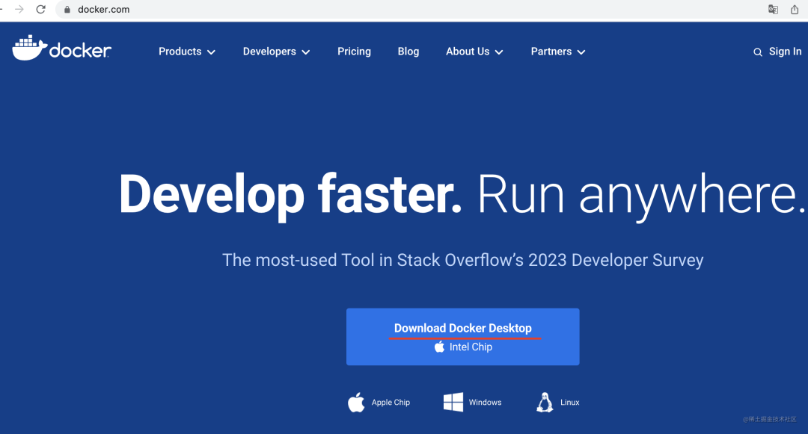

跑起来可以看到本地的所有docker容器和镜像

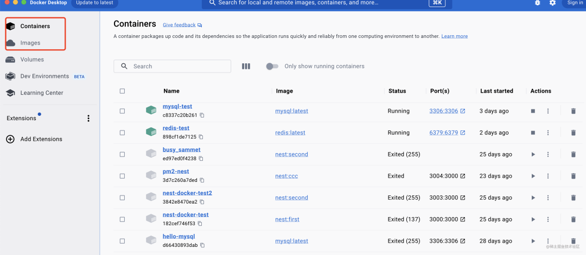

命令行也是可以用的
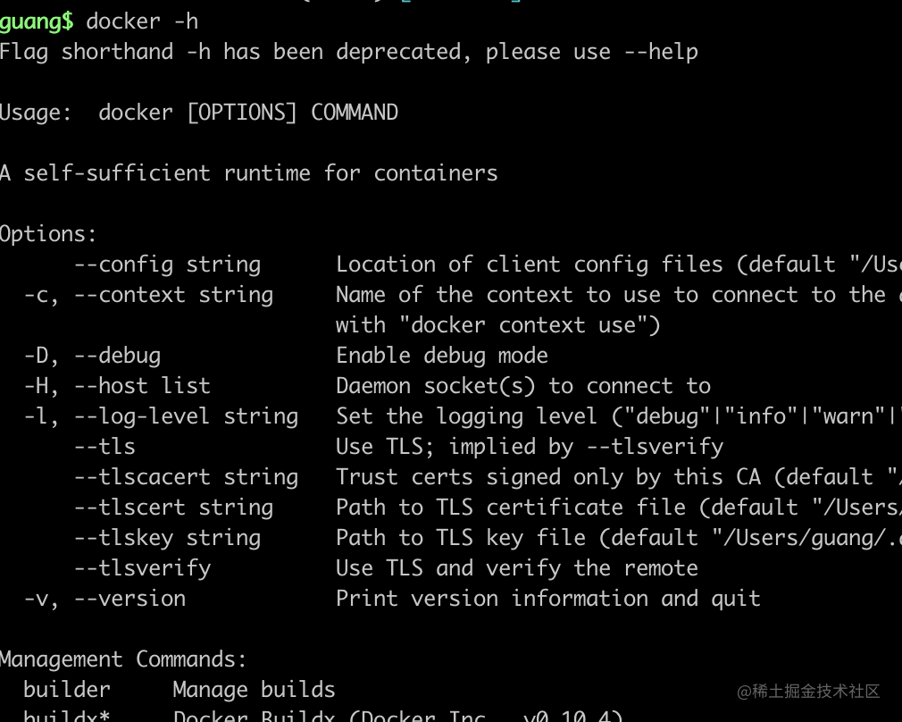

然后我们来写下Dockerfile
```js
FROM node:18

WORKDIR /app

COPY package.json .

COPY *.lock .

RUN npm config set registry https://registry.npmmirror.com/

RUN npm install

COPY . .

RUN npm run build

EXPOSE 3000

CMD [ "node", "./dist/main.js" ]
```
FROM node:18 是继承 node:18 基础镜像。

WORKDIR /app 是指定当前目录为/app

COPY 复制宿主机的package.json 和 lock 文件到容器的当前目录，也就是/app下

RUN 是执行命令，这里执行了npm install

然后再复制其余的文件到容器内。

EXPOSE 指定容器需要暴露的端口是3000.

CMD指定容器跑起来时执行的命令是 node ./dist/main.js

然后通过 docker build 把它构建成镜像：
```js
docker build -t dockerfile-test:first
```
-t 是指定名字和标签，这里镜像名为 dockerfile-test 标签为 first

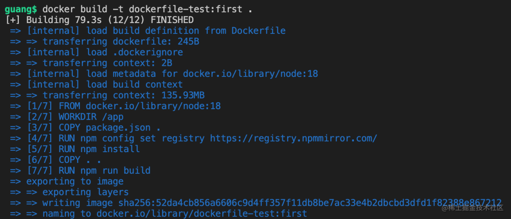

然后在 docker desktop 的iamges里就可以看到这个镜像了

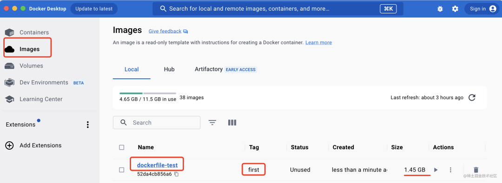

就是现在镜像稍微大了点，有 1.45 G。

我们先跑起来看看：
```js
docker run -d -p 2333:3000 --name first-container dockerfile-test:first
```
<span style="color: blue">-d 是后台运行</span>

<span style="color: blue">-p 指定端口映射，映射宿主机2333端口到容器的3000端口</span>

<span style="color: blue">--name 指定容器名</span>

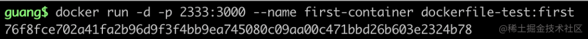

然后就可以看到容器部分有了这个这个容器

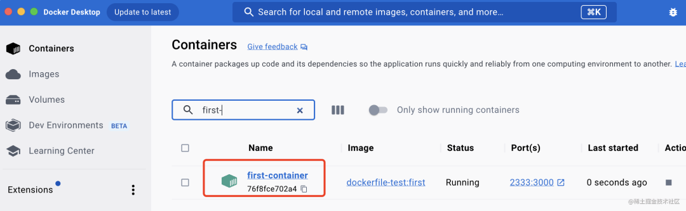

浏览器访问 http://localhost:2333 就可以访问容器内跑的这个服务：


这就是 Dockerfile 构建成镜像，然后通过容器跑起来的流程。

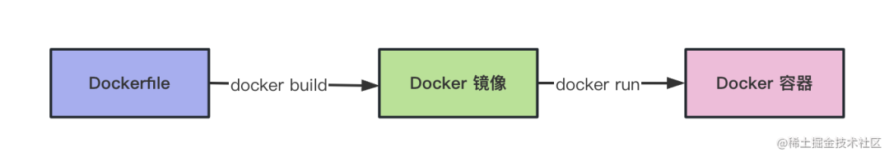

但是刚才也发现了，现在镜像太大了，有 1.45G 呢，怎么优化一下呢？

这就涉及到了第一个技巧：

## 使用 alpine 镜像，而不是默认的 linux 镜像
docker容器内跑的是linux系统，各种镜像的dockerfile都会继承linux镜像作为基础镜像。

比如我们刚刚创建的那个镜像，点开详情可以看到它的镜像继承关系

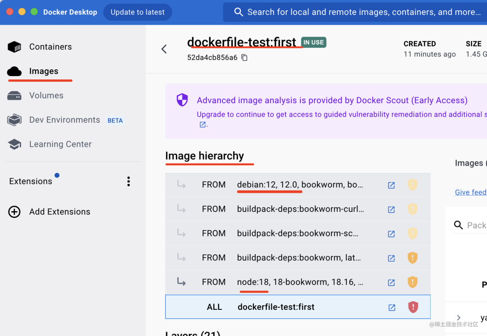

最终还是继承了debian的Linux镜像，这是一个linux发行版

但其实这个linux镜像可以换成更小的版本，也就是alpine。

它裁剪了很多不必要的linux功能，使得镜像体积大幅减小了。

alpine 是高山植物，就是很少的资源就能存活的意思。

我们改下 dockerfile，使用 alpine 的镜像：

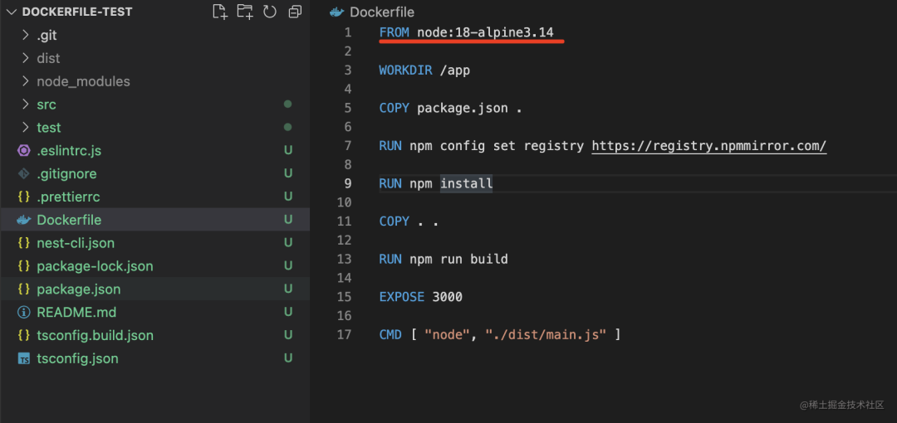

node:18-alpine3.14是使用18版本的node镜像

然后 docker build
```js
docker build -t dockerfile-test:second
```
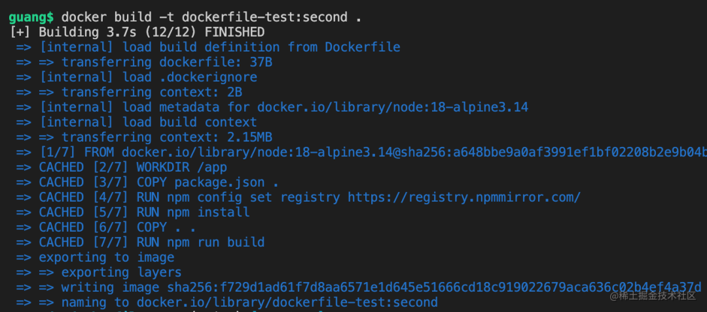

这次的 tag 为 second。

然后在docker desktop 里看下
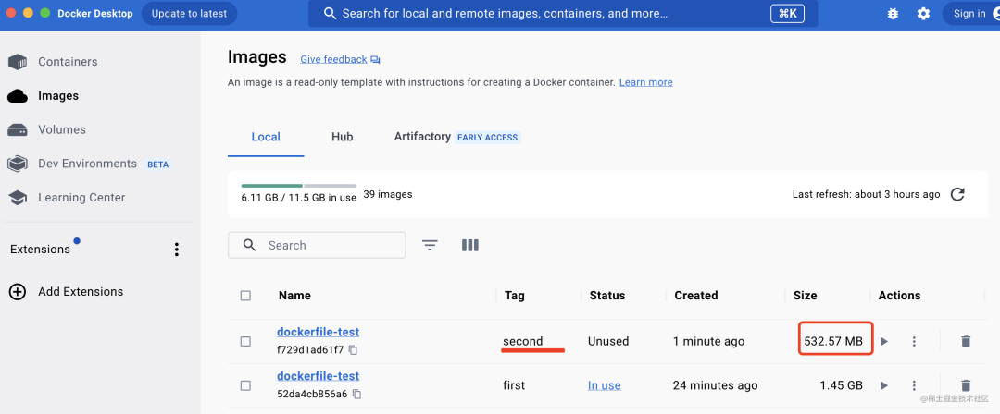

好家伙，足足小了 900M。

我们点开看看：
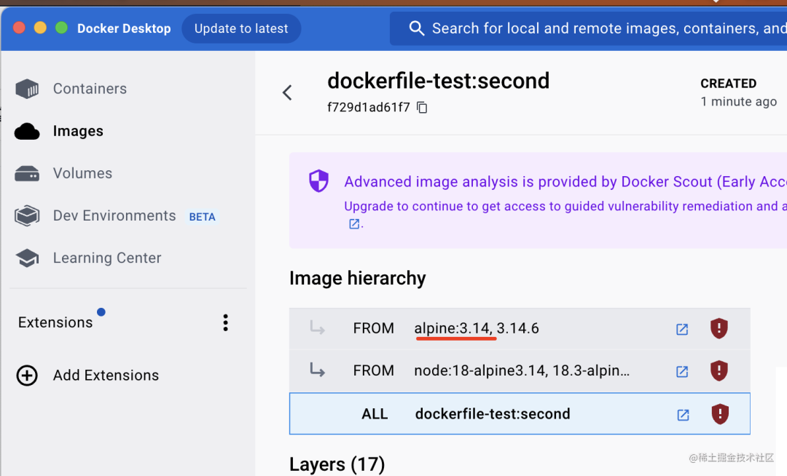

可以看到它的底层linux镜像是 alpine3.14

体积小了这么多，功能还正常么？

我们跑跑看：
```js
docker run -d -p 2334:3000 --name second-container dockerfile-test:second
```

docker desktop 可以看到这个跑起来的容器：

浏览器访问下，依然是正常的：


alpine只是去掉了很多linux里用不到的功能，使得镜像体积更小

这就是第一个技巧。

然后再来看第二个：

## 使用多阶段构建
看下面这个 dockerfile，大家发现有啥问题没？
```shell
FROM node:18-alpine3.14

WORKDIR /app

COPY package.json .

RUN npm config set registry https://registry.npmmirror.com/

RUN npm install

COPY . .

RUN npm run build

EXPOSE 3000

CMD ["node", "./dist/main.js"]
```
有的同学可能会说：为什么先复制package.json 进去，安装一类之后在赋值其他文件，直接全服赋值进去不就行了？

不是的，这两种写法的效果不同。

<span style="color: blue">docker 是分层存储的，dockerfile里的每一行指令是一层，会做缓存</span>

<span style="color: blue">每次docker build的时候，只会从变化的层开始重新构建，没变的层会直接复用</span>

<span style="color: blue">**也就说现在这种写法，如果package.json没变，那么就不会执行 npm  install,直接复用之前的。**</span>

那如果一开始就把所有文件复制进去呢？

那不管 package.json 变没变，任何一个文件变了，都会重新 npm install，这样没法充分利用缓存，性能不好。

我们试试看就知道了：

现在重新跑 docker build，不管跑多少次，速度都很快，因为文件没变，直接用了镜像缓存：
```js
docker build -t dockerfile-test:second .
```
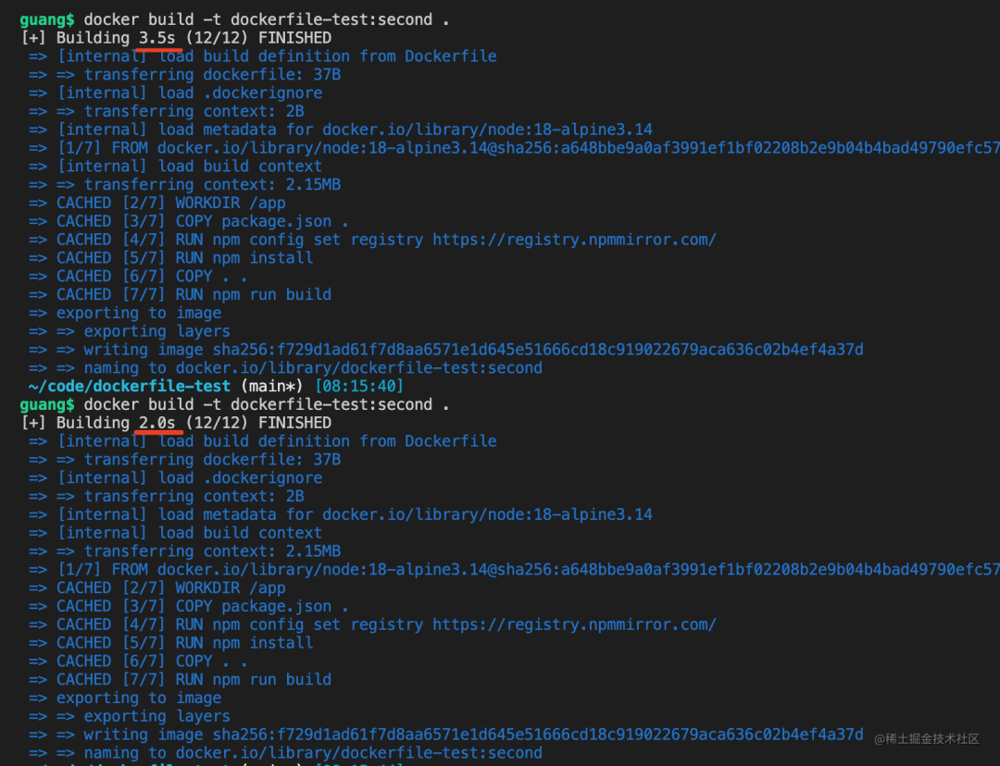

现在我们改下 README.md

然后重新跑 build：
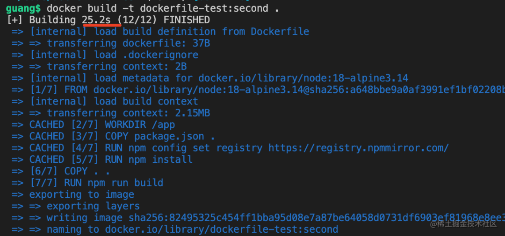

现在花了 25s，其实是没有重新 npm install 的。

然后改下 package.json：

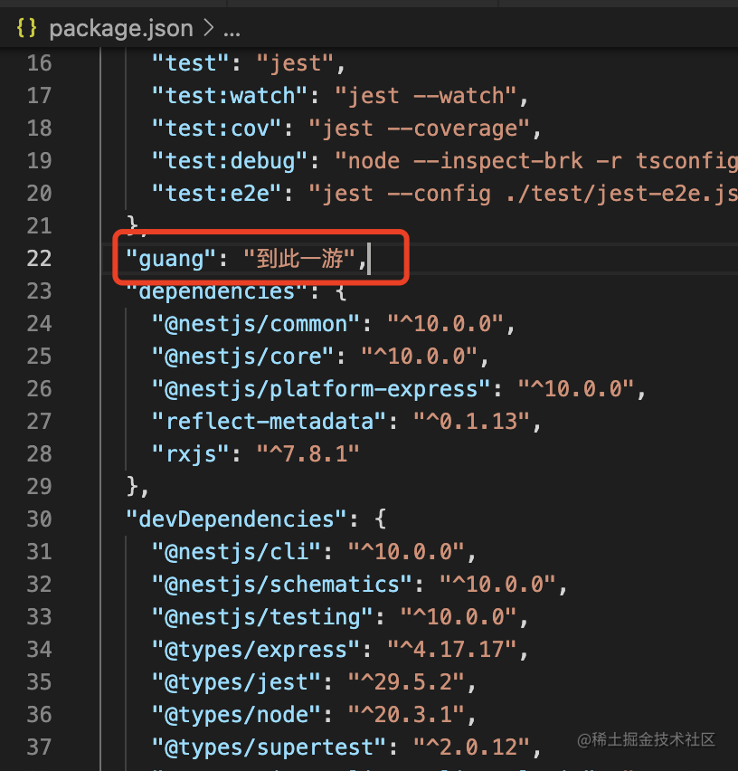

再跑 docker build

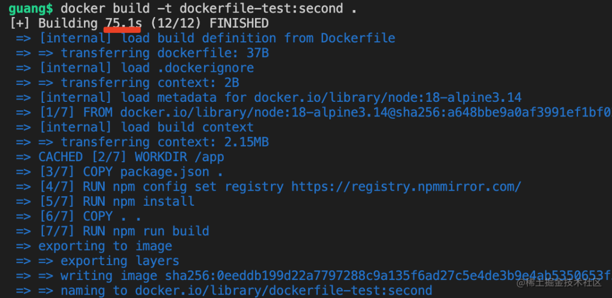

时间明显多了很多，过程中你可以看到在 npm install 那层停留了很长时间。

这就是为什么要这样写：

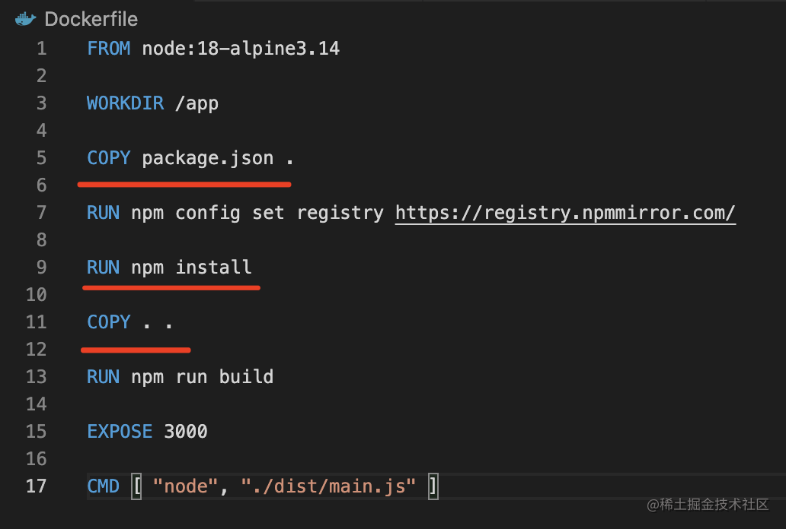

这里没问题，大家还能发现有别的问题吗？

问题就是源码和很多构建的依赖是不需要的，但是现在都保存在了镜像里。

实际上我们只需要构建出来的./dist目录下的文件还有运行时的依赖。

那怎么办呢？

这时可以用多阶段构建：
```shell
FROM node:18-alpine3.14 as build-stage

WORKDIR /app

COPY package.json .

RUN npm install

COPY . .

RUN npm run build

# production stage
FROM node:18-alpine3.14 as production-stage

COPY --from=build-stage /app/dist /app
COPY --from=build-stage /app/package.json /app/package.json

WORKDIR /app

RUN  npm install --production

EXPOSE 3000

CMD ["node", "/app/main.js"]
```
<span style="color: red">FROM 后面添加一个 as 来指定当前构建阶段的名字</span>

<span style="color: red">通过 COPY --from=xxx可以从上个阶段复制文件过来。</span>

<span style="color: red">然后 npm install 的时候添加 --production，这样只会安装dependencies的依赖</span>

<span style="color: red">docker build之后，只会留下最后一个阶段的镜像</span>

<span style="color: red">也就是说，最终构建出来的镜像里没有源码的，有的只是dist的文件和运行时的依赖</span>

这样镜像会小很多

```shell
docker build -t dockerfile-test:third -f 222.Dockerfile
```
标签为third

<span style="color: red">-f 是指定 Dockerfile 的名字41.j</span>

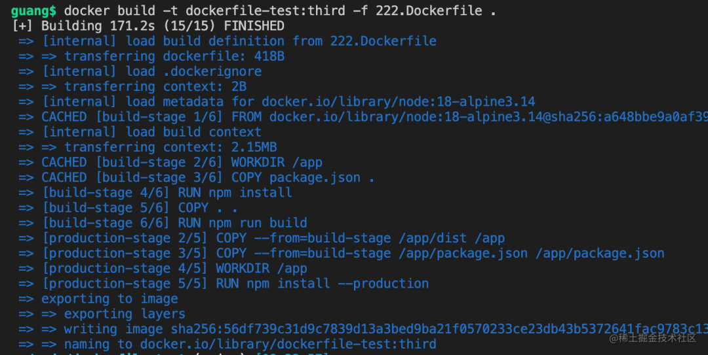

然后 desktop 里看下构建出来的镜像：
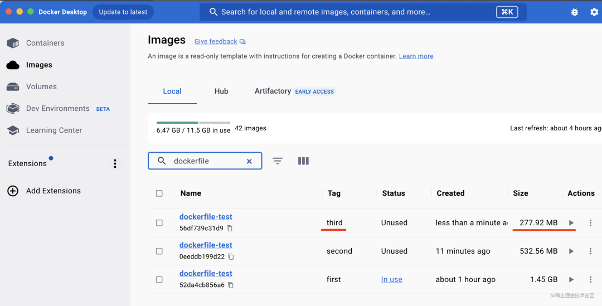

镜像体积比没有用多阶段构建的时候小了250M。

然后跑起来看看

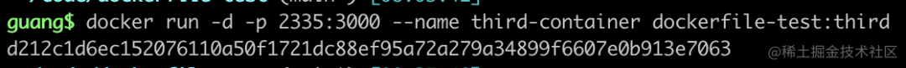

这次映射 2335 端口到容器内的 3000 端口。

依然能正常访问：

这就是第二个技巧，多阶段构建。

## 使用 ARG 增加构建灵活性
我们写一个test.js
```js
console.log(process.env.aaa)；

console.log(process.env.bbb);
```
打印了环境变量aaa、bbb

跑一下：
```js
export aaa=1 bbb= 2

node ./test.js
```
可以看到打印了这两环境变量

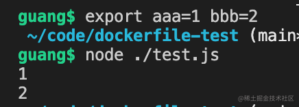

然后我们写个dockerfile,文件名是333.Dockerfile
```dockerfile
FROM node:18-alpine3.14

ARG aaa
ARG bbb

WORKDIR /app

COPY ./test.js

ENV aaa=${aaa} \
    bbb=${bbb}

CMD ["node", "/app/test.js"]
```

<span style="color: red">使用ARG声明构建参数，使用 `${xxx}`获取</span>

<span style="color: red">然后用ENV声明环境变量</span>

<span style="color: red">dockerfile 内换行使用 '\'</span>

之后构建的时候传入构建参数
```shell
docker build --build-arg aaa=3 --build-arg bbb=4 -t arg-test -f 333.Dockerfile .
```
<span style="color: red">通过 --build-arg xxx=yyy 传入ARG参数的值</span>

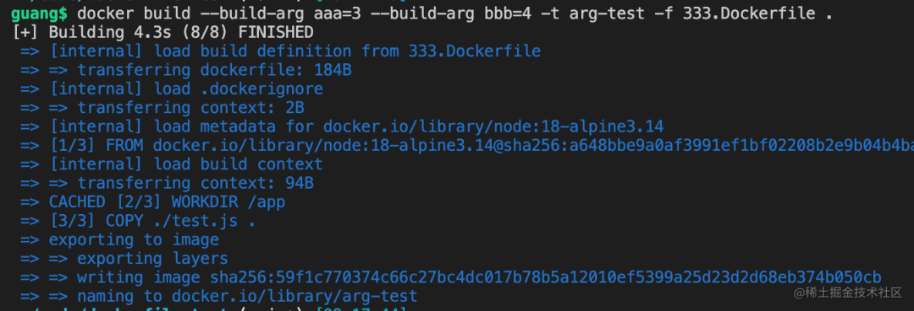

点击查看镜像详情，可以看到 ARG 已经被替换为具体的值了：

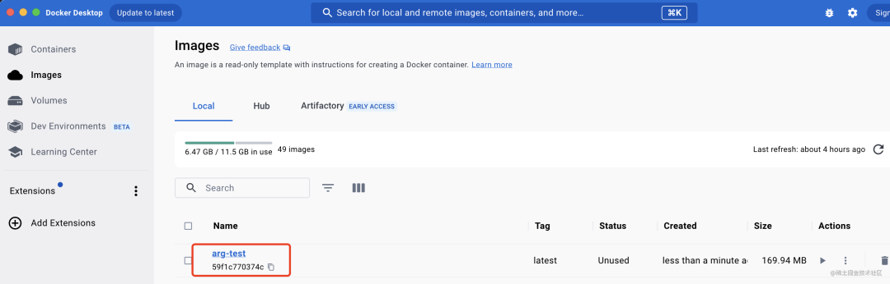

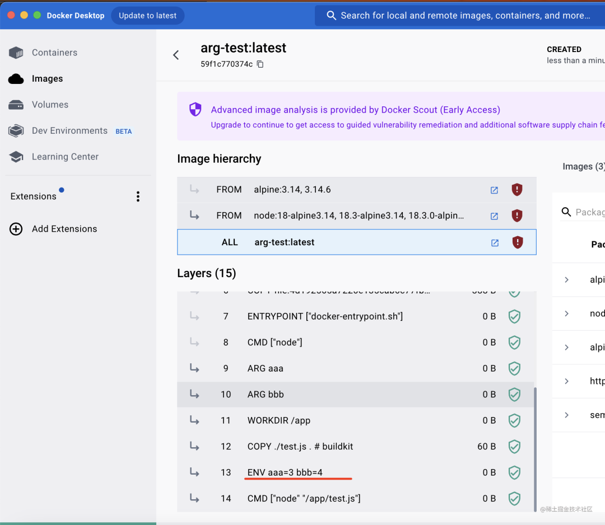

然后跑起来
```shell
docker run --name fourth-container arg-test
```
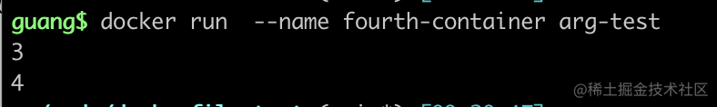

可以看到容器内拿到的环境变量就是ENV设置的。

也就是说 ARG 是构建时候的参数，EVN 是运行时的变量

灵活使用 ARG，可以增加 dockerfile的灵活性

这就是第三个技巧

## CMD 结合 ENTRYPOINT
前面我们指定容器跑起来之后运行什么命令，用的CMD

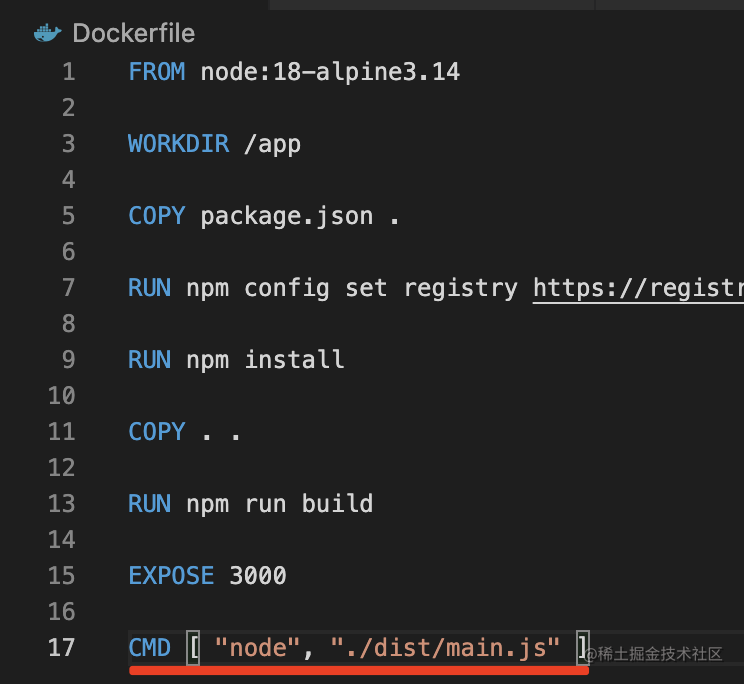

其实还可以写成ENTRYPOINT
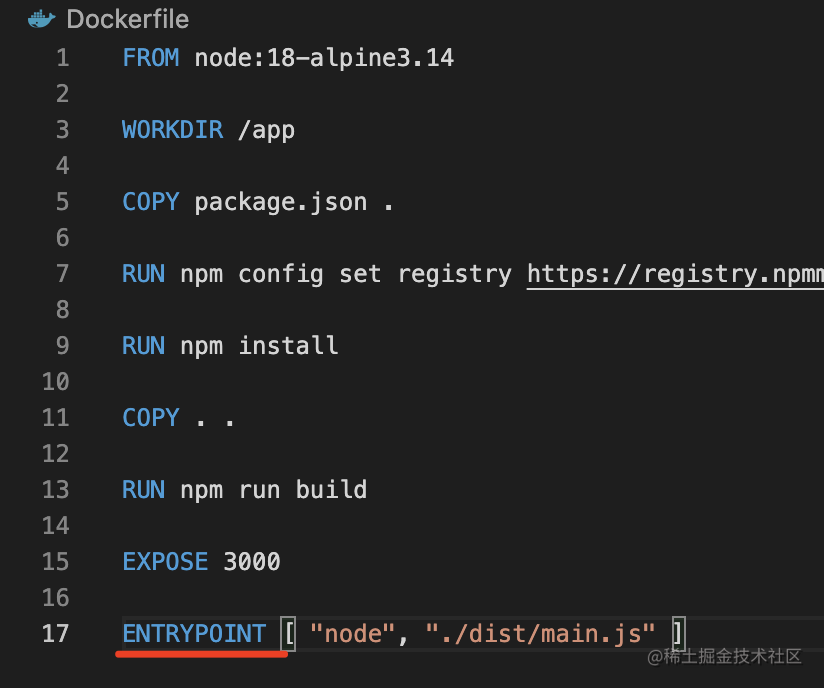

这两种写法有什么区别呢？

我们来试试

写个444.Dockerfile
```shell
FROM node:18-alpine3.14

CMD ["echo", "光光", "到此一游"]
```
然后build
```js
docker build -t cmd-test -f 444.Dockerfile .
```
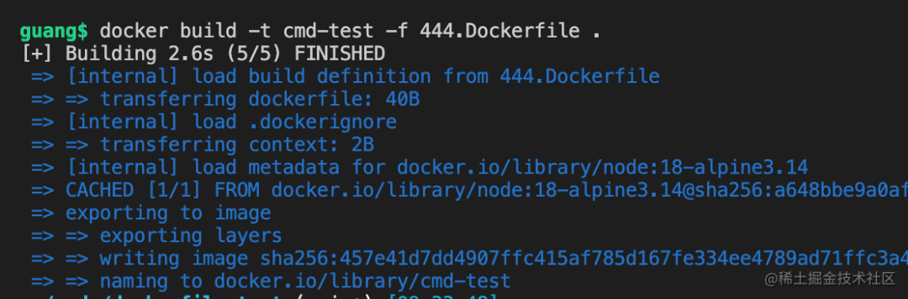

然后run一下
```js
docker run cmd-test
```


没有指定 --name 时，会生成一个随机容器名。

就是这种：

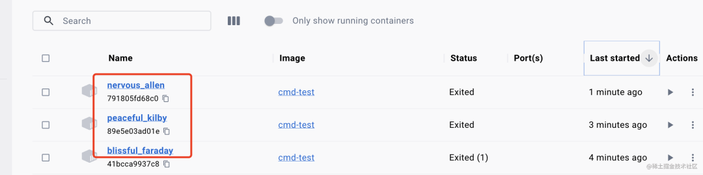

这不是重点。

<span style="color: red;font-weight:bold">重点是用 CMD 的时候,启动命令是可以重写的</span>

```shell
docker run cmd-test echo "东东"
```
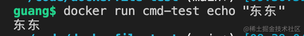

可以替换成任何命令

而用 ENTRYPOINT 就不会
```shell
FROM node:18-alpine3.14

ENTRYPOINT ["echo", "光光", "到此一游"]
```
docker build:
```js
docker build -t cmd-test -f 444.Dockerfile .
```
docker run:
```shell
docker run cmd-test echo "东东"
```
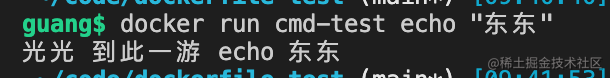

可以看到，现在dockerfile里ENTRYPOINT的命令依然执行了。

docker run 传入的参数作为了echo的额外参数

这就是 ENTRYPOINT 和 CDM的区别。

一般还是CMD 用的多点，可以灵活修改启动命令

其实ENTTRYPOINT 和CMD是可以结合使用的

比如这样
```shell
FROM node:18-alpine3.14

ENTRYPOINT ["echo","光光"]

CMD ['到此一游']
```
docker build
```js
docker build -t cmd-test -f 444.Dockerfile .
```
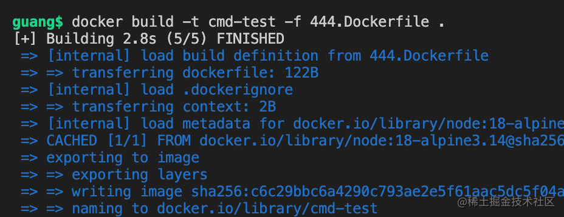

docker run 
```js
docker run cmd-test
docker run cmd-test 66666
```

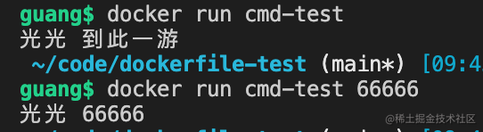

当没传参数的时候，执行的是 ENTRYPOINT + CMD 组合的命令，而传入参数的时候，只有CMD部分会被覆盖。

这就起到了默认值的作用

所以，用 ENTRYPOINT + CMD 的方式更加灵活。

这是第四个技巧。

## COPY vs ADD
其实不只是 ENTRYPOINT 和 CMD 相似，dockerfile里还有一对指令也比较相似，就是ADD 和 COPY

这两都可以把宿主机的文件复制到容器内

但有一点区别，就是对于tar.gz这种压缩文件的处理上；

我们创建一个aaa 目录，下面添加两个文件

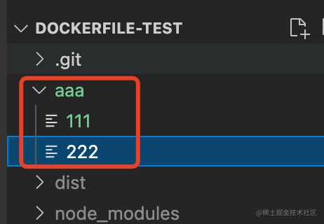

使用 tar 命令打包：
```js
tar -zcvf aaa.tar.gz ./aaa
```

然后写个 555.Dockerfile
```dockerfile
FROM node:18-alpine3.14

ADD ./aaa.tar.gz /aaa

COPY ./aaa.tar.gz /bbb
```
docker build 生成镜像
```js
docker build -t add-test -f 555.Dockerfile .
```
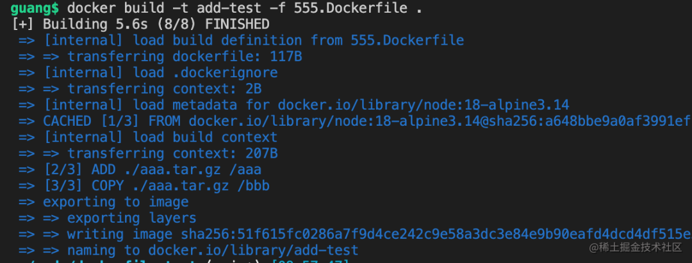

docker run 跑起来

```shell
docker run -d --name sixth-container add-test
```
<span style="color: red">可以看到，ADD把 tar.gz 给解压然后复制到容器内了。</span>

<span style="color: red">而COPY 没有解压，它把文件整个复制过去了</span>

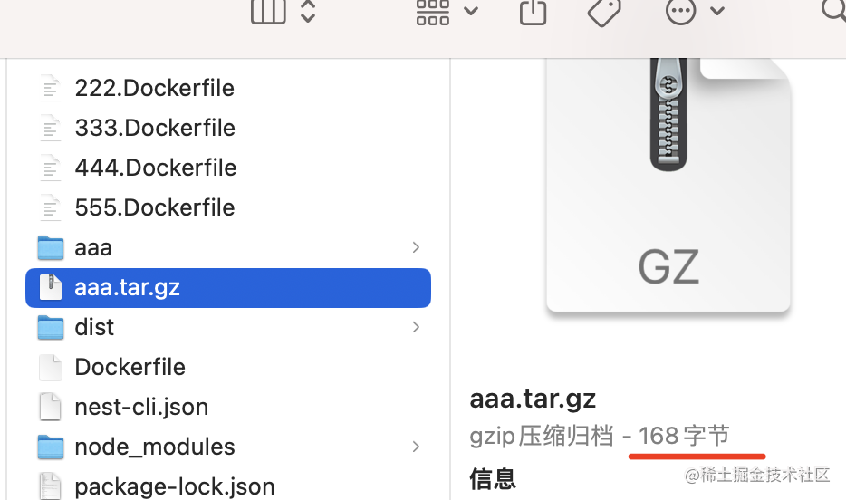
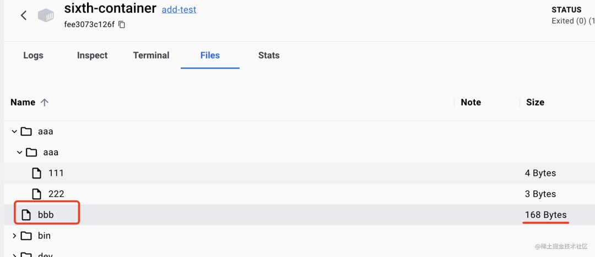
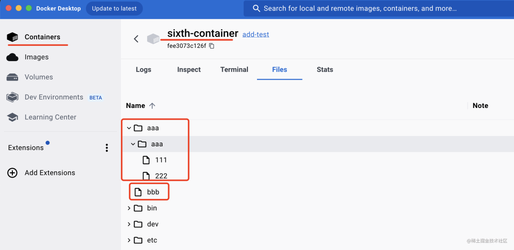

也就是说，ADD、COPY都可以用于把目录下的文件复制到容器内的目录下。

但ADD还可以解压 tar.gz 文件。

一般情况下，还是用COPY居多

案例代码上传了 github：[案例](https://github.com/QuarkGluonPlasma/nestjs-course-code/tree/main/dockerfile-test)

<span style="color: red;font-weight:bold;">可以看到，ADD把tar.gz给解压然后复制到容器内了。而COPY没有解压，它把文件整个复制过去了</span>

## 总结
Dokcer是流行的容器技术，它可以在操作系统上创建多个隔离的容器，在容器内跑各种服务。

它的流程是Dockerfile经过 docker build 生成docker 镜像，然后 dockerrun 来跑容器


docker run 的时候可以通过 -p 指定宿主机和容器的端口映射，通过 -v 挂载数据卷到容器内的某个目录

CI/CD基本也是这套流程，但是Dockerfile是要开发者自己维护的。

Dockerfile有挺多的技巧：
- <span style="color: red">使用alpine的镜像，而不是默认的linux镜像，可以极大减小镜像体积，比如node:18-alpine3.14这种</span>
- <span style="color: red">使用多阶段构建，比如一个阶段来执行build，一个阶段把文件复制过去，跑起服务来，最后只保留最后一个阶段的镜像。这样使镜像内只保留运行需要的文件以及dependencies.</span>
- <span style="color: red">使用ARG增加构建灵活性，ARG可以在docker build时通过 --build-arg xxx=yyy 传入，在dockerfile中生效，可以使构建过程更灵活。如果是想定义运行时可以访问的变量，可以通过 ENV 定义环境变量，值使用 ARG 传入。</span>
- <span style="color: red">CMD 和 ENTRYPOINT 都可以指定容器跑起来之后运行的命令，CMD 可以被覆盖，而 ENTRYPOINT 不可以，两者结合使用可以实现参数默认值的功能。</span>
- <span style="color: red">ADD 和 COPY 都可以复制文件到容器内，但是 ADD 处理 tar.gz 的时候，还会做一下解压。</span>


## 资料
[掌握这 5 个技巧，让你的 Dockerfile 像个大师！](https://mp.weixin.qq.com/s/JnTmB7H-8tJuRWMosnHCKA)