2010年，几个搞IT的年轻人，在美国旧金山成立了一家名叫"dotCould"的公司

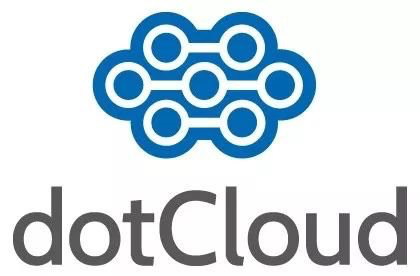

这家公司主要提供基于Paas的云计算技术服务。具体来说，是和LXC有关的容器技术

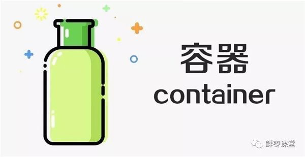

LXC,就是Linux容器虚拟技术(Linux container)

后来，dotCloud公司将自己的容器技术进行简化和标准化，并命名为-Docker

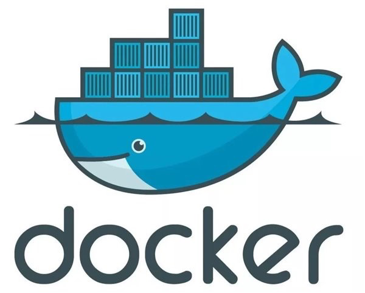

Docker技术诞生之后，并没有引起行业的关注。而DotCould公司，作为一家小型创业企业，在激烈竞争之下，也步履维艰。

正当他们快要坚持不下去的时候，脑子里蹦出来开源的想法

什么是开源？开源，就是开放源代码。也就是将原来内部保密的源代码开放给所有人，然后让大家一起参与进来，贡献代码和意见

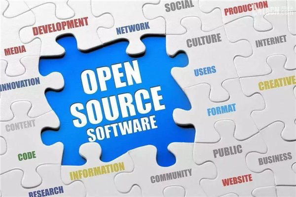

open source开源

有的软件是一开始就开源的。也有的软件是换不下去了，创造者又不想放弃，所以选择开源。自己养不活，就吃百家饭嘛

2013年3月，dotCould公司的创始人之一，Docker之父，28岁的Solomon Hykes正式决定，将Docker项目开源

不开则已，一开惊人。

越来越多的IT工程师发现了Docker的有点，然后蜂拥而至，加入Docker开源社区

Docker的人气迅速攀升，速度之快

开源当月，Docker 0.1版本发布。此后的每一个月，Docker都会发布一个版本。到2014年6月9日，Docker 1.0版本正式发布。

此时的Docker，已经成为行业里人气最火爆的开源技术，没有之一。甚至像Google、微软、Amazon、VMware这样的巨头，都对它青睐有加，表示将全力支持。

Docker火了之后，dotCloud公司干脆把公司名字也改成了Docker Inc.。

Docker和容器技术为什么会这么火爆？说白了，就是因为它“轻”。

在容器技术之前，业界的网红是虚拟机。虚拟机技术的代表，是VMWare和OpenStack。

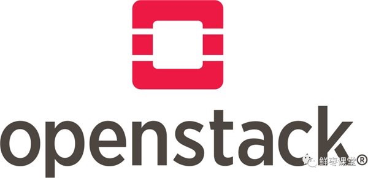

相信很多人都用过虚拟机。虚拟机，就是在你的操作系统里面，装一个软件，然后通过这个软件，再模拟一台甚至多台“子电脑”出来。

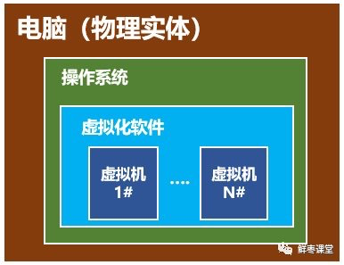

虚拟机，类似于子电脑

在“子电脑”里，你可以和正常电脑一样运行程序，例如开QQ。如果你愿意，你可以变出好几个“子电脑”，里面都开上QQ。“子电脑”和“子电脑”之间，是相互隔离的，互不影响。

虚拟机属于虚拟化技术。而Docker这样的容器技术，也是虚拟化技术，属于轻量级的虚拟化。

虚拟机虽然可以隔离出很多“子电脑”，但占用空间更大，启动更慢，虚拟机软件可能还要花钱（例如VMWare）。

而容器技术恰好没有这些缺点。它不需要虚拟出整个操作系统，只需要虚拟一个小规模的环境（类似“沙箱”）。

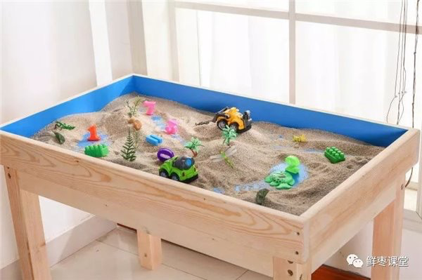

它启动时间很快，几秒钟就能完成。而且，它对资源的利用率很高(一台主机可以同时运行几千个Docker容器)。此外，它占得空间很小，虚拟机 一般要几GB到几十个GB的空间，而容器只需要MB甚至KB级。

特性|虚拟机|容器
---|---|---
隔离级别|操作系统级|进程级
隔离策略|Hypervisor|CGroups
系统资源| 5~15% | 0~5%
启动时间|分钟级|秒级
镜像存储|GB-TB|KB-MB
集群规模|上百|上万
高可用策略|备份、容灾、迁移|弹性、负载、动态

容器和虚拟机的对比

正因为如此，容器技术受到了热烈的欢迎和追捧，发展迅速。

我们具体来看看Docker。

大家需要注意，**Docker本身并不是容器，它是创建容器的工具，是应用容器引擎**。

想要搞懂Docker，其实看它的两句口号就行。

第一句，是“Build, Ship and Run”。

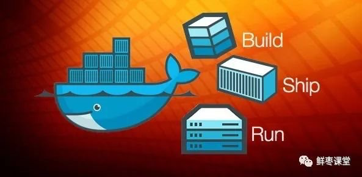

也就是，"搭建、发送、运行"，三板斧

举个例子

我来到一片空地，想建个房子，于是我搬石头、砍木头、画图纸，一顿操作，终于把这个房子盖好了。

结果，我住了一段时间，想搬到另一空地去。这时候，按以往的办法，我只能再次搬石头、砍木头，画图纸、盖房子。

但是，跑来一个老巫婆，教会我一种魔法

这种魔法，可以把我盖好的房子复制一份，做成"镜像"，放在我的背包里

等我到了另一空地，就用这个"镜像"，复制一套房子，摆在那边，领包入住

怎么样？是不是很神奇？

所以，Docker的第二句口号就是:"build once,Run angwherre(搭建一次，到处能用)"

Docker技术的三大核心概念，分别是：

- 镜像(images)
- 容器(Container)
- 仓库(Repository)

我们刚才例子里，那个放在包里的"镜像"，就是**Docker镜像**。而我的背包，就是**Docker仓库**。我在空地上，用魔法造好的房子，就是一个**Docker容器**

说白了，这个Docker镜像，是一个特殊的文件系统。它除了提供容器运行时所需的程序、库、资源、配置等文件外，还包含了一些为运行时准备的一些配置参数(例如环境变量)。镜像不包含任何动态数据，其内容构建之后也不会被改变

也就是说，每次变出房子，房子是一样的，但生活用品之类的，都是不管的。谁住谁负责添置。

每一个镜像可以变出一个房子，那么我可以有多个镜像

也就是说，我改了一个欧式别墅，生成了镜像。另一个哥们可能盖了一个中国四合院，也生成了镜像。还有哥们，盖了一个非洲茅草屋，也生成了镜像...

这样一来，我们可以交换镜像，你用我的，我用你的，岂不是很爽。

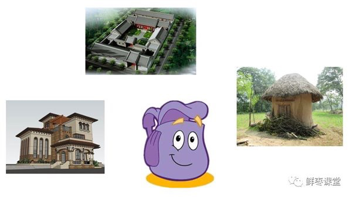

于是乎，就变成了一个大的公共仓库。

**负责对Docker镜像进行管理的，是Docker Registry服务（类似仓库管理员）。**

不是任何人建的任何镜像都是合法的。万一有人盖了一个有问题的房子呢？

所以，Docker Registry服务对镜像的管理是非常严格的

最常使用的Registry公开服务，是官方的Docker Hub，这也是默认的Registry，并拥有大量的高质量的官方镜像。

好了，说完了Docker，我们再把目光转向K8S。

就在Docker容器技术被炒得热火朝天之时，大家发现，如果想要将Docker应用于具体业务实现，是存在困难的--编排、管理和调度各个方面，都不容易。于是，人们迫切需要一套管理系统，对Docker及容器进行更高级更灵活的管理。

这个时候，K8S出现了

**K8S，就是基于容器的集群管理平台，它的全称，是kubernetes。**

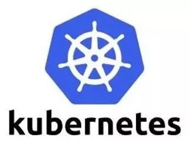

kubernetesKubernetes这个单词来自于希腊语，含义是舵手或领航员。K8S是它的缩写，用“8”字替代了“ubernete”这8个字符。

和Docker不同，K8S的创造者，是众人皆知的行业巨头——Google。

然而，K8S并不是一件全新的发明。它的前身，是Google自己捣鼓了十多年的Borg系统。

K8S是2014年6月由Google公司正式公布出来并宣布开源的。

同年7月，微软、Red Hat、IBM、Docker、CoreOS、Mesosphere和Saltstack等公司，相继加入K8S。

之后的一年内，VMware、HP、Intel等公司，也陆续加入。

2015年7月，Google正式加入OpenStack基金会。与此同时，Kuberentes v1.0正式发布。

目前，kubernetes的版本已经发展到V1.13。

K8S的架构，略微有一点复杂，我们简单来看一下。

**一个K8S系统，通常称为一个K8S集群（Cluster）。**

这个集群主要包括两个部分
- 一个Master节点(主节点)
- 一群Node节点(计算节点)

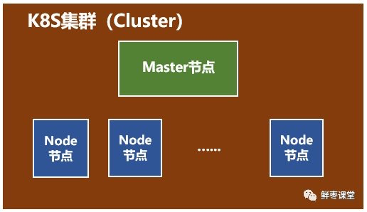

一看就明白：Master节点主要负责管理和控制。Node节点是工作负载节点，里面是具体的容器。

深入来看这两种节点

首先是Master节点

Master节点包括API Server、Scheduler、Controller manager、eted.

API Server是整个系统的对外接口，供客户端和其他组件调用，相当于营业厅

Scheduler负责对集群内部的资源进行调度，相当于调度室

Controller manger负责管理控制器，相当于大总管

然后是Node节点

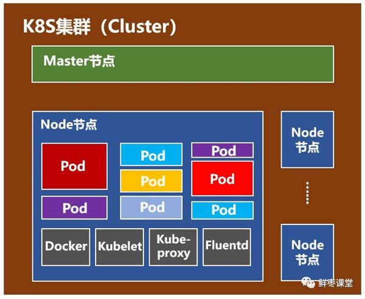

Node节点包括Docker、kubelet、kube-proxy、Fluentd、kube-dns（可选），还有就是Pod。

> Pod是k8s最基本的操作单元。一个pod代表着集群中运行的一个进程，它内部封装了一个或多个紧密相关的容器。除了pod之外，k8s还有一个Service概念，一个Service可以看做一组提供相同服务的pod的对外访问接口。这个不太好好理解，跳过吧

- Docker，不用说了，创建容器的。

- Kubelet，主要负责监视指派到它所在Node上的Pod，包括创建、修改、监控、删除等。

- Kube-proxy，主要负责为Pod对象提供代理。

- Fluentd，主要负责日志收集、存储与查询。

是不是有点懵？唉，三言两语真的很难讲清楚，继续跳过吧。

## 资料
[原文](https://www.cnblogs.com/misswangxing/p/10669444.html)