## 介绍
### 出现的原因
前后端开发到测试到生产的过程中，经常会遇到一个问题，明明我在本地跑没问题，为什么到测试环境或者生产环境就报错了了呢，常常这是因为开发、测试、生产的环境与配置不同导致的。

折腾过环境配置的人都明白其中麻烦，换一台系统、虚拟机、机器，就又要重来一次，费力费时。由于环境和配置的原因，各种奇奇怪怪因为环境和配置的 Bug，总是像打地鼠游戏里面的地鼠一样不断冒出来 🐹


Docker对这个问题给出了一个很好地解决方案，通过镜像将除了系统之外所需要的系统环境由下而上打包，达到服务跨平台的无缝运作。也就是说，安装的时候，把特定的环境一模一样的搬过来，从而解决[在我的电脑上能跑，在xx环境就跑步了]的情况

另外一个重要的原因，就是轻量,基于容器的虚拟化，Docker的镜像仅包含业务运行所需的runtime环境
，一个CentOS/Ubuntu基础镜像仅170M，因为轻量一个宿主机可以轻松安装数百个容器。
### 是什么？
Docker是基于GO语言实现的云开源项目，从2013年发布到现在一直广受关注。Docker可以让你像使用集装箱一样快速的组合成应用，并且可以像运输标准集装箱一样，尽可能的屏蔽代码层面的差异。它将应用程序与该程序的依赖，打包在一个文件里面。运行这个文件，就会生成一个虚拟容器

程序在这个虚拟容器里运行，就好像在真实的物理机上运行一样。有了Docker，就不用担心环境问题了

## 安装与配置
### Mac下安装
直接使用Homebrew Cask来安装，Mac下
```shell
# Homebrew 安装
$ braw cask install docker
```
既可，安装完输入命令，直接报错
```shell
$ docker 
zsh:command not found: docker 
```
遇到这个报错别担心，安装完之后要在应用列表里双击Docker应用，输入密码之后就可以使用这个命令了

### CentOS下安装
Docker 要求 CentOS 版本必须在 6.5 及以上才可以安装
```shell
# 安装
$ sudo yum install yum-utils device-mapper-persistent-data lvm2
$ sudo yum-config-manager --add-repo https://download.docker.com/linux/centos/docker-ce.repo
$ sudo yum install docker-ce

# 开启 Docke
$ sudo systemctl start docke
```
在 Windows 上可以直接下载安装包来安装，或者 Mac 上不使用 Homebrew 也可以去官网直接下载安装包来安装，百度一下到处都是安装方法，其他的就不用多说。

## 简单配置并跑起来
### 配置镜像加速
在MacOS 的Docker配置 Perferences -> Docker Engine 或者 Windows 的 Settings->Deamon 中的JSON中增加一项 registry -> mirrors 如下

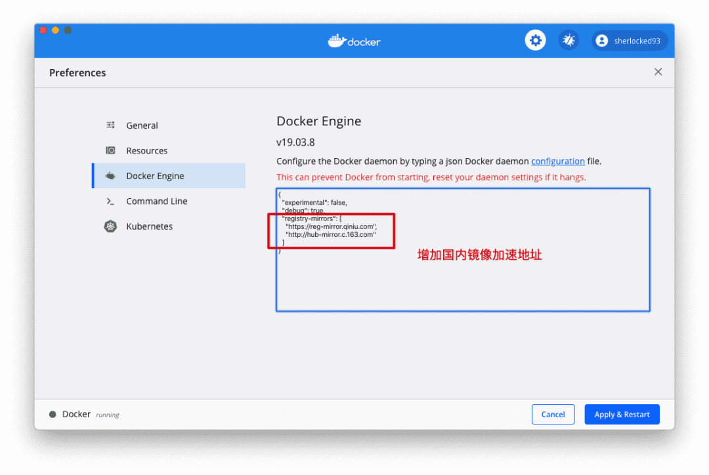

配置完之后再命令行中 docker info 就可以查看到我们配置的镜像加速地址了
```js
➜  ~ sudo docker info
...
 Registry Mirrors:
  https://reg-mirror.qiniu.com/
  http://hub-mirror.c.163.com/
  https://registry.docker-cn.com/
...
```
如果你的系统的Docker没有客户端，比如CentOS中，可以直接修改 deamon 配置文件
```shell
# 修改/创建 docker的 deamon 配置文件
$ sudo vi /etc/docker/daemon.json

# 修改为如下配置
{
    "experimental": false,
    "debug": true,
    "registry-mirrors": [
        "https://reg-mirror.qiniu.com",
        "http://hub-mirror.c.163.com",
        "https://registry.docker-cn.com"
    ]
}
# 修改完 :wq 重启
$ sudo systemctl restart docker
```
### Hello World!
然后就可以快乐跑起来我们第一个Docker指令Hello World 了

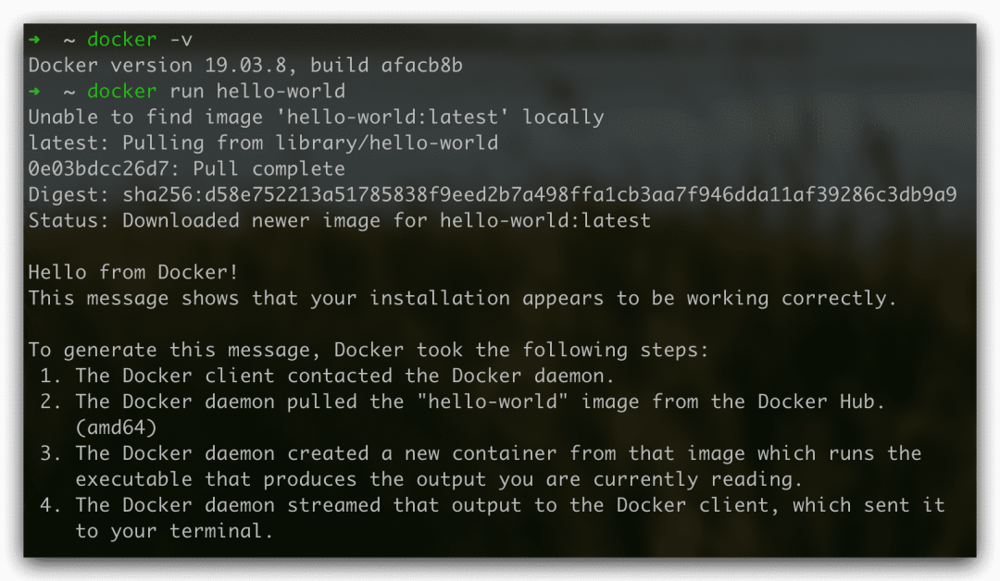

Good start ！🎉

## 镜像 & 容器 & 仓库
<span style="color: red">镜像 和 容器的关系就像类和类的实例，一个镜像可以同时跑多个容器，单个容器实例有可以创建新的镜像</span>。如下图

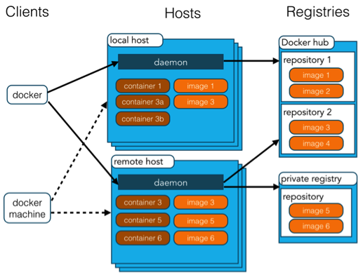

下面解释一下这个图里面出现的元素
概念|说明
---|---
Docker镜像Images | 用于创建Docker容器的只读模版，比如Ubuntu 16.04系统、Nginx1.16.0等，是一个特殊的文件系统，包括容器运行时需要的程序、库、资源、参数等，但不包括任何动态数据，内容在构建后也不会被改变，一个镜像可以创建多个容器
Docker容器 Container | 容器是独立运行、相互隔离的一个或一组应用，是镜像创建的运行实例，实质是进程，可以看作为**一个简易版的Linux环境 + 运行在其中的应用程序**
Docker 客户端Client | 客户端通过命令行或其他工具使用Docker SDK(https://docs.docker.com/develop/sdk/)与Docker的守护进程通信
Docker 主机Host| 一个物理或虚拟的机器用于执行Docker 守护进程和容器
Docker 仓库 Repository | 集中存放镜像文件的地方，分为公有仓库和私有仓库
Docker 注册服务器 Registry | 是一个集中存储、分发镜像的服务，官方的叫 Docker Hub。一个 Docker Registry 中可包含多个仓库，每个仓库可以包含多个标签 Tag 的镜像，不同的标签对应不同的版本
Docker Machine | Docker Machine 是一个简化 Docker 安装的命令行工具，通过一个简单的命令行即可在相应的平台上安装Docker，比如 VirtualBox、 Digital Ocean、Microsoft Azure

容器的生命周期图示

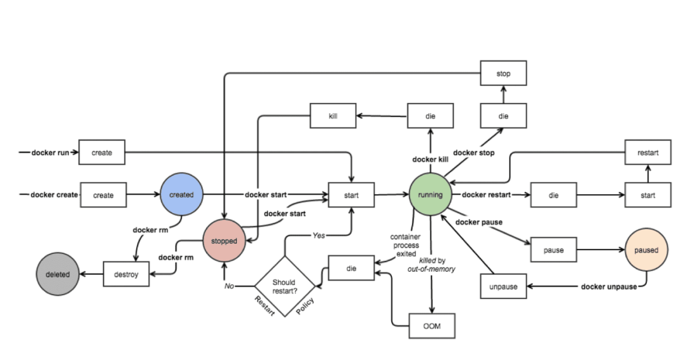

<span style="color: red'>容器的五个核心状态，也就是图中色块表示的： Created、Running、Paused、Stopped、Deleted</span>

1. Created: 容器已经被创建，容器所需的相关资源已经准备就绪，但容器中的程序还未处于运行状态
2. Running: 容器正在运行，也就是容器中的应用正在运行
3. Paused: 容器已暂停，表示容器中的所有程序都处于暂停(不是停止)状态
4. Stopped: 容器处于停止状态，占用的资源和沙盒环境都依然存在，只是容器中的应用程序均已停止
5. Deleted: 容器已删除，相关占用的资源及粗出在Docker中的管理信息也都已释放和移除

## 基本使用
### 操作命令
```shell
# 开启 Docker 开机自启动
$ sudo systemctl enable docker

# 关闭 Docker 开启自启动
$ sudo systemctl disable docker
```
### 镜像命令
```shell
# 去下载镜像，先从本地找，没有去镜像，最后没有去hub 标签不写默认为 lastest
$ docker pull [镜像名]:[标签Tag]

# 列出本机的所有image文件，-a 显示本地所有镜像(包括中间镜像), -q 只显示镜像id， --digests显示镜像的摘要信息
$ docker image ls
$ docker images 

# 删除image, -f 强制删除镜像
$ docker rmi [镜像名]:[:标签Tag]
$ docker rmi [镜像名]:[:标签Tag] [镜像名2]:[:标签Tag]
$ docker rmi $(docker ps -a -q) #删除全部 后面是子命令

# 查询镜像名称，--no-trunc 显示完整的镜像描述，--filter=starts=30 列出start不少于指定值的镜像 --filter=is-automated=true 列出自动构建类型的镜像
$ docker search [关键字]

# 下载镜像，标签tag不写默认为 lastest,也可以自己加上比如：3.2.0
$ docker pull [镜像名]:[:标签tag]
```
### 容器命令
```shell
# 列出本机正在运行的容器， -a 累出本机所有容器包括终止运行的容器， -q 静默模式只显示容器编号， -l 显示最近创建的容器
$ docker container ls # 等价于下面这个命令
$ docker ps

# 新建并重启容器
$ docker run [options] [容器名]
# docker run -p 3002:80 -d mynginx 例子

# 启动容器
$ docker start [容器ID]/[容器Names]
# docker start ac7410808406 例子

# 重启容器
$ docker restart [容器ID]/[容器Names]

# 终止容器运行
$ docker kill [容器ID]； # 强行终止，相当于向容器里面的主进程发出 SIGKILL 信号，那些正在进行中的操作会全部丢失
$ docker kill $(docker ps -a -q) # 强行终止所有容器
$ docker stop [容器ID] # 从容终止，相当于向容器里面的主进程发出SIGTERM信号，，然后过一段时间再发出 SIGKILL 信号
$ docker stop $(docker ps -a -q) # 终止所有容器

# 止运行的容器文件，依然会占据硬盘空间，可以使用 docker container rm 命令删除，-f 强制删除可以删除正在运行的容器
$ docker rm [容器ID]
$ docker rm `docker ps -aq` # 删除所有已经停止的容器，因为没有停止的rm删不了需要加-f

# 查看容器的输出，-t加入时间戳，-f跟随最近日志打印，--tail数字显示最后多少条，如果docker run时，没有使用-it,就要用这个命令查看输出
$ docker logs [容器ID]

# 查看容器进程信息
$ docker stop [容器ID]/[容器Names]
$ docker prot [容器ID]/[容器Names]

# 退出容器
$ exit # 容器退出
ctrl + p + q # 容器退出，快捷键

 进入容器
$ docker attach [容器ID]      # 退出容器时会让容器停止，本机的输入直接输到容器中
$ docker exec -it [容器ID]    # 退出容器时不会让容器停止，在已运行的容器中执行命令，不创建和启动新的容器

# 设置容器在docker启动时自动启动
$ docker container update --restart=always [容器名字]
```
这里要特别说一下  docker run 的options， 因为最常用
1. --name 为容器指定一个名称
2. -d 容器启动后进入后台，并返回容器ID，即启动守护式容器；
3. -P 随机端口映射
4. -p 80:8080 将本地的80端口映射到容器的8080端口；
5. bash 容器启动以后,内部第一个执行的命令。这里启动bash，保证用户可以使用Shell
6. -i 以交互模式运行容器，通常与-t同时使用；
7. -t 为容器重新分配一个伪输入中断，容器的Shell会映射到当前的Shell，然后在本机窗口输入的命令，就会传入容器，通常与-i同时使用
8. --rm 在容器终止运行后自动删除容器文件
9. --restart=always 设置容器自启动
10. -v /xxx:/yyy 映射命令，把本机的xx目录映射到容器中的yyy目录，也就是说改变本机的xxx目录下的内容，容器yyy目录中的内容也会改变；

比如我在CentOS下跑起来一个CentOS的 Docker容器
```shell
# 下载
$ docker pull centos

# 在上面下载的 centos 镜像基础上，新建一个容器名为 mycentos0901 的 centos 实例，并进入这个容器的 bash
$ docker run -it --name mycentos0901 0d120b6ccaa8

[root@169c9fffeecd /]   # 进入容器，下面输入命令，注意这里 root 后面的一串 ID
$ ls       # 可以看到centos的根目录文件列表
$ docker   # bash: docker: command not found 这个容器没有安装docke
```
是不是很神奇，我们可以在一开始的 CentOS 下面执行  docker ps 来查看容器列表：
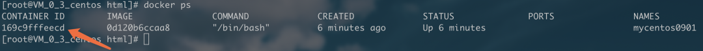

你会发现上面那个 ID，正是下面列表中跑起来的这个容器的 ID，镜像的 ID 也是我们前面 pull 下来的 CentOS 镜像 ID，名字也是我们起的 mycentos0901。

如果 docker run 之后报 Conflict. The container name "xxxx" is already in use by container 就直接运行 docker rm $(docker ps -a -q) 删除已停止的容器，或者精确删除 docker rm [containerID] 也可以，就可以了。

### 几个常见场景的命令使用
- 守护式启动容器

    使用centos以后台模式启动一个容器 docker run -d --name mycentos0903 0d120b6ccaa8, 启动之后  docker ps -a 查看，发现容器并不在运行中，这是因为Docker的运行机制：<span style="color: red">Docker 容器后台运行，必须有一个前台进程。</span>

    容器运行的命令如果不是那些一直挂起的命令，比如top、tail，运行结束会自动退出。所以为了让容器持续在后台运行，那么需要将运行的程序以前台进程的形式运行。

    比如这里在后台运行一个命令，这个命令一直在打印 docker run -d centos /bin/sh -c "while true; do echo hello zzyy; sleep 2; done",ranhou women logs查看一下

    ![logs][./images/6.png]

- 退出容器后对容器操作

    退出容器后可以通过 exec 方法对正在运行的容器进行操作

    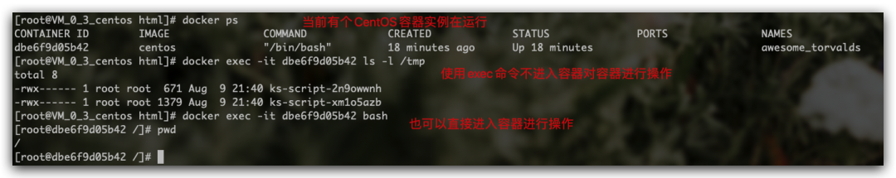

- 在容器中拷贝文件到外部

    拷贝文件使用 cp 命令

    ```shell
    $ docker cp [容器ID]/[容器Names]:[要拷贝的文件目录] [本地目录] # 容器文件拷贝到本机
    $ docker cp [本机目录] [容器ID]/[容器Names]:[要拷贝的文件目录] # 本机文件拷贝到容器
    ```
    cp 不仅能把容器中的文件/文件夹拷贝到本机，也可以把本机中的文件/文件夹拷贝到容器。

    演示一下，这里先到容器里面创建一个无聊的文件xixi.txt,然后拷贝到本机

    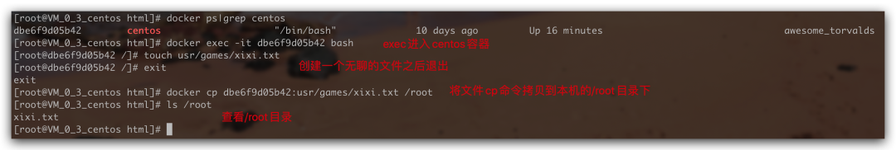

    使用的时候，我们可以拷贝配置、日志等文件到本地

## 安装MySQL
```shell
# 搜索镜像
$ docker search mysql

# 下载镜像，实测没配置镜像加速的时候会比较慢，配置了好一些
$ docker pull mysql

# 查看镜像
$ docker images

# 创建并运行容器
$ docker run -d -p 3307:3306 -e MYSQL_ROOT_PASSWORD=888888 -v /Users/sherlocked93/Personal/configs/mysql.d:/etc/mysql/conf.d --name localhost-mysql mysql
```
稍微解释以下上面的参数
1. -p 3307:3306 将本机的3307端口映射到mysql容器的3306端口，根据需要自行更改
2. -e MYSQL_ROOT_PASSWORD=&lg;string&gt; 设置远程登陆的root用户密码
3. --name &lt;string&gt; 可选，设置容器别名
4. -v xxx/mysql.d:/etc/mysql/conf.d 将本机目录下设置文件夹映射到容器的/etc/mysql/conf.d
5. -v xxx/logs:/lons 将本地指定目录下的logs目录挂载到容器的/logs
6. -v xxx/data:/var/lib/mysql 将本机指定目录下的data目录挂载到容器的/var/lib/mysql

运行截图
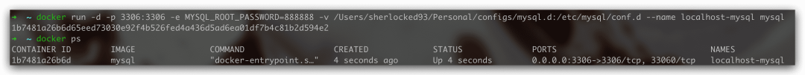
然后去Navicat中就可以连接到MYsql了。

这也太爽了!真的是几行命令就装好了啊，比之前真实快乐多了
## 安装 Nginx
Nginx的安装与其他类似，如果你还不想Nginx如何使用，可以参考[Nginx从入门到实践，万字详解](https://mp.weixin.qq.com/s?__biz=Mzg5ODA5MzQ2Mw==&mid=2247484653&idx=1&sn=3d384389337950a9f2391f2464bc4d9c&scene=21#wechat_redirect)这篇文章，看完基本就了解如何使用和配置了。

```shell
# 搜索/下载镜像
$ docker search nginx
$ docker pull nginx
```
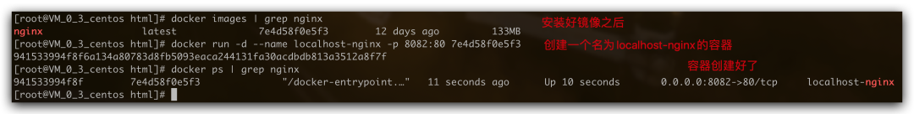

然后创建一个临时的容器，目的是把默认配置拷贝到本机，我这里把配置文件放到/mnt 目录下，主要是三个配置文件夹
1. /etc/nginx 放置Nginx配置文件
2. /var/log/nginx 放置Nginx日志文件
3. /usr/share/nginx/html/ 放置Nginx前端静态文件都放在这个文件夹；

分别把这几个目录都拷贝到本机的/mnt文件夹下的nginx、nginx_logs、html文件夹

刚刚创建的临时容器没用了 docker rm -f [临时容器ID] 把临时容器干掉，然后 docker run 重新创建Nginx 容器

```shell
$ docker run -d --name localhost-nginx -p 8082:80 \
-v /mnt/nginx:/etc/nginx \
-v /mnt/nginx_logs:/var/log/nginx \
-v /mnt/html:/usr/share/nginx/html \
--privileged=true nginx
```
<span style="color: red">--privileged=true 表示容器内部对挂载的目录拥有读写等权限</span>

其他配置刚刚上面已经讲过
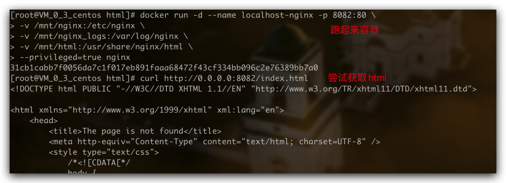

然后再你自己浏览器上就可以访问了，如果是云服务器，记得开放对应端口
## 安装 Easy Mock
因为Easy Mock依赖Redis和MongoDB,因此本地环境使用docker-compose来搭建Easy Mock应该算是最贱实践了

### 安装docker-compose
官方文档：https://docs.docker.com/compose/install/

首先你得确定拥有 docker 环境，如果你是 Windows / Mac 用户，那么安装客户端，就会自带 docker-compose 了。

因为本次我们是在云服务器 CentOS7.6 上搭建，所以我们需要自行安装 docker-compose，运行如下命令，下载当前稳定版本的 docker-compose
```shell
$ sudo curl -L "https://github.com/docker/compose/releases/download/1.24.1/docker-compose-$(uname -s)-$(uname -m)" -o /usr/local/bin/docker-compose
```
修改文件权限为可执行文件
```shell
$ sudo chmod +x /usr/local/bin/docker-compose
```
验证是否安装成功
```shell
$ docker-compose version
```
### 编写docker-compose.yml配置文件
可以参考官方文件给出的部署文件，也可以参考我下面的配置过程。

首先新建文件 docker-compose.yml 并将下面docker-compose文件内容复制进入 docker-compose.yml,然后将内容中注释位置替换为自己需要的本地地址
```shell
version: '3'

services:
  mongodb:
    image:mongo:3.4.1
    volumes:
      #  /apps/easy-mock/data/db 是数据库文件存放地址，根据需要修改为本地地址
      -'/apps/easy-mock/data/db:/data/db'
    networks:
      -easy-mock
    restart:always

  redis:
    image:redis:4.0.6
    command:redis-server--appendonlyyes
    volumes:
      #  /apps/easy-mock/data/redis 是 redis 数据文件存放地址，根据需要修改为本地地址
      -'/apps/easy-mock/data/redis:/data'
    networks:
      -easy-mock
    restart:always

  web:
    image:easymock/easymock:1.6.0
    # easy-mock 官方给出的文件，这里是 npm start，这里修改为 npm run dev
    command:/bin/bash-c"npm run dev:server"
    ports:
      -7300:7300# 改为你自己期望的映射
    volumes:
      # 日志地址，根据需要修改为本地地址
      -'/apps/easy-mock/logs:/home/easy-mock/easy-mock/logs'
    networks:
      -easy-mock
    restart:always

networks:
  easy-mock:
```
### 启动Easy-mock
在docker-compose文件目录下，运行如下命令
```shell
$ docker-compose up -d
```
如果遇到easymock docker 实例报文件权限错误
```shell
Error: EACCES:permission denied...
```
要在项目根目录执行以下命令
```shell
$ chmod 777 /yourfile/logs
```
然后就可以通过浏览器上的 你的域名.com:7300 访问到 easy-mock 了！

如果你觉得域名后面跟着端口号挺难看的，你可以通过配置 Nginx 的二级域名来访问你部署的 easy-mock，配置二级域名的方法参见 [这篇文章](https://mp.weixin.qq.com/s?__biz=Mzg5ODA5MzQ2Mw==&mid=2247484653&idx=1&sn=3d384389337950a9f2391f2464bc4d9c&scene=21#wechat_redirect)

## 可视化管理
关于可视化查询工具,这里就简单推介一个LazyDocker，由于是在终端运行的，而且支持键盘操作和鼠标点击，就挺骚气的，有了这个一些查询语句就可以少打几次了

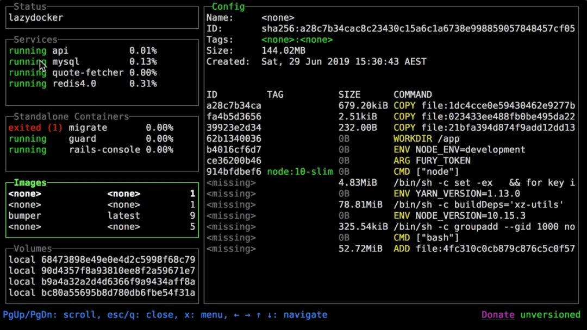

安装比较简单，运行下面命令
```shell
$ docker run --rm -it -v \
/var/run/docker.sock:/var/run/docker.sock \
-v ~/.config/lazydocker:/.config/jesseduffield/lazydocker \
lazyteam/lazydocke
```
可以设置一个终端的alias
```shell
$ alias lzd='docker run --rm -it -v /var/run/docker.sock:/var/run/docker.sock -v ~/.config/lazydocker:/.config/jesseduffield/lazydocker lazyteam/lazydocker'
```
然后 你在终端输入 lzd 就可以浏览你的镜像、容器、日志、配置、状态等等内容了
## 结语
由于在下目前使用 Docker 的主要场景是 MySQL、Nginx 之类工具的安装，所以本文所介绍的内容也大多属于这个场景。

## 资料
[原文](https://mp.weixin.qq.com/s/1YDDCiDUMtxFlGQ94aoItg)

[docker+Jenkins+nginx实现前端自动部署详细教程](https://mp.weixin.qq.com/s/bU8Sh8SVn6L7Scxt6-4CZw)

[使用Docker Compose、Nginx、SSH和Github Actions实现前端自动化部署测试机](https://mp.weixin.qq.com/s/QgASFlvJ8aI3SUmEx-ZOfQ)