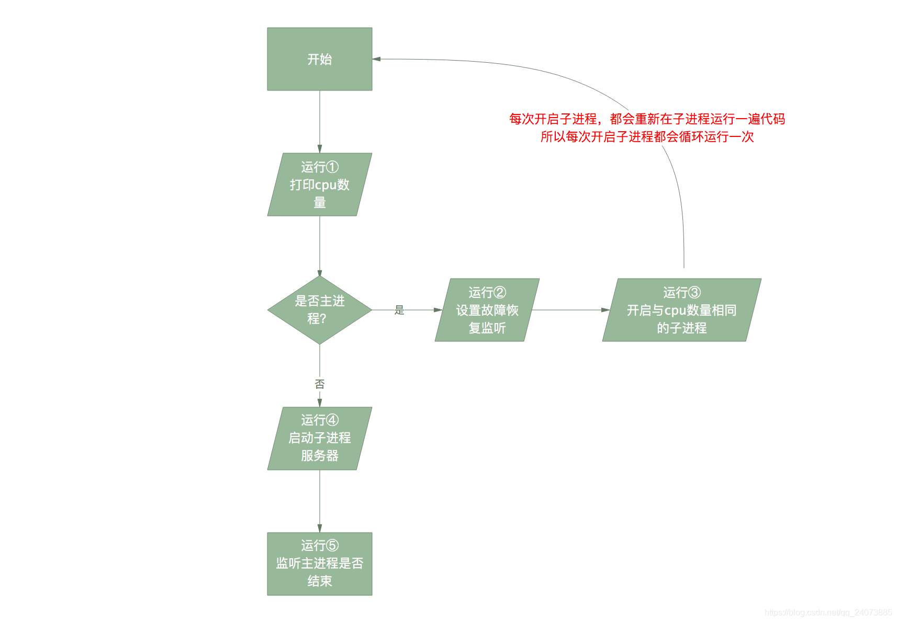
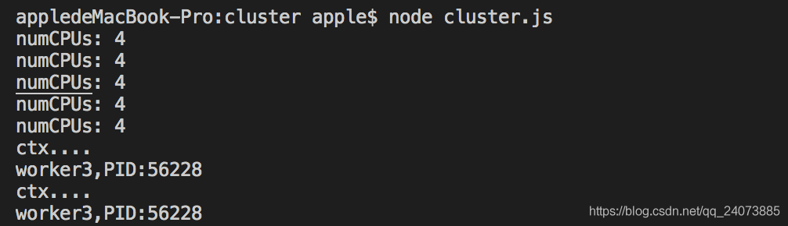
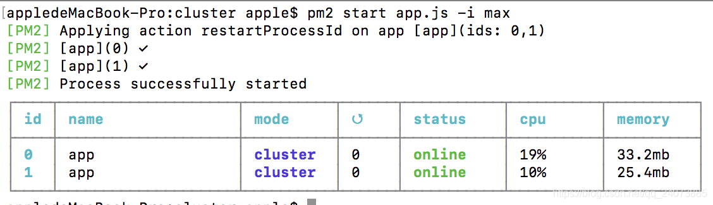
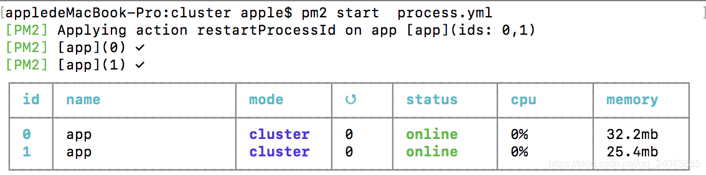
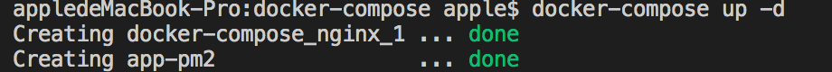
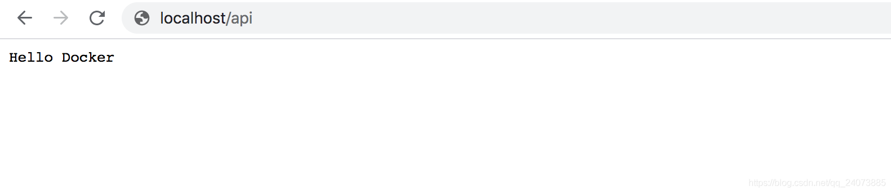

主要解决的问题
- 故障恢复
- 多核利用
- 多进程共享端口

## cluster(集群)
cluster可以多核监听同一个端口。实现多进程共享端口，这个在node底层已经做好了

**folk(child_process.fork)方式不能实现多进程共享端口，还需要nginx去做多个端口的负载均衡，一般来说用cluster要好点，folk方式适用于多个程序之间**

建立一个cluster.js文件
```javascript
var cluster = require('cluster'); // cluster库
var os = require('os'); // 获取cpu的数量
var numCPUs = os.cups().length;
var process = require('process'); // 管理进程用的

console.log('numCPUs:', numCPUs); // 打印cpu数量 ①
var workers = {};
if (cluster.isMaster) { // 这里是进入主进程，第一次启动的时候运行这里
    // 主进程分支
    cluster.on('death', function(worker) { // ②
        // 当一个工作进程结束时，重启工作进程delete workers[worker.pid];这里主要是为了让代码即使报错，也不会影响服务器运行。故障恢复
        worker = cluster.fork();
        workers[worker.pid] = worker;
    })
    // 初始开启与CPU数量相同的工作进程， 多核利用③
    for(var i = 0; i < numCPUs; i++) {
        var worker = cluster.worker(); // 复制进程，有多少个核，复制多少个子进程，复制的过程会重新运行一遍该文件(因为是复制进程，代码也会复制在子进程运行)
        workers[worker.pid] = worker;
    }
} else { // 这里是子进程开启的时候，就是主进程folk之后，会走到这里。所以这里会启动与cpu相同数量的子进程服务
    // 子进程启动服务器，多进程共享3000端口 ④
    var app = require('./app');
    app.use(async (ctx, next) => {
        console.log('worker' + cluster.workder.id + ',PID:'+ process.pid);
        next();
    })
    app.listen(3000);
}

// 当主进程被终止之后，关闭所有工作进程 ⑤
process.on('SIGTERM', function() {
    for(var pid in workers) {
        process.kill(pid);
    }
    process.exit(0);
})
```
直接看代码，这样看可能看不太懂。我们用一个流程图来展示。我在上面代码标记了①-⑤ ,5个代码块



这里看运行情况，启动后，打印了5次cupu数量(主进程一次，子进程4次)，①这段代码执行了5次

然后我们通过访问localhost:3000,得到当前访问的是第三个子进程



## 更优雅的部署node(PM2)

- 内建负载均衡(使用Node cluster集群模块、子进程)
- 线程守护，keep alive
- 0秒停机重载，维护升级的时候不需要停机
- 现在Linux(stable)&MacOs(stable)&Windows(stable)多平台支持
- 停止不稳定的进程(避免无限循环)
- 控制台检测https://id.keymetrics.io/api/oauth/login#/register
- 提供HTTP API

命令部署方法
```
npm install -g pm2
pm2 start app.js --watch -i 2 // watch监听文件变化
// -i 启动多少个实例
pm2 stop all
pm2 list
pm2 start app.js -i max # 根据机器CPU数,开启对应数目的进程
```



process.yml文件部署方法

```
apps: 
    - script: app.js
      instances: 2
      watch  : true
      env    :
        NODE_ENV: production
```

运行pm2 start process.yml



pm2设置开机启动pm2 startup

可以看到两种方式的效果是一样的，但是大多数选择yml文件启动

## docker概念
docker属于Linux容器的一种封装，提供简单易用的容器使用接口
- 提供一次性的环境。比如，本地测试他人的软件、持续集成的时候提供单元测试和构建环境
- 提供弹性的云服务。因为docker容器可以随开随关，很适合动态扩容和缩容
- 组建微服务架构。通过多个容器，一台机器可以跑多个服务，因此在本机就可以模拟处微服务架构
- image可以创建容器，每个容器都有自己的容器端口，我们需要将它映射到主机端口
- docker compose是docker提供的一个命令行工具，用来定义和运行由多个容器组成的应用。使用compose，我们可以通过YAML文件声明式的定义应用程序的各个服务，并由单个命令完成应用的创建和启动

特点
- 高效的利用系统资源
- 快速的启动时间
- 一致的运行环境
- 持续交付和部署
- 更轻松地迁移

对比传统虚拟机总结

特性|容器|虚拟机
---|---|---
启动|秒级|分钟级
硬盘使用|一般为MB|一般为GB
性能|接近原生|弱于
系统支持两|单机支持上千个容器|一般几十个

三个核心概念
1. 镜像
2. 容器
3. 仓库

和pm2类似，docker也有两种方式启动，一种是命令方式，一种是Dockerfile定制镜像方式

DockerFile参数
FROM|MAINTAINER|RUN|ADD&COPY|WORKDIR|VALUME|EXPOSE
---|---|---|---|---|---|---|---
它依赖什么|维护者信息|执行命令行命令|复制文件到指定路径(ADD能解压)|指定工作目录|目录挂载|容器端口

常用的doker命令
- 查看docker版本：dokcer version
- 显示docker系统信息：docker info
- 检索image:docker search image_name
- 下载image:dokcer pull image_name
- 已下载镜像列表:dokcer images
- 删除镜像: docker rm image_name
- 启动容器: docker run image_name

### docker构建一个nginx服务器
1. 拉去官方镜像
    ```
    拉取官方镜像
    docker pull nginx
    查看镜像
    docker images nginx
    启动镜像
    docker run -p 80:80 -d nginx
    查看进程
    docker ps
    docker ps -a // 查看全部
    停止
    docker stop id
    删除镜像
    docker rm id
    ```
2. Dockerfile定制镜像
    ```
    #Dockerfile
    FROM nginx:latest
    RUN echo '<h1>Hello, docker</h1>' > /usr/share/nginx/html/index.html


    # 定制镜像
    docker build -t mynginx .
    # 运⾏
    # -d 守护态运⾏
    docker run -p 80:80 -d mynginx
    ```
### Docker-Compose
:::tip
Docker-Compose项目是Docker官方开源项目，负责实现对docker容器集群的快速编排
Docker-Compose将所管理的容器分为三层,分别是工程(project)，服务(service)以及容器(container)。
Docker-Compose运行目录下的所有文件(docker-compose.yml,extends文件或环境变量文件等)组成一个功能，若无特殊指定工程名即为当前目录名
:::

docker-compose主要是可以集合多个服务，一起运行。比如一个项目有(前端、后台、数据库、nginx)4个服务需要去启动，如果单独启动的话，我们需要运行4次docker。这里我们能通过docker-compose，一起运行

案例：nginx+node+pm2后台

1. nginx-在nginx文件夹里，里面建立一个conf.d文件夹。添加一个一个docker.conf文件
    ```
    ## nginx/conf.d/docker.conf
    server {
        listen       80;
        location / {
            root   /var/www/html;
            index  index.html index.htm;
        }
        location ~ \.(gif|jpg|png)$ {
            root /static;
            index index.html index.htm;
        }
        location /api {
                proxy_pass  http://127.0.0.1:3000;
                proxy_redirect     off;
                proxy_set_header   Host             $host;
                proxy_set_header   X-Real-IP        $remote_addr;
                proxy_set_header   X-Forwarded-For  $proxy_add_x_forwarded_for;
        }
    }
    ```
2. node 
    ```javascript
    // app.js
    const Koa = require('koa');
    const app = new Koa();
    app.use(ctx => {
        ctx.body = 'hello docker';
    })
    app.listen(3000, () => {
        console.log('app started at http://localhost:3000/')
    })

    // process.yml
    apps:
    - script : server.js
        instances: 2
        watch  : true
        env    :
            NODE_ENV: production

    // Dockerfile
    #Dockerfile
    #制定node镜像的版本
    FROM node:10-alpine
    #移动当前目录下面的文件到app目录下
    ADD . /app/
    #进入到app目录下面，类似cd
    WORKDIR /app
    #安装依赖
    RUN npm install
    #对外暴露的端口
    EXPOSE 3000
    #程序启动脚本
    CMD ["pm2-runtime", "start",  "process.yml"]
    ```
3. 构建docker-compose.yml
    ```javascript
    ## docker-compose.yml

    version: '3.1'
    services:
    app-pm2:
        container_name: app-pm2
        #构建容器
        build: ./node 
        ports:
            - "3000:3000"
    nginx:
        restart: always
        image: nginx
        ports:
        - 80:80
        volumes:
        - ./nginx/conf.d/:/etc/nginx/conf.d/  #本地配置文件写入到nginx配置目录
        - ./www/:/var/www/html/ 
    ```
4. 创建一个www文件夹放一个静态html文件
    ```javascript
    //index.html

    hello web!! 
    ```
可以看到在docker-compose文件里面，我们运行了两个镜像，一个是打包后的node名为app-pm2的镜像，一个是nginx的镜像。
同时我们把nginx的配置文件从本地写到了docker运行的nginx目录里面。现在我们来看运行效果：

输入：docker-compose up -d 后台启动命令。


可以看到，两个容器都被创建。现在我们先访问80端口（nginx映射在80端口）。


访问成功，成功访问到www/index.html

然后我们访问/api路径，看是否可以访问到node服务器



访问成功。这里一个docker-compose的案例就成功运行了。里面用了nginx反向代理3000端口接口到80端口/api路径，同时用了pm2去启动node接口服务器。

项目搭建好之后，就需要持续集成了


## 参考资料

+ [Node.js](https://nodejs.org/dist/latest-v10.x/docs/api/)

+ [如何构建一个高可用的node环境](https://blog.csdn.net/qq_24073885/article/details/109580808)