本文内容主要分为两大部分，第一部分是Node.js的基础和架构，第二部分是Node.js核心模块的实现
- Node.js基础和架构
    - Node.js的组成
    - Node.js代码架构
    - Node.js启动过程
    - Node.js事件循环
- Node.js核心模块的实现
    - 进程和进程间通信
    - 线程和线程间同喜
    - Cluster
    - Libuv线程池
    - 信号处理
    - 文件
    - TCP
    - UDP
    - DNS
## Nodejs组成
Nodejs主要由V8、Libuv和第三方库组成：
1. Libuv:跨平台的异步IO库，但它提供的功能不仅仅是IO，还包括进程、线程、信号、定时器、进程间通信，线程池等。
2. 第三方库:异步DNS解析(cares)、HTTP解析器(旧版使用http_parser,新版使用llhttp)、HTTP2解析器(nghttp2)、解压缩库(zlib)、加密解密库(openssl)等
3. V8:实现JS解析、执行和支持自定义拓展,得益于V8支持自定义拓展，才有了Node.js

## Node.js代码架构
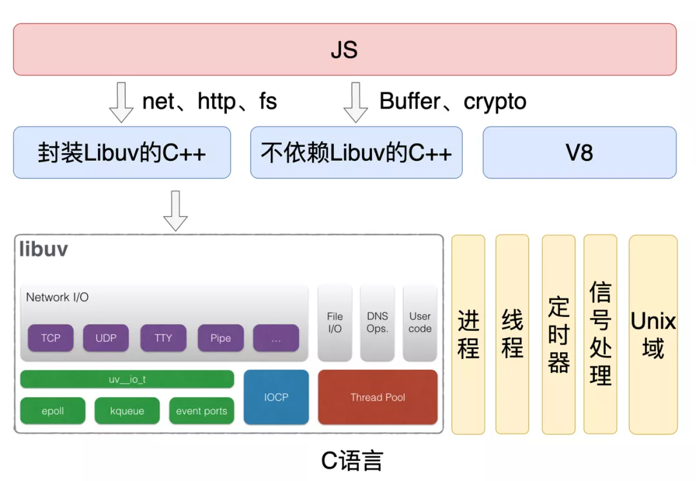

上图是Node.js的代码架构，Node.js的代码主要分为JS、C++、C三种
1. JS是我们平时使用的那些模块(http/fs)
2. C++代码分为三个部分，第一部分是封装了Libuv的功能，第二部分则是不依赖于Libuv(crypto部分API使用了Libuv线程池)，比如Buffer模块，第三部分是V8的代码
3. C语言层的代码主要是分支了操作系统的功能TCP UDP

了解了Node.js的组成和代码架构之后，我们看看Node.js启动的过程都做了什么？

## Node.js启动过程
### 注册C++模块

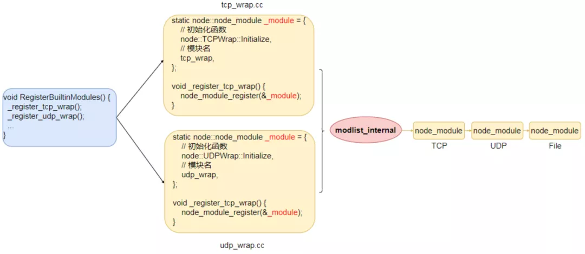

首先Node.js会调用registerBuiltinModules函数注册C++模块，这个函数会调用一系列registerxxx函数，我们在Node.js源码里找不到这些函数，因为这些函数是在各个C++模块中，通过宏定义实现的，宏展开后就是上图黄色框的内容，每个registerxxx函数的作用就是往C++模块的链表插入一个节点，最后形式一个链表

那么Node里是如何访问这些C++模块的呢？在Node.js中，是通过internalBinding访问C++模块的，internalBinding的逻辑很简单，就是根据模块名从模块队列中找到对应的模块。但是这个函数只能在Node.js内部使用，用户可以通过process.binding访问C++模块

### Environment对象和绑定Context
注册完C++模块后就开始创建Environment对象，Environment是Node.js执行时的环境对象，类似一个全局变量的作用,他记录了Nodejs在运行时的一些公共数据。创建完Environment后，Node.js会把该对象绑定到V8的Context中，为什么要这样做呢？主要是为了在V8的执行上下文里拿到env对象，因为V8中只有Isolate、Context这些对象，如果我们想在V8的执行环境中获取Environment对象的内容，就可以通过Context获取Environment对象

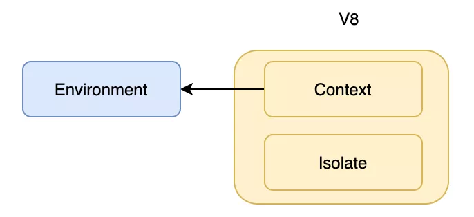
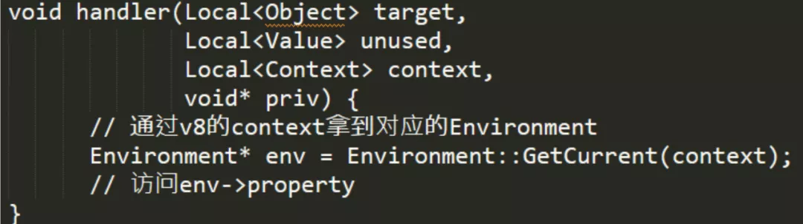

### 初始化模块加载器
1. Node.js首先传入C++模块加载器，执行loader.js,loader.js主要是封装了C++模块加载器和原生JS模块加载器，并保存到env对象中
2. 接着传入C++和原生JS模块加载器，执行run_main_module.js
3. 在run_main_module.js中传入普通JS和原生JS模块加载器，执行用的JS

假设用户的JS如下
- requier('net');
- require('./myModule')

分别加载了一个用户模块和原生JS模块，我们看看加载过程，执行require的时候

1. Node.js首先判断是否是原生JS模块，如果不是咋直接加载用户模块，否则会使用原生模块加载器加载原生JS模块
2. 加载原生JS模块的时候，如果用到C++模块，则使用internalBinding去加载

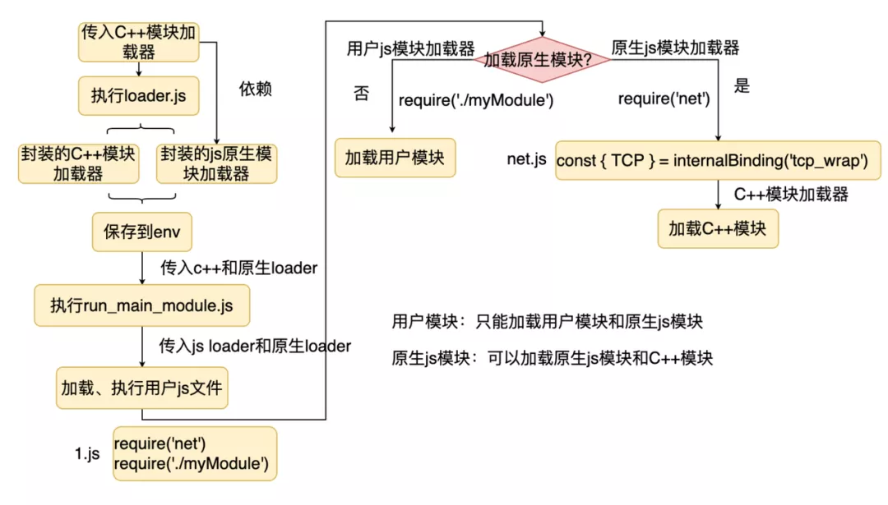

### 执行用户代码，Libuv事件循环
接着Node.js就会执行用户的JS，通常用的JS会给到事件循环生产任务，然后就进入了事件循环系统，比如我们listen一个服务的时候，就会在事件循环中新建一个TCP handle。Node.js就会在这个事件循环中一直运行
```
net.createServer(() => {}).listen(90)
```
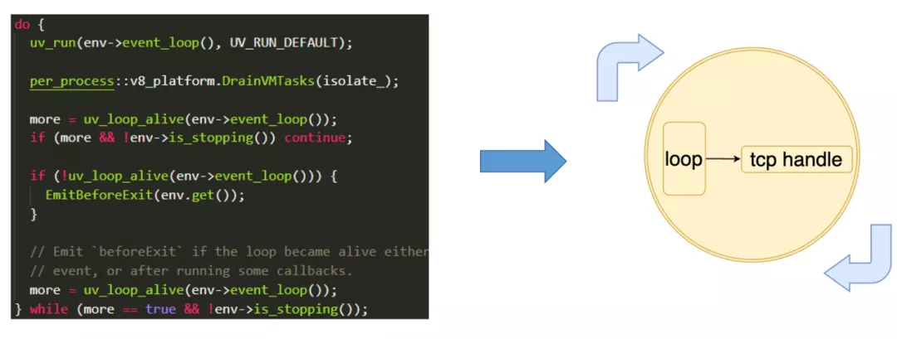

## 事件循环
下面我们看一下事件循环的实现。事件循环主要分为7个阶段，timer阶段主要是处理定时器相关任务，pending阶段主要是处理Poll IO阶段回调里产生的回调，check、prepare、idle阶段是自定义阶段，这三个阶段的任务每次事件循环都会被执行，Poll IO阶段主要是处理网络IO、信号、线程池等任务，closing阶段主要是处理关闭的handle，比如关闭服务器

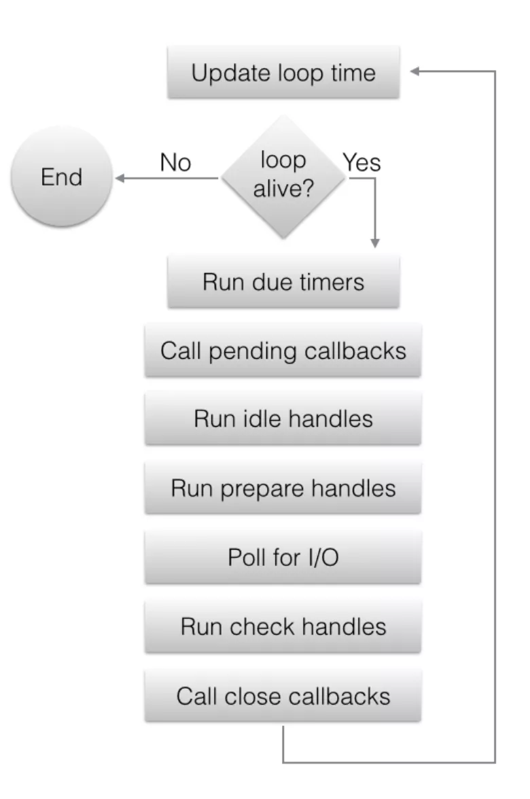

1. timer阶段：用二叉堆实现，最快过期的在根节点。
2. pending阶段：处理Poll IO阶段会回调里产生的回调
3. check、prepare、idle阶段：每次事件循环都会被执行
4. Poll IO阶段：处理文件描述符相关事件
5. closing阶段：执行调用uv_close函数时传入的回到，下面我们详细看一下每个阶段的实现

### 定时器阶段
定时器的底层数据是二叉堆，最快到期的节点在最上面。在定时器阶段的时候,就会逐个节点遍历，如果节点超时了，那么就执行他的回调，没有没有超时，那么后面的节点也不用判断了，因为当前节点是最快过期的，如果他都没有过期，说明其他节点也没有过期。节点的回调呗执行后，就会被删除，为了支持setInterval的场景，如果设置repeat标记，那么这个节点会被重新插到二叉堆

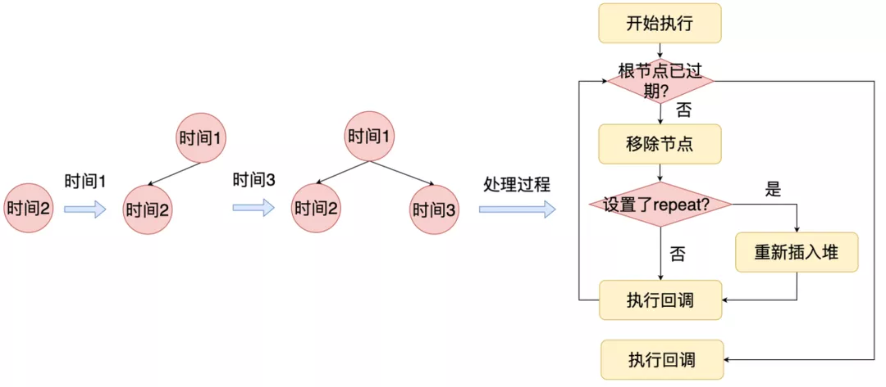

我们看到底层的实现稍微简单，但是 Node.js 的定时器模块实现就稍微复杂。

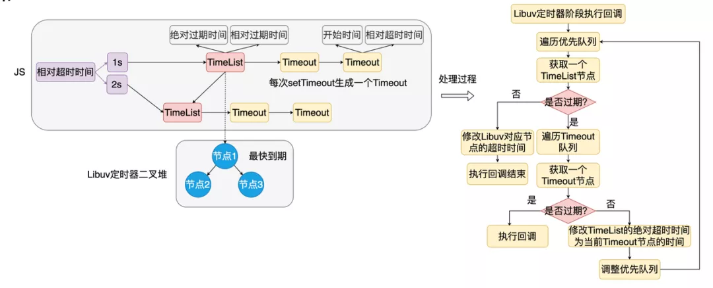

1. Node.js在JS层维护了一个二叉堆
2. 堆的每个节点维护了一个链表，链表中，最久超时的排在后面
3. 另外Node.js还维护了一个map,map的key是相对超时时间，值就是对应的二叉堆节点。
4. 堆的所有节点对应底层的一个超时节点

当我们调用setTimeout的时候，首先会根据setTimeout的入参，从map中找到二叉堆节点，然后插入链表的尾部，必要的时候,Node.js会根据js二叉堆的最快超时时间来更新底层节点的超时时间。当事件循环处理定时器阶段的时候，Node.js会遍历JS二叉堆，然后拿到过期的节点，在遍历过期节点中的链表，逐个判断是否需要执行回调，必要的时候调用二叉堆和底层的超时事件

### check、idle、prepare阶段

check、idle、prepare阶段相对比较简单，每个阶段维护一个队列，然后在处理对应阶段的时候，执行队列中每个节点的回调，不过这三个阶段比较特殊的是，队列中的节点被执行后不会被删除，二三一直在队列中，除非显式删除

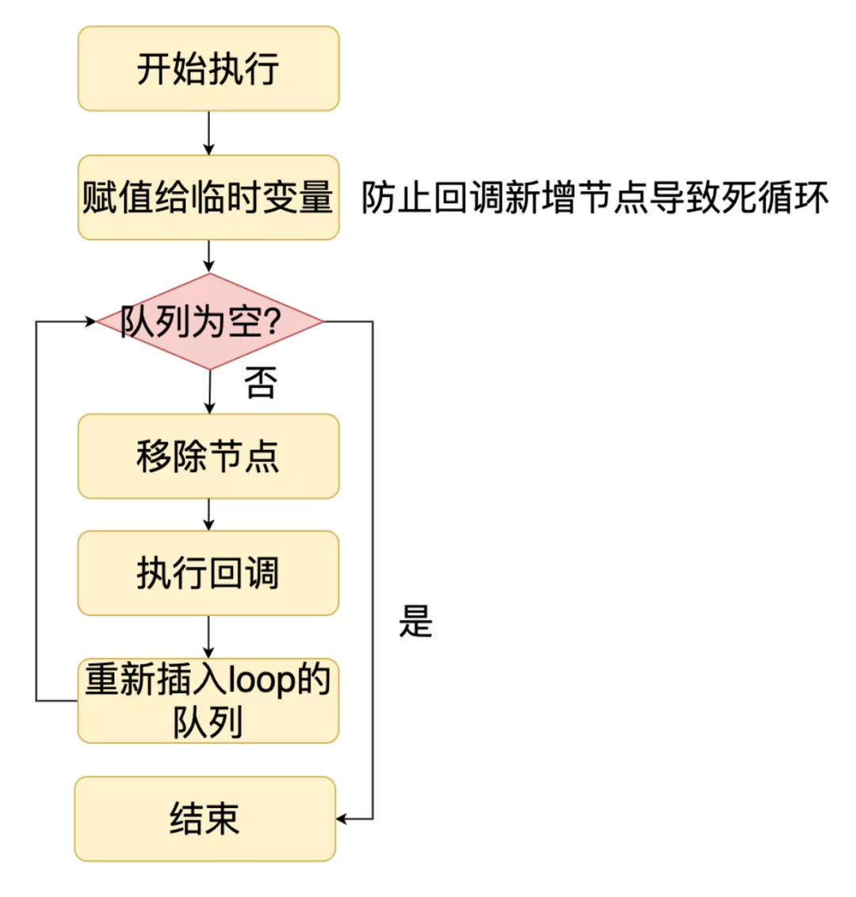

### pending、closing阶段
pending阶段:在Poll IO回调里产生的回调。closing阶段:执行关闭handle的回到。pending和closing阶段也是维护了一个队列，然后在对应阶段的时候执行每个节点的回调，最后删除对应的节点

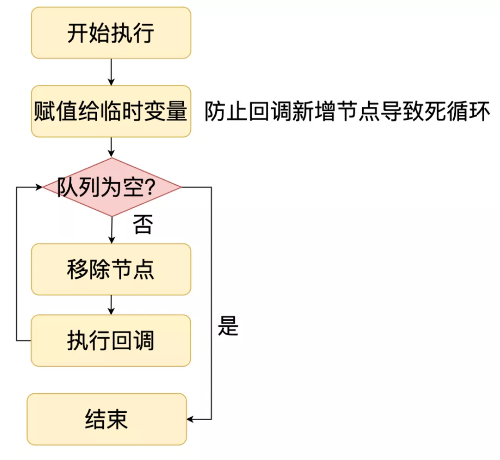

### poll IO阶段
Poll IO阶段是最重要和复杂的一个阶段，下面我们看一下实现。首先我们看一下Poll IO阶段核心的数据结构：IO观察者，IO观察者是对文件的描述符，感兴趣事件和回到的封装，主要是用在epoll中

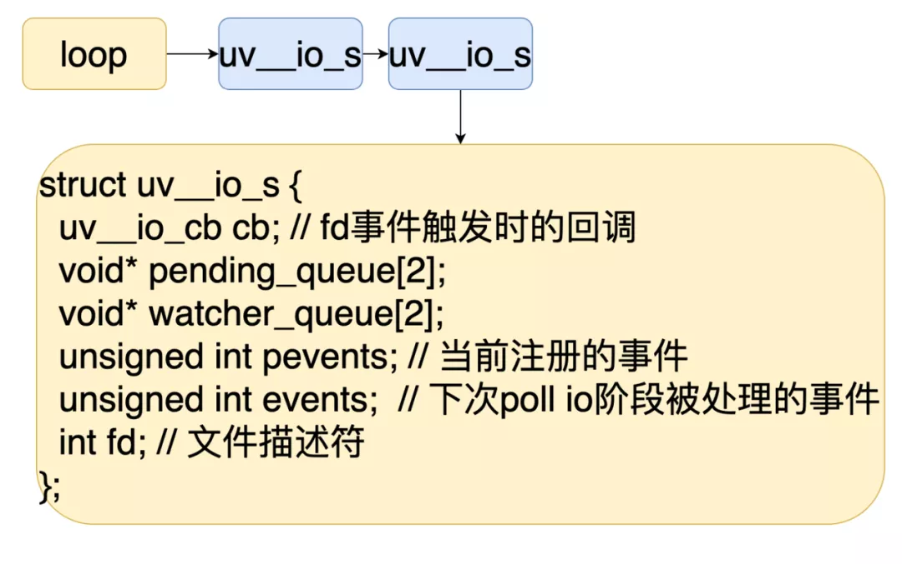

当我们有一个文件描述符需要被epoll监听的时候
1. 我们可以创建一个IO观察者
2. 调用uv_io_start往事件循环中插入一个IO观察者队列。
3. Libuv会记录文件描述符和IO观察者映射关系
4. 在Poll IO阶段的时候就会返回遍历IO观察者队列，然后操作epoll去做响应的处理
5. 等从epoll返回的时候，我们就可以拿到那些文件描述符的事件触发了，最后根据文件描述符找到对应的IO观察者并执行他的回到就行

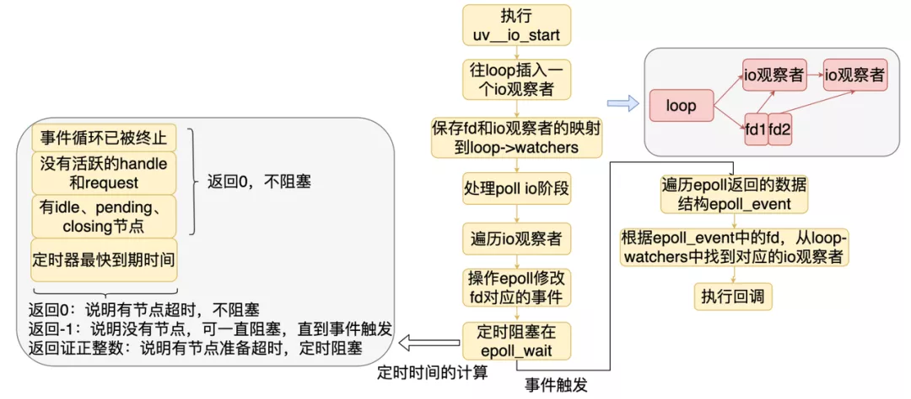

另外我们看到,Poll IO阶段可能会阻塞，是否阻塞和阻塞多久取决于事件循环系统当前状态。当发生阻塞的时候，为了保证定时器阶段按时执行，epoll阻塞的时间需要设置为最快到期定时器节点的时间。

## 进程和进程间通信
### 创建进程
Node.js中的进程是使用fork+exec模式创建的，fork就是复制主进程的数据，exec是加载新的程序执行。

Node.js提供了异步和同步创建进程两种模式

1. 异步方式就是创建一个子进程后，主进程和子进程独立执行，互不干扰。在主进程的数据结构中如图所示，主进程会记录子进程的信息，子进程退出的时候会用到
    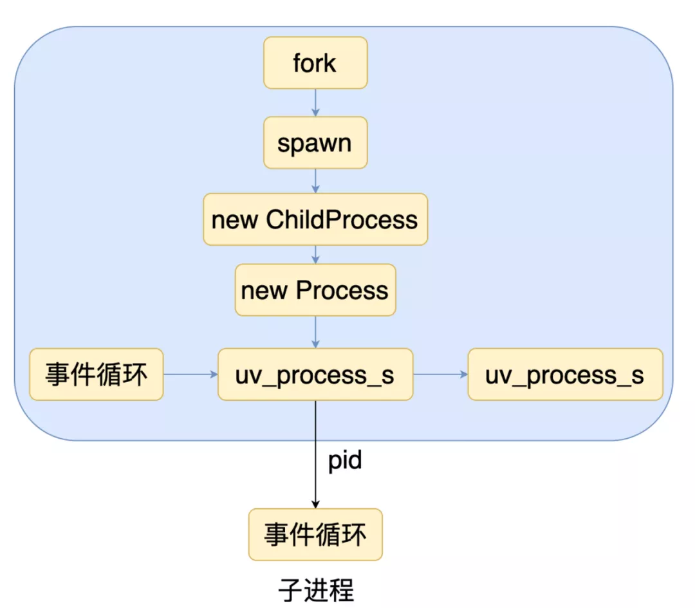

2. 同步方式
    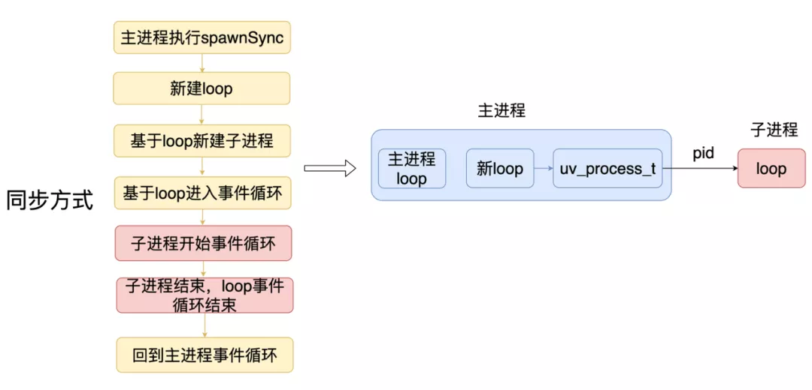

    同步创建子进程会导致主进程阻塞，具体的实现是
    1. 主进程中会新建一个新的事件循环结构体，然后基于这个新的事件循环创建一个子进程
    2. 然后主进程就在新的事件循环中之心，旧的事件循环被阻塞了
    3. 子进程结束的时候，新的事件循环也就结束了，从而回到旧的事件循环。

### 进程间通信
接下来我们看一下父子进程间怎么通信呢？**在操作系统中，进程间的虚拟地址是独立的，所以没有办法于进程内存直接通信，这时候就需要借助内核提供的内存。进程间的通信方式有很多种，管道、信号、共享内存等**

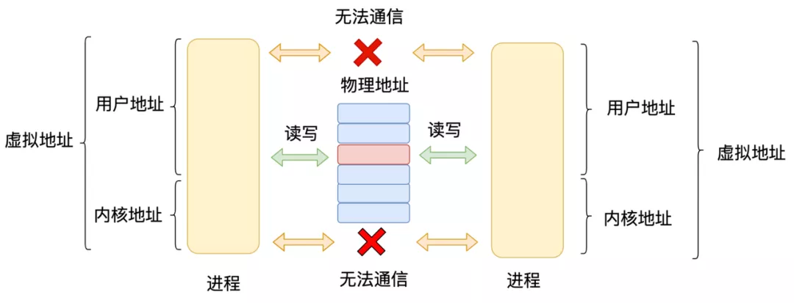

Node.js选取的进程间通信方式是Unix域，Node.js为什么会选取Unix域呢？因为只有Unix域支持描述符传递，文件描述符传递是一个非常重要的能力。

首先我们看一下文件系统和进程的关系，在操作系统中，当进程打开一个文件的时候，他就是形成了一个fd->file-inode这样的管理，这种关系在fork子进程的时候会被继承

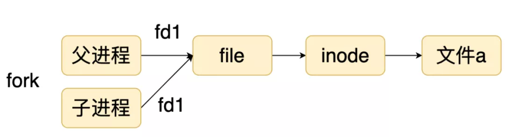

但是如果主进程在fork子进程之后，打开了一个文件，他想告诉子进程，那怎么办呢？如果仅仅是把文件描述符对应的数字传给子进程，子进程是没有办法知道这个数字对应的文件的。如果通过Unix域发送的话，系统会把文件描述符和文件的关系也复制到子进程中。

具体实现

1. Node.js底层通过cosketpair创建两个文件描述符，主进程拿到其中一个文件描述符，并且封装了send和onmessage方法进程进程间通信
2. 接着主进程通过环境变量把另一个文件描述符传给子进程
3. 子进程同样基于文件描述符封装发送和接受数据的接口，这样两个进程就可以进行通信了

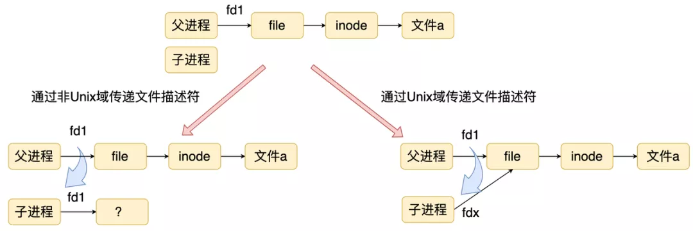

## 线程和线程间通信
### 线程架构
Node.js是单线程的，为了方便用户处理耗时的操作，Node.js在支持多进程之后，又支持了多线程。

Node.js中多线程的架构如下图所示，每个子线程本质上是独立的事件循环，但是所有的线程会共享底层的Libuv线程池

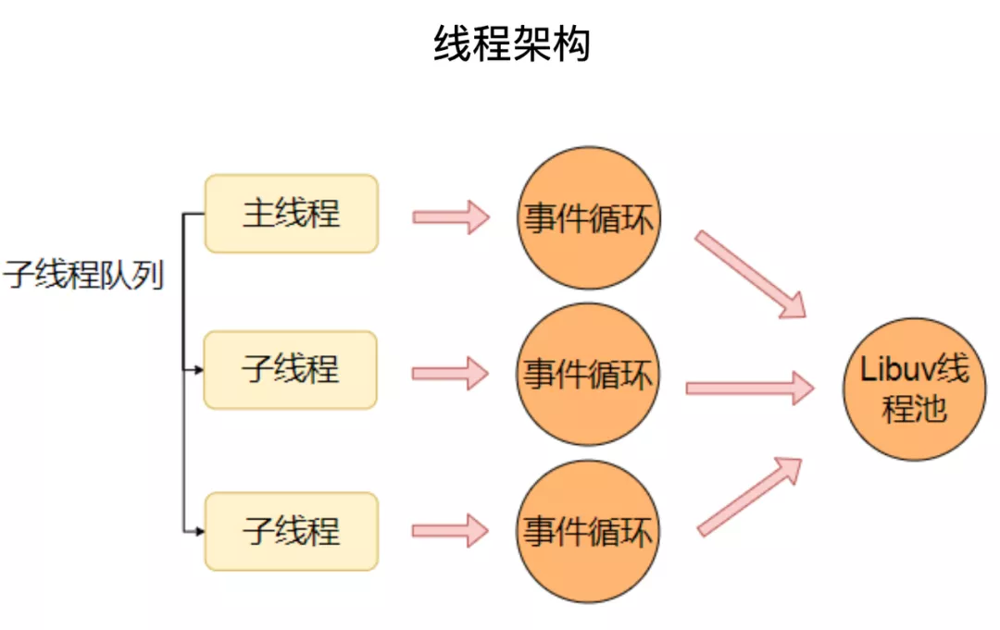

### 创建线程
接下来我们看看创建线程的过程

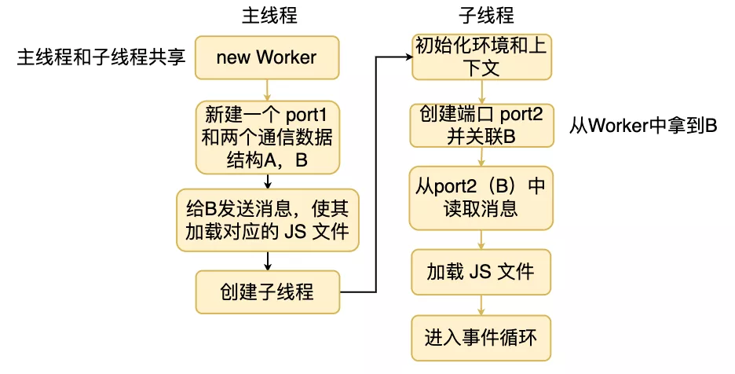

当我们调用new Worker创建线程的时候
1. 主线程会首先创建创建两个通信的数据结构，接着往对端发送一个加载JS文件的信息
2. 然后调用底层接口创建一个线程
3. 这时候子线程就被创建出来了，子线程被创建后首先初始化自己的执行环境和上下文
4. 接着从通信的数据中读取文件，然后加载对应的js文件，最后进入事件循环

### 线程间通信
那么Node.js中的线程是如果通信的呢？线程和进程不一样，进程的地址空间是独立，不能直接通信，但是线程的地址是共享的，所以可以基于进程的内存直接进行通信

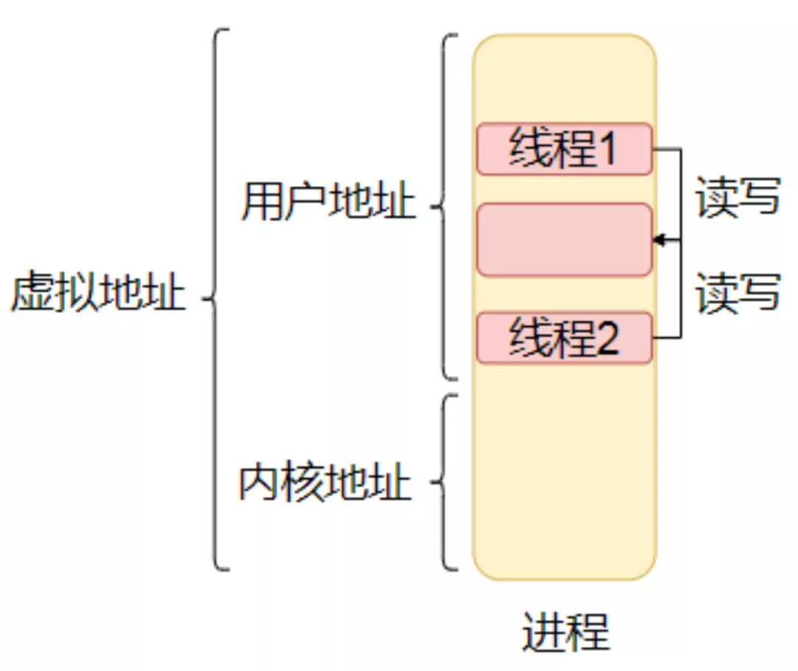

下面我么看看Node.js是如何实现线程间通信的。了解Node.js线程通信之前，我们先看一下核心数据结构
1. Message代表一个消息
2. MessagePortData是对操作Messge的封装和对消息的承载
3. MessagePort是代表通信的端点，是对MessagePortData的封装
4. MessageChannel是代表通信的两端，即两个MessagePort。

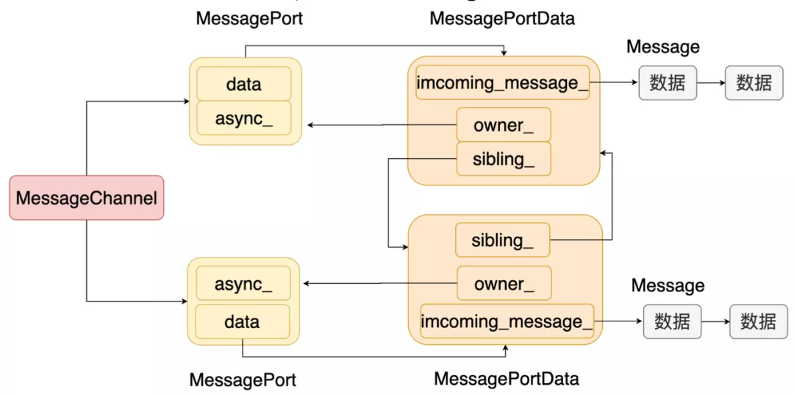

我么看到两个port是相互关联的，当需要给对端发送消息的时候，只需要往对端的消息队列插入一个节点就行。我们来看看通信的具体过程

1. 线程1调用postMessage发送消息
2. postMessage会先对消息进行序列化
3. 然后拿到对端消息队列的锁，并把消息插入度列中
4. 城府发送消息后，还需要通知消息接收者所在的线程
5. 消息接收者会在时间循环的Poll IO阶段处理这个消息

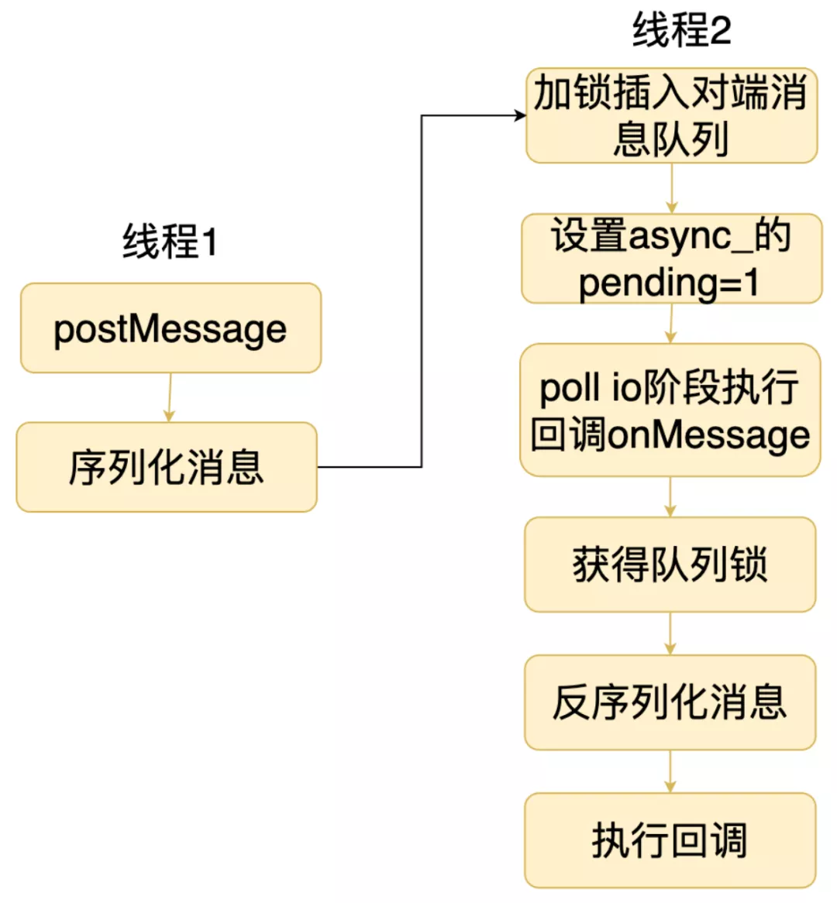

## Cluster

我们知道Node.js是单进程架构的，不能很好地利用多核，Cluster模块使得Node.js支持多进程的服务器架构。Node.js支持轮训(主进程accept)和共享(子进程accept)两种模式，可以通过环境变量进行设置。多进程的服务器架构通常有两种模式，第一种是主进程处理连接，然后分发给子进程处理，第二种是进程共享socket，通过竞争的方式获取连接进行处理

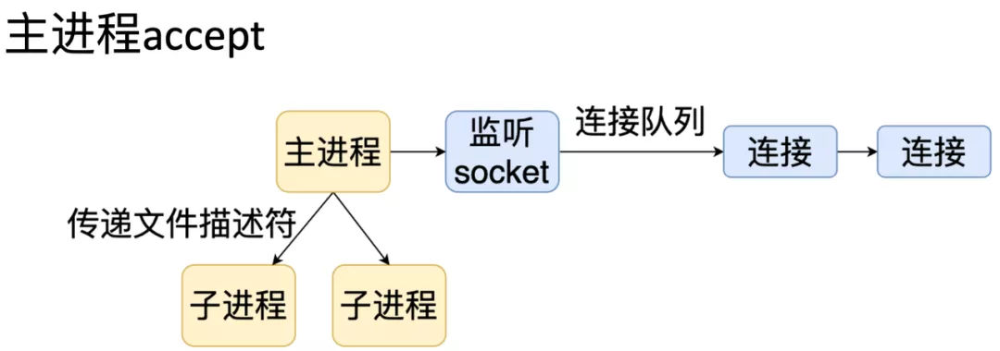

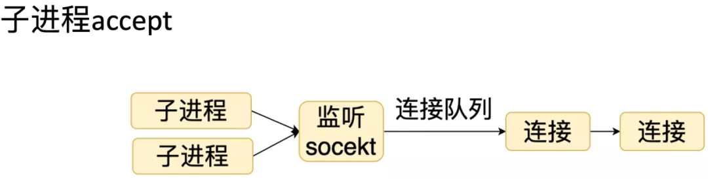

我们看一下Cluster模块是图和使用的
```
const cluter = require('cluster');
const http = require('http');
const numCPUs = require('os').cpus().length;

if (cluster.isMaster) {
    // 创建子进程
    for (let i = 0; i < numCPUs;i ++) {
        cluster.fork();
    }
} else {
    http.createServer((req, res) => {
        res.writeHead(200);
    }).listen(8000)
}
```
这是个Cluster模块的使用例子
1. 主进程调用fork创建子进程
2. 子进程启动一个服务器。通常来说，多个进程监听同一个端口会包括，我们看看Node.js里是怎么处理这个问题的

### 主进程accept
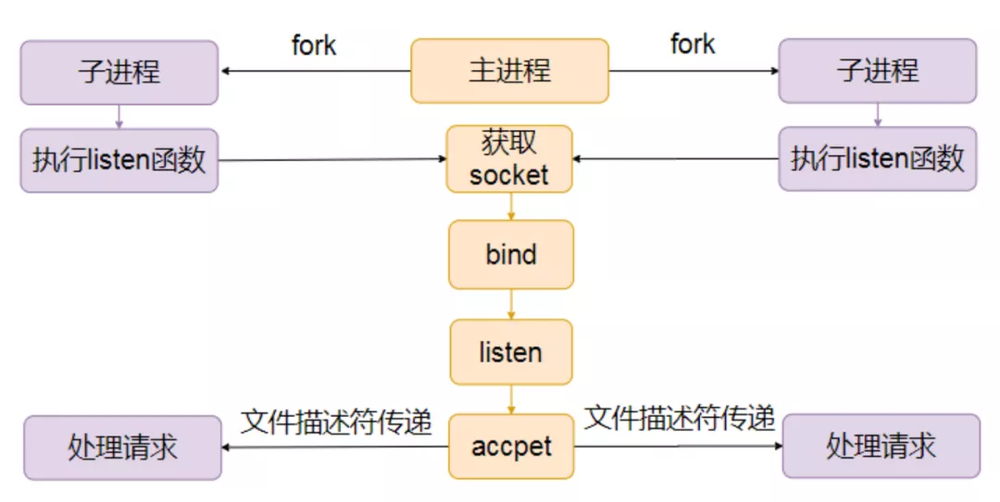

我们先看一下主进程accept这种模式
1. 首先主进程fork多个子进程处理
2. 然后在每个子进程里调用listen
3. 调用listen函数的时候，子进程会给主进程发送一个消息
4. 这时候主进程会创建一个socket，绑定地址，并置为监听状态
5. 当连接到来的时候，主进程负责接收连接，然后通过文件描述符传递的方式分发给子进程处理

### 子进程accept
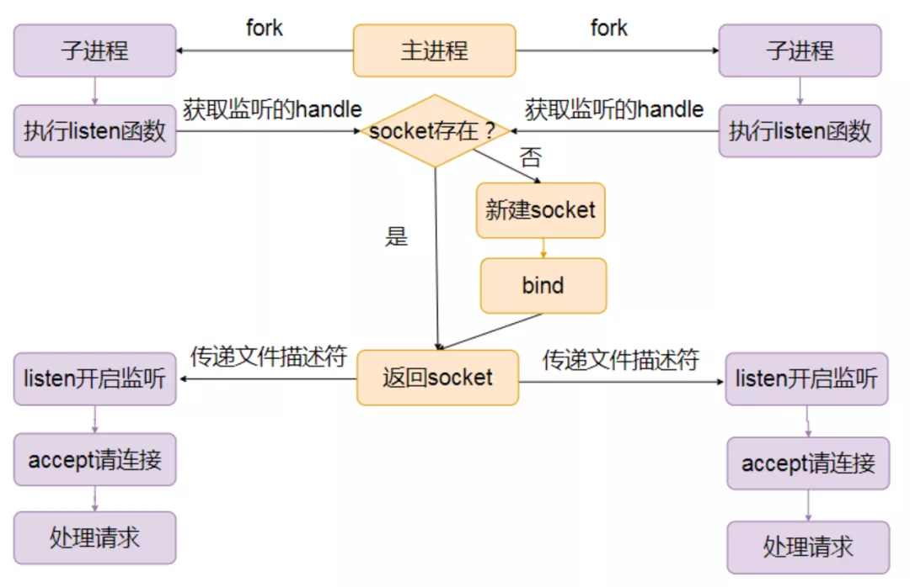

我们在看一下子进程accept这种模式
1. 首先主进程fork多个子进程处理
2. 然后在每个进程里调用listen
3. 调用listen函数的时候，子进程会给主进程发送一个消息
4. 这时候主进程就会创建一个socket，并绑定地址。但不会把他置为监听状态，而是吧这个socket通过文件描述符的方式返回给子进程
5. 当连接到来的时候，这个连接会被某一个子进程处理

## Libuv线程池
为什么需要使用线程池？文件IO、DNS、CPU密集型不适合在Node.js主线程处理，需要把这些任务放到子线程处理

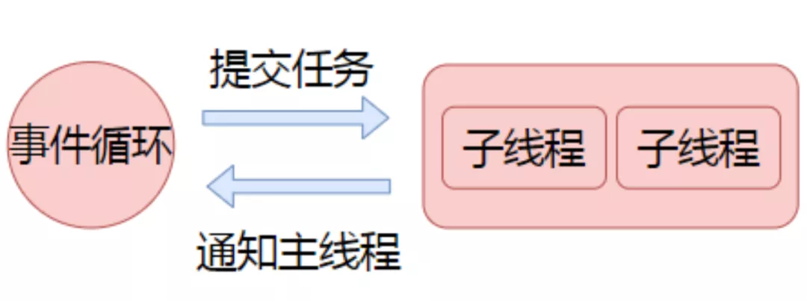

了解线程池实现之前我们先看下Libuv的异步通信机制，异步通信指的是Libuv主线程和其他子线程之间的通信机制。比如Libuv主线程正在执行回调，子线程同事完成了一个任务，那么如何通知主线程，这就需要用到异步通信机制

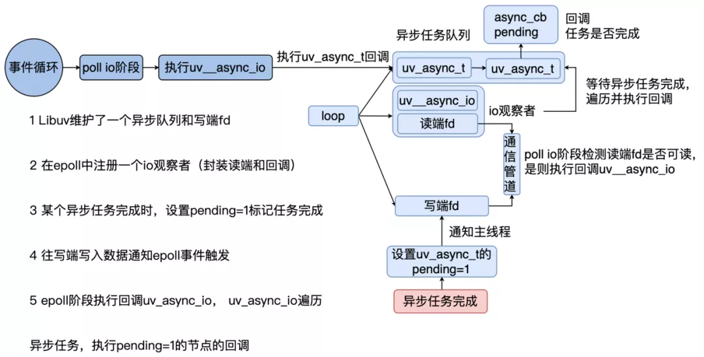

1. Libuv内部维护了一个异步通信的队列，需要异步通信的时候，就往里面插入了一个async节点
2. 同时Libuv还维护了一个异步通信相关的IO观察者
3. 当有异步任务完成的时候，就会设置对应的async节点的pending字段为1，说明任务完成了。并且通知主线程。
4. 主线程在Poll IO阶段就会执行处理异步通信的回调，在回调里会执行pending为1的节点的糊掉。

下面我们来看一下线程池的实现

1. 线程池维护了一个待处理的任务队列，多个线程互斥的从队列中摘下任务进行处理
2. 当给线程池提交一个任务的时候，就是往这个队列里插入一个节点
3. 当子线程处理完任务后，就会把这个任务插入到事件循环本身维护到一个已完成队列中，并且通过异步通信的机制通知主线程。
4. 主线程在Poll IO阶段就会执行任务对应的回调

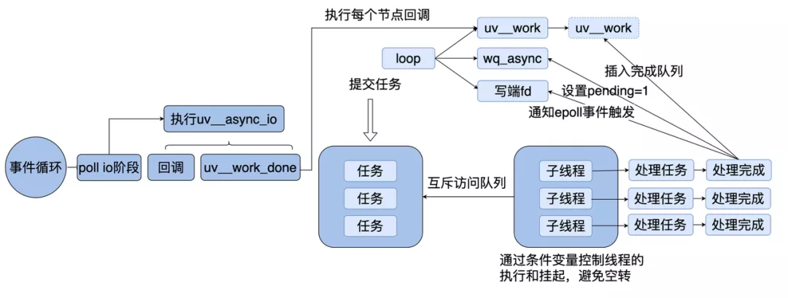

## 信号


上图是操作系统中信号的表示，操作系统使用一个long类型表示进程收到的信息，并且用一个数组来标记对应的处理函数。我们看一下信号模块在Libuv中是如何实现的

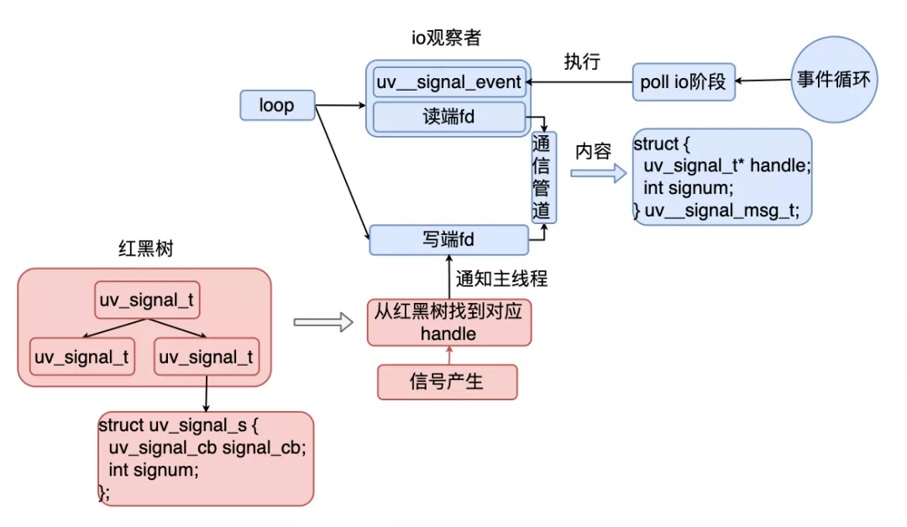

1. Libuv中维护了一个红黑树，当我们监听一个新的信号时就会插入一个节点
2. 在插入第一个节点时，Libuv会封装一个IO观察者注册到epoll中，用来监听是否有信号需要处理
3. 当信号发生的时候，就会根据信号类型从红黑树中找到对应的handle，然后通知主线程
4. 主线程在Poll IO阶段就会逐个执行回调

Node.js中，是通过监听newListener事件来实现信号的监听的，newListener是一种hooks的机制。每次监听事件的时候，如果监听了newListener事件，那就会触发newListener事件。所以当执行process.on('SIGINT')时，就会调用startListeningIfSignal(newListener事件的处理器)注册一个红黑树节点。并在events模块保存了订阅关系，信号触发时，执行process.emit('SIGINT')通知订阅者

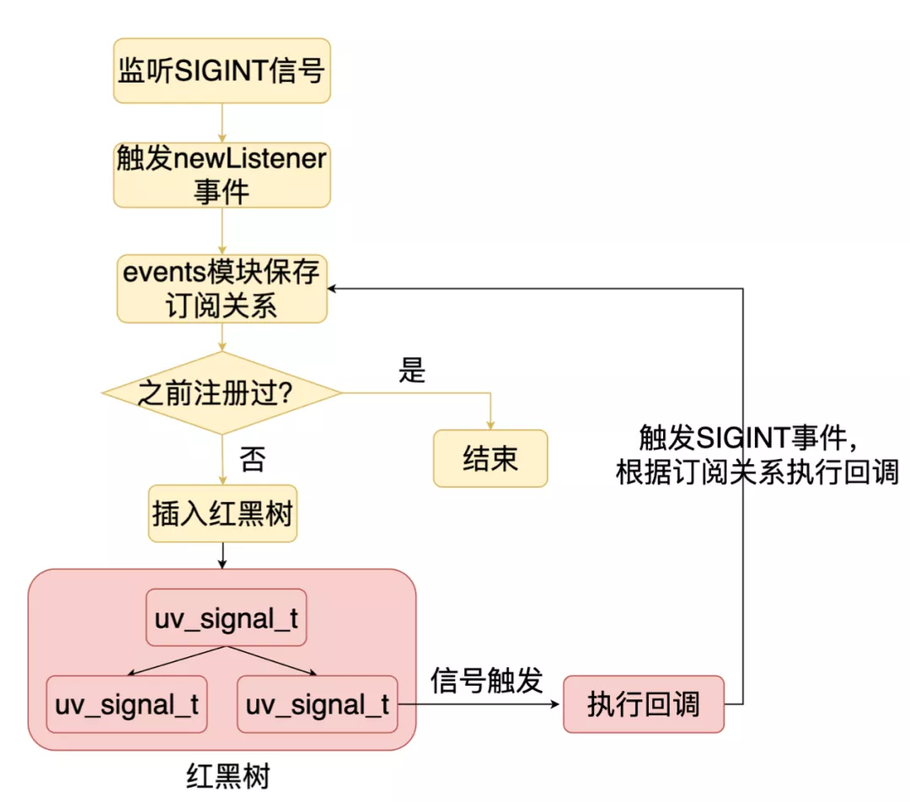

## 文件
### 文件操作
Node.js中文件操作分为同步和异步模式，同步模式就是在主进程中直接调用文件系统的API，这种方式可能会引起进程的阻塞，异步方式是借助了Libuv线程池，把阻塞操作放到子线程中去处理，主线程可以继续处理其他操作

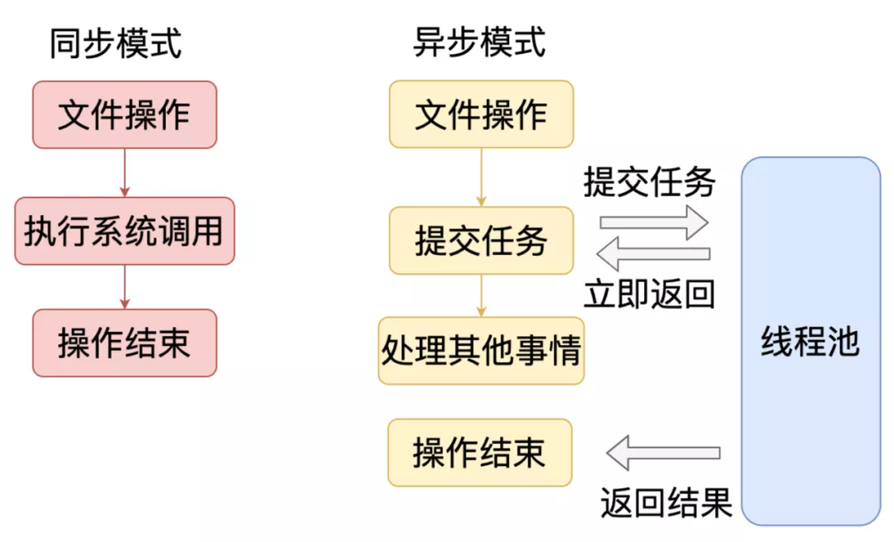

### 文件监听
Node.js中文件监听提供了基于轮询和订阅发布两种模式。我们先看一下轮询模式的实现，轮询模式比较简单，他是使用定时器实现的，Node.js会定时执行回调，在回调中比较当前文件的元数据和上一次获取的是否不一样了，如果是则说明文件改变了

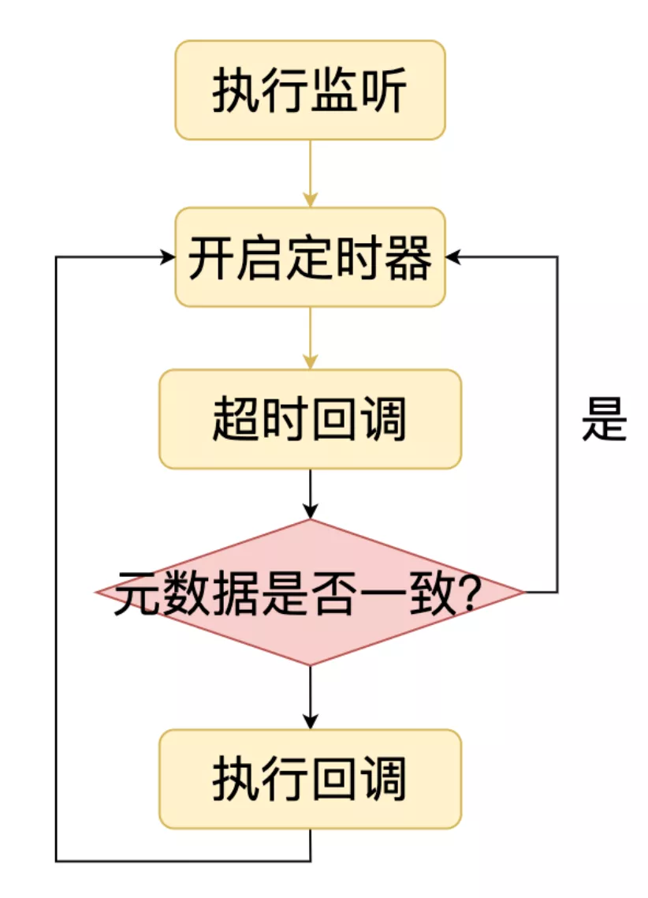

第二种监听模式是更高效的inotify机制，inotify是基于订阅发布模式的，避免了无效轮询。我们首先看一下操作系统的inotify机制，inotify和epoll的使用是类似的

1. 首先通过接口获取一个inotify实例对应的文件描述符
2. 然后通过增删改查接口操作inotify实例，比如需要监听一个文件的时候，就调用接口往inotify实例中新增一个订阅关系
3. 当文件发生改变的额时候，我们可以调用read接口获取那些文件发生了改变，inotify通常接口epoll来使用

接下来我们看看Node.js中如何基于inotify机制实现文件监听的

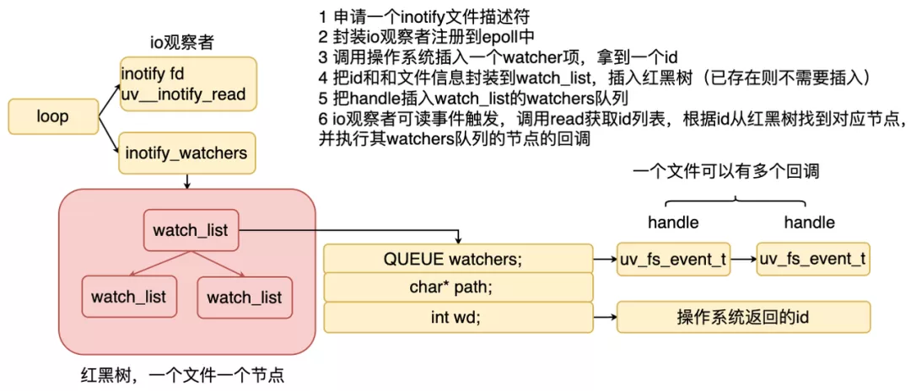

1. 首先Node.js把inotify实现的文件描述符和回调封装成io观察者注册到epoll中
2. 当需要监听一个文件的时候，Node.js会调用系统函数往inotify实例中插入一个项，并且拿到一个id,接着Node.js把这个id和文件信息封装到一个结构体中，然后插入红黑树
3. Node.js维护了一个红黑树，红黑树的每个节点记录了呗监听的文件或目录和事件触发时的回调列表
4. 如果有事件出发时，在Poll IO阶段就会执行对应的回调，回调里会判断那些文件发生了然后根据id从红黑树找到对应的接口，从而执行对应的回调

## TCP
我们通常会调用http.createServer(cb).listen(port)启动一个服务器，那么这个过程到底做了什么呢？listen函数其实是对网络API的封装
1. 首先获取一个socket
2. 然后绑定地址到该socket中
3. 接着调用listen函数把该socket改为监听状态
4. 最后把该socket注册到epoll中，等待连接的到来

那么Node.js是如何处理连接的呢？当监理了一个TCP连接后，Node.js会在Poll IO阶段执行对应的回调
1. Node.js会调用accept摘下一个TCP连接
2. 接着会调C++层，C++层会新建一个对象表示和客户端通信的实例
3. 接着回调JS层，JS也会新建一个对象表示要通信的实例，主要是用户使用
4. 最后注册等待可读事件，等待客户端发送数据过来

这就是Node.js处理一个连接的过程，处理完一个连接后,Node.js会判断是否设置了single_accept标记，如果有则睡眠一段时间，给其他进程处理剩下的连接，一定程度避免了负责不均衡，如果没有设置改标记，Node.js会继续尝试下一个连接。这就是Node.js处理连接的整个过程

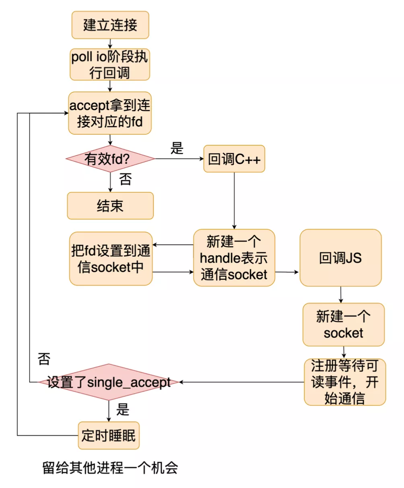

## UDP
因为UDP是非连接、不可靠的协议，在实现和使用上相对比较简单，这里讲一下发送UDP数据的过程，当我们发送一个UDP数据包的时候，Libuv会把数据先插入等待发送队列，接着在epoll中注册等待可写的时间，当可写的事件的触发的时候，Libuv会遍历等待发送队列，逐个节点发送，发送成功后，Libuv会把节点移到发送成功队列，并往pending阶段插入一个节点，在pending阶段,Libuv就会执行发送完成队列里节点的回调通知等待调用方法结束

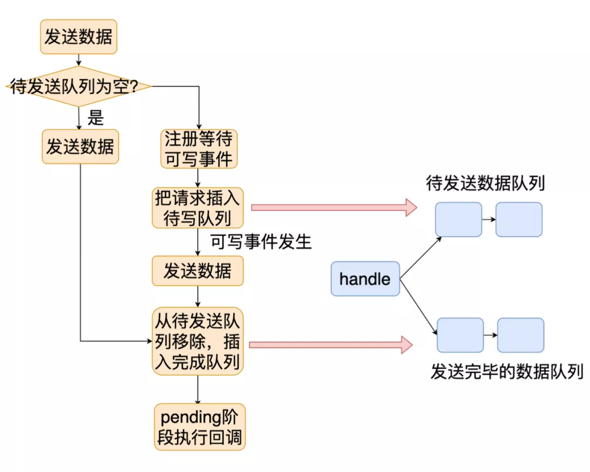

## DNS
因为通过域名查找IP或通过IP查找域名的API是阻塞式的，所以这两个功能是借助了Libuv的线程池实现的。发起一个查找操作的时候，Node.js会往线程池提及一个任务，然后就继续处理其他事情了，同时线程池的子线程会调用底层函数做DNS查询，查询结束后，子线程会把结果交给主线程。这就是整个查找过程

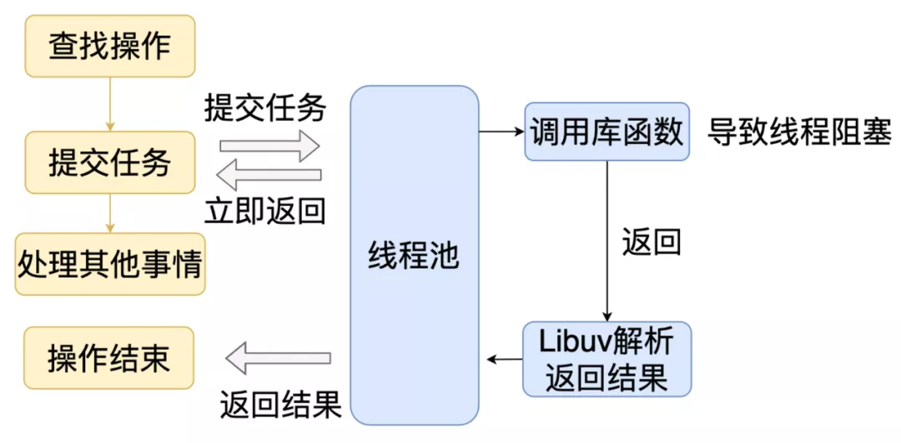

其他的DNS操作是通过cares实现的，cares是一个异步DNS库，我们知道DNS是一个应用层的协议，cares就是实现了这个协议。我们看一下Node.js是怎么使用cares实现DNS操作的。

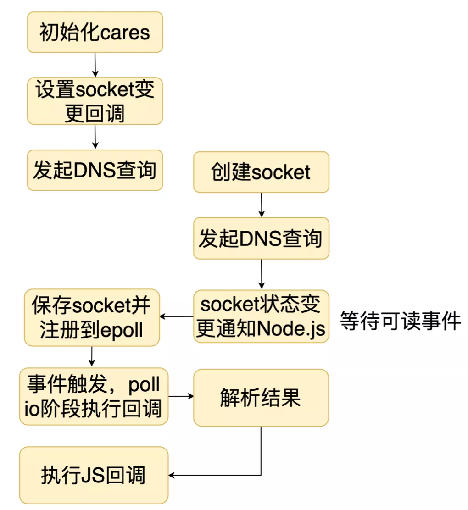

1. 首先Node.js初始化的时候，会初始化cares库，其中最重要的是设置socket变更的回调。我们一会可以看到这个回到的作用
2. 当我们发起一个DNS操作的时候，Node.js会调用cares的接口，cares接口会创建一个socket并发起一个DNS查询，接着通过状态变更回调把socket传给Nodejs
3. Node.js把这个socket注册到epoll中，等待查询结果，当查询结果返回的时候，Node.js会调用cares的函数进行解析，最后调用js回调通知用户

## 总结
本文从整体的角度介绍了一下 Node.js 的实现，同时也介绍了一些核心模块的实现。从本文中，我们也看到了很多底层的内容，Node.js 正是结合了 V8 和 操作系统的能力创建出来的 JS 运行时。深入去理解 Node.js的原理和实现，可以更好地使用 Node.js。

更多内容可以参考：https://github.com/theanarkh/understand-nodejs

## 资料
[原文](https://mp.weixin.qq.com/s/JmvHLsueJJZluNyroDbwdg)