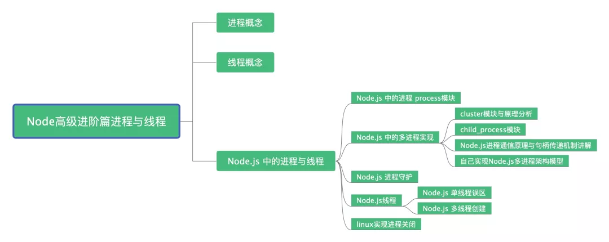
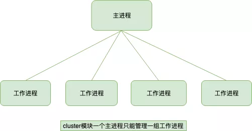
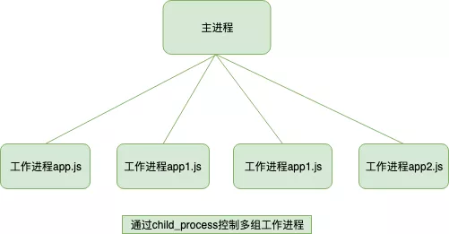
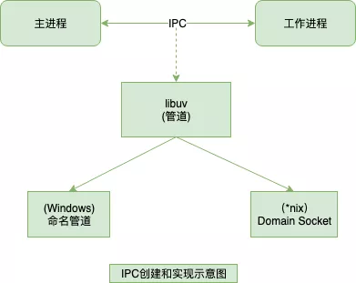
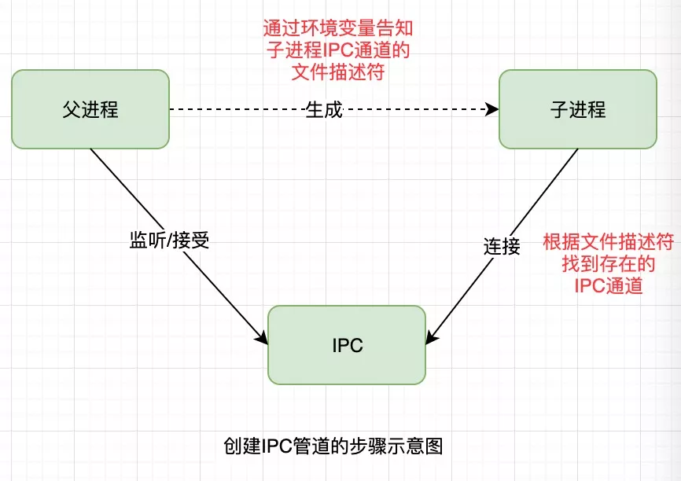
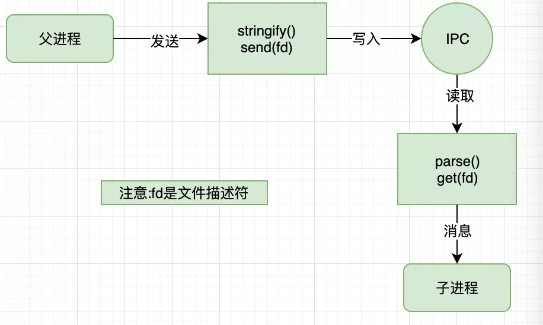
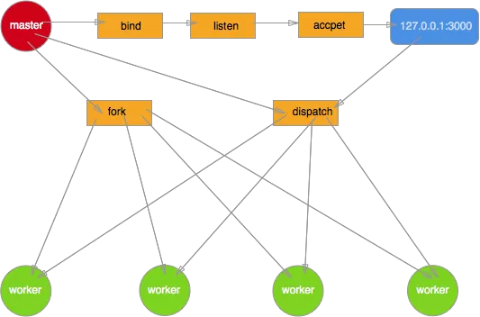
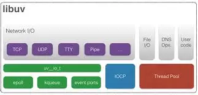

## 前言
进程和线程是一个程序员的必知概念，面试经常被问及，但是一些文章内容只是讲讲理论知识，可能一些小伙伴并没有整的理解，在实际开发中应用也比较少。本篇文章除了介绍概念，通过Node.js的角度讲解进程与线程，并且讲解一些项目中的实战的应用，让你不仅仅能迎战面试官还可以在实战中完美应用

### 文章导览



### 面试会问
1. Node.js是单线程吗？
2. Node.js做耗时的计算时候，如何避免阻塞
3. Node.js如何实现多进程的开启和关闭
4. Node.js可以创建线程吗
5. 开发过程中如何实现进程首付
6. 处了使用第三方模块，自己是否封装过一个多进程架构

## 进程
进程Process是计算机中的程序中关于某数据集合上的一次运行活动，是系统进行资源分配的和调度的基本单位，是操作系统结构的基础，进程是线程的容器。进程是资源分配的最小单位。我们启动一个服务、运行一个实例，就是开一个服务进程，例如Java里的JVM本身就是一个进程，Node.js里通过node app.js开启一个服务进程，多进程就是进程的复制fork，fork出来的每一个进程都拥有自己的独立空间地址、数据线，一个进程无法访问另一个进程里定义的变量、数据结构，只有建立了IPC通信，进程之间才可数据共享。
```
const http = require('http');

const server = http.createServer();
server.listen(3000, () => {
    process.title = '程序员成长测试进程';
    console.log('进程id',process.pid)
})
```
运行上面代码后，以下为Mac系统自带的监控工具"活动监视器"所展示的效果，可以看到我们刚开启的Nodejs进程7663


## 线程
线程是操作系统能够进行运算调度的最小单位，首先我们要清楚线程是隶属于进程的，被包含于进程中。**一个线程只能隶属于一个进程，但是一个进程是可以拥有多个线程的**

### 单线程
**单线程就是一个进程只开一个线程**

Javascript就是属于单线程，程序顺序执行(这里暂且不提JS异步)，可以想象一个队列，前面一个执行完之后，后面才可以执行，当你在使用单线程语言编码时切勿有过多耗时的同步操作，否则想成会造成阻塞，导致后续响应无法处理。你如果采用Javascript进行编码时，尽可能的利用Javascript异步操作的特性
```
// 经典计算耗时造成线程阻塞的例子
const http = require('http');
const longComputation = () => {
    let sum = 0;
    for (let i = 0; i< 1e10; i++) {
        sum += i;
    }
    return sum;
}
const server = http.createServer();
server.on('request', (req, res) => {
    if (req.url === '/compute') {
        console.info('计算开始', new Date());
        const sum = longComputation();
        console.info('计算结束', new Date());
        return res.end(`Sum is ${sum}`)
    } else {
        res.end('ok')
    }
})
server.listen(3000);

//打印结果

//计算开始 2019-07-28T07:08:49.849Z

//计算结束 2019-07-28T07:09:04.522Z

```
查看打印结果，当我们调用 127.0.0.1:3000/compute的时候，如果想要调用其他的路由地址比如127.0.0.1/大约需要15秒时间，也可以说一个用户请求完第一个 compute接口后需要等待15秒，这对于用户来说是极其不友好的。下文我会通过创建多进程的方式 child_process.fork 和 cluster 来解决解决这个问题。

**单线程的一些说明**
1. Node.js虽然是单线程，但是其基于事件驱动、异步非阻塞模式，可以应用于高并发场景，避免了线程创建、线程之间上下文切换所产生的资源开销
2. 当你的项目中需要有大量计算,CPU耗时的操作的时候，要注意考虑开启多进程来完成了
3. Node.js开发过程中，错误会引起整个应用退出，应用的健壮性值得考验，尤其是错误的异常抛出，以及进程守护是必须要做的
4. 单线程无法利用多核CPU，但是后来Node.js提供的API以及一些第三方工具相应都得到了解决，文章后面会讲到

## Node.js中进程和线程
Node.js是Javascript在服务端的运行环境,构建在chrome的V8引擎之上，基于事件驱动、非阻塞I/O模型，充分利用操作系统提供的异步I/O进行多任务执行，适合于I/O密集型的应用场景，因为异步，程序无需阻塞等待结果返回，而是基于回调通知的机制，原本同步模式等待的时间，则可以用来处理其他任务

:::danger
在web服务器方面，著名的Nginx也是采用此模式(事件驱动)，避免了多线程的线程创建、线程上下文切换开销，Nginx采用C语言进行编写，主要用来做高性能的Web服务器，不适用做业务
:::

Web业务开发中，如果你有高并发应用场景那么Node.js会是你不做的选择。

在单核CPU系统之后我们采用单进程+单线程的模式来开发。在多核CPU系统上，可以通过child_process, fork开启多个进程(Node.js在v0.8版本之后新增了Cluster来实现多进程架构)，即多进程+单线程模式。注意：开启多进程不是为了解决高并发，主要是解决了单进程模式下Nodejs CPU利用率不足的情况，充分利用多核CPU的性能

## Node.js中的进程

### process模块
Node.js中的进程Process是一个全局对象，无需require直接使用，给我们提供了当前进程中的相关信息。官方文档提供了详细说明，感兴趣的可以亲自实践下Process文档。
- process.env:环境变量，例如通过process.env.NODE_ENV获取不同环境项目配置信息
- process.nextTick：这个在谈及Event Loop时候经常用到
- process.pid：获取当前的进程id
- process.ppid：当前进程对应的父进程
- process.cwd():获取当前进程工作目录
- process.platform:获取当前进程运行的操作系统平台
- process.uptime():当前进程已运行时间，例如pm2守护进程的uptime值
- 进程事件: process.on('uncaughtException', cb),捕获异常信息、process.on('exit', cb)进程退出监听
- 三个标准流：process.stdout标准输出、process.stdin标准输入、process.stderr标准错误输出
- process.title：指定进程名称，有的时候需要给进程指定一个名称

以上仅列举了部分常用功能点，除了Process之外Node.js还提供了child_process模块用来对子进程进行操作，在下文Node.js进程创建会继续讲述

### Node.js进程创建
进程创建有多种方式，本篇文章以child_process模块和cluster模块进行讲解

#### child_process模块

child_process是Node.js内置模块，[官网地址](http://nodejs.cn/api/childprocess.html#childprocesschild_process)

几个常用函数：四种方式
- child_process.spawn():适用于返回大量数据，例如图像处理，二进制数据处理。
- child_process.exec():适用于小量数据，maxBuffer默认值为200*1024超出这个默认值将会导致程序崩溃，数据量大可采用spawn
- child_process.execFile():类似child_process.exec()，区别是不能通过shell来执行，不支持I/O重定向和文件查找这样的行为
- child_process.fork():衍生新的进程，进程之间是相互独立的，每个进程都有自己的V8实例、内存、系统资源是有限的，不建议衍生太多的子进程出来，通常根据cpu核心数设置。

:::danger
CPU核心数这里说明下，fork确实可以开启多个进程，但是并不建议衍生出来太多的进程，cpu核心数的获取方式const cpus = require('os').cpus();这里cpus返回一个对象数组，包含所安装的每个CPU/内核的信息，二者总和的数组。假设主机装有两个cpu，每个cpu有4个核，那么总核数就是8
:::

#### fork开启子进程demo
fork开启子进程解决文章起初的计算耗时时造成线程阻塞。在进程compute计算时创建子进程，子进程计算通过send方法将结果发送给主进程，主进程通过message监听到信息后处理并推出
```
// fork_app.js
const http = require('http');
const fork = require('child_process').fork;

const server = http.createServer((req, res) => {
    if (req.url === '/compute') {
        const compute = fork('./fork_compute.js');
        compute.send('开启一个新的子进程')；
        // 当一个子进程使用process.send()发送消息时会触发message事件
        compute.on('message', sum => {
            res.end(`Sum is ${sum}`);
            compute.kill();
        })
        // 子进程监听到一些错误消息退出
        compute.on('close', (code, signal) => {
            console.log(`收到close事件，子进程收到信号${signal}而终止，退出码${code}`);
            compute.kill();
        })
    } else {
        res.end('ok')
    }
})
server.listen(3000, 127.0.0.1, () => {
    console.log(`server started at http://${127.0.0.1}:${3000}`)
})
```
针对需要进行计算的例子我们创建子进程拆分出来单独进行运算。
```
const computation = () => {
    let sum = 0;
    console.info('计算开始');
    console.log('计算耗时')；
    for(let i = 0; i < 1e10; i++) {
        sum += i;
    }
    console.log('计算结束');
    console.log('计算耗时');
    return sum;
}
process.on('message', msg => {
    console.log(msg, 'process.pid', process.pid); // 子进程id
    const sum = computation();
    // 如果Node.js进程是通过进程间通信产生的，那么，process.send()方法可以用来给父进程发送消息
    process.send(sum);
});
```

### cluster模块
cluster开启子进程Demo
```
const http = require('http');
const numCPUS = require('os').cpus().length;
const cluster = require('cluster');

if (cluster.isMaster) {
    console.log('Master proces id is', process.pid);
    // fork workers
    for (let i = 0; i < numsCPUS; i++) {
        cluster.fork();
    }
    cluster.on('exit', function(worker, code, signal) {
        console.log('worker process died,id', worker.process.pid);
    })
} else {
    // Worker可以共享同一个TOP连接  这里是一个http服务器
    http.createServer(function(req, res) {
        res.writeHead(200);
        res.end('hello wrod');
    }).listen(8000);
}
```

#### cluster原理分析



cluster模块调用fork方法来创建子进程，该方法与child_process中的fork是同一个方法。cluster模块采用的是经典的主从模型，Cluster会创建一个master，然后根据你指定的数量复制出多个子进程，可以使用cluster.isMaster属性判断当前进程是master还是worker(工作进程)。由master来管理所有的子进程，主进程不负责具体的任务处理，主要工作是负责调度和管理。

cluster模块使用内置的负载均衡来更好的处理线程之间的压力，该负载均衡使用了Round-robin算法(也被称为循环算法)。当使用Round-robin调度策略时，master accepts()所有传入的连接请求，然后将相应的TCP请求处理发送给选中的工作进程(该方式仍然通过IPC来进行通信)。

开启多进程时候端口疑问讲解:如果多个Node进程监听同一个端口时出现Error：listen EADDRIUNS的错误，而cluster为什么可以让多个子进程监听同一个端口呢？**原因是master进程内部启动了一个TCP服务器，而真正监听端口的只有这个服务器，当来自前端的请求触发服务器的connection事件后，master会将对应的socket句柄发送给子进程**

### child_process模块与cluster模块总结
无论是child_process模块还是cluster模块，为了解决Node.js实例单线程运行，无法利用多核CPU的问题而出现的。**核心就是父进程(即master进程)负责监听端口，接收到新的请求后将其分发给下面的worker进程**

cluster模块的弊端




cluster内部隐式的构建TCP服务器的方式对使用者确实简单和透明了很多，但是这种方式无法像使用childprocess那样灵活，因为一直主进程只能管理一组相同的工作进程；而自行通过childprocess来创建的工作进程，一个主进程可以控制多组进程。原因是child_process操作子进程时，可以隐式的创建多个TCP服务器，对比上面的两幅图应该能理解

## Node.js进程通信原理
前面讲解的无论是child_process模块，还是cluster模块，都需要主进程和工作进程之间的通信。通过fork()或者其他API,创建了子进程之后,为了实现父子进程之间的通信,父子继承之间才能通过message和send()传递消息。

IPC这个词我想大家并不陌生，不管哪一种开发语言只要提到进程通信，都会提到它。IPC的全程是Inter-Process Communication，即进程间通信。它的目的是为了让不同的进程能够相互访问资源并进行协调工作。实现进程间通信的技术有很多，如命名管道，匿名管道，socket，信号量，共享内存，消息队列等。Node中实现IPC通道依赖于libuv。windows下由命名管道(name pipe)实现，unix系统则采用Unix Domain Socket实现。表现在应用层上的进程间通信只有简单的message事件和send()方法，接口十分简介和消息化

IPC创建和实现示意图



IPC通信管道是如何创建的



父进程在实际创建子进程之前，会创建IPC通道并监听它，然后才真正的创建出子进程，这个过程中也会通过环境变量(NODECHANNELFD)告诉子进程这个IPC通道的这个文件描述符。子进程启动的过程中，根据文件描述符去连接这个已存在的IPC通道，从而完成父子进程之间的连接。

## Node.js句柄传递
讲句柄之前，先想一个问题，send句柄发送的时候，真的是将服务器对象发送给了子进程？

### 子进程对象send()方法可以发送的句柄类型
- net.Socket TCP套接字
- net.Server TCP服务器，任意建立在TCP服务上的应用层服务都可以享受它带来的好处
- net.Native C++层面的TCP套接字或IPC管道
- dgram.Socket UDP套接字
- dgram.Native c++层面的UDP套接字

### send句柄发送原理分析
结合句柄的发送和还原示意图更容易理解



send()方法在将消息发送到IPC通道前，实际将消息组装成了两个对象，一个参数是hadler，另一个是message。message参数如下
```
{
    cmd: 'NODE_HANDLE',
    TYPE: 'net.Server',
    msg: message
}
```
发送到IPC管道中的实际上是我们要发送的句柄文件描述符。这个message对象在写入到IPC管道时，也会通过JSON.stringfy()进行序列化。所以最终发送到IPC通道中的信息都是字符串，send()方法能发送消息和句柄并不意味着它能发送任何对象。

连接了IPC通道的子线程可以读取父进程发来的消息，将字符串通过JSON.parse()解析还原为对象后，才触发message事件将消息传递给应用层使用。在这个过程中，消息对象还要被进行过滤处理，message.cmd的值如果以NODE为前缀，它将相应一个内部事件internalMessage，如果message.cmd值为NODEHANDLE,它将取出message.type的值和得到的文件描述符一起还原出一个对应的对象。

以发送的TCP服务器句柄为例，子进程收到消息后的还原过程代码如下
```
function(message, handle, emit) {
    var self = this;

    var server = new net.Server();
    server.listen(handler, function() {
        emit(server);
    })
}
```
这段还原代码，子进程根据message.type创建对应的TCP服务器对象，然后监听到文件描述符上。由于底层细节不被应用层感知，所以子进程中，开发者会有一种服务器对象就是从父进程中直接传递过来的错觉。

:::tip
Node进程之间只有消息传递，不会真正的传递对象，这种错觉是抽象封装的结果。目前Node只支持我前面提到的几种句柄，并非任意类型的句柄都能在进程之间传递，除非它有完成的发送和还原的过程
:::

## Node.js多进程架构模型
我们自己实现一个多进程架构守护Demo



**编写主进程**

master.js主要处理一下逻辑
- 创建一个server并监听3000端口
- 根据系统cpus开启多个进程
- 通过进程对象的send方法发送消息到子进程进行通信
- 在主进程中监听了子进程的变化，如果是自杀信号重新启动一个工作进程
- 主进程监听到退出消息的时候，先退出子进程在退出主进程
```
// master.js
const fork = require('child_process').fork;
const cpus = require('os').cpus();

const server = require('net').createServer();
server.listen(3000);
process.title = 'node-master';

const workers = {};
const createWorker = () => {
    const worker = fork('worker.js');
    worker.on('message', function(message) {
        if (message.act === 'suicide') {
            createWorker();
        }
    })
    worker.on('exit', function(code, signal) {
        console.log('worker process exited, code: %s signal: %s', code, signal);
        delete workers[worker.pid];
    })
    worker.send('server', server);
    workers[worker.pid] = server;
    console.log('worker process created, pid: %s ppid:%s', worker.pid, process.pid);
}
for (let i = 0; i < cups.length; i++) {
    createWorker();
}

process.once('SIGINT', close.bind(this, 'SIGINT')); // KILL(2) Ctrl -c;
process.once('SIGQUIT', close.bind(this, 'SIGQUIT')); // kill(3) Ctrl - \
process.once('SIGTERM', close.bind(this, 'SIGTERM')); // kill(15) default
process.once('exit', close.bind(this));

function close(code) {
    console.log('进程退出!', code);

    if (code !== 0) {
        for (let pid in workers) {
            console.log('master process exited, kill worker pid:', pid);
            workers[pid].kill('SIGINT');
        }
    }
    process.exit(0);
}
```

**工作进程**

worker.js子进程处理逻辑如下
- 创建一个server对象，注意这里最开始并没有监听3000端口
- 通过message对象接收主进程send方法发送的消息
- 监听uncaughtException事件，捕获未处理的异常，发送自杀消息由主进程重建进程，子进程在连接关闭之后推出

```
// worker.js
const http = require('http');
const server = http.createServer((req, res) => {
    res.writeHead(200, {
        'Content-Type':'text/plan'
    });
    res.end('I am worker, pid:' + process.pid + ', ppid:' + process.ppid);
    throw new Error('worker process exception!'); // 测试异常进程退出重启
})

let worker;
process.title = 'node-worker';
process.on('message', function(message, sendHandle) {
    if (message === 'server') {
        worker = sendHandle;
        worker.on('connection', function(socket) {
            server.emit('connection', socket);
        })
    }
})
process.on('uncaughtException', function(err) {
    console.log(err);
    process.send({act: 'suicide'});
    worker.close(function() {
        process.exit(1)
    })
})
```

## Node.js进程守护
### 什么是进程守护
每次启动Node.js程序都需要在命令窗口输入命令 node app.js才能启动，但如果把命令窗口关闭则Node.js程序就会立即断掉。除此之外，当我们这个Node.js服务以外崩溃了就不能自动重启进程了。这些线程都不是我们想要看到的，所以需要通过某些方式来守护这个进程，执行node app.js开启一个服务进程后，我还可以在这个终端上做些别的事情，且不会相互影响。

### 如何实现进程守护
这里我只说一些第三方进程守护框架，pm2和forever，它们都是可以实现进程守护，底层也都是通过上面讲的child_process模块和cluster模块实现的，这里就不在提他们的额原理。

pm2指定生成环境启动一个名为test的node服务
```
pm2 start app.js -env production --name test
```
**Pm2常用api**
- pm2 stop Name/processId停止某个服务，通过服务名称或者服务进程ID
- pm2 delete Name/processId 删除某个服务，通过服务名称或者服务进程ID
- pm2 log [name] 查看日志，如果添加服务名称，则指定查看某个服务的日志，不加则查看所有日志
- pm2 start app.js -i 4 集群， -i参数用来告诉pm2以clustermode的形式运行你的app(对应的叫forkmode)，后面的数字表示要启动的工作线程的数量。如果给定的数字为0，PM2则会更加CPU核心的数量来生成对应的工作线程。注意一般在生成环境使用cluster_mode模式，测试或者本地环境使用fork模式，方便测试到错误
- pm2 reload Name, pm2 restart Name 应用程序代码有更新，可以用重载来加载新代码，也可以用重启来完成 reload可以做到0秒宕机加载心代码，restart则是重新启动，生成环境中多用reload来完成代码更新
- pm2 show Name 查看服务详情
- pm2 list 查看pm2中所有项目
- pm2 monit 用monit可以打开实时监控器去查看资源占用情况

**pm2官网个地址**

[pm2官网](http://pm2.keymetrics.io/docs/usage/quick-start/)

[forever]https://github.com/foreverjs/forever

注意：二者更推荐pm2，看一下二者对比就知道我为什么更推荐使用pm2了。

https://www.jianshu.com/p/fdc12d82b661

## linux关闭一个进程
- 查找与进程相关的PID号
    ```
    ps aux | grep server
    
    ```
- 杀死进程
    - 以优雅的方式结束进程

        kill -I PID

        -I选项告诉kill命令用好像启动进程的用户以注销的方式结束进程。当使用该选项时，kill命令也视图杀死所留下的子进程。但这个命令也不是总能成功--或许仍然需要先手工杀死子进程，然后在傻子父进程
    - kill 命令用于终止进程

        例如：kill-9[PID]-9 表示强迫进程立即停止

        这个强大和危险的命令迫使进程在运行时突然终止，进程在结束后不能自我清理。危害是导致系统资源无法正常释放，一般不推荐使用，除非其他办法都无效。当使用此命令时，一定要通过ps -ef确认没有剩下任何僵尸进程。只能通过终止父进程来消除僵尸进程。如果僵尸进程被init收养，问题就比较严重了。杀死init进程意味着关闭系统。如果系统中有僵尸进程，并且其父进程是init，
        而且僵尸进程占用了大量的系统资源，那么就需要在某个时候重启机器以清除进程表了。
    - killall 命令

        杀死同一进程组内的所有进程。其允许指定要终止的进程的名称，而非PID
        ```
        killall httppd
        ```

## Node.js线程
### Node.js关于单线程的误区
```
const http = require('http');

const server = http.createServer();
server.listen(3000, () => {
    process.title = '程序员成长测试进程';
    console.log('进程id', process.pid)
})
```
仍然看本文第一段代码，创建了http服务，开启了一个进程，都说了Node.js是单线程，所以Node启动了线程数应该是1，但是为什么会开启7个线程呢？难道Javascript不是单线程不知道小伙伴有没有这个疑问？

解释下原因：

Node中最核心的是V8引擎，在Node启动后，会创建V8的实例，这个实例是多线程的。
- 主线程:编译、执行代码
- 编译/优化线程：在主线程执行的时候，可以优化代码
- 分析器线程：记录分析代码运行时间，为Crankshaft优化代码执行提供依据
- 垃圾回收的几个线程

所以大家常说的Node是单线程指的是Javascript的执行是单线程(开发者编码的代码运行在单线程环境中)，但Javascript的宿主环境，无论是Node还是浏览器是多线程的因为libuv中有线程池的概念存在的，libuv会通过类似线程池的实现来模拟不同操作系统的异步调用，这对开发者来说是不可见的

### 某些异步IO会占用额外的线程

还是上面的例子，我们在定时器执行的同事，去读一个文件
```
const fs = require('fs');
setInterval(() => {
    console.log(new Date().getTime())
}, 300);

fs.readFile('./index.html', () => {})
```
线程数量变成11个，这是因为在Node中有一些IO操作(DNS,FS)和一些CPU秘密计算(zlib, Crypto)会启用Node的线程池，而线程池默认大小是4,因为线程数变成了11，我们可以手动更改线程池默认大小
```
process.env.UV_THREADPPOOL_SIZE = 64
```
一行代码轻松把线程变成71

### Libuv
Libuv是一个跨平台的异步IO库，它结合了Unix下的libev和window下的IOCP的特性，最早由Node的作者开发，专门为Node提供多屏下的异步IO支持。Libuv本身是由C++语言实现的，Node中的非阻塞IO以及事件循环机制都是由Libuv实现的



在Window环境下，libuv直接使用windows的IOCP来实现异步IO。在非window下，libuv使用多线程来模拟异步IO

注意下面的话，Node的异步调用是由libuv来支持的，以上面的读取文件的例子，读取文件实质的系统调用是由libuv来完成的，Node只是负责调用libuv的接口，等数据返回后在执行对应的回调方法

### Node.js线程创建
直到 Node 10.5.0 的发布，官方才给出了一个实验性质的模块 worker_threads 给 Node 提供真正的多线程能力。
```
const {
    isMainThread,
    parentPort,
    workerData,
    threadId,
    MessageChannel,
    MessagePort,
    Worker
} = require('worker_threads');

function mainThread() {
    for (let i = 0; i < 5; i++) {
        const worker = new Worker(__filename, {workerData: i});
        worker.on('exit', code => {console.log(`main: worker stopped with exit code ${code}`;)});
        worker.on('message', msg => {
            console.log(`main: receive ${msg}`);
            worker.postMessage(msg + 1);
        })
    }
}
function workerThread() {
    console.log(`worker: workerDate ${workerData}`);
    parentPort.on('message', msg => {
        console.log(`worker: receive ${msg}`);
    })
    parentPort.postMessage(workerData);
}

if (isMainThread) {
    mainThread();
} else {
    workerThead();
}
```
上述代码在主线程中开启五个子线程，并且主线程向子线程发送简单的消息。

由于 worker_thread 目前仍然处于实验阶段，所以启动时需要增加 --experimental-worker flag，运行后观察活动监视器，开启了5个子线程

### worker_thread 模块
workerthread 核心代码（地址https://github.com/nodejs/node/blob/master/lib/workerthreads.js）
worker_thread 模块中有 4 个对象和 2 个类，可以自己去看上面的源码。

- isMainThread: 是否是主线程，源码中是通过 threadId === 0 进行判断的。

- - MessagePort: 用于线程之间的通信，继承自 EventEmitter。

- MessageChannel: 用于创建异步、双向通信的通道实例。

- threadId: 线程 ID。

- Worker: 用于在主线程中创建子线程。第一个参数为 filename，表示子线程执行的入口。

- parentPort: 在 worker 线程里是表示父进程的 MessagePort 类型的对象，在主线程里为 null

- workerData: 用于在主进程中向子进程传递数据（data 副本）

## 总结
多进程 vs 多线程

属性 | 多进程 | 多线程 | 比较
--- | --- | --- | ---
数据| 数据共享复杂，需要IPC;数据是分开的，同步简单 | 因为共享进程数据，数据共享简单，同步复杂 | 各有千秋
CPU、内存| 占用内存多，切换复杂，CPU利用率低 | 占用内存少，切换简单，CPU利用率高 | 多线程更好
销毁、切换 | 创建销毁、切换复杂，速度慢| 创建销毁、切换简单速度很快| 多线程更好
coding | 编码简单、调试方便 | 编码、调试复杂 | 编码、调试复杂
可靠性|进程独立运行，不会相互影响| 线程同呼吸共命运| 多进程更好
分布式| 可用于多机多核分布式，易于扩展| 只能用于多核分布式| 多进程更好


## 资料
[深入理解Node.js 进程与线程](https://mp.weixin.qq.com/s/RiuRbKFUOvB-0Y99AyACOw)

