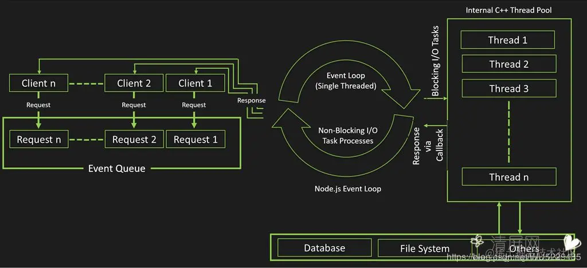
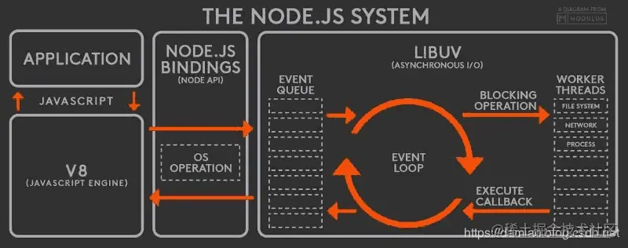

## 导读
ALL THE TIME，我们写的大部分<span style="color: orange">javascript</span>代码都是在浏览器环境中运行的，因此我们可能对浏览器的事件循环机制了解比<span style="color: orange">Node.js</span>的事件循环更深入一些。但是开始深入学习NodeJS的时候，发现NodeJS的事件循环机制和浏览器端有很大的区别，特此记录学习

参考资料
[深入分析Node.js事件循环与消息队列](https://blog.csdn.net/i10630226/article/details/81369841)

[Node.js中的执行顺序（微任务与事件循环）](https://blog.csdn.net/xgangzai/article/details/89647029)

[由setTimeout和setImmediate执行顺序的随机性窥探Node的事件循环机制](https://segmentfault.com/a/1190000013102056?utm_source=tag-newest#articleHeader10)



## 什么是事件循环
首先我们需要了解一下最基础的东西，比如这个事件循环，事件循环是指Node.js执行非阻塞I/O操作，尽管==<u>Javascript是单线程的</u>==,但由于大多数==<u>内核都是多线程的</u>==，<span style="color: orange">Node.js</span>会尽可能将操作装载到系统内核。因此它们可以处理在后台执行的多个操作。当其中一个操作完成时，内核会告诉<span style="color: orange">Node.js</span>,以便<span style="color: orange">Node.js</span>可以将响应的回调添加到轮训队列中以最终执行

当Node.js启动时会初始化<span style="color: orange">Event loop</span>,每一个<span style="color: orange">Event Looop</span>都会包括如下顺序六个循环阶段

```
   ┌───────────────────────┐
┌─>│        timers         │
│  └──────────┬────────────┘
│  ┌──────────┴────────────┐
│  │     I/O callbacks     │
│  └──────────┬────────────┘
│  ┌──────────┴────────────┐
│  │     idle, prepare     │
│  └──────────┬────────────┘      ┌───────────────┐
│  ┌──────────┴────────────┐      │   incoming:   │
│  │         poll          │<─────┤  connections, │
│  └──────────┬────────────┘      │   data, etc.  │
│  ┌──────────┴────────────┐      └───────────────┘
│  │        check          │
│  └──────────┬────────────┘
│  ┌──────────┴────────────┐
└──┤    close callbacks    │
   └───────────────────────┘
```
1. <span style="color: blue">timers</span>**阶段**:这个阶段执行<span style="color: blue">setTimeout(callback)</span>和<span style="color: blue">setInTerval(callback)</span>预定的callback
2. <span style="color: blue">I/O callback</span>**阶段**:此阶段执行某些系统操作的回调，例如TCP错误的类型。例如，如果TCP套接字在尝试连接时收到ECONNERFUSED，则某些*nix系统希望等待报告错误。操作将等待在==I/O回调阶段==执行
3. <span style="color: blue">idle,prepare</span>**阶段**: 仅node内部使用
4. <span style="color: blue">poll I/O</span>**阶段**:获取新的I/O事件，例如操作读取文件，适当的条件下node将阻塞在这里
5. <span style="color: blue">check</span>**阶段**:执行<span style="color: blue">setImmediate()</span>设定的callbacks;
6. <span style="color: blue">close callbacks</span>**阶段**:比如<span style="color: blue">socket.on('close', callback)</span>的callback会在这个阶段执行；

## 事件循环详解


这个图是整个Node.js的运行原理，从左到右，从上到下，Node.js被分为了四层<span style="color:blue">应用层、V8引擎层、Node API层和Libuv层</span>

- <span style="color:blue">应用层：即Javascript交互层，常见的就是Node.js的模块，比如http,fs</span>
- <span style="color:blue">V8引擎层: 即利用V8引擎来解析JavaScript语法，进而与下层API交互</span>
- <span style="color:blue">NodeAPI层: 为上层提供系统调用，一般由C语言来实现，和操作系统进行交互</span>
- <span style="color:blue">Libuv层: 是跨平台的底层封装，实现了事件循环、文件操作等，是Node.js实现异步的核心</span>

### 每个循环阶段内容详解
- <span style="color: blue">**timer阶段**:一个timer指定一个下限时间而不是准确时间，在达到这个下线时间后执行回调。在指定时间过后，timers会尽可能早执行回调，但是系统调度或者其他回调的执行可能会延迟它们</span>
   - 注意:技术上来说，poll阶段控制timers什么时候执行
   - 注意:这个下限时间有个范围：[1, 2147483647]，如果设定的时间不在这个范围，将被设置为1。

- <span style="color: blue">I/O callbacks阶段：这个阶段执行一些系统操作的回调。比如TCP错误，如一个TCP socket在想要连接时收到ECONNREFUSED类unix系统会等待以报告错误，这就会放到I/O callbacks阶段的队列执行。名字会让人误解为执行I/O回调处理程序，实际上I/O回调会由Poll阶段执行</span>

- <span style="color: blue">Poll阶段:poll阶段有两个主要功能：1. 执行下限时间已经达到timers的回调 2.然后处理poll队列里的时间。当event loop进入poll阶段，并且没有设定的timers，会发生下面两件事之一：</span>

    - 如果poll队列不空,event loop会遍历队列并同步执行回调，直到队列清空或执行的回调数到达系统上限;
    - 如果poll队列为空，则发生一下两件事之一    
        - 如果代码已经被setImmediate()设定了回调,event loop将结束poll阶段进入check阶段来执行check队列(里面的回调callback)
        - 如果带么没有被setImmediate()设定回调,event loop将阻塞在该阶段等待回调被加入poll队列,并立即执行
    - 但是，当event loop进入poll阶段，并且有设定的timers，一旦poll队列为空(poll阶段空状态)：event loop将检查timers,如果有1个或多个timer下限时间已经达到，event loop将绕回timer阶段，并执行timer队列
- <span style="color: blue">check阶段:这个阶段允许在poll阶段结束后立即执行回调。如果poll阶段空闲，并且有被setImmediate()设定的回调，event loop会转到check阶段而不是继续等待</span>
    - setImmediate()实际上是一个特殊的timer,跑在event loop中一个独立的阶段。它使用libuv的API来设定在poll阶段结束后立即执行回调。
    - 通常上来讲，随着代码执行，event loop终将进入poll阶段，在这个阶段等待incoming connection,request等等。但是，只要有被setImmediate()设定了回调，一旦poll阶段空闲，那么程序将结束poll阶段并进入check阶段，而不是继续等地啊poll事件们(poll events)
- <span style="color: blue">chose callbacks阶段:如果一个socket或handle被突然关掉(比如socket.destroy())，close事件将在这个阶段被触发，否在将通过process.nextTick()触发</span>


这里呢，我们通过伪代码来说明一下，这个流程
```js
// 事件循环本身相当于一个死循环，当代码开始执行的时候，事件循环就已经启动了
// 然后顺序调用不同阶段的方法
while(true) {
    // timer阶段
    timer();
    // I/O callbacks阶段
    IO();
    // idle阶段
    IDLE()
    // poll阶段
    poll();
    // check阶段
    check();
    // close阶段
    close();
}
// 在一次循环中，当事件进入到某一阶段，加入进入到check阶段,濡染timer阶段的事件就绪，也会等到当前这次循环结束，在去执行对应timer阶段的回调函数
// 下面看这个例子
const fs = require('fs');
// timer阶段
const startTime = Date.now();
setTimeout(() => {
    const endTime = Date.now();
    console.log(`timers:${endTime - startTime}`);
}, 1000)

// poll阶段(等待新的事件出现)
const readFileStart = Date.now();
fs.readFile('./Demo.txt', (err, data) => {
    if(err) throw err;
    let endTime = Date.now();
    // 获取文件读取的时间
    console.log(`read time: ${endTime - readFileStart}`)
    // 通过while循环将fs回调强制阻塞5000s
    while(endTime - readFileStart < 5000){
        endTime = Date.now()
    }
})
// check阶段
setImmediate(() => {
    console.log('check阶段')
})
/**
 * 控制台打印
 * check阶段
 * read time: 9
 * timers:5008
 * 通过上述结果分析
 * 1. 代码执行到定时器setTimeout，目前timers阶段对应的事件列表为空，在1000ms后会放入事件
 * 2. 事件循环进入到poll阶段，开始不断的轮训监听事件
 * 3. fs模块异步执行，根据文件大小，可能执行时间长短不同，这里使用的小文件，时间大概9s左右
 * 4. setImmediate执行，poll阶段暂未检测到事件，发现有setImmediate函数，跳转到check阶段执行check阶段事件(打印check阶段），第一次时间循环结束，开始下一轮事件循环
 * 5.因为时间仍未到定时器截止时间，所以事件循环有一次进入到poll阶段，进行轮询
 * 6. 读取文件完毕，fs产生一个时间进入到poll阶段的事件队列，此时时间队列准备执行callback，所以会打印(read time:9)，人工阻塞5s,虽然此时timer定时器事件已经被添加，但是因为这一段段的时间循环未完成，所以不会被执行（如果这里是死循环，那么定时器代码永远无法执行）
 * 7. fs回调阻塞5s后，当前事件循环结束，进入到下一轮事件循环，发现timer事件队列有事件，所以开始执行 打印timers: 5008
 * 
 * ps:
 * 1.将定时器延迟时间改为5ms的时候，小于文件读取时间，那么就会先监听到timers阶段有事件进入，而进入到timers阶段执行，执行完毕继续进行事件循环
 * check阶段
 * timers: 6
 * read time: 5008
 * 2.将定时器事件设置为0ms，会在进入到poll阶段的时候发现timers阶段已经有callback，那么会直接执行，然后执行完毕在下一阶段循环，执行check阶段，poll队列的回调函数
 * timers: 2
 * check阶段
 * read time: 7
*/
```

通武廊## 走进案例分析
### 1. nextTick与setImmediate
- process.nextTick 不属于事件循环的任何一个阶段，它属于该阶段和下阶段的过渡，即本阶段执行结束，进入下一个阶段前，所要执行的回调。有给人一种插队的感觉
- setImmediate的回调处于check阶段，当poll阶段的队列为空，切换到check阶段执行

### 3. setTimeout 与 setImmediate
- setImmediate()被设计在poll阶段结束后立即执行的回调
- setTimeout()被设计在指定下线时间达到后执行回调

无 I/O 处理情况下：
```js
setTimeout(function timeout () {
  console.log('timeout');
},0);

setImmediate(function immediate () {
  console.log('immediate');
});
```
执行结果
```js
C:\Users\92809\Desktop\node_test>node test.js
timeout
immediate

C:\Users\92809\Desktop\node_test>node test.js
timeout
immediate

C:\Users\92809\Desktop\node_test>node test.js
timeout
immediate

C:\Users\92809\Desktop\node_test>node test.js
immediate
timeout
```
从结果，我们可以发现，这里打印输出出来的结果，并没有什么固定的先后顺序，偏向于随机，为什么会发生这样的情况呢？

答：首先进入的是timers阶段，如果我们的机器性能一般，那么进入timers阶段，1ms已经过去了 ==(setTimeout(fn, 0)等价于setTimeout(fn, 1))==，那么setTimeout的回调会首先执行。

如果没有到1ms，那么在timers阶段的时候，下限时间没到，setTimeout回调不执行，事件循环来到了poll阶段，这个时候队列为空，于是往下继续，先执行了setImmediate()的回调函数，之后在下一个事件循环再执行setTimemout的回调函数。

问题总结：而我们在==执行启动代码==的时候，进入timers的时间延迟其实是==随机的==，并不是确定的，所以会出现两个函数执行顺序随机的情况。

### 4.nextTick 与 promise
概念：对于这两个,我们可以把他们理解成一个微任务。也就是说，它其实不属于事件循环的一部分。那么他们是在什么时候执行呢？不管在什么地方调用，他们都会在其所处的事件循环最后，事件循环进入下一个循环的阶段前执行
```js
setTimeout(() => {
    console.log('timeout0');
    new Promise((resolve, reject) => { resolve('resolved')}).then(res => console.log(res));
    new Promise((resolve, reject) => {
        setTimeout(() => {
            resolve('timeout resolved')
        })
    }).then(res => console.log(res))
    process.nextTick(() => {
        console.log('nextTick1');
        process.nextTick(() => {
            console.log('nextTick2')
        })
    })
    process.nextTick(() => {
        console.log('nextTick3');
    })
    console.log('sync');
    setTimeout(() => {
        console.log('timeout2')
    }, 0)
}, 0)
```
打印结果
```js
timeout0
sync
nextTick1
nextTick2
nextTick3
resolved
timeout2
timeout resolved
```

## 资料
[深深入理解NodeJS事件循环机制](https://juejin.cn/post/6844903999506923528)


