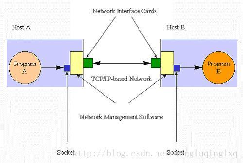

应用层通过传输层进行数据通信时,TCP和UDP会遇到同时为多个应用程序进程提供并发服务的问题。多个TCP连接或多个应用程序进程可能需要通过同一个TCP协议端口传输数据。**为了区分不同的应用程序进程和连接，许多计算机操作系统为应用程序与TCP/IP协议交互提供了成为套字节(Sokect)的接口，区分不同应用程序进程间的网络通信和连接**

生成套字节，主要有3个参数：通信的目的IP地址、使用的传输层协议(TCP或UDP)和使用的端口号。Socket原意是"插座"。通过将这3个参数结合起来，与一个"插座Socket"绑定，应用层就可以和传输层通过套字节接口，区分来自不同的应用程序进程或网络连接的通信，实现数据传输的并发服务。

Socket可以看成两个程序进行通讯连接中的一个端点，一个程序将一段信息写入Socket中，该Socket将这段信息发送给另外一个Socket，使这段信息能够传送到其他程序中。如下图

Host A上的程序A将一段信息写入Socket中，Socket的内容被Host A的网络管理软件访问，并将这段信息通过Host A的网络接口卡发送到Host B，Host B的网络接口卡接收到这段信息后，传送给Host B的网络管理软件，网络管理软件将这段信息保存在Host B的Socket中，然后程序B才能在Socket中阅读这段信息。

## 资料
[什么是套字节](https://blog.csdn.net/wangluqinglxq/article/details/38402759)

