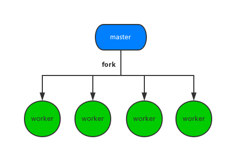

Node诞生之初就遭到不少这样的吐槽，当然这些早已不是问题
:::danger
1. 可靠性低
2. 单进程，单线程，只支持单核CPU，不能充分的利用多核CPU服务器。一旦这个进程崩掉，那么整个web服务器就崩掉了
:::
会想以前用php开发web服务器的时候，每个request都在单独的线程中处理，即使某一个请求发生很严重的错误也不会影响到其他请求。

NodeJS会在线程中处理大量请求，如果处理某个请求时产生一个没有被捕获到的异常将导致整个进程的退出，已经接收到的其他连接全部都无法处理，对一个web服务器来说，这就绝对是致命的灾难。

<span style="color: blue">应用部署到多核服务器时,为了充分利用多核CPU资源一般启动多个Node.js进程提供服务，**这时就会使用到Node.js内置cluster模块了**</span>.相信大多数的Node.js开发者可能都没有直接使用到cluster，cluster模块对child_process模块提供了一层封装，可以说是为了发挥服务器多核优势而量身定做的。简单的一个fork，不需要开发者修改任何的应用代码便能够实现多进程部署。当下最热门的带有负载均衡功能的Node.js应用进程管理器pm2便是最好的一个例子，开发的时候完全不需要关注多进程场景，剩余的一切交给pm2处理，与开发者的应用代码完美分离

```js
pm2 start app.js
```
pm2确实非常强大，但本文并不讲解pm2的工作原理，而是从更底层的进程通信讲起，为大家解密使用Node.js开发web应用时，使用cluster模块实现多进程部署的原理

## fork
说到多进程当然少补了fork，在un*x系统中，fork函数为用户提供最底层的多进程实现

本文要讲解的fork是cluster模块中非常重要的一个方法，当然了，底层也是依赖上面提到的fork函数实现。多个子进程便是通过在master进程中不断的调用cluster.fork方法构造出来。下面的结构图相信大家非常熟悉了



上面的图非常粗糙，并没有告诉我们master和worker到底是如何分工协作的。Node.js在这块做过比较大的改动，下面就剖析开来

### 多进程监听同一端口
**最初的Node.js多进程模型就是这样实现的，master进程创建socket，绑定到某个地址以及端口后，自身不调用listen来监听连接以及accept连接，而是将该socket的fd传递到fork出来的worker进程，worker接收到fs后在调用listen，accept新的连接。但实际一个新到来的连接最终只能被某一个worker进程accept在做处理，至于哪个worker能够accept到，开发者完全无法预知以及敢于。这势必就导致了当一个新连接到来时，多个worker进程会产生竞争，最终由胜出的worker获取连接**


为了进一步加深对这种模型的理解，我编写了一个非常简单的demo
```js
// master进程
const net = require('next');
const fork = require('child_process').fork;

var handle = net._createServerHandle('0.0.0.0', 3000);

for(var i = 0; i < 4; i++) {
    for('./worker').send({}, handle);
}

// worker进程
const net = require('net');
process.on('message', function(m, handle) {
    start(handle);
})

var buf = 'hello nodejs';
var res = ['HTTP/1.1 200 OK','content-length:'+buf.length].join('\r\n')+'\r\n\r\n'+buf;

function start(server) {
    server.listen();
    server.onconnection = function(err,handle) {
        console.log('got a connection on worker, pid = %d', process.pid);
        var socket = new net.Socket({
            handle: handle
        });
        socket.readable = socket.writable = true;
        socket.end(res);
    }
}
```
保存后直接运行node master.js启动服务器，在另一个终端多次运行ab -n10000 -c100 http://127.0.0.1:3000/

各个worker进程统计到的请求次数分别为
```js
worker 63999  got 14561 connections
worker 64000  got 8329  connections
worker 64001  got 2356  connections
worker 64002  got 4885  connections
```
相信到这里大家应该知道这种多进程模型比较明显的问题了
- <span style="color: red">多个进程之间会竞争accpet一个连接，产生惊群现象，效率比较低</span>
- <span style="color: red">由于无法控制一个新的连接由那个进程来处理，必然导致各worker进程之间负载非常不均衡</span>

这其实就是著名的"惊群"现象。

简单来说，多线程/多进程等待同一个socket事件,当这个事件发生时,这些线程/进程被同时唤醒,这就是惊群。可以想见，效率低下，许多进程被内核重新调度唤醒，同事去响应这一个时间，当然只有一个进程能处理事件成功，其他的进程在处理该时间失败后重新休眠(也有其他选择)。这种性能浪费就是惊群。

惊群通常发生在server上,当父进程绑定一个端口监听socket，然后fork出多个子进程，子进程们开始循环处理(比如accept)这个cocket。每当用户发起一个TCP连接时,多个子进程同时被唤醒，然后其中一个子进程accept新链接成功，余者皆失败，重新休眠

### nginx proxy
现代的web服务器一般都会用在应用服务器外面在添加一层负载均衡，比如目前使用最广泛的nginx

利用ngxin强大的反向代理功能，可以启动多个独立的node进程，分别绑定不同的端口，最后由nginx接收请求然后进行分配
```js
http {
    upstream cluster {
        server 127.0.0.1:3000;
        server 127.0.0.1:3001;
        server 127.0.0.1:3002;
        server 127.0.0.1:3003;
    }
    server {
        listen 80;
        server_name www.domain.com;
        location / {
            proxy_pass http://cluster
        }
    }
}
```
这种方式就将负载均衡的任务完全交给了nginx处理，并且nginx本身也相当擅长。在加一个守护进程负责各个node进程的稳定性，这种方案也勉强行得通。但也有比较大的局限性，比如想增加或者减少一个进程时还得在去改下nginx的配置。该方案与nginx耦合度太高，实际项目中并不经常使用。

## 小结
说了这么多，一直在讲解 Node.js 多进程部署时遇到的各种问题。小伙伴们肯定会有非常多的疑问。实际的 Node.js 项目中我们到底是如何利用多进程的呢，并且如何保障各个 worker 进程的稳定性。如何利用 cluster 模块 fork 子进程，父子进程间又是如何实现通信的呢？

下篇将为大家一一揭晓，敬请期待！

## 资料
[当我们谈论 cluster 时我们在谈论什么(上)](https://fed.taobao.org/blog/taofed/do71ct/nodejs-cluster/)