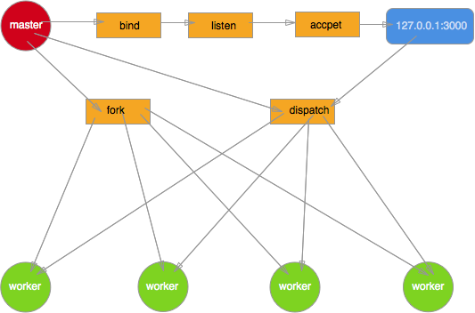

[上篇文章](/back-end/Node/base-cluster01.html)讲解了Node.js中多进程部署时遇到的各种问题，那么实际的线上项目中到底是如何利用多进程,如何保障各个worker进程稳定性的呢？又是如何利用cluster模块fork子进程，父子进程间又是如何实现通信的呢？

## 负载均衡
<span style="color: red">**回忆一下上篇中提到的最初Node.js多进程模型，多个进程绑定同一端口，相互竞争accpet新到来的连接。由于无法控制一个新的连接由哪个进程来处理，导致各worker进程之间负载非常不均衡**</span>

于是后面就出现了基于round-robin算法的另一种模型。<span style="color: blue">主要思路是master进程创建socket,绑定地址以及端口后在进行监听。该socket的fd不传递到各个worker进程。当master进程获取到新的连接时，再决定将accept到的客户端连接分发给指定的worker处理。这里使用了指定，所以如何传递以及传递给哪个worker完全是可控的。round-robin只是其中的某种算法，当然可以换成其他的。</span>



同样基于这个模型也给出一个简单的demo。

```js
// master进程
const net = require('net');
const fork = require('child_process').fork;

var workers = [];
for(var i = 0; i < 4; i++) {
    workers.push(fork('./worker'));
}

var handle = net._createServerHandle('0.0.0.0', 3000);
handle.listen();
handle.onconnection = function(err, handle) {
    var worker = workers.pop();
    worker.send({}, handle);
    workers.unshift(worker)
}

// woker进程
const net = require('net');
process.on('message', function (m, handle) {
  start(handle);
});

var buf = 'hello Node.js';
var res = ['HTTP/1.1 200 OK','content-length:'+buf.length].join('\r\n')+'\r\n\r\n'+buf;

function start(handle) {
    console.log('got a connection on worker, pid = %d', process.pid);
    var socket = new net.Socket({
        handle: handle
    });
    socket.readable = socket.writable = true;
    socket.end(res);
}
```
<span style="color: blue">**由于只有master进程接收客户端连接,并且能够按照特定的算法进行分发，很好的解决了上篇中提到的由于竞争导致各worker进程负载不均衡的硬伤**</span>

## 优雅退出
上篇文章开头提到Node.js被吐槽稳定性差,进程发生未捕获到的异常就会退出。实际项目中由于各种原因，不可避免最后上线时还是存在各种bug以及异常，最终进程退出

当进程异常退出时，有可能该进程上还有很多未处理完的请求，简单粗暴的使进程直接退出必然导致所有的请求都会丢失，给用户带来非常糟的体验，这就非常需要一个进程优雅退出的方案。

<span style="color: red">给process对象添加 uncaughtException事件绑定能够避免发生异常时进程直接退出。在回调函数里调用当前运行server对象的close方法，停止接收新的连接。同时告知master进程该worker进程即将退出，可以fork新的worker</span>

接着在几秒钟之后差不多所有请求都已经处理完毕后，该进程主动退出，其中timeout可以根据实际业务场景进行设置。
```js
setTimeout(function() {
    process.exit(1);
}, timeout)
```
这里面有一个小的细节处理，在关闭服务器之前，后续新接收的request全部关闭keep-alive特性，通知客户端不需要与该服务器保持socket连接了
```js
server.on('request', function(req, res) {
    req.shouldKeepAlive = false;
    res.shouldKeepAlive = false;
    if(!res._header) {
        res.setHeader('Connection', 'close')
    }
})
```
弟三方graceful模块专门来处理这种场景的，感兴趣的同学可以阅读下源码

## 进程守护
<span style="color: red">master进程除了负责接收新的连接，分发给各worker进程处理之外，还得像天使一样默默地守护着这些worker进程，保障整个应用的稳定性。一旦某个worker进程异常退出就fork一个新的子进程顶替上去</span>

这一切cluster模块都已经处理了，当某个worker进程发生异常退出或与master进程失去联系(disconnected)时,master进程都会收到响应的事件通知
```js
cluster.on('exit', function () {
    clsuter.fork();
});

cluster.on('disconnect', function () {
    clsuter.fork();
});
```
推荐使用第三方模块 recluster 和 cfork，已经处理的很成熟了。

这样一来整个应用的稳定性重任就落在 master 进程上了，所以一定不要给 master 太多其它的任务，百分百保证它的健壮性，一旦 master 进程挂掉你的应用也就玩完了。

## IPC
master进程能够接收连接进行分发,同时守护worker进程，这一切都离不开进程间的通信

讲了这么多，终于到最核心的地方了，要用多进程模型就一定会涉及IPC(进程间通信)了。Node.js中IPC都在父子进程之间进行,按又无发送fd分为2种方式

### 发送fd
当进程间需要发送文件描述符fd，libuv底层采用消息队列来实现IPC。master进程接收到客户端连接分发给worker进程处理时就用到了进程间fd的传递

### 不发送fd
<span style="color: blue">这种情况父子进程之间只是发送简单的字符串，并且他们之间的通信是双向的。master与worker间消息传递便是这种方式。虽然pipe能够满足父子进程间的消息传递，但由于pipe是半双工的，也就是说必须得创建2个pipe才可以实现双向的通信，这无疑使得程序逻辑更复杂</span>

libuv底层采用socketpair来实现全双工的进程通信，父进程fork子进程之前会调用socketpair创建2个fd，下面是一个最简单的也最原始的利用socketpair来实现父子进程间双向通信的demo

```js
#include <stdio.h>
#include <string.h>
#include <unistd.h>
#include <sys/types.h>
#include <errno.h>
#include <sys/socket.h>
#include <stdlib.h>
#define BUF_SIZE 100

int main () {
    int s[2];
    int w,r;
    char * buf = (char*)calloc(1 , BUF_SIZE);
    pid_t pid;
    
    if (socketpair(AF_UNIX,SOCK_STREAM,0,s) == -1 ) {
        printf("create unnamed socket pair failed:%s\n", strerror(errno));
        exit(-1);
    }
    
    if ((pid = fork()) > 0) {
        printf("Parent process's pid is %d\n",getpid());
        close(s[1]);
        char *messageToChild = "a message to child  process!";
        if ((w = write(s[0] , messageToChild , strlen(messageToChild) ) ) == -1) {
            printf("Write socket error:%s\n",strerror(errno));
            exit(-1);
        }
        sleep(1);
        if ( (r = read(s[0], buf , BUF_SIZE )) == -1) {
          printf("Pid %d read from socket error:%s\n",getpid() , strerror(errno) );
          exit(-1);
        }
        printf("Pid %d read string : %s \n",getpid(),buf);
    } else if (pid == 0) {
         printf("Fork child process successed\n");
         printf("Child process's pid is :%d\n",getpid());
         close(s[0]);
         char *messageToParent = "a message to parent process!";
         if ((w = write(s[1] , messageToParent , strlen(messageToParent))) == -1 ) {
             printf("Write socket error:%s\n",strerror(errno));
             exit(-1);
         }
         sleep(1);
         if ((r = read(s[1], buf , BUF_SIZE )) == -1) {
             printf("Pid %d read from socket error:%s\n", getpid() , strerror(errno) );
             exit(-1);
         }
         printf("Pid %d read string : %s \n",getpid(),buf); 
     } else {
        printf("Fork failed:%s\n",strerror(errno));
        exit(-1);
    }
    exit(0);
}
```
保存为 socketpair.c 后运行 gcc socketpair.c -o socket && ./socket 输出
```js
Parent process's pid is 52853
Fork child process successed
Child process's pid is :52854
Pid 52854 read string : a message to child  process! 
Pid 52853 read string : a message to parent process!
```
### Node.js中的IPC
上面从libuv底层方面讲解了父子进程间双向通信的原理,在上层Node.js中又是如何实现的呢？让我们来一探究竟

Node.js中父进程调用fork产生子进程时，会事先构造一个pipe用于进程通信
```js
new process.binding('pipe_wrap').Pipe(true);
```
构造出的pipe最初还是关闭状态，或者说底层还并没有创建一个真实的pipe，直到调用到libuv底层的uv_spawn，利用socketpair创建的全双工通信管道绑定到最初Node.js层创建的pipe上

管道此时已经真是的存在了，父进程保留对一端的操作，通过环境变量讲管道的另一端文件描述符fd传递到子进程
```js
options.envPairs.push('NODE_CHANNEL_FD=' + ipcFd);
```
子进程启动后通过环境变量拿到 fd
```js
var fd = parseInt(process.env.NODE_CHANNEL_FD, 10);
```
并将 fd 绑定到一个新构造的 pipe 上
```js
var p = new Pipe(true);
p.open(fd);
```
于是父子进程间用于双向通信的所有基础设施都已经准备好了。说了这么多可能还是不太明白吧？ 没关系，我们还是来写一个简单的 demo 感受下。

Node.js 构造出的 pipe 被存储在进程的_channel属性上

```js
// master.js
const WriteWrap = process.binding('stream_wrap').WriteWrap;
var var cp = require('child_process');

var worker = cp.fork(__dirname + '/worker.js');
var channel = worker._channel;

channel.onread = function (len, buf, handle) {
    if (buf) {
        console.log(buf.toString())
        channel.close()
    } else {
        channel.close()
        console.log('channel closed');
    }
}

var message = { hello: 'worker',  pid: process.pid };
var req = new WriteWrap();
var string = JSON.stringify(message) + '\n';
channel.writeUtf8String(req, string, null);

// worker.js
const WriteWrap = process.binding('stream_wrap').WriteWrap;
const channel = process._channel;

channel.ref();
channel.onread = function (len, buf, handle) {
    if (buf) {
        console.log(buf.toString())
    }else{
        process._channel.close()
        console.log('channel closed');
    }
}

var message = { hello: 'master',  pid: process.pid };
var req = new WriteWrap();
var string = JSON.stringify(message) + '\n';
channel.writeUtf8String(req, string, null);
```
运行node master.js 输出
```js
{"hello":"worker","pid":58731}
{"hello":"master","pid":58732}
channel closed
```
### 进程失联
在多进程服务器中，为了保障整个 web 应用的稳定性，master 进程需要监控 worker 进程的 exit 以及 disconnect 事件，收到相应事件通知后重启 worker 进程。

exit 事件不用说，disconnect 事件可能很多人就不太明白了。还记得上面讲到的进程优雅退出吗，当捕获到未处理异常时，进程不立即退出，但是会立刻通知 master 进程重新 fork 新的进程，而不是等该进程主动退出后再 fork。**具体的做法就是调用 worker进程的 disconnect 方法，从而关闭父子进程用于通信的 channel ，此时父子进程之间失去了联系，此时master 进程会触发 disconnect 事件，fork 一个新的 worker进程。**

下面是一个触发disconnect事件的简单 demo
```js
// master.js
const WriteWrap = process.binding('stream_wrap').WriteWrap;
const net = require('net');
const fork = require('child_process').fork;

var workers = [];
for (var i = 0; i < 4; i++) {
     var worker = fork(__dirname + '/worker.js');
     worker.on('disconnect', function () {
         console.log('[%s] worker %s is disconnected', process.pid, worker.pid);
     });
     workers.push(worker);
}

var handle = net._createServerHandle('0.0.0.0', 3000);
handle.listen();
handle.onconnection = function (err,handle) {
    var worker = workers.pop();
    var channel = worker._channel;
    var req = new WriteWrap();
    channel.writeUtf8String(req, 'dispatch handle', handle);
    workers.unshift(worker);
}
// worker.js
const net = require('net');
const WriteWrap = process.binding('stream_wrap').WriteWrap;
const channel = process._channel;
var buf = 'hello Node.js';
var res = ['HTTP/1.1 200 OK','content-length:' + buf.length].join('\r\n') + '\r\n\r\n' + buf;

channel.ref(); //防止进程退出
channel.onread = function (len, buf, handle) {
    console.log('[%s] worker %s got a connection', process.pid, process.pid);
    var socket = new net.Socket({
        handle: handle
    });
    socket.readable = socket.writable = true;
    socket.end(res);
    console.log('[%s] worker %s is going to disconnect', process.pid, process.pid);
    channel.close();
}
```
运行node master.js启动服务器后，在另一个终端执行多次curl http://127.0.0.1:3000，下面是输出的内容
```js
[63240] worker 63240 got a connection
[63240] worker 63240 is going to disconnect
[63236] worker 63240 is disconnected
```
## 最简单的负载均衡server
回到前面讲的 round-robin 多进程服务器模型，用于通信的 channel 除了可以发送简单的字符串数据外，还可以发送文件描述符，
```js
channel.writeUtf8String(req, string, null);
```
最后一个参数便是要传递的 fd。round-robin 多进程服务器模型的核心也正式依赖于这个特性。 在上面的 demo 基础上，我们再稍微加工一下，还原在 Node.js 中最原始的处理。
```js
// master.js
const WriteWrap = process.binding('stream_wrap').WriteWrap;
const net = require('net');
const fork = require('child_process').fork;

var workers = [];
for(var i = 0; i < 4; i++) {
    workers.push(fork(__dirname + '/worker.js'));
}

var handle = net._createServerHandle('0.0.0.0', 3000);
handle.listen();
handle.onconnection = function (err,handle) {
    var worker = workers.pop();
    var channel = worker._channel;
    var req = new WriteWrap();
    channel.writeUtf8String(req, 'dispatch handle', handle);
    workers.unshift(worker);
}
// worker.js
const net = require('net');
const WriteWrap = process.binding('stream_wrap').WriteWrap;
const channel = process._channel;
var buf = 'hello Node.js';
var res = ['HTTP/1.1 200 OK', 'content-length:' + buf.length].join('\r\n') + '\r\n\r\n' + buf;

channel.ref();
channel.onread = function (len, buf, handle) {
    var socket = new net.Socket({
        handle: handle
    });
    socket.readable = socket.writable = true;
    socket.end(res);
}
```
运行 node master.js， 一个简单的多进程 Node.js web 服务器便跑起来了。

## 小结
到此整个 Node.js 的多进程服务器模型，以及底层进程间通信原理就讲完了，也为大家揭开了 cluster 的神秘面纱， 相信大家对 cluster 有了更深刻的认识。祝大家 Node.js 的开发旅途上玩得更愉快！

## 资料
[当我们谈论 cluster 时我们在谈论什么(下)](https://fed.taobao.org/blog/taofed/do71ct/nodejs-cluster-2/)