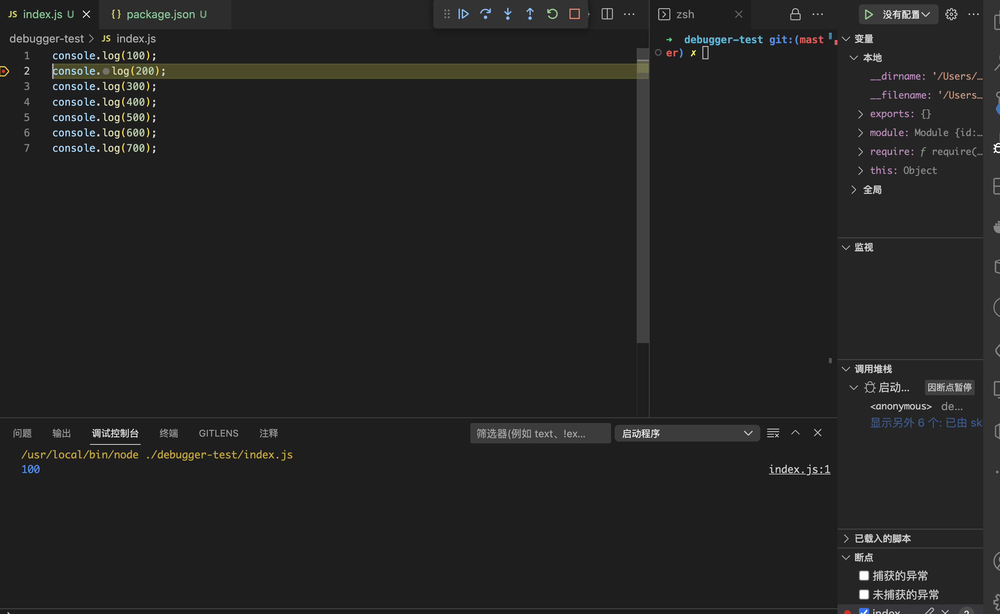

## 亚马逊
- 英语要求强吗？

    能读懂，详情界面(读写能力)

- 规则

    要保证货品不能侵权

- 发货

    先发货到到亚马逊仓库  服装sku(大小款号(s、l、m)、颜色)? 必须先放到亚马逊仓库

- 网址

    国外--货品俄语区

样品-->

阿里巴巴->供货


## 使用nvm
- nvm，nodejs版本管理工具，可切换多个node.js版本
- mac oc，使用brew install nvm
- windows， github中搜索nvm-window，有下载地址

## nodejs和Javascript的区别
- ECMAScript
    - 定义了语法(语法和词法),写javascript和nodejs都必须遵守
    - 变量定义，循环、判断、函数
    - 原型和原型链，作用域和闭包，异步

    - 不能操作DOM，不能监听click事件，不能发送ajax请求
    - 不能处理http请求，不能操作文件
    - 即，只有ECMAScript，几乎做了任何实际项目
    - 具体内容参考[http://es6.ruanyifeng.com/](http://es6.ruanyifeng.com/)
- Javascript
    - 使用ECMAScript语法规范，外加Web API, 缺一不可
    - DOM操作，BOM操作，事件绑定，AJAX等
    - 两者结合，即可完成浏览器的任何操作
- nodejs
    - 使用ECMAScript语法规范，外加nodejs API,缺一不可
    - 两者结合，即可完成server端的任何操作

    - 处理http，处理文件，具体参考[http://nodejs.cn/api/](http://nodejs.cn/api/)

### 总结
- ECMAScript是语法规范
- nodejs = ECMAScript + NodeJS API
- Javascript = ECMAScript + Web api

## Commonjs 模块化
Commonjs是node默认的模块化规范
```js
// a.js
function add(a, b) {
    return a + b
}
function mul(a, b) {
    return a * b
}
module.exports = {
    add, 
    mul
};

// b.js
const {add, mul} = require('./a');

const _ = require('lodash');
// const opt = require('./a');
// let add = opt.add;
// let mul = opt.mul;
console.log(mul(10, 20))
console.log(add(10, 20))

const arr = _.concat([1,2], 3)
console.log('arr...', arr)
```

## node debugger
package.json 中 "main": "index.js",  开启debugger调试  


```js
// console.log(100);
// console.log(200);
// console.log(300);
// console.log(400);
// console.log(500);
// console.log(600);
// console.log(700);
 const http = require('http');

 const server = http.createServer((req, res) => {
    res.writeHead(200, {'content-type': 'text/html'});
    res.end('<h1>hello world1</h1>');
 })
 server.listen(3000, () => {
    console.log('listening on 3000 port')
 })
```
vscode开启断点调试->断点->点击运行->浏览器访问3000->回调到浏览器->一步一步调试


## 地址
[视频地址](https://www.youtube.com/watch?v=Lfef9uQo2pE&list=PL9nxfq1tlKKlhV1UzUmElRkxmjkoO3mtH&index=2)