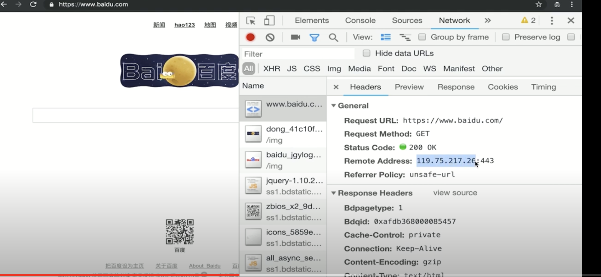

## 博客项目介绍
- 目标
    - 开发一个博客系统，具有博客的基本功能
    - 只开发server端，不关心前端
- 需求
    - 首页，作者主页，博客详情页
    - 登录页
    - 管理中心，新建页，编辑页
- 技术方案
    - 数据如何存储
    - 如何与前端对接，即接口设计
### 数据存储
博客、用户
- 博客存储
    id|title|content| createtime | author 
    ---|---|---|---|---
    1|标题1|内容1|132453245|zhangsan
    2|标题2|内容2|132453245|lizi
- 用户
    id|username | password|realname
    ---|---|---|---
    1|zhangsan|123|张三
    2|lisi|123|李四
## 接收设计
描述|接口|方法|url参数|备注
---|---|---|---|---
获取博客列表|/api/blog/list | get | author作者，keyword搜索关键字 | 参数为空的话，则不进行查询过滤
获取一篇博客的内容| /api/blog/detail | get | id | ''
新增一篇博客| /api/blog/new | post | '' | post中有新增的信息
更新一篇博客| /api/blog/update | post | id | postData中有更新内容
删除一篇博客| /api/blog/del | post | id | ''
登录 | /api/user/login | '' | postDate中有用户名和密码

### 关于登录
- 业界有统一的解决方案，一般不用再重新设计
- 实现起来比较复杂，课程后面会讲解

## 开发接口(不使用任何框架)
- nodejs处理http请求
- 搭建开发环境
- 开发接口(暂不连接数据库，咱不考虑登录)

### http请求概述
- DNS解析，建立TCP连接，发送http请求
- server接收到http请求，处理，并返回
- 客户端接收到返回数据，处理数据(如渲染页面，执行js)

### 实例演示


Remote Address：解析到的DNS

## Nodejs处理http请求
- get 请求和 querystring
- post 请求 和postdata
- 路由 --接口地址

```js
const http = require('http');
const server = http.createServer((req, res) => {
    res.end('hello world');
})
server.listen(8000)
```
## nodejs处理get请求
-  get请求，即客户端要想server断获取数据，如查询博客列表
- 通过querystring来传递数据，如a.html?a=100&b=200
- 浏览器直接访问，就发送get请求

```js
const http = require('http');
const querystring = require('querystring');

const server = http.createServer((req, res) => {
    console.log(req.method); // GET
    const url = req.url; //获取请求的完整url
    req.query = querystring.parse(url.split('?')[1]);
    res.end(JSON.stringify(req.query));
})
server.listen(8000)
```
## nodejs处理post请求
- post请求，即客户端要向服务端传递数据，如新建博客(传递博客名字 标记 id)
- 通过 post data传递数据，后面会演示
- 浏览器无法直接模拟，需要手写js，或者使用postman

[postman chrome插件安装](xxxx)
```js
const http = require('http');
const server = http.createServer((req, res) => {
    if(req.method === 'POST') {
        // 数据格式
        console.log('content-type', req.headers['content-type']);
        // 接收数据
        let postData = '';
        req.on('data', chunk => {
            postData += chunk.toString();
        })
        req.on('end', () => {
            console.log(postData);
            res.end('hello world'); // 在这里返回，因为是异步
        })
    }
})
server.listen(8000)
```
### nodejs处理路由(资源的唯一标识)
- https://github.com/
- https://github.com/username
- http://github.com/username/xxxx

```js
const http = require('http');
const server = http.createServer((req, res) => {
    const url = req.url;
    const path = url.split('?')[0];
    res.end(path); // 返回路由
})
server.listen(8000)
```
## 综合示例
```js
const http = require('http')
const querystring = require('querystring')

const server = http.createServer((req, res) => {
	const method = req.method
	const url = req.url
	const path = url.split('?')[0]
	const query = querystring.parse(url.split('?')[1])

	// 设置返回格式为JSON
	res.setHeader('Content-type', 'application/json')

	// 返回的数据
	const resData = {
		method,
		url,
		path,
		query,
	}
	// 返回
	console.log(method)
	if (method === 'GET') {
		res.end(JSON.stringify(resData))
	}
	if (method === 'POST') {
		let postData = ''
		req.on('data', (chunk) => {
			postData += chunk.toString()
		})
		req.on('end', () => {
			resData.postData = postData
			res.end(JSON.stringify(resData))
		})
	}
})

server.listen(8000)
console.log('ok')

```