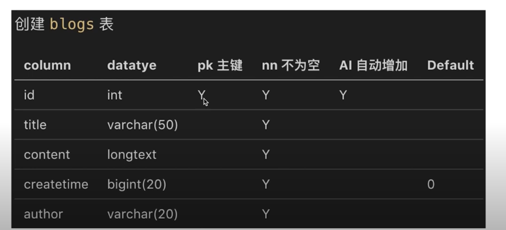

- myslq介绍、安装和使用
- nodejs连接mysql
- API连接mysql
## 为什么使用mysql而不mogondb
- mysql是企业内最常用的存储工具，一般都有人专门维护
- mysql也是社区内最常用的存储工具，有问题随时可查
- mysql本身是一个复杂的数据库软件，本课只讲基本使用

mysql关系型数据库  需要学习sql 不是太特别麻烦

mogondb 有点类似redis json?

## myslq介绍
- web server中最流行的关系型数据库
- 官网免费下载，用于学习
- 轻量级，易学易用

下载地址：[https://dev.mysql.com/downloads/mysql](https://dev.mysql.com/downloads/mysql)

## myslq 安装
- 执行安装
- 过程中需要输入root用户名的密码，要记住这个密码

## myslq workbench 
- 操作mysql 的客户端，可视化操作
- 下载[https://dev.mysql.com/downloads/workbench](https://dev.mysql.com/downloads/workbench)

- docker 镜像安装

    ```shell
    $ docker search mysql

    $ docker run -p 12345:3306 \
    --name mysql-01 \
    -v /tmp/mysql/conf:/etc/mysql/conf.d \
    -v /tmp/mysql/logs:/logs \
    -v /tmp/mysql/data:/var/lib/mysql \
    -e MYSQL_ROOT_PASSWORD=123456 \
    -d mysql:5.7
    ```
[Sequal Pro 连接docker容器中的mysql](https://blog.csdn.net/m0_52231324/article/details/126200213)

## 数据库操作(创建和增、删、查)
- 建库
- 建表
- 表操作
### 建库
- 创建myblog数据库
- 执行  show databases;查询

### 建表
id | username | password | realname
---|---|---|---
1 | zhangsan | 123 | 张三
2 | lisi | 123 | 李四

id | title | content | createtime | author 
---|---|---|---|---
1 | 标题1 | 内容1 | 123123123| zhangsan
2 | 标题2 | 内容2 | 12342353425 | lisi

> 建表只会建表结构 不会建内容

- 创建 users 表

    column | datatye | pk主键 | nn不为空 | AI自动增加 | default
    --- | --- | ---| --- | ---| ---
    id | int | Y | Y | y | ''
    username | varchar(20) | '' | Y | '' | ''
    password | varchar(20) | '' | Y | '' | ''
    realname | varchar(10) | '' | Y | '' | ''

    - column 列
    - datatye 类型
    - pk 主键-- id保证不能重复
    - nn不为空 -- 当前列内容是否不空
    - ai 自动增加

- 创建blogs表
    

### 操作表
- 增、删、改、查
- 使用sql语句(入门简单，一学就会)

```sql
show databases; -- 所有数据库的列表 
use myblog;

-- show tables;

-- insert into users(username, `password`, realname) values("zhangsan", "123", "张三"); -- password是关键字 需要``

-- insert into users(username, `password`, realname) values("lisi", "123", "李四");

-- 查询
-- select * from users; 

select id, username from users;

-- select * from users where username ='zhangsan' and `password`='123';
select * from users where username ='zhangsan' or `password`='123';

-- 模糊查询
select * from users where username like '%li%'; 

-- 排序 按照id排序 默认正序
select * from users where password like '%1%' order by id;

-- 排序 按照id排序 desc 倒序
select * from users where password like '%1%' order by id desc;


-- 更新   可能报错的情况下执行SET SQL_SAFE_UPDATES = 0;
update users set realname='李四2' where username='lisi';

-- 真实情况更新
select * from users where state='1';

update users set state='0' where username='lisi'; -- 软删除技术

-- 查询不等于0
select * from users where state <> '0';


-- blogs 
insert into blogs (title, content, createtime, author) values('标题B', '内容B', 123123123, 'lisi');

select * from blogs order by createtime desc;

select * from blogs where author='lisi' order by createtime desc;

select * from blogs where title like '%标题%' order by createtime desc;

-- 查询版本
select version()
```
[MySQL 创建数据表](https://www.runoob.com/mysql/mysql-create-tables.html)
## 总结
- 如何建库、如何建表
- 建表时常用的数据类型(int bigit varchar longtext)
- sql语句的增、删、改、查