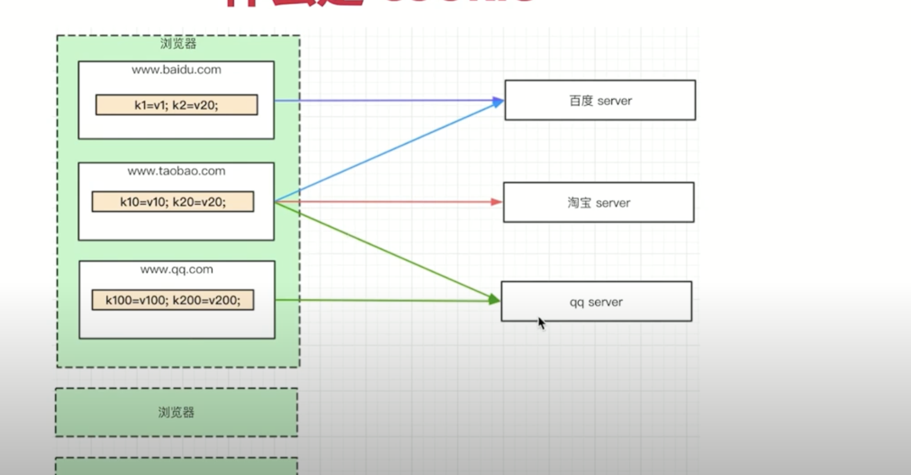

## 开始
- 核心:登录校验 & 登录信息存储
- 为何只讲登录，不讲注册？ (注册和创建博客一致。。。没什么难度)

### 目录
- cookie 和 session
- session 写入redis(内存数据库)
- 开发登录，和前端联调(用到nginx反向代理)

> mysql 硬盘数据库

## cookie介绍
- 什么是cookie

	- 储在浏览器的一段字符串(最大5kb)
	- 跨域不共享
	- 格式k1=v1,k2=v2,k3=v3;因此可以存储结构化的数据
	- 每次发送http请求，会讲请求域的cookie一起发送给server
	- server可以修改cookie并返回给浏览器
	- 浏览器中也可以通过js修改cookie(有限制)
	

- js操作cookie， 浏览器查看cookie

	- 客户端查看cookie，三种方式
	- js查看、修改cookie（有限制）

	1. 客户端 request：cookie    response：set-cookie
	2. Application 查看cookie
	3. 控制台 document.cookie

	```js
	// 累加
	document.cookie = 'k1 = 100';
	document.cookie = 'k2 = 100';
	```

- server端操作cookie，实现登录验证

	- 查看cookie
	- 修改cookie
	- 实现登录验证

	```js
	// app.js
	const querystring = require('querystring')
	const handleBlogRouter = require('./src/router/blog')
	const handleUserRouter = require('./src/router/user')

	// 用于处理  post data
	const getPostData = (req) => {
		return new Promise((resolve, reject) => {
			if (req.method !== 'POST') {
				resolve({})
				return
			}
			if (req.headers['content-type'] !== 'application/json') {
				resolve({})
				return
			}
			let postData = ''
			req.on('data', (chunk) => {
				postData += chunk.toString()
			})
			req.on('end', () => {
				if (!postData) {
					resolve({})
				}
				resolve(JSON.parse(postData))
			})
		})
	}

	const serverHandle = (req, res) => {
		// 设置返回格式JSON
		res.setHeader('Content-Type', 'application/json')

		// const resData = {
		// 	name: '双越100',
		// 	site: 'imooc',
		// 	evn: process.env.NODE_ENV,
		// }
		// res.end(JSON.stringify(resData))

		// 处理 path
		const url = req.url
		req.path = url.split('?')[0]

		// 解析 query
		req.query = querystring.parse(url.split('?')[1])

		// 解析cookie
		req.cookie = {}
		const cookieStr = req.headers.cookie || '' // k1 = v1; k2 = v2
		cookieStr.split(';').forEach((item) => {
			if (!item) return
			const arr = item.split('=')
			const key = arr[0]
			const value = arr[1]
			req.cookie[key] = value
		})
		console.log(req.cookie)
		// 处理  post data
		getPostData(req).then((postData) => {
			req.body = postData

			// 处理blog路由
			// const blogData = handleBlogRouter(req, res)
			// if (blogData) {
			// 	res.end(JSON.stringify(blogData))
			// 	return
			// }

			const blogResult = handleBlogRouter(req, res)
			if (blogResult) {
				blogResult.then((blogData) => {
					res.end(JSON.stringify(blogData))
				})
				return
			}

			// 处理user路由
			// const userData = handleUserRouter(req, res)
			// if (userData) {
			// 	res.end(JSON.stringify(userData))
			// 	return
			// }
			const userResult = handleUserRouter(req, res)
			if (userResult) {
				userResult.then((userData) => {
					res.end(JSON.stringify(userData))
				})
				return
			}
			// 未命中路由，返回 404
			res.writeHead(404, { 'Content-Type': 'text/plain' })
			res.write('404 Not Fount\n')
			res.end()
		})
	}
	module.exports = serverHandle


	// 测试 checklong改为login
	// src/router/user.js
	const { login } = require('../controller/user')
	const { SuccessModel, ErrorModel } = require('../model/resModel')

	const handleUserRouter = (req, res) => {
		const method = req.method

		// 登录
		if (method === 'POST' && req.path === '/api/user/login') {
			const { username, password } = req.body
			const result = login(username, password)
			return result.then((data) => {
				if (data.username) {
					return new SuccessModel()
				}
				return new ErrorModel('登录失败')
			})
		}
		// 登录验证测试
		if (method === 'GET' && req.path === '/api/user/login-test') {
			if (req.cookie.username) {
				return Promise.resolve(new SuccessModel())
			}
			return Promise.resolve(new ErrorModel('尚未登录'))
		}
	}
	module.exports = handleUserRouter


	// 测试  http://localhost:8000/api/user/login-test
	document.cookie = 'username=zhangsan'
	```
	- 设置cookie

		```js
		const { login } = require('../controller/user')
		const { SuccessModel, ErrorModel } = require('../model/resModel')

		const handleUserRouter = (req, res) => {
			const method = req.method

			// 登录
			if (method === 'GET' && req.path === '/api/user/login') {
				const { username, password } = req.query
				const result = login(username, password)
				return result.then((data) => {
					if (data.username) {
						// 操作 cookie
						res.setHeader('Set-Cookie', `username=${data.username};path=/`)
						return new SuccessModel()
					}
					return new ErrorModel('登录失败')
				})
			}
			// 登录验证测试
			if (method === 'GET' && req.path === '/api/user/login-test') {
				if (req.cookie.username) {
					return Promise.resolve(
						new SuccessModel({
							username: req.cookie.username,
						})
					)
				}
				return Promise.resolve(new ErrorModel('尚未登录'))
			}
		}
		module.exports = handleUserRouter

		// 测试验证  http://localhost:8000/api/user/login-test
		```