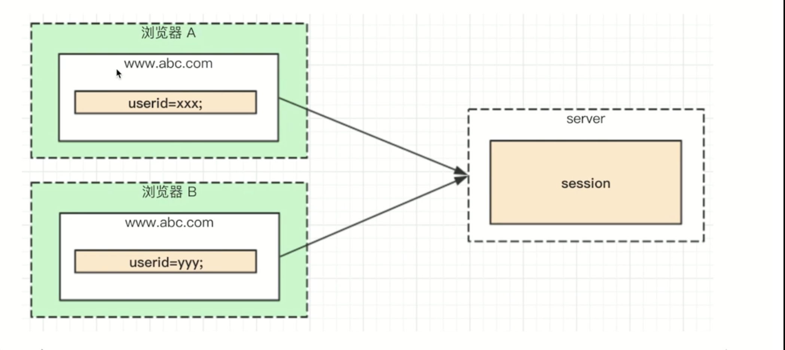

- 上一节的问题：会暴漏username,很危险
- 如何解决：cookie中存储userid， server端对应username
- 解决方案：session， 即server端存储用户信息



```js
//app.js
const querystring = require('querystring')
const handleBlogRouter = require('./src/router/blog')
const handleUserRouter = require('./src/router/user')

// 获取cookie的过期时间
const getCookieExpires = () => {
	const d = new Date()
	d.setTime(d.getTime() + 24 * 60 * 60 * 1000)
	console.log('d.toGMTString:', d.toGMTString())
	return d.toGMTString()
}

// session 数据
const SESSION_DATA = {}

// 用于处理  post data
const getPostData = (req) => {
	return new Promise((resolve, reject) => {
		if (req.method !== 'POST') {
			resolve({})
			return
		}
		if (req.headers['content-type'] !== 'application/json') {
			resolve({})
			return
		}
		let postData = ''
		req.on('data', (chunk) => {
			postData += chunk.toString()
		})
		req.on('end', () => {
			if (!postData) {
				resolve({})
			}
			resolve(JSON.parse(postData))
		})
	})
}

const serverHandle = (req, res) => {
	// 设置返回格式JSON
	res.setHeader('Content-Type', 'application/json')

	// const resData = {
	// 	name: '双越100',
	// 	site: 'imooc',
	// 	evn: process.env.NODE_ENV,
	// }
	// res.end(JSON.stringify(resData))

	// 处理 path
	const url = req.url
	req.path = url.split('?')[0]

	// 解析 query
	req.query = querystring.parse(url.split('?')[1])

	// 解析cookie
	req.cookie = {}
	const cookieStr = req.headers.cookie || '' // k1 = v1; k2 = v2
	cookieStr.split(';').forEach((item) => {
		if (!item) return
		const arr = item.split('=')
		const key = arr[0].trim()
		const value = arr[1].trim()
		req.cookie[key] = value
	})

	//解析session
	let needSetCookie = false
	let userId = req.cookie.userId
	if (userId) {
		if (!SESSION_DATA[userId]) {
			SESSION_DATA[userId] = {}
		}
	} else {
		needSetCookie = true
		userId = `${Date.now()}_${Math.random()}`
		SESSION_DATA[userId] = {}
	}
	req.session = SESSION_DATA[userId]

	// 处理  post data
	getPostData(req).then((postData) => {
		req.body = postData

		// 处理blog路由
		// const blogData = handleBlogRouter(req, res)
		// if (blogData) {
		// 	res.end(JSON.stringify(blogData))
		// 	return
		// }

		const blogResult = handleBlogRouter(req, res)
		if (blogResult) {
			blogResult.then((blogData) => {
				if (needSetCookie) {
					res.setHeader(
						'Set-Cookie',
						`userId=${userId};path=/;httpOnly; expires=${getCookieExpires()}`
					)
				}
				res.end(JSON.stringify(blogData))
			})
			return
		}

		// 处理user路由
		// const userData = handleUserRouter(req, res)
		// if (userData) {
		// 	res.end(JSON.stringify(userData))
		// 	return
		// }
		const userResult = handleUserRouter(req, res)
		if (userResult) {
			if (needSetCookie) {
				res.setHeader(
					'Set-Cookie',
					`userId=${userId};path=/;httpOnly; expires=${getCookieExpires()}`
				)
			}
			userResult.then((userData) => {
				res.end(JSON.stringify(userData))
			})
			return
		}
		// 未命中路由，返回 404
		res.writeHead(404, { 'Content-Type': 'text/plain' })
		res.write('404 Not Fount\n')
		res.end()
	})
}
module.exports = serverHandle

// src/router/user.js
const { login } = require('../controller/user')
const { SuccessModel, ErrorModel } = require('../model/resModel')

// 获取cookie的过期时间
const getCookieExpires = () => {
	const d = new Date()
	d.setTime(d.getTime() + 24 * 60 * 60 * 1000)
	console.log('d.toGMTString:', d.toGMTString())
	return d.toGMTString()
}

const handleUserRouter = (req, res) => {
	const method = req.method

	// 登录
	if (method === 'GET' && req.path === '/api/user/login') {
		const { username, password } = req.query
		const result = login(username, password)
		return result.then((data) => {
			if (data.username) {
				// 设置session
				req.session.username = data.username
				req.session.realname = data.realname
				console.log('req.sesion is:', req.session)

				return new SuccessModel()
			}
			return new ErrorModel('登录失败')
		})
	}
	// 登录验证测试
	if (method === 'GET' && req.path === '/api/user/login-test') {
		console.log(req.session, 'req.session')
		if (req.session.username) {
			return Promise.resolve(
				new SuccessModel({
					session: req.session,
				})
			)
		}
		return Promise.resolve(new ErrorModel('尚未登录'))
	}
}
module.exports = handleUserRouter
```

## 总结
- 知道session解决的问题
- 如何实现session