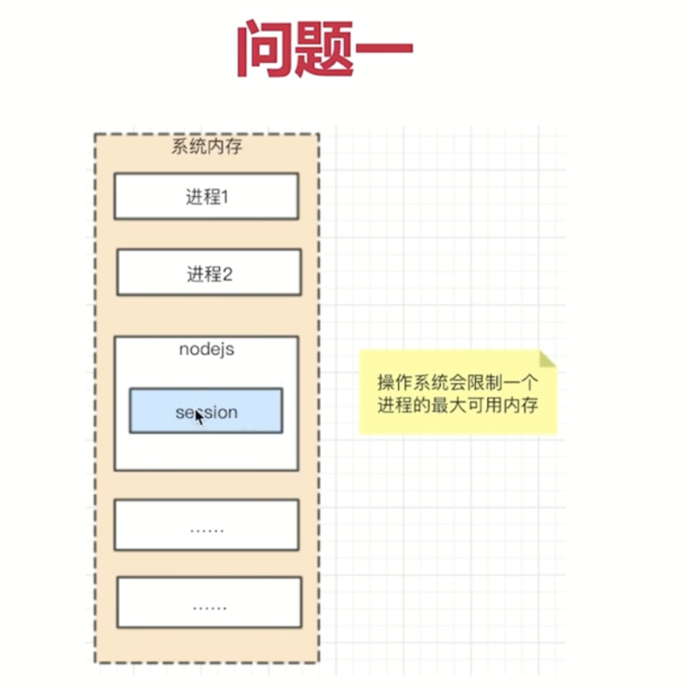
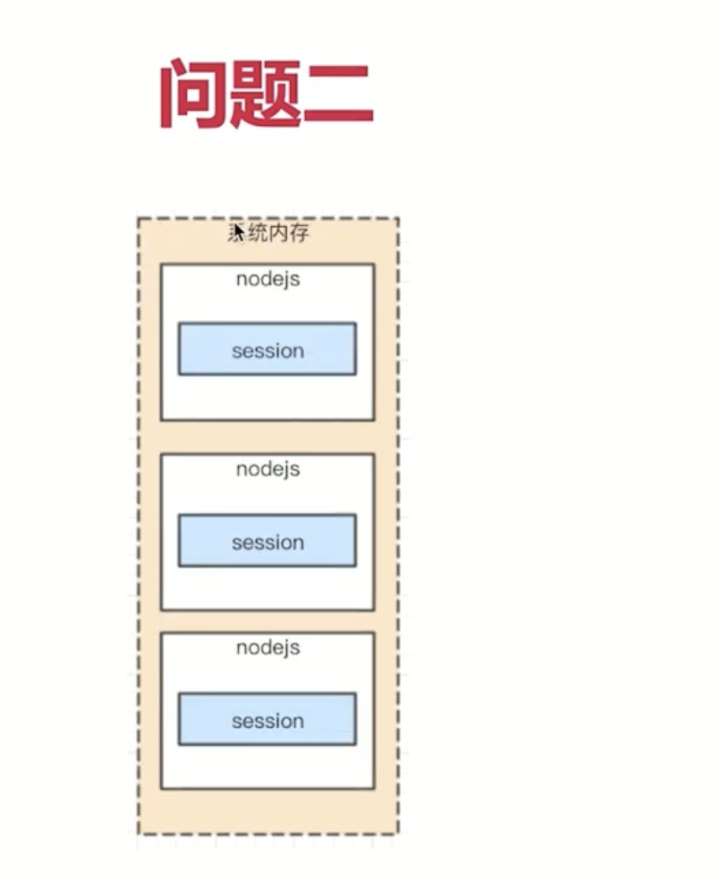
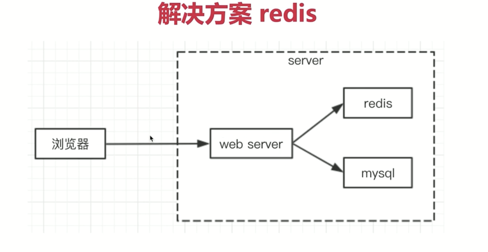

## 当前设置session代码的问题
- 目前seesion直接是js变量，放在nodejs进程内存中
- 第一，进程内存有限，访问量过大，内存暴增怎么办？
- 第二，正式线上运行是多进程，进程之间内存无法共享(第一次登录在第一个进程，第二次登录在第二个进程，就无法登录了？多机器呢？)


进程分配的内存是固定的
- stack 程序运行的变量
- heap 引用类型  session太多的话 就超出





## 解决方案 redis
- web server最常用的缓存数据库，数据放在内存中。
- 相比于mysql，访问速度快(内存和影片不是一个数量级的)
- 成本更高，可存储的数据量更小(内存的硬伤)



- 将web server和rediss拆分成两个单独的服务
- 双方都是独立的，都是可扩展(例如都扩展成集群)
- (包括mysql，也是一个单独的服务，也可扩展)

## 为什么session适合用redis
- session访问频繁，对性能要求极高
- session可不考虑断电丢失数据的问题(内存的硬伤)
- session数据量不会太大(相比于mysql中存储的数据)

> redis也可以做到断电不丢失，需要做一些配置

## 为什么网站数据不适合用redis
- 操作频率不是太高(相比session操作)
- 断电不能丢失，必须保留
- 数据量太大，内存成本太高

## 安装 redis
- window [http://www.runoob.com/redis/redis-install.html](http://www.runoob.com/redis/redis-install.html)
- mac 使用brew install redis
- [docker 安装redis](https://www.runoob.com/docker/docker-install-redis.html)

```js
$ docker pull redis:latest

$ docker run -itd --name redis-test -p 6379:6379 redis

$ docker exec -it redis-test /bin/bash

$ redis-cli
```
## 使用演示

```shell
$ brew instal redis
$ redis-server

$ redis-cli #redis-client

$ set myname shuangyuelaoshi
$ get myname

$ kyes *

$ del myname

$ set userid session-val

$ get userid
```
> redis 是key value 的数据库

## 总结
- 为何使用redis，不用redis出现什么问题
- redis适合什么场景？mysql适合什么场景