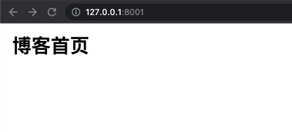
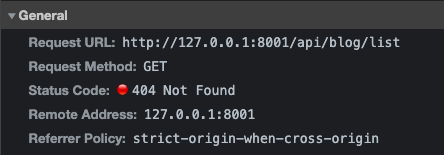
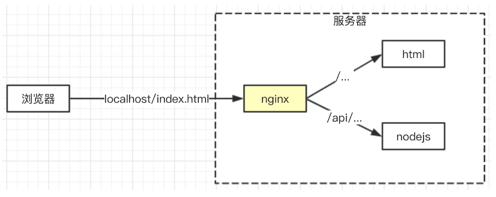
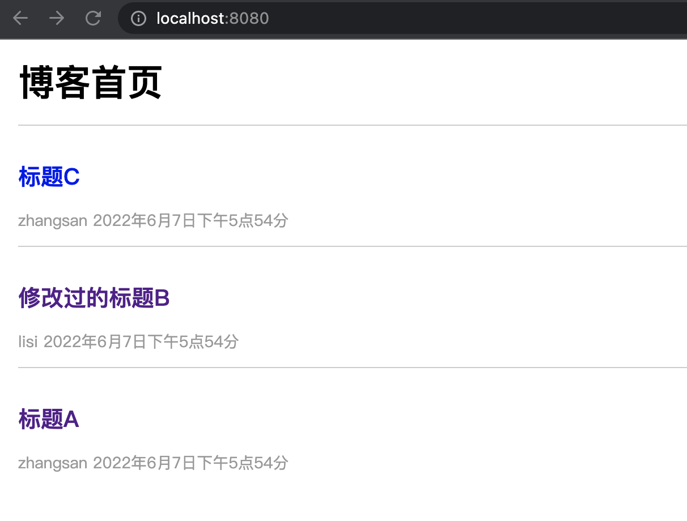

- 登录功能依赖cookie，必须用浏览器来联调
- cookie跨域不共享的，前端和server端必须同域
- 需要用到nginx做带来，让前后端同域

## 开发前端网页
后端和前端同时启动项目，因为端口的不同，会产生跨域的问题。

前端启动服务：

先安装 http-server 用于启动服务器

```shell
yarn global add http-server
```
然后在前端所在文件夹设置一个端口启动：
```shell
http-server -p 8001
```
效果如下


但是是请求不到博客列表的，因为端口不同（我的后端端口为 8000），因此 cookie 也不能携带过去。



## NGINX 解决跨域
- 高性能的 web 服务器，开源免费
- 一般用于静态服务、负载均衡
- 反向代理



反向代理是对客户端不可见的代理。与反向代理相反的是正向代理，即客户端能控制的代理，例如，公司的内网需要下载相关代理，浏览器才能访问到。

nginx 根据请求的不同，代理到不同的地方。

### nginx 安装
- windows 用户在官网上安装
- mac 用户使用 homebrew: brew install nginx

- nginx 默认配置文件
	```shell
	Windows: C:\nginx\conf\nginx.conf
	Mac: /usr/local/etc/nginx/nginx.conf
	```
- nginx 命令

	```js
	测试配置文件格式是否正确： nginx -t
	启动 nginx： nginx
	重启 nginx：nginx -s reload
	停止 nginx：nginx -s stop
	```
- 代理配置

	```js
	server {
		listen       8080;
		server_name  localhost;

		#charset koi8-r;

		#access_log  logs/host.access.log  main;

		# 静态文件端口
		location / {
			proxy_pass http://localhost:8001;
		}

		# 服务器端口
		location /api/ {
			proxy_pass http://localhost:8000;
			proxy_set_header Host $host;
		}
	}
	```
直接看内容还是很好理解的。nginx 服务器访问的端口为 8080。当接到根目录，就代理到 8001 端口下，接到 /api/ 路径，则代理到 8000 端口。

代理配置完后即可看到效果，跨域成功解决：



[session存入redis](https://blog.csdn.net/weixin_45196863?type=blog&year=2022&month=07)


## 总结
- admin问题

	```js
	// src/router/blog.js
	const {
		getList,
		getDetail,
		newBlog,
		updateBlog,
		delBlog,
	} = require('../controller/blog')
	const { SuccessModel, ErrorModel } = require('../model/resModel')

	// 统一的登录验证函数
	const loginCheck = (req) => {
		if (!req.session.username) {
			return Promise.resolve(new ErrorModel('尚未登录'))
		}
	}

	const hanldeBlogRouter = (req, res) => {
		const method = req.method
		let id = req.query.id
		// 获取博客列表
		if (method === 'GET' && req.path === '/api/blog/list') {
			let author = req.query.author || ''
			const keyword = req.query.keyword || ''
			// const listData = getList(author, keywords)
			// return new SuccessModel(listData)

			if (req.query.isadmin) {
				// 管理员界面
				const loginCheckResult = loginCheck(req)
				if (loginCheckResult) {
					// 未登录
					return loginCheckResult
				}
				// 强制查询自己的博客
				author = res.session.username
			}

			const result = getList(author, keyword)
			return result.then((listData) => {
				return new SuccessModel(listData)
			})
		}

		// 获取博客详情
		if (method === 'GET' && req.path === '/api/blog/detail') {
			// const data = getDetail(id)
			// return new SuccessModel(data)
			const result = getDetail(id)
			return result.then((data) => {
				return new SuccessModel(data)
			})
		}
		// 新建一篇博客
		if (method === 'POST' && req.path === '/api/blog/new') {
			// const data = newBlog(req.body)
			// return new SuccessModel(data)
			const loginCheckResult = loginCheck(req)
			if (loginCheckResult) {
				// 未登录
				return loginCheckResult
			}

			req.body.author = req.session.username
			const result = newBlog(req.body)
			return result.then((data) => {
				return new SuccessModel(data)
			})
		}
		// 更新一篇博客
		if (method === 'POST' && req.path === '/api/blog/update') {
			const loginCheckResult = loginCheck(req)
			if (loginCheckResult) {
				// 未登录
				return loginCheckResult
			}
			const result = updateBlog(id, req.body)
			return result.then((val) => {
				if (val) {
					return new SuccessModel()
				} else {
					return new ErrorModel('更新失败')
				}
			})
		}
		// 删除一篇博客
		if (method === 'POST' && req.path === '/api/blog/del') {
			const loginCheckResult = loginCheck(req)
			if (loginCheckResult) {
				// 未登录
				return loginCheckResult
			}
			const author = req.session.username
			const result = delBlog(id, author)
			return result.then((val) => {
				if (val) {
					return new SuccessModel()
				} else {
					return new ErrorModel('删除博客失败')
				}
			})
		}
	}
	module.exports = hanldeBlogRouter

	```

- cookie是什么？session是什么？如何实现登录？
- redis在这里扮演什么角色，有什么核心的价值？
- nginx的反向代理，联调过程中的作用？
