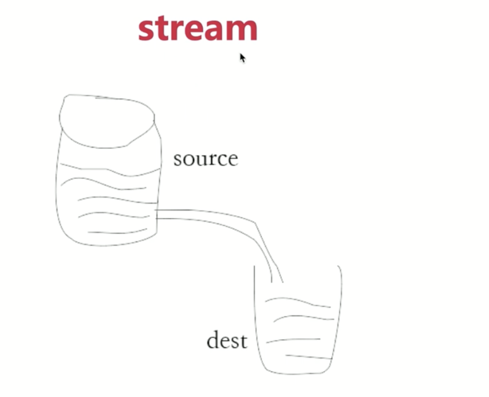

## 开始
### 目标

- 系统没有日志，就等于人没有眼睛-- 抓瞎
- 第一，访问日志 access log（server 端最重要的日志）
- 第二，自定义日志（包括自定义事件、错误记录等）

### 目录
- nodejs文件操作，nodejs stream(提高性能)
- 日志功能开发和使用
- 日志文件拆分，日志内容分析

## 代码演示-文件操作
- 读取文件
	```js
	const fs = require('fs')
	const path = require('path') // window 和linux路径拼接方式不同 需要兼容

	const filename = path.resolve(__dirname, 'data.txt')

	// 读取文件内容
	fs.readFile(filename, (err, data) => {
		if (err) {
			console.log(err)
			return
		}
		// data是二进制类型，需要转换为字符串
		console.log(data.toString())
	})
	```
	<span style="color: red">如果文件data.txt太大nG，就太慢了性能不高？ </span>
- 写入文件

	```js
	const fs = require('fs')
	const path = require('path') // window 和linux路径拼接方式不同 需要兼容

	const filename = path.resolve(__dirname, 'data.txt')

	// 读取文件内容
	// fs.readFile(filename, (err, data) => {
	// 	if (err) {
	// 		console.log(err)
	// 		return
	// 	}
	// 	// data是二进制类型，需要转换为字符串
	// 	console.log(data.toString())
	// })

	// 写入文件
	const content = '这是新写入的内容\n'
	const opt = {
		flag: 'a', // 追加写入，覆盖用'w'
	}
	fs.writeFile(filename, content, opt, (err) => {
		if (err) {
			console.error(err)
		}
	})
	```
	<span style="color: red">每次写入一行，很耗性能？内容太多呢？ </span>
- 判断文件是否存在

	```js
	const fs = require('fs')
	const path = require('path') // window 和linux路径拼接方式不同 需要兼容

	const filename = path.resolve(__dirname, 'data.txt')

	// 读取文件内容
	// fs.readFile(filename, (err, data) => {
	// 	if (err) {
	// 		console.log(err)
	// 		return
	// 	}
	// 	// data是二进制类型，需要转换为字符串
	// 	console.log(data.toString())
	// })

	// 写入文件
	// const content = '这是新写入的内容\n'
	// const opt = {
	// 	flag: 'a', // 追加写入，覆盖用'w'
	// }
	// fs.writeFile(filename, content, opt, (err) => {
	// 	if (err) {
	// 		console.error(err)
	// 	}
	// })

	// 判断文件是否存在
	fs.exists(filename, (exist) => {
		console.log('exist', exist)
	})
	```
## stream 介绍
### IO操作的性能瓶颈
- IO包括"网络IO"和"文件IO"(网络带宽问题，文件大？内存？)
- 相比于CPU计算和内存读写，IOS的突出特点就是：慢！
- 如果和在有限的硬件资源下提高IO的操作效率？



### stream 通俗介绍
stream 就是流动，之前一口气读取文件内容出来就好比搬水桶，直接把整个水桶抬走了。但是大多数人并没有那力气。更好的方式是，接个水管，将水稳定地通过管道转移到其他地方，降低了成本（小孩子都能够完成）。stream 就类似于此，极大降低了硬件资源要求。

```js
// 标准输入输出，pipe就是管道(符合水流管道的模型图)
// process.stdin 获取数据，直接通过管道传递给process.stdout
// process.stdin 来源   process.stdout 目的地
process.stdin.pipe(process.stdout)
```
终端输入的内容将通过管道持续输出到终端中。

### 请求内容输出到响应内容
```js
const http = require('http');
const server = http.createServer((req, res) => {
	if(req.method === 'POST') {
		req.pipe(res);
	}
})
server.listen(8000)
```
现在，req 和 res 通过 pipe 连接，一旦 req 接收到了东西，就会立刻稳定地输出到 res 中。

## stream演示
```js
// stream-test/test1.js

// 标准输入输出
process.stdin.pipe(process.stdout)

// 例子二--- 在postman中 body传入  直接输出
const http = require('http')
const server = http.createServer((req, res) => {
	if (req.method === 'POST') {
		req.pipe(res)
	}
})
server.listen(8000)
```


### stream 拷贝文件

### stream 读取文件内容