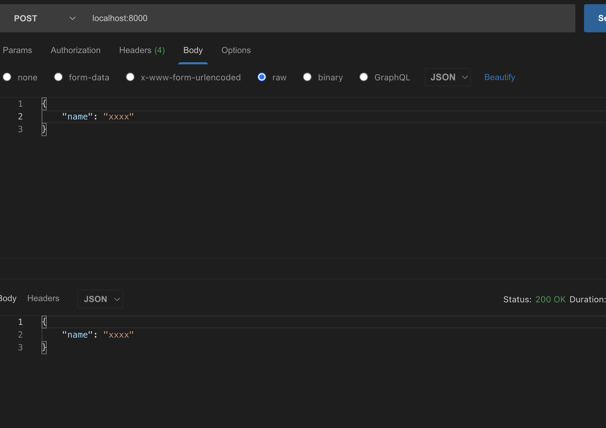

## 开始
### 目标

- 系统没有日志，就等于人没有眼睛-- 抓瞎
- 第一，访问日志 access log（server 端最重要的日志）
- 第二，自定义日志（包括自定义事件、错误记录等）

### 目录
- nodejs文件操作，nodejs stream(提高性能)
- 日志功能开发和使用
- 日志文件拆分，日志内容分析

## 代码演示-文件操作
- 读取文件
	```js
	const fs = require('fs')
	const path = require('path') // window 和linux路径拼接方式不同 需要兼容

	const filename = path.resolve(__dirname, 'data.txt')

	// 读取文件内容
	fs.readFile(filename, (err, data) => {
		if (err) {
			console.log(err)
			return
		}
		// data是二进制类型，需要转换为字符串
		console.log(data.toString())
	})
	```
	<span style="color: red">如果文件data.txt太大nG，就太慢了性能不高？ </span>
- 写入文件

	```js
	const fs = require('fs')
	const path = require('path') // window 和linux路径拼接方式不同 需要兼容

	const filename = path.resolve(__dirname, 'data.txt')

	// 读取文件内容
	// fs.readFile(filename, (err, data) => {
	// 	if (err) {
	// 		console.log(err)
	// 		return
	// 	}
	// 	// data是二进制类型，需要转换为字符串
	// 	console.log(data.toString())
	// })

	// 写入文件
	const content = '这是新写入的内容\n'
	const opt = {
		flag: 'a', // 追加写入，覆盖用'w'
	}
	fs.writeFile(filename, content, opt, (err) => {
		if (err) {
			console.error(err)
		}
	})
	```
	<span style="color: red">每次写入一行，很耗性能？内容太多呢？ </span>
- 判断文件是否存在

	```js
	const fs = require('fs')
	const path = require('path') // window 和linux路径拼接方式不同 需要兼容

	const filename = path.resolve(__dirname, 'data.txt')

	// 读取文件内容
	// fs.readFile(filename, (err, data) => {
	// 	if (err) {
	// 		console.log(err)
	// 		return
	// 	}
	// 	// data是二进制类型，需要转换为字符串
	// 	console.log(data.toString())
	// })

	// 写入文件
	// const content = '这是新写入的内容\n'
	// const opt = {
	// 	flag: 'a', // 追加写入，覆盖用'w'
	// }
	// fs.writeFile(filename, content, opt, (err) => {
	// 	if (err) {
	// 		console.error(err)
	// 	}
	// })

	// 判断文件是否存在
	fs.exists(filename, (exist) => {
		console.log('exist', exist)
	})
	```
## stream 介绍
### IO操作的性能瓶颈
- IO包括"网络IO"和"文件IO"(网络带宽问题，文件大？内存？)
- 相比于CPU计算和内存读写，IOS的突出特点就是：慢！
- 如果和在有限的硬件资源下提高IO的操作效率？


### stream 通俗介绍
stream 就是流动，之前一口气读取文件内容出来就好比搬水桶，直接把整个水桶抬走了。但是大多数人并没有那力气。更好的方式是，接个水管，将水稳定地通过管道转移到其他地方，降低了成本（小孩子都能够完成）。stream 就类似于此，极大降低了硬件资源要求。

```js
// 标准输入输出，pipe就是管道(符合水流管道的模型图)
// process.stdin 获取数据，直接通过管道传递给process.stdout
// process.stdin 来源   process.stdout 目的地
process.stdin.pipe(process.stdout)
```
终端输入的内容将通过管道持续输出到终端中。

### 请求内容输出到响应内容
```js
const http = require('http');
const server = http.createServer((req, res) => {
	if(req.method === 'POST') {
		req.pipe(res);
	}
})
server.listen(8000)
```
现在，req 和 res 通过 pipe 连接，一旦 req 接收到了东西，就会立刻稳定地输出到 res 中。

## stream演示
```js
// stream-test/test1.js

// 标准输入输出
process.stdin.pipe(process.stdout)

// 例子二--- 在postman中 body传入  直接输出
const http = require('http')
const server = http.createServer((req, res) => {
	if (req.method === 'POST') {
		req.pipe(res)
	}
})
server.listen(8000)
```


### stream 拷贝文件
```js
// 复制文件
const fs = require('fs')
const path = require('path')

const filename1 = path.resolve(__dirname, 'data.txt')
const filename2 = path.resolve(__dirname, 'data-bak.txt')

const readStream = fs.createReadStream(filename1)
const writeStream = fs.createWriteStream(filename2)

readStream.pipe(writeStream)
readStream.on('data', (chunk) => {
	console.log(chunk.toString())
})
readStream.on('end', () => {
	console.log('copy done')
})
```
### stream 读取文件内容
```js
const http = require('http')
const fs = require('fs')
const path = require('path')
const filename1 = path.resolve(__dirname, 'data.txt')
const server = http.createServer((req, res) => {
	if (req.method === 'GET') {
		const readStream = fs.createReadStream(filename1)
		readStream.pipe(res)
	}
})
server.listen(8001)
```

## 写日志
1. 启动blo-1g项目
2. 创建一个文件夹logs
3. logs 里有access.log / error.log / event.log
### 3.1 创建写日志的相关方法
在项目里创建 logs 文件夹，里边存储日志文件。同时在 src 目录创建 utils 用于放常用的工具方法，里边创建 log.js，里面写了写日志相关方法。

```js
const fs = require('fs')
const path = require('path')

// 写日志
function writeLog(writeStream, log) {
	writeStream.write(log + '\n') // 关键代码
}

// 生成write Stream
function createWriteStream(filename) {
	const fullFilename = path.join(__dirname, '../', '../', 'logs', filename)
	const writeStream = fs.createWriteStream(fullFilename, {
		flags: 'a', //追加
	})
	return writeStream
}
// 写访问日志
const accessWriteStream = createWriteStream('access.log')
function access(log) {
	writeLog(accessWriteStream, log)
}

module.exports = {
	access,
}
```
### 3.2 每次接收到请求后写入日志
app.js 里的 serverHandle 每次调用的时候便是接收到请求的时候，此时写入访问日志即可。其他的日志，例如 error 和 event 在合适的时候写入即可
```js
// app.js
const querystring = require('querystring')
const { get, set } = require('./src/db/redist')
const { access } = require('./src/utils/log')
const handleBlogRouter = require('./src/router/blog')
const handleUserRouter = require('./src/router/user')

// ....
const serverHandle = async (req, res) => {
  // 记录访问信息
  access(
    `${req.method} -- ${req.url} -- ${
      req.headers["user-agent"]
    } -- ${Date.now()}`
  );
// ......其他主要代码
}
```
实现效果，访问的时候成功写入了 log 文件：


## 日志拆分
- 日志内容会慢慢积累，放在一个文件中不好处理
- 按时间划分日志文件 如2019-02-10.access.log
- 实现方式：Linux 的 crontab 命令，即定时任务(不说window了  服务器一般是linux)

### crontab
- 设置定时任务，格式: *****command (第一个分钟 第二个每天的小时  第三个日期 第四个月份 第五个星期)
- 将access.log 拷贝并重命名为2019-02-10.acces.log
- 清空access.log,继续积累日志

### 实现方式
以下流程适用于 Linux 和 macOS

写 sh 脚本

写一个脚本 copy.sh 用于产生具有日期标注的日志，命令行执行 sh coppy.sh 查看效果：
```shell
#!/bin/sh
cd /Users/xuzhe/Desktop/website/public/node/blog-1/logs/
cp access.log $(date +%Y-%m-%d).access.log
echo '' > access.log
```
理想情况是，生成新的带有日期的日志文件，并且 access.log 里的内容被清空。


- 使用 crontab

	在命令行中执行 crontab -e 进入编辑模式，写入以下内容，意思为每天的第 0 小时执行 sh 命令。
	```shell
	# 格式
	* 0 * * * sh copy.sh的绝对路径
	# demo
	* 0 * * * sh /Users/xuzhe/Desktop/website/public/node/blog-1/src/utils/copy.sh
	```
- 查看 crontab 任务

	crontab -l 可以查看当前系统的定时任务。

## 日志分析
- 如针对acces.log日志，分析chrome的占比
- 日志是按行存储的，一行就是一条日志
- 使用nodejs的readline(基于steam， 效率高)

比如，如下的日志内容，前四个是 Safari 浏览器跑的，后两个是 Chrome 浏览器。
```shell
GET -- /api/blog/detail?id=1 -- Mozilla/5.0 (Macintosh; Intel Mac OS X 10_15_7) AppleWebKit/605.1.15 (KHTML, like Gecko) Version/15.5 Safari/605.1.15 -- 1655271842104
GET -- /favicon.ico -- Mozilla/5.0 (Macintosh; Intel Mac OS X 10_15_7) AppleWebKit/605.1.15 (KHTML, like Gecko) Version/15.5 Safari/605.1.15 -- 1655271843024
GET -- /api/blog/detail?id=1 -- Mozilla/5.0 (Macintosh; Intel Mac OS X 10_15_7) AppleWebKit/605.1.15 (KHTML, like Gecko) Version/15.5 Safari/605.1.15 -- 1655271853955
GET -- /api/blog/detail?id=2 -- Mozilla/5.0 (Macintosh; Intel Mac OS X 10_15_7) AppleWebKit/605.1.15 (KHTML, like Gecko) Version/15.5 Safari/605.1.15 -- 1655271854350
GET -- /api/blog/detail?id=1 -- Mozilla/5.0 (Macintosh; Intel Mac OS X 10_15_7) AppleWebKit/537.36 (KHTML, like Gecko) Chrome/102.0.5005.61 Safari/537.36 -- 1655271857708
GET -- /api/blog/detail?id=1 -- Mozilla/5.0 (Macintosh; Intel Mac OS X 10_15_7) AppleWebKit/537.36 (KHTML, like Gecko) Chrome/102.0.5005.61 Safari/537.36 -- 1655271859548
```

可以看出，Safari 浏览器发送请求时，里面没有 Chrome 标记。就可以依据这个来判别 Chrome 的占比（当然比较不严谨，演示用）

计算 Chrome 占比的脚本如下：

```js
// utils/readline.js
const fs = require('fs')
const path = require('path')
const readline = require('readline')

// 文件路径
const fullFileName = path.resolve(__dirname, '../', '../', 'logs', 'access.log')
// 创建 readStream
const readStream = fs.createReadStream(fullFileName)

// 创建 readline 对象
const rl = readline.createInterface({
	input: readStream,
})

let chromeNum = 0
let sum = 0

// 逐行读取
rl.on('line', (lineData) => {
	if (!lineData) {
		return
	}

	// 记录总行数
	sum++

	const [method, url, userAgent] = lineData.split(' -- ')
	if (userAgent?.includes('Chrome')) {
		// 累加 Chrome 数量
		chromeNum++
	}
})

// 监听读取完成
rl.on('close', () => {
	console.log(`Chrome 占比：${chromeNum / sum}`)
})
```
运行结果
```js
Chrome 占比：0.3333333333333333
```

## 总结

- 日志对 server 端的重要性，相当于人的眼睛
- IO 性能瓶颈，使用 stream 提高性能
- 使用 crontab 拆分日志文件，使用 readline 分析日志内容
