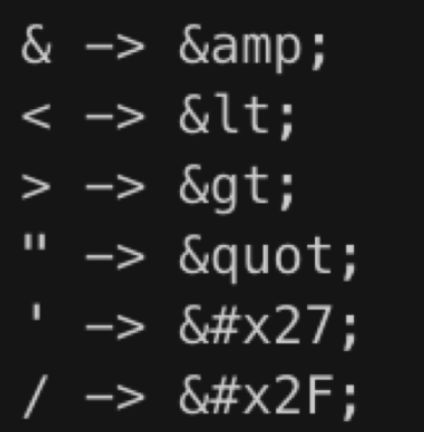
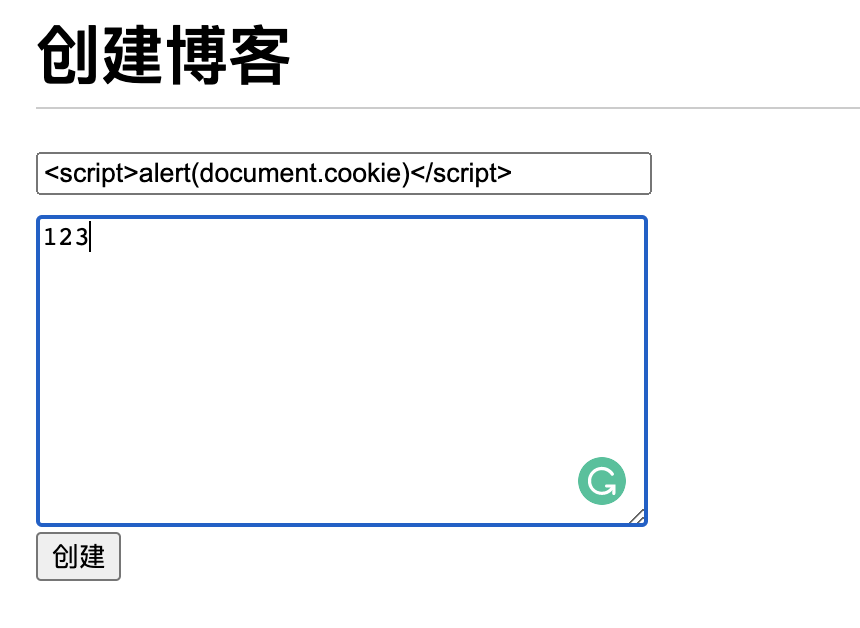
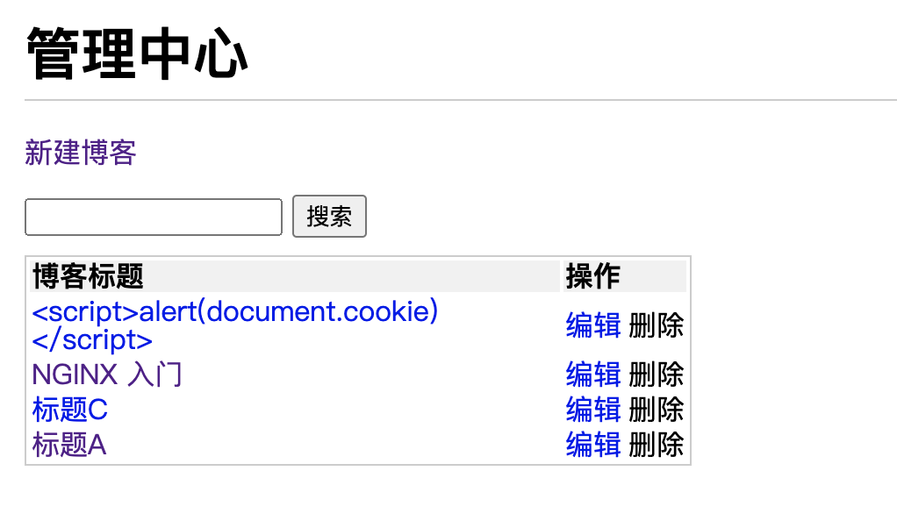
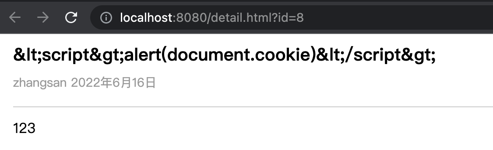
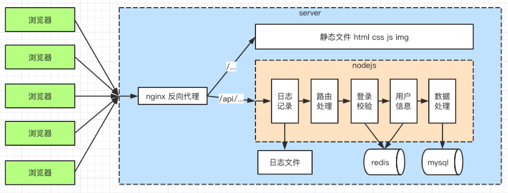

- sql注入：窃取数据库内容
- XSS攻击：窃取前端的cookie内容
- 密码加密：保障用户信息安全(重要！)
### 补充
- server 端的攻击方式非常多，以防手段也非常多
- 本文章之讲常见的、能通过 web server (nodejs) 层面预防的
- 有些攻击需要硬件和服务来支持（需要 OP 支持），如 DDOS

## sql注入
- 最原始、最简单的攻击，从有了web2.0就有了sql注入攻击
- 攻击方式：输入一个sql片段，最终拼接成一段攻击代码
- 预防措施:使用mysql的escape函数处理输入内容即可

### 演示
比如现在的登录验证，是通过字符串拼接后执行 SQL 语句来实现的：
```js
const { exec } = require("../db/mysql");

const login = (username, password) => {
  const sql = `
    select username, realname from users where
    username = '${username}' and password = '${password}';
  `;
  return exec(sql).then((rows) => {
    return rows[0] || {};
  });
};

module.exports = {
  login,
};
```
SQL 语句例如：
```js
select username, realname from users where username = 'zhangsan' and password = '123456';
```
### 免密码登录
但是如果输入的用户名是 zhangsan' -- ，便将后边的语句注释了，就算密码错误也可以用 zhangsan 的账号登录
```js
select username, realname from users where username = 'zhangsan' -- ' and password = '123456';
```
### 删库
如果现在有人的用户名是 zhangsan';delect from users; -- ，后果更严重，直接数据库全删了。
```js
select username, realname from users where username = 'zhangsan';delect from users; -- ' and password = '123456';
```
### 解决方法
使用转义字符。将敏感的符号转义可以避免这个问题。mysql 库提供了 mysql.escape 方法，用来转义内容：
```js
// src/db/mysql.js
const mysql = require('mysql')
const { MYSQL_CONFIG } = require('../config/db')

// 创建链接对象
const con = mysql.createConnection(MYSQL_CONFIG)

// 开始链接
con.connect()

// 统一执行 sq l的函数
function exec(sql) {
	return new Promise((resolve, reject) => {
		con.query(sql, (err, result) => {
			if (err) {
				reject(err)
				return
			}
			resolve(result)
		})
	})
}

module.exports = {
	exec,
	escape: mysql.escape
}


// controller/user.js
const { exec, escape } = require('../db/mysql')

const login = (username, password) => {
	username = escape(username);
  	password = escape(password);
	const sql = `
		select username, realname from users where username=${username} and password=${password}
	`
	console.log(sql)
	return exec(sql).then((rows) => {
		return rows[0] || {}
	})
}
module.exports = {
	login,
}
// 前端页面
<!DOCTYPE html>
<html lang="en">

<head>
    <meta charset="UTF-8">
    <meta http-equiv="X-UA-Compatible" content="IE=edge">
    <meta name="viewport" content="width=device-width, initial-scale=1.0">
    <title>new</title>
    <script src="https://cdn.staticfile.org/jquery/1.10.2/jquery.min.js"></script>

</head>

<body>
    <h2>创建</h2>
    <input type="text" placeholder="请输入用户名" id="username" />
    <input type="text" placeholder="请输入密码" id="password" />
    <button onClick="test()">登录</button>
    <script>
        function test () {
            let data = {
                username: document.getElementById('username').value,
                password: document.getElementById('password').value
            }
            console.log(data);
            $.ajax({
                url: '/api/user/login',
                type: 'post',
                contentType: 'application/json',
                data: JSON.stringify(data),
                dataType: "json",
                success: function (res) {
                    if(res.errno === 0) {
                        location.href = '/'
                    }
                }
            })
        }
    </script>
</body>

</html>
```
转义后的SQL语句如下
```js
select username, realname from users where username='zhangsan \' --' and password='123'
```
username 整体被单引号包起来了，里面的单引号会被转义，因此不会影响到查询。

> 需要拼接sql的语句 需要escape包装一遍--单引号去掉 重要 

## XSS攻击
- 前端同学最熟悉的方式，但server端更应该掌握
- 攻击方式：在页面展示内容中掺杂了js代码，以获取网页信息
- 预防措施:转换生成js的特殊字符



### XSS攻击演示


创建成功后跳转到管理中心，因为 HTML 里直接嵌入了 script 脚本，因此会执行 alert(document.cookie)。因此转移会生成 script 脚本的符号是个有效的办法。

### 2.2 预防 XSS 攻击
```js
yarn add xss // 安装
```
用法和上面的 escape 转义十分类似，只要将需要转义的字符串包起来即可。
```js
// controller/blog.js
const newBlog = (blogData = {}) => {
  // blogData 是一个博客对象，包含 title、content、author 属性
  blogData = {
    ...blogData,
    createTime: Date.now(),
    id: 3, // 表示新建博客，插入到数据表里面的 id
  };
  const { title, content, author, createTime } = blogData;
  const sql = `
    insert into blogs (title, content, createTime, author) 
    values 
    ('${xss(title)}', '${xss(content)}', ${createTime}, '${author}');`;
  return exec(sql).then((insertData) => {
    // promise 返回插入的值对应的 id
    return {
      id: insertData.insertId,
    };
  });
};
```
效果


转义后的 SQL 语句如下：
```js
insert into blogs (title, content, createTime, author) 
values 
```
但是有些地方可能转义符号没有转义，例如文章详情页

这种内容需要由前端来处理而非后端。

## 密码加密
- 万一数据库被用户攻破， 最不应该泄露的就是用户信息
- 攻击方式：获取用户名和密码，再去尝试登录其他系统
- 预防措施：将密码加密，即使拿到密码也不知道明文
加密流程
1. 先引入node自带的crypto模块

	```js
	const crypto = require('crypto');
	```
2. 在utils文件里新建文件夹，写密码加密的相关逻辑，然后通过方法获取到密码加密后的内容，然后修改数据中原来的明文密码

	当然这一步是不合理的，但是没有做注册和修改密码功能没办法
	```js
	const crypto = require('crypto');
	
	// 密钥
	const SECRET_KEY = 'kfdsjl_742938#';

	// md5加密内容
	const md5 = content => {
		// 输出变成16进制
		return crypto.createHash('md5').update(content).digest('hex');
	}
	// 加密函数
	const genPassword = (password) => {
		const str = `password=${password}&key=${SECRET_KEY}`;
		return md5(str);
	};

	module.exports = {
		genPassword,
	};
	```
3. 登录的时候密码加密并进行查询，因为现在数据库里存的是加密后的内容

	```js
	// controller/user.js
	const { exec, escape } = require("../db/mysql");
	const { genPassword } = require("../utils/cryp");

	const login = (username, password) => {
	username = escape(username);
	// 生成加密密码 注意getPassword 和escape的顺序 会牵扯sql是否有引号问题
	password = genPassword(password);
	password = escape(password);

	const sql = `
		select username, realname from users where
		username = ${username} and password = ${password};
	`;
	return exec(sql).then((rows) => {
		return rows[0] || {};
	});
	};

	module.exports = {
		login,
	};
	```
## 总结
- 开发了哪些功能模块，完整的流程
- 用到了哪些知识点
- server和前端的区别

### 功能模块
- 处理http接口
- 连接数据库
- 实现登录
- 日志
- 安全
- 上线(最后在一起讲)



### 核心知识点
- http,nodejs处理http、处理路由，mysql
- cookie, session,redis,nginx反向代理
- sql注入，xss攻击，加密
- 日志，stream,contrab, readline
- 线上环境的知识点，之后统一讲

### server端和前端区别
- 服务稳定性（pm2）
- 内存CPU (优化扩展)
- 日志记录
- 安全(包括登录校验)
- 集群和服务拆分(设计已支持)

### 下一步
- 不适用框架开发，从0开始，关注底层API
- 很琐碎、很复杂，没有标准可依，很容易代码写乱
- 适合学习，但是不适用应用接下来开始express和koa2
