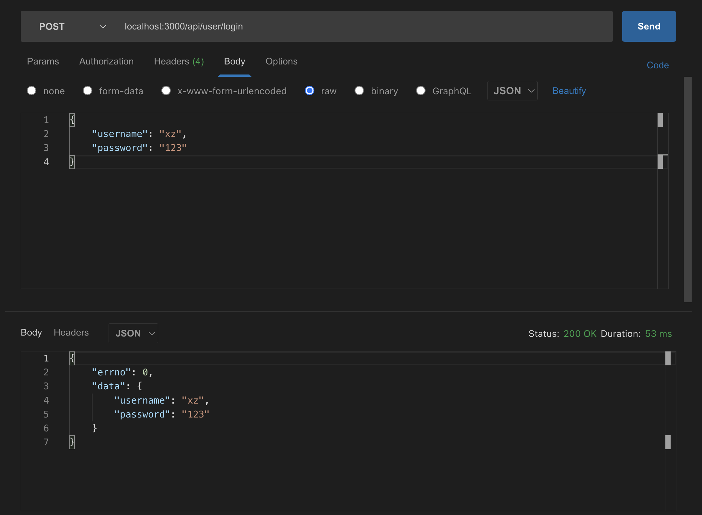

## 开始
### 使用express
- express是nodejs最常用的web server框架
- 什么是框架？(架子，制定了一些标准，开发更简单更关注业务开发；特点：封装一些api、**有一定流程和标准形成一套标准的解决方案**)
- 不要以为express过时了

### 目录
- express下载、安装和使用，express中间件机制
- 开发接口，连接数据库，实现登录，日志记录
- 分析express中间件原理

## express安装
- 安装(使用脚手架express-generator)
- 初始化代码介绍，处理路由
- 使用中间件

```js
$ npm install express-generator -g
$ express express-test
$ npm install & npm start

//nodemon cross-env
npm install nodemon cross-env --save-dev 

// pageage.json增加
"dev": "cross-env NODE_ENV=dev nodemon ./bin/www"
```
## 介绍express的入口代码
- 各个插件的作用
- 思考各个插件的实现原理
- 处理get请求和post请求

:::tip
- cookie-parse 解析cookie 
- mogan 记录日志logger 自动生成日志，需要配置
- app.use(express.json())  --- 类似getPostData  为了req.body = postData
- app.use(express.urlencoded({ extended: false }));  处理content-type除json之外的格式 为了req.body塞数据 req.body = postData 同上一条
- 注册路由

	```js
	app.use('/', indexRouter);
	app.use('/users', usersRouter);
	```
- 处理404

	```js
	app.use(function(req, res, next) {
		next(createError(404));
	});
	```
- error hanlder

	```js
	app.use(function(err, req, res, next) {
		// set locals, only providing error in development
		res.locals.message = err.message;
		res.locals.error = req.app.get('env') === 'dev' ? err : {}; // 修改为自己的dev环境

		// render the error page
		res.status(err.status || 500);
		res.render('error');
	});
	```
:::

## 演示express如何处理路由
```js
// routes/blog.js
var express = require('express')
var router = express.Router()

router.get('/list', function (req, res, next) {
	res.json({ // 直接返回json 自动加了res.setHeader('Content-Type', 'application/json')
		errno: 0,
		data: [1, 2, 3],
	})
})
router.get('/detail', function (req, res, next) {
	res.json({
		errno: 0,
		data: 'ok',
	})
})
module.exports = router

// route/router.js
var express = require('express')
var router = express.Router()

router.post('/login', function (req, res, next) {
	const { username, password } = req.body
	res.json({
		errno: 0,
		data: {
			username,
			password,
		},
	})
})

module.exports = router
```


## 中间件机制
```js
const express = require('express')

// 本次http请求的实例
const app = express()

app.use((req, res, next) => {
	console.log('请求开始...', req.method, req.url)
	next()
	// console.log('结束')
})
app.use((req, res, next) => {
	// 假设在处理cookie
	req.cookie = {
		userId: 'abc123',
	}
	next()
})
app.use((req, res, next) => {
	// 假设处理post data
	// 异步
	setTimeout(() => {
		req.body = {
			a: 100,
			b: 200,
		}
		next()
	})
})
app.use('/api', (req, res, next) => {
	console.log('处理api 路由')
	next()
})

app.get('/api', (req, res, next) => {
	console.log('get /api 路由')
	next()
})

app.post('/api', (req, res, next) => {
	console.log('post /api 路由')
	next()
})

// 模拟登录验证
function loginCheck(req, res, next) {
	setTimeout(() => {
		console.log('模拟登录失败')
		res.json({
			errno: -1,
			msg: '登录失败',
		})
		// console.log('模拟登录成功')
		// next()
	})
}

app.get('/api/get-cookie', loginCheck, (req, res, next) => {
	console.log('get /api.get-cookie')
	res.json({
		errno: 0,
		data: req.cookie,
	})
})

app.post('/api/get-post-data', (req, res, next) => {
	console.log('post /api/get-post-data')
	res.json({
		errno: 0,
		data: req.body,
	})
})

app.use((req, res, next) => {
	console.log('处理404')
	res.json({
		errno: -1,
		msg: '404',
	})
})

app.listen(3000, () => {
	console.log('server listening on port 3000')
})
```
> 关注中间件使用

[express中间件--关注异步](/back-end/Node/frame-compose.html#express中间件)

## 总结
- 初始化代码中，各个插件的作用
- express如何处理路由
- express中间件