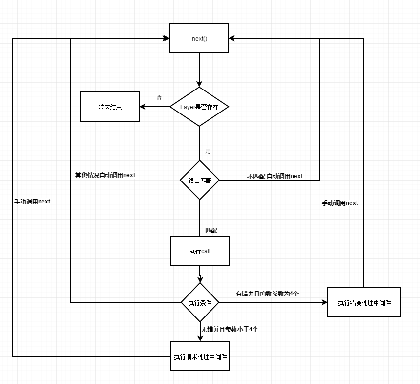

:::tip
Koa作为下一代Web开发框架，不仅让我体验到了async/await语法带来的同步方式书写异步代码的酸爽，而且本身简洁的特点，更加利于开发者结合业务本身进行扩展
:::
本文从以下几个方面解读Koa源码
- 封装创建应用程序函数
- 扩展res和req
- 中间件实现原理
- 异常处理

## 封装创建应用程序函数
利用NodeJS可以很容易编写一个简单的应用程序
```
const http = require('http');
const server = http.createServer((req, res) => {
  // 每一次请求处理的方法
  console.log(req.url);
  res.writeHead(200, { 'Content-Type': 'text/plain' });
  res.end('Hello NodeJS');
})
server.listen(8080)
```
> 注意：当浏览器发送请求时，会附带请求/favicon.ico

而Koa在封装创建应用程序的方法中主要执行了以下流程

- 组织中间件(监听请求之前)
- 生成context上下文对象
- 执行中间件
- 执行默认响应方法或者异常处理方法

```
// application.js
listen(...args) {
  const server = http.createServer(this.callback());
  return server.listen(...args);
}

callback() {
  // 组织中间件
  const fn = compose(this.middleware);

  // 未监听异常处理，则采用默认的异常处理方法
  if(!this.listenerCount('error')) this.on('error', this.onerror);

  const handleRequest = (req, res) => {
    // 生成context上下文对象
    const ctx = this.createContext(req, res);
    return this.handleRequest(ctx, fn);
  }
  return handleRequest;
}

handleRequest(ctx, fnMiddleware) {
  const res = ctx.res;
  // 默认状态码为404
  res.statusCode = 404;
  // 中间件执行完毕之后 采用默认的错误与成功的处理方式
  const onerror = err => ctx.onerror(err);
  const handleResponse = () => respond(ctx);
  onFinished(res, onerror);
  return fnMiddleware(ctx).then(handleResponse).catch(onerror)
}
```
## 扩展res和req
首先我们要知道NodeJS中res和req是http.IncomingMessage和http.ServerResponse的实例，那么我们就可以在NodeJS中这样扩展req和res:
```
Object.defineProperties(http.IncomingMessage.prototype, {
  query: {
    get() {
      return querystring.parse(url.parse(this.url).query);
    }
  }
})

Object.defineProperties(http.ServerResponse.prototype, {
  json: {
    value: function(obj) {
      if (typeof obj === 'object') {
        obj = JSON.stringify(obj);
      }
      this.end(obj)
    }
  }
})
```
而Koa中则是自定义request和response对象,然后保持对res和req的引用，最后通过getter和setter方法实现扩展
```
// application.js
createContext((req, res) {
  const context = Object.create(this.context);
  const request = context.request = Object.create(this.request);
  const response = context.response = Object.create(this.response);
  context.app = request.app = response.app = this;
  context.req = request.req = response.req = req; // 保存原生req对象
  context.res = request.res = response.res = res; // 保存原生res对象
  request.ctx = response.ctx = context;
  request.response = response;
  response.request = request;
  context.originalUrl = request.originalUrl = req.url;
  context.state = {};
  // 最终返回完整的context上下文对象
  return context;
})
```
所以Koa中要区别这两组对象
- request、response：Koa扩展的对象
- res、req:Node原生对象
```
// request.js
get header() {
  return this.req.headers;
},
set header() {
  this.req.headers = val;
}
```
此时已经可以采用这样的方式访问header属性
```
ctx.request.header
```
但是为了方便开发者调用这些属性和方法,Koa将response和request中的属性和方法代理到context上。


通过Object.defineProperty可以轻松的实现属性的代理

```
function access(proto, target, name) {
  Object.defineProperty(proto, name, {
    get() {
      return target[name];
    }
    set (value) {
      target[name] = value;
    }
  })
}
access(context, request, 'header');
```
而对于方法的代理，则需要注意this的指向
```
function method(proto, target, name) {
  proto[name] = function() {
    return target[name].apply(target, arguments);
  }
}
```
上述就是**属性代理和方法代理**的核心代码，这基本算是一个常用的套路

代理这部分详细的源码，可以查看[node-delegates](https://github.com/tj/node-delegates/blob/master/index.js),不过这个包时间久远,有一些老方法已经废除

在上述过程中的源码中涉及到很多JavaScript的基础知识，例如：原型继承、this指向。

## 中间件实现原理
首先需要明确的是：中间件并不是NodeJS中的概念，它只是connect、express和koa框架衍生的概念

### connect中间件设计
在connect中，开发者可以通过use方法注册中间件
```
function use(route, fn) {
  var handle = fn;
  var path = route;

  // 不传入route则默认为'/'，这种基本是框架处理参数的一种套路
  if(typeof route !== 'string') {
    handle = route;
    path = '/'
  }

  // ...
  // 存储中间件
  this.stack.push({ route: path, handle: handle })

  // 以便链式调用
  return this;
}
```
use方法内部获取到中间件的路由信息(默认为'/')和中间件的处理函数之后，构建成layer对象，然后将其存储在一个队列当中，也就是上述代码中的stack。

connect中间件的执行流程主要由handle与call函数决定
```
function handle(req, res, out) {
  var index = 0;
  var stack = this.stack;
  ...
  function next(err) {
    ...
    // 依次取出中间件
    var layer = stack[index++];

    // 终止条件
    if(!layer) {
      defer(done, err);
      return;
    }

    // 路由匹配规则
    if(path.toLowerCase().substr(0, route.length) !== route.toLowerCase()) {
      return next(err);
    }
    ...
    call(layer.handle, route, err, req, res, next);
  }

  next();
}
```
handle函数中使用闭包函数next来检测layer是否与当前你路由相匹配，匹配则执行该layer上的中间件函数，否则继续检查下一个layer

这里需要注意next中检查路由的方式可能与想象中的不太一样，所以默认路由为'/'的中间件会在每一次请求处理中都执行。

```
function call(handle, route, err, req, res, next) {
  var arity = handle.length;
  var error = err;
  var hasError = Boolean(err);

  try {
    if (hasError && arity === 4) {
      // 错误处理中间件
      handle(err, req, res, next);
      return;
    } else if (!hasError && arity < 4) {
      // 请求处理中间件
      handle(req, res, next);
      return;
    }
  } catch (e) {
    // 记录错误
    error = e;
  }

  // 将错误传递下去
  next(error);
}
```
在通过call方法执行中间件方法的时候，采用try/catch捕获错误，这里有个特别需要注意的地方是，call内部会根据是否存在错误以及中间件函数的参数决定是否执行错误处理中间件。并且一旦捕获到错误，next方法会将错误传递下去，所以接下来普通的请求处理中间件即使通过了next中的路由匹配，仍然会被call方法给过滤掉

下面是layer的处理流程图


上述就是connect中间件涉及的核心要点，总结起来有如下几点
1. 通过use方法注册中间件
2. 中间件的顺序执行是通过next方法衔接的并且需要手动调用，在next中会进行路由匹配，从而过滤掉部分中间件
3. 当中间件的执行过程中发生异常，则next会携带异常过滤掉非错误处理中间件，也是为什么错误中间件会比其他中间件多一个error参数
4. 在请求处理的周期中，需要手动调用res.end()来结束响应

### Koa中间件设计
Koa中间件与connect中间件的设计有很大的差异
- Koa中间件的执行并不需要匹配路由，所以注册的中间件每一次请求都会执行(当然还需要手动调用next)
- Koa中通过继承event,暴露error时间让开发者自定义异常处理
- Koa中res.end由中间件执行完成之后自动调用，这样避免在connect忘记调用res.end导致用户得不到反馈
- Koa中采用了async/await语法让开发者利用同步的方式编写异步代码

当然Koa中也是采用use方法注册中间件，相比较connect省去路由匹配的处理，就显的很简洁
```
use(fn) {
  this.middleware.push(fn);
  return this;
}
```
并且use支持链式调用

Koa中间件的执行流程主要通过koa-compose中的compose函数完成
```
function compose(middleware) {
  if (!Array.isArray(middleware)) throw new TypeError('Middleware stack must be an array');
  for (const fn of middleware) {
    if (typeof fn !== 'function') throw new TypeError('Middleware must be composed of functions!')
  }

  /**
  * @param {Object} context
  * @return {Promise}
  * @api public
  */

  return function(context, next) {
    let index = -1;
    return dispatch(0);
    return dispatch(i) {
      if (i <= index) return Promise.reject(new Error('next() called multiple times'));
      index = i;
      let fn = middleware[i];
      if (i === middleware.length) fn = next;
      if (!fn) return Promise.resolve();
      try {
        // 递归调用下一个中间件
        return Promise.resovle(fn(context, dispatch.bind(null, i + 1)))
      } catch(err) {
        return Promise.reject(err)
      }
    }
  }
}
```
看到这里本质上connect和koa实现中间件的思想都是递归，不难看出koa相比较connect实现的更加简介，主要原因在于
- connect中提供路由匹配功能，而Koa中则是相当于connect中默认的'/'路径
- connect在捕获中间件的异常时，通过next携带error一个个中间件验证，直到错误处理中间件。而Koa中则是用Promise包装中间件，一旦中间件发生异常，那么会直接触发reject状态，直接在Promise的catch中处理就行

上述就是connect中间件与Koa中间件的实现原理，现在在看Koa中间件的这张执行流程图，应该没什么疑问了吧


## 异常处理
对于同步代码，通过try/catch可以轻松捕获异常,在connect中间件的异常捕获则是通过try/catch完成。

对于异步代码，try/catch则无法捕获，这时候一般可以构造Promise链，在最后的catch方法中捕获错误，Koa就是这样处理，并且在catch方法中发送error事件，以便开发者自定义异常处逻辑
```
this.app.emit('error', err, this);
```
前面也谈到Koa利用async/await语法带来同步方式书写异步代码的酸爽，另外也让错误处理更加自然
```
// 也可以这样自定义错误处理
app.use(async (ctx, next) => {
  try {
    await next();
  } catch(err) {
    ctx.status = err.status || 500;
    ctx.body = err;
  }
})
```

## 总结
相信看到这里，再回忆一下之前遇到的那些问题，你应该会有新的理解，并且再次使用Koa时会更加得心应手，这也是分析Koa源码的目的之一。


## 资料
[玩转Koa -- 核心原理分析](https://www.imooc.com/article/274031)