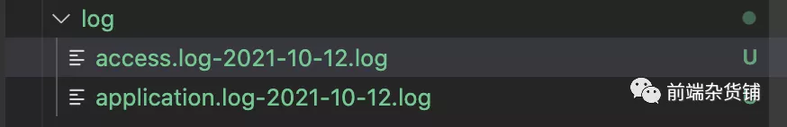
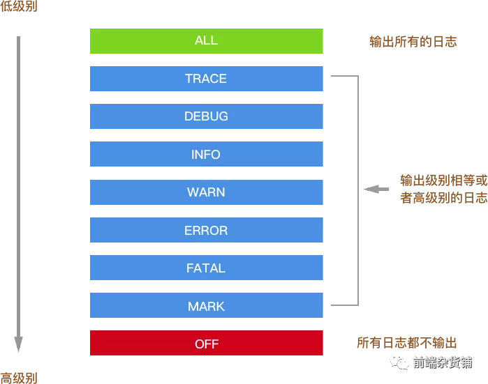
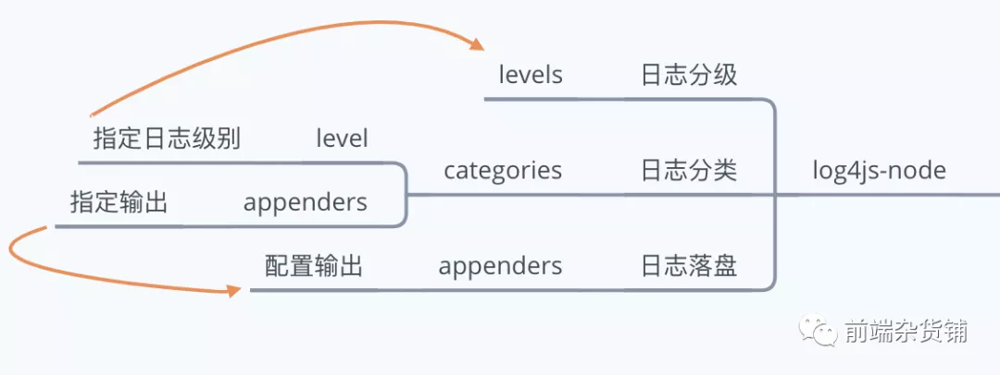

用Node写服务端的时候，比较头疼的是排查定位问题，因为不像Chrome浏览器中，我们有直接的报错提示在 dev tool中，或者我们可以直接打断点调试.

经常我们会遇到明明在test环境可以呀，为什么live环境不行的问题。加入没有日志，对于这种问题，根本毫无头绪。

所以这篇文章，我们来聊聊如果在Node服务中写日志

本文demo可以查看[Github](Github: https://github.com/GpingFeng/node-log)

## 快速新建一个koa项目
保证全局安装了koa2
```
sudo npm install -g koa-generator
```
然后执行
```
koa2 -e node-log # 新建一个项目
cd node-log
npm i # 安装依赖
npm run start #启动
```
基础服务就搭建起来了，访问http://localhost:3000/,就可以看到以下的页面


以上是一个快读搭建koa服务的方法。这个项目中内置了一个写日志的库---koa-logger.我们先来看看它做了什么东西吧。

## koa-logger
这个库比较简单，记录请求的基本信息，比如请求的方法、URI、用时等。作为中间件中使用，注意：推荐放在所有的中间件之前，这个跟koa的洋葱模型有关。假如不是第一个，计算时间会不准确

```
var logger = require('koa-logger');
app.use(logger());
```
在我们访问响应的资源的时候，会在控制台输出响应的日志如下：

```
 <-- GET /
GET / - 14
  --> GET / 200 19ms 234b
  <-- GET /stylesheets/style.css
GET /stylesheets/style.css - 1
  --> GET /stylesheets/style.css 200 3ms 111b
  <-- GET /favicon.ico
GET /favicon.ico - 1
  --> GET /favicon.ico 404 1ms -
```

默认情况下,日志是通过console的方式直接输出到控制台中，加入我们需要对日志做自定义操作，比如写入到日志文件中等。可以通过类似完成，比如我记录时间
```
app.use(logger(str => {
    console.log(new Date() + str);
    // redirect koa logger to other output pipe
     // default is process.stdout(by console.log function)
}))
```
结果
```
Mon Oct 11 2021 19:28:41 GMT+0800 (China Standard Time)  <-- GET /
GET / - 10ms
Mon Oct 11 2021 19:28:41 GMT+0800 (China Standard Time)  --> GET / 200 20ms 226b
Mon Oct 11 2021 19:28:41 GMT+0800 (China Standard Time)  <-- GET /stylesheets/style.css
Mon Oct 11 2021 19:28:41 GMT+0800 (China Standard Time)  --> GET /stylesheets/style.css 200 4ms 111b
```

## koa-log4js
koa-logger比较轻量，也暴露了相对灵活的接口。但在实际业务中，我个人推荐使用koa-log4js.主要理由如下:

- koa-logger看起来只支持中间件的使用方式，而不支持上报特定日志功能。
- 内置的功能比较少。如果日志的分类和落盘等。

[koa-log4js](
koa-log4js: https://www.npmjs.com/package/koa-log4)对[log4js-node](
log4js-node: https://github.com/log4js-node/log4js-node)做了一封封装,从而支持Koa日志的中间件。它的配置和log4js-node是保持一致的。所以加入你用了log4js-node的话，使用上应该是一致的。

### 使用
```
npm i -save koa-log4
```

先来看使用，根目录新建一个文件夹log.并且新建一个文件夹utils，在其中新建文件logger.js。代码如下
```
const path = require('path');
const log4js = require('koa-log4');
const RUNTIME_PATH = path.resolve(__dirname, '../');
const LOG_PATH = path.json(RUNTIME_PATH，'log');

log4js.configure({
    // 日志输出
    appenders: {
        access: {
            type: 'dateFile',
            pattern: '-yyyy-MM-dd.log', // 生成文件规则
            alwaysIncludePattern: true, // 文件名始终以日期区分
            encoding: 'utf-8',
            filename: path.join(LOG_PATH, 'access.log'); // 生成文件名
        },
        application: {
            type: 'dateFile', 
            pattern: '-yyyy-MM-dd.log',
            alwaysIncludePattern: true,
            encoding: 'utf-8',
            filename: path.join(LOG_PATH, 'application.log')
        },
        out: {
            type: 'console'
        }
    },
    categories: {
        default: { appenders: ['out'], level: 'info'},
        access: { appenders: ['access'], level: 'info'},
        application: { appenders: ['application'], level: 'all'}
    }
})

// getlogger 传参指定的类型
exports.accessLogger = () => log4js.koaLogger(log4js.getLogger('access'));
exports.logger = log4js.getLogger('application');
```
简单解释一下，configure是log4js-node的配置(后文会详解)，通过getLogger函数传参为日志类型，比如access是访问级别日志。

然后在app.js中加入
```
const { accessLogger, logger } = require('./utils/logger');
app.use(accessLogger());
```
以及routes/index.js中加入
```
+ const { logger } = require('../utils/logger');

router.get('/', async(ctx, next) => {
    + logger.info('我是首页')；
    await ctx.render('index', {
        title: 'Hello Koa 2!'
    })
})
```
刷新，可以看到log文件夹中输出两个文件



分别记录了
```
[2021-10-12T10:43:33.914] [INFO] access - ::1 - - "GET / HTTP/1.1" 200 226 "" "Mozilla/5.0 (Macintosh; Intel Mac OS X 10_15_7) AppleWebKit/537.36 (KHTML, like Gecko) Chrome/94.0.4606.71 Safari/537.36"
[2021-10-12T10:43:34.065] [INFO] access - ::1 - - "GET /stylesheets/style.css HTTP/1.1" 200 111 "http://localhost:3000/" "Mozilla/5.0 (Macintosh; Intel Mac OS X 10_15_7) AppleWebKit/537.36 (KHTML, like Gecko) Chrome/94.0.4606.71 Safari/537.36"
```

```
[2021-10-12T10:43:33.902] [INFO] application - 我是首页
```
接下来我们来看看 log4js-node 的配置。

### Level

日志的分级，主要作用是更好的展示日志(不同颜色)、有选择罗盘日志，比如在生成中避免一些debug的铭感日志被泄露。log4-node默认有九个分级(你可以通过levels进行修改)，如下：
```
{
    ALL: new Level(Number.MIN_VALUE, 'ALL');
    TRACE: new Level(5000, "TRACE"),
    DEBUG: new Level(10000, "DEBUG"),
    INFO: new Level(20000, "INFO"),
    WARN: new Level(30000, "WARN"),
    ERROR: new Level(40000, "ERROR"),
    FATAL: new Level(50000, "FATAL"),
    MARK: new Level(9007199254740992, "MARK"), // 2^53
    OFF: new Level(Number.MAX_VALUE, "OFF")
}
```
如下图所示



只会输出级别相等或者级别高的日志。比如你配置了WARN，就不会输出INFO的日志。可以在下面配置的categories中配置不同的类型日志的日志级别。

### categories
日志类别。必须配置默认日志类别，用于没有命中的情况下的兜底行为。该配置为一个对象key值为分类名称。比如上述demo中
```
{
  default: { appenders: [ 'out' ], level: 'info' },
  access: { appenders: [ 'access' ], level: 'info' },
  application: { appenders: [ 'application' ], level: 'all'}
}
```
其中每个类别都有两个配置appenders是一个字符串数组，是输出配置(后文会详解)，可以指定多个，至少要有一个。level是上文日志级别

### appenders
解决了日志分级和分类,接下来是日志落盘，也可以是输出日志的问题。对应的配置是appenders，该配置的key值为自定义的名称(可以给categories中的appenders使用)，属性值为一个对象，配置输出类型。如下所示
```
// 日志输出
appenders: {
    access: {
        type: 'dateFile',
        pattern: '-yyyy-MM-dd.log', // 生成文件的规则
        alwaysIncludePattern: true, // 文件名 始终以日期区分
        encoding: 'utf-8',
        filename: path.join(LOG_PATH, 'access.log') // 生成文件名
    }，
    out: {
        type: 'console'
    }
}
```
其中，out指的是通过console输出，这个可以作为我们的一个兜底。access中type为dateFile,指的是输出文件，然后配置文件的命名和输出路径。除了这个类型，详情可以看[官网](https://log4js-node.github.io/log4js-node/appenders.html),比如SMTP通过邮件发送(这个需要nodemailer)

### 总结配置

日志分级、日志分类以及日志落盘，配置上的关系如下



## 总结

日志对于我们服务端排查定位问题非常重要，本文通过koa-logger和koa-log4js讲解了如何上报日志。

koa-logger比较轻量，记录请求的基本信息，也提供了一定的自定义能力.

koa-log4js在日志分级、日志分类以及日志落盘上提供了一定的能力，个人任务基本这个更加适用于生成环境


## 资料
[Node服务中如何写日志](https://mp.weixin.qq.com/s/Bgtw4L_T2hhNwtXylwj1sg)
