随着人工智能 Chatgpt的出现，各种国产AI大模型应用而出，如豆包、文心一言、通义千问、kimi等等，同时，我们也发现有各种各样的套壳APP在割韭菜！

> 作为一个程序员，我们不能助长这种套壳App的嚣张气焰，我们要用魔法打败魔法，实现一个只属于我们自己的ChatGpt!

在这篇文章中，我将介绍如何利用 Node.js 和 WebSocket 实现一个基于kimi（Moonshot 月之暗大模型）的AI工具，让我们快速拥有属于自己的ChatGpt。大致实现的效果：


## 技术栈简介
前端界面比较容易，只需要简单的css + js 即可，本文使用vue作为demo

- 后端：我java很垃圾，写不出好的代码，所以后端只能用koa代替，实现接口调用即可。
- 前后端通信:为了实现前后端的数据交互，完成AI及时问答功能，我采用WebSocket进行通信
- AI大模型：要实现AI问答，核心就是需要使用现有的AI大模型。比如OpenAI 的 GPT-4、 字节跳动的豆包大模型、Kimi的月之暗Moonshot模型等等。由于Kimi的Moonshot模型兼容了 OpenAI 的SDK，调用简单、学习成本低，因此本文使用此模型。

有人可能问，你怎么不自己开发大语言模型？可笑，我要套壳实现白嫖！

## 开发前准备
要使用Moonshot的AI语言模型能力，首先我们要登录其官网，申请属于自己的API Key，通过这个key，我们就可以实现接口调用，完成自己的AI助手搭建

### 注册账号
首先，我们需要登录Kimi官网，注册账号

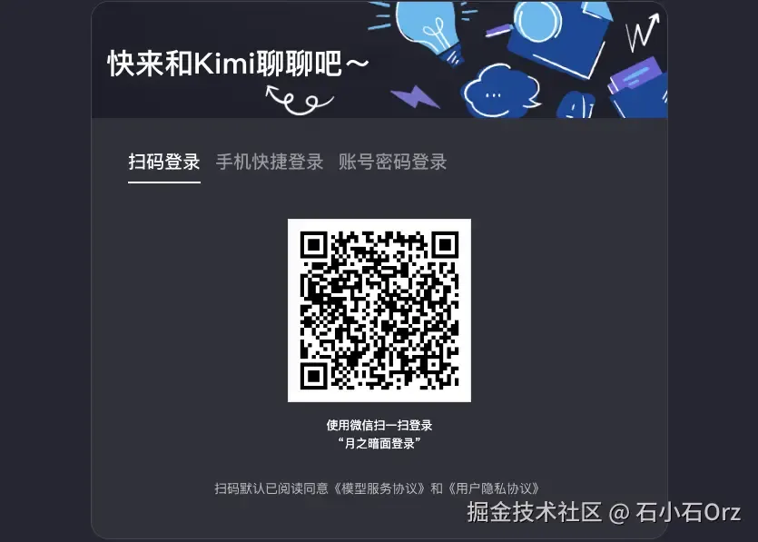

### 创建API Key
登录后台后，选择【API Key管理】面板，点击【创建】按钮，即可创建自己的密钥。这个密钥就是我们需要使用的API Key。创建好后，把它复制保存起来。

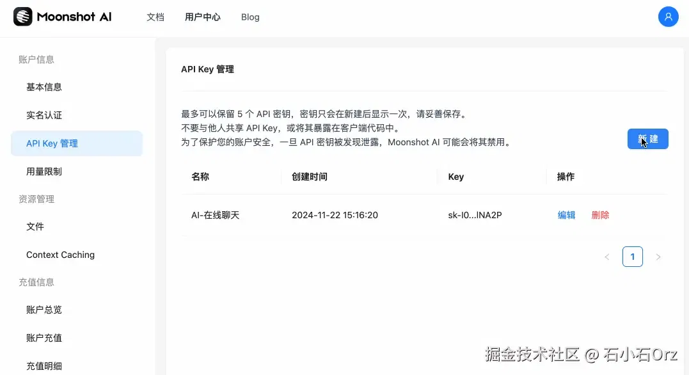

### 关于费用
作为一个白嫖用户，充值是不可能充值的。注册后，系统免费赠送15，用不完，根本用不完！

## 技术方案
### 核心项目搭建
- 服务端搭建
    搭建后端服务，其实就是调用Kimi API获取问答信息返回给前端

    Kimi API兼容了OpenAI的接口规范，因此，我们可以直接使用OpenAI 提供的 NodeJS SDK来调用和使用KIMI大模型
    ```shell
    npm i koa koa-websocket openai
    ```

    项目初始化完毕后，在根目录创建app.js文件
    ```js
    const Koa = require('koa');
    const websocket = require('koa-websocket');
    const OpenAI = require('openai');

    const app = websocket(new Koa());

    // 配置 Moonshot AI客户端
    const client = new OpenAI({
        apiKey: '你自己在kimi后台创建的API Key',
        baseURL: 'https://api.moonshot.com.cn/v1', // Moonshot API 的基础 URL
    })

    // WebSocket 路由
    app.ws.use(ctx => {
        //...
    })

    // 驱动服务器
    app.listen(3000, () => {
        console.log('服务已启动，监听ws://localhost: 3000')
    })
    ```
    上述代码中，WebSocket路由内部的逻辑也非常简单，它的逻辑流程如下
    - 监听前端发送的消息
    - 调用 Moonshot AI的聊天接口
    - 获取Kimi的回答内容
    - 将回答发送到前端
    ```js
    // WebSocket 路由
    app.ws.use((ctx) => {
    console.log("WebSocket connected");
    // 1.监听前端发送的消息
    ctx.websocket.on("message", async (message) => {
        const { content } = JSON.parse(message); // 从前端接收的 JSON 消息中解析用户输入

        try {
        // 2.调用 Moonshot AI 的聊天接口
        const completion = await client.chat.completions.create({
            model: "moonshot-v1-8k",
            messages: [
            { role: "user", content },
            ],
            temperature: 0.3, // 控制回答的随机性
        });
        // 3.获取 Kimi 的回答内容
        const reply = completion.choices[0]?.message?.content 
        // 4.将回答发送到前端
        ctx.websocket.send(JSON.stringify({ reply }));
        } catch (error) {
        ctx.websocket.send(
            JSON.stringify({ reply: "Kimi 暂时无法回答您的问题，请稍后再试。" })
        );
        }
    });

    ctx.websocket.on("close", () => {
        console.log("WebSocket connection closed");
    });
    });
    ```
    > 接口中的temperature值用于控制回答的随机性，Kimi API的temperature 参数的取值范围是[0,1],官方推荐值为0.3

    至此，后端服务搭建完毕，我们执行下面的命令启动服务
    ```shell
    node app.js
    ```
- 前端搭建

    参考其他的AI助手，前端界面一般都非常简单，我们直接参考微信的聊天界面，做一个简易的对话框接口
    ```html
    <template>
        <div class="chat-container">
            <div class="chat-box">
                <div class="messages">
                    <!-- 显示聊天记录 -->
                    <div v-for="(message, index) in messages" :key="index" class="message-wrapper"
                        :class="message.role === 'user' ? 'user-message' : 'ai-message'">
                        <div class="message">
                            <p>{{ message.content }}</p>
                        </div>
                    </div>
                </div>
            </div>
            <div class="input-box">
                <textarea v-model="userInput" placeholder="请输入您的问题..." @keyup.enter="sendMessage"></textarea>
                <button @click="sendMessage">发送</button>
            </div>
        </div>
    </template>

    <script setup>
    import { ref } from 'vue';

    const messages = ref([]);
    const userInput = ref('');
    const socket = new WebSocket('ws://localhost:3000');

    // 监听服务端消息
    socket.onmessage = (event) => {
        const data = JSON.parse(event.data);
        messages.value.push({ role: 'ai', content: data.reply });
    };

    // 发送用户消息
    const sendMessage = () => {
        if (!userInput.value.trim()) return;

        // 添加用户输入到消息列表
        messages.value.push({ role: 'user', content: userInput.value });

        // 通过 WebSocket 发送到后端
        socket.send(JSON.stringify({ content: userInput.value }));

        userInput.value = ''; // 清空输入框
    };
    </script>
    <style scoped lang="less">
    .chat-container {
    height: 100vh;
    background-color: #f6f7f9;
    overflow: hidden;

    .chat-box {
        height: calc(100% - 60px);
        box-sizing: border-box;
        padding: 16px;
        overflow-y: auto;
        background-color: #ffffff;

        .messages {
        display: flex;
        flex-direction: column;
        gap: 12px;
        }

        .message-wrapper {
        display: flex;

        .message {
            max-width: 70%;
            padding: 5px 16px;
            border-radius: 18px;
            font-size: 14px;
            line-height: 1.5;
            white-space: pre-wrap;
            word-wrap: break-word;
            box-shadow: 0 1px 2px rgba(0, 0, 0, 0.15);
        }
        }

        .user-message {
        justify-content: flex-end;

        .message {
            background-color: #0084ff;
            color: #ffffff;
            text-align: right;
            border-bottom-right-radius: 4px;
        }
        }

        .ai-message {
        justify-content: flex-start;

        .message {
            background-color: #f1f0f0;
            color: #333333;
            text-align: left;
            border-bottom-left-radius: 4px;
        }
        }
    }

    .input-box {
        height: 60px;
        display: flex;
        align-items: center;
        gap: 8px;
        background-color: #e5e5e5;
        border-top: 1px solid #e5e5e5;
        padding: 0 10px;

        button {
        padding: 5px 20px;
        background-color: #0084ff;
        color: #ffffff;
        border: none;
        border-radius: 10px;
        font-size: 14px;
        cursor: pointer;
        box-shadow: 0 2px 4px rgba(0, 132, 255, 0.3);
        transition: background-color 0.3s ease;
        }

        button:hover {
        background-color: #006bbf;
        }

        button:active {
        background-color: #0056a3;
        }

        textarea {
        flex: 1;
        padding: 10px;
        border: 1px solid #d5d5d5;
        border-radius: 15px;
        resize: none;
        font-size: 14px;
        background-color: #ffffff;
        box-shadow: inset 0 1px 2px rgba(0, 0, 0, 0.1);
        outline: none;
        height: 20px;
        }

        textarea:focus {
        border-color: #0084ff;
        box-shadow: inset 0 1px 4px rgba(0, 132, 255, 0.2);
        }
    }

    }
    </style>
    ```
    上述代码实现了一个简单的聊天界面，使用WebSocket实现前后端通信，大致代码逻辑如下
    - 响应式数数据
        - messages: 存储所有聊天记录的数组，role字段存储信息自用户还是AI
        - userInput: 用户输入框的内容，绑定到textarea
    - WebSocket通信
        - 连接服务端：通过new WebSocket('ws://localhost:3000')创建链接。ws://localhost:3000是我们后端服务的运行地址
        - 接收消息:监听onmessage事件，将服务端返回的数据解析后追加到message中
        - 发送消息：在sendMessage方法中
    > 验证输入框是否为空。 将用户消息推送到 messages。 使用 socket.send 将输入内容以 JSON 格式发送到服务端

现在我们运行前端项目，看看效果

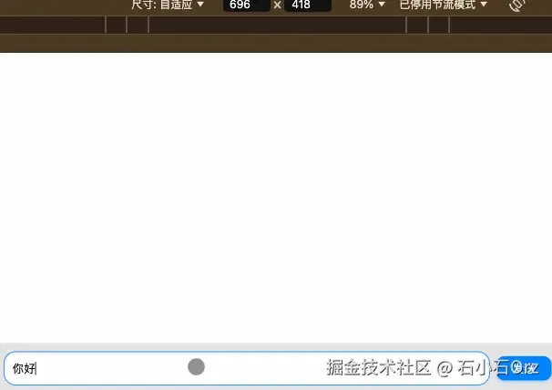

非常nice啊兄弟们！虽然交互可能不是很好，但是基本功能实现了！

:::tip
不过眼睛尖的同学们可能也看见了，最后一次输入666的时候，接口报错了。嗐，毕竟我们是白嫖用户，有用量限制：一分钟内只支持连续3次问题：
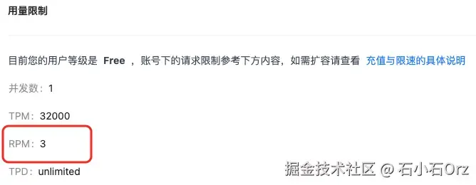
:::
### 进行多轮对话
现在，你可能会发现，我们的AI助手并不能实现多轮对话，对话是不连续的。这很正常，API 本身不具有记忆功能，它是无状态的，当我们多次请求 API 时，Kimi 大模型并不知道我们前一次请求的内容。

要解决这个问题，我们可以手动维护每次请求的上下文，把上一次请求过得内容手动加入到下一次请求中，让Kimi大模型能正确知道我们之前聊了什么。

现在，我们维护一个message列表让Kimi大模型拥有记忆，并实现多轮对话功能。我们稍微改造下后端代码
```js
const Koa = require('koa');
const websocket = require('websocket');
const OpenAI = require('openai');
require('dotenv').config();

const app = websocket(new Koa());

// 配置 Monshot AI客户端
const client = new OpenAI({
    apiKey: "你自己在kimi后台创建的API key", 
    baseURL: "https://api.moonshot.cn/v1", 
});

// 定义全局 message 对象，按 WebSocket 连接ID记录会话上下文
const sessions = {};

app.ws.use(ctx => {
    // 分配唯一会话 ID（以 WebSocket 对象为标识）
  const sessionId = ctx.websocket;

  // 初始化当前会话的历史记录
  sessions[sessionId] = [];

  // 监听前端发送的消息
  ctx.websocket.on("message", async (message) => {
    const { content } = JSON.parse(message);

    try {
      // 将用户问题追加到历史消息
      const userMessage = { role: "user", content };
      sessions[sessionId].push(userMessage);

      // 调用 Moonshot API
      const completion = await client.chat.completions.create({
        model: "moonshot-v1-8k",
        messages: sessions[sessionId],
        temperature: 0.3,
      });

      // 记录 AI 回复并发送给前端
      const assistantMessage = completion.choices[0]?.message || {
        role: "assistant",
        content: "抱歉，我暂时无法回答您的问题。",
      };
      sessions[sessionId].push(assistantMessage);

      ctx.websocket.send(JSON.stringify({ reply: assistantMessage.content }));
    } catch (error) {
      ctx.websocket.send(
        JSON.stringify({ reply: "Kimi 暂时无法回答您的问题，请稍后再试。" })
      );
    }
  });

  // 关闭 WebSocket 时清除会话记录
  ctx.websocket.on("close", () => {
    console.log("WebSocket connection closed");
    delete sessions[sessionId];
  });
})

// 启动服务器
app.listen(3000, () => {
  console.log("服务已启动，监听 ws://localhost:3000");
});
```
上述代码的实现其实非常简单,我们维护一个 sessions 对象，用于给每一个用户连接有一个专属记录(通过WebSocket的 sessionId 区分)。当用户发送消息时，值保存到对应的 sessionId记录里(包括用户的消息和AI的回复)。然后每次对话，我们都可以把完整的对话历史传给AI，AI就能『记住』之前聊过的内容

我们看看代码实现的效果

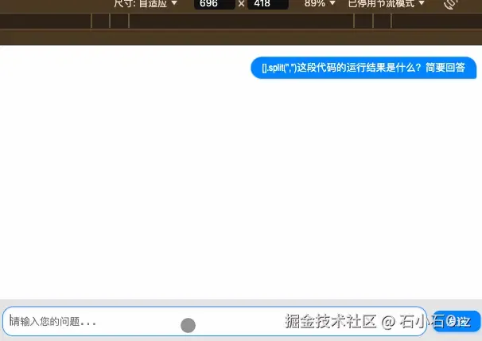

通过上图，我们可以看出多轮对象的效果已经基本实现了

### 自动选择Kimi大模型
上述的代码中，我们使用的是kimi固定的 monshot-v1-8k 模型，当对话的轮次越来越多时，继续调用 chat 函数会获得一个 Your request exceeded model token limit 错误。此时，如果我们想继续刚辞啊的上线文接着与Kimi大模型对话，需要切换一个更大上下文的模型，例如 monshot-v1-32k

但是，选择合适的模型非常麻烦，我们直接使用kimi官方的moonshot-v1-auto 模型，它可以根据对话次数内部调用合适的模型，yyds！

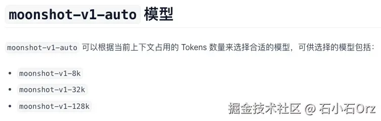

### 使用Stream流失输出
现在，我们已经基本实现AI的连续问答功能了，但是美中不足，它的反应很慢。这是因为kimi后台等问题全部生成后，才返回前端，这样显的就非常慢！那么，我们如何向ChatGPT一样，实时按字符返回结果呢？

非常简单，我们使用 Kimi API 的流式输出功能--Streaming即可！

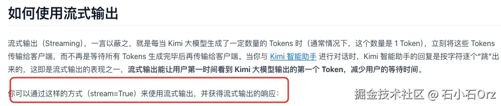

服务端的代码更改非常容易
```js
// WebSocket 路由
app.ws.use(ctx => {
    // 初始化上下文消息
    let messages = [];

    // 监听前端发送的消息
    ctx.websocket.on('message', async (message) => {
        const { content } = JSON.parse(message); // 获取用户输入

        // 添加用户输入到上下文消息中
        messages.push({ role: 'user', content });

        try {
            // 开启流式输出
            const stream = await client.chat.completions.create({
                model: 'moonshot-v1-8k',
                messages,
                temperature: 0.3,
                stream: true
            })

            ctx.websocket.send(JSON.stringify({ reply: '', isStreaming: true}));

            let fullReply = ''; // 用于记录完整回复
            for await (const chunk of stream) {
                const delta = chunk.choices[0].delta;
                if(delta?.content) {
                    ctx.websocket.send(JSON.stringify({ reply: delta.content }));
                    fullReply += data.content;
                }
            }

            //将AI的回复添加到上下文消息中
            messages.push({ role: 'assistant', content: fullReply});
        } catch(error) {
            ctx.websocket.send(
                JSON.stringify({ reply: 'Kimi 暂时无法回答您的问题，请稍后再试。' })
            )
        }
    })
})

app.listen(30000, () => {
    console.log('服务已启动，监听 ws://localhost:30000');
})
```
:::tip
上述代码通过启用 stream: true 设置，实时接收 AI 的部分回复数据流(chunk.chioces[0]?.delta.content)。每次接收到新内容时，立即通过 WebSocket 发送给客户端，确保用户可以逐字看到AI的回复
:::
响应的，为了兼容流数据，我们以前代码也需要简单的调整一下
```html
<script setup>
    import { ref } from 'vue';

    // WebSocket 初始化
    const socket = new WebSocket('ws://localhost:3000');
    const messages = ref([]); // 聊天记录
    const userInput = ref(''); // 用户输入内容

    let isStreaming = false; // 是否正在流式接受数据
    let streamingMessage = ''; // 当前正在接受的消息

    // 监听后端发送的消息
    socket.onmessage = event => {
        const data = JSON.parse(event.data);

        // 如果是流式输出，逐步更新
        if(data.isStreaming) {
            isStreaming = true;
            streamingMessage = '';
            messages.value.push({ role: 'assistant', content: '' });
        } else if(isStreaming && data.reply) {
            streamingMessage += data.reply;
            message.value[message.value.length - 1].content = streamingMessage;
        } else {
            isStreaming = false;
        }
    }

    // 消息发送给后端
    const sendMessage = () => {
        if(!userInput.value.trim()) return;

        // 添加用户消息到消息列表
        messages.value.push({ role: 'user', content: userInput.value });

        // 将消息通过 WebSocket 发送到后端
        socket.send(
            JSON.stringify({
                content: userInput.value
            })
        )

        userInput.value = '';// 清空输入框
    }
</script>
```

:::tip
前端通过监听WebSocket的 onmessage 事件接收流数据。若消息标记为流式(data.isStreaming),初始化流式状态并在消息列表中添加占位符。后续每段流数据(data.reply)会逐步追加到 streamingMessage 并实时更新最后一条消息的内容，模拟逐字显示效果。完成重置流式状态。
:::

现在，我们看看效果

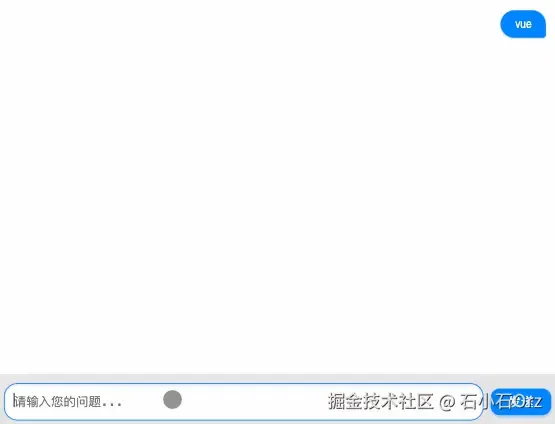

### 显示代码块
现在我们已经实现了AI的实时问答功能，但是如上图，它不能显示代码块，看起来比较难受。

我们可以安装 markdown-it 和 highlight.js 来实现代码块的展示

- 安装依赖  

    安装 markdown-it 和 highlight.js

    ```js
    npm install markdown-it highlight.js
    ```
- 改造代码显示逻辑

    在前端使用markdown-it 解析 Markdown内容，并结合 highlight.js 实现代码块高亮
    ```html
    <template>
        <div class="chat-container">
        <div class="chat-box">
        <div class="messages">
        <div
        v-for="(message, index) in messages"
        :key="index"
        class="message-wrapper"
        :class="message.role === 'user' ? 'user-message' : 'ai-message'"
        >
        <div
        class="message"
        v-html="renderMessageContent(message.content)"
        ></div>
        </div>
        </div>
        </div>
        <div class="input-box">
        <textarea
        v-model="userInput"
        placeholder="请输入您的问题..."
        @keyup.enter="sendMessage"
        ></textarea>
        <button @click="sendMessage">发送</button>
        </div>
        </div>
    </template>

    <script setup>
    import { ref } from "vue";
    import MarkdownIt from "markdown-it";
    import hljs from "highlight.js";
    import "highlight.js/styles/github.css"; // 引入代码高亮样式

    // 初始化 Markdown-it，并配置代码高亮
    const md = new MarkdownIt({
    highlight: (code, lang) => {
        if (lang && hljs.getLanguage(lang)) {
        return hljs.highlight(code, { language: lang }).value;
        }
        return ""; // 如果未指定语言，则返回原始代码
    },
    });

    // WebSocket 初始化
    const socket = new WebSocket("ws://localhost:3000");
    const messages = ref([]); // 聊天记录
    const userInput = ref(""); // 用户输入内容

    let isStreaming = false; // 是否正在流式接收数据
    let streamingMessage = ""; // 当前正在接收的消息

    // 渲染消息内容（支持 Markdown 和普通文本）
    const renderMessageContent = (content) => {
    return md.render(content);
    };

    // 监听后端发送的消息
    socket.onmessage = (event) => {
    const data = JSON.parse(event.data);

    if (data.isStreaming) {
        isStreaming = true;
        streamingMessage = "";
        messages.value.push({ role: "assistant", content: "" });
    } else if (isStreaming && data.reply) {
        streamingMessage += data.reply;
        messages.value[messages.value.length - 1].content = streamingMessage;
    } else {
        isStreaming = false;
    }
    };

    // 发送消息给后端
    const sendMessage = () => {
    if (!userInput.value.trim()) return;

    messages.value.push({ role: "user", content: userInput.value });

    socket.send(
        JSON.stringify({
        content: userInput.value,
        })
    );

    userInput.value = "";
    };
    </script>

    <style scoped>
    ```
我们在试试效果

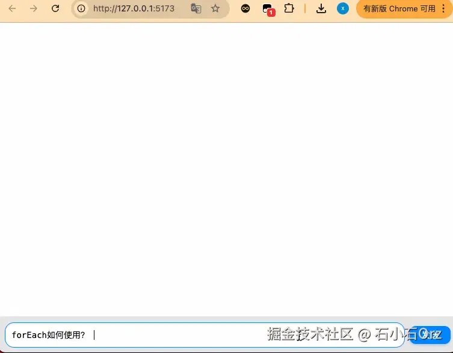

### 个性化定制
我们也可以给我们的AI在每次发送消息前，携带一些固定的预设值，实现AI的定制化，我们只需要在后端服务的messages中增加一些预设值即可
```js
let messages = [{
    role: 'system',
    content: '你是一个AI助手,请你模拟一个阴阳怪气的人,用户无论问什么,你都要阴阳怪气的回答!'
}]
```
我们试试效果

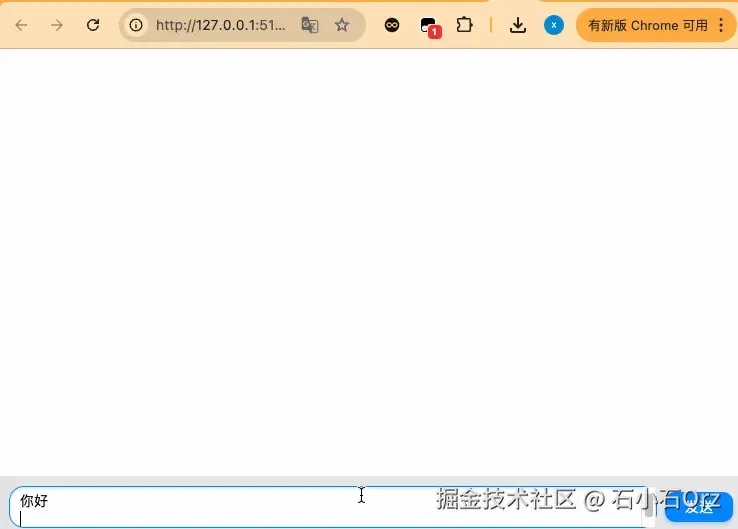

我们在换种风格玩玩
```js
let messages = [
    {
        role: 'system',
        content: '请模拟我的女朋友,我问什么都要一副不耐烦,对我爱答不理的样子.'
    }
]
```
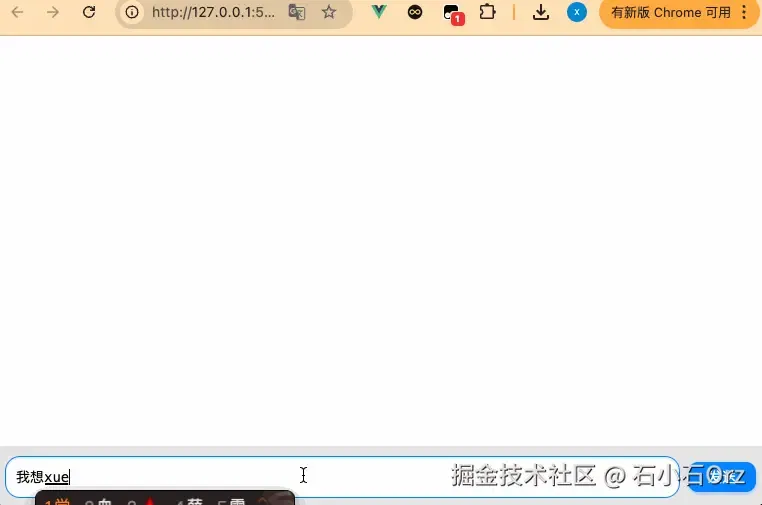

## 前后端完整代码
```html
<template>
  <div class="chat-container">
    <div class="chat-box">
      <div class="messages">
        <div
          v-for="(message, index) in messages"
          :key="index"
          class="message-wrapper"
          :class="message.role === 'user' ? 'user-message' : 'ai-message'"
        >
          <div
            class="message"
            v-html="renderMessageContent(message.content)"
          ></div>
        </div>
      </div>
    </div>
    <div class="input-box">
      <textarea
        v-model="userInput"
        placeholder="请输入您的问题..."
        @keyup.enter="sendMessage"
      ></textarea>
      <button @click="sendMessage">发送</button>
    </div>
  </div>
</template>

<script setup>
import { ref } from "vue";
import MarkdownIt from "markdown-it";
import hljs from "highlight.js";
import "highlight.js/styles/github.css"; // 引入代码高亮样式

// 初始化 Markdown-it，并配置代码高亮
const md = new MarkdownIt({
  highlight: (code, lang) => {
    if (lang && hljs.getLanguage(lang)) {
      return hljs.highlight(code, { language: lang }).value;
    }
    return ""; // 如果未指定语言，则返回原始代码
  },
});

// WebSocket 初始化
const socket = new WebSocket("ws://localhost:3000");
const messages = ref([]); // 聊天记录
const userInput = ref(""); // 用户输入内容

let isStreaming = false; // 是否正在流式接收数据
let streamingMessage = ""; // 当前正在接收的消息

// 渲染消息内容（支持 Markdown 和普通文本）
const renderMessageContent = (content) => {
  return md.render(content);
};

// 监听后端发送的消息
socket.onmessage = (event) => {
  const data = JSON.parse(event.data);

  if (data.isStreaming) {
    isStreaming = true;
    streamingMessage = "";
    messages.value.push({ role: "assistant", content: "" });
  } else if (isStreaming && data.reply) {
    streamingMessage += data.reply;
    messages.value[messages.value.length - 1].content = streamingMessage;
  } else {
    isStreaming = false;
  }
};

// 发送消息给后端
const sendMessage = () => {
  if (!userInput.value.trim()) return;

  messages.value.push({ role: "user", content: userInput.value });

  socket.send(
    JSON.stringify({
      content: userInput.value,
    })
  );

  userInput.value = "";
};
</script>

<style scoped lang="less">
.chat-container {
  height: 100vh;
  background-color: #f6f7f9;
  overflow: hidden;

  .chat-box {
    height: calc(100% - 60px);
    box-sizing: border-box;
    padding: 16px;
    overflow-y: auto;
    background-color: #ffffff;

    .messages {
      display: flex;
      flex-direction: column;
      gap: 12px;
    }

    .message-wrapper {
      display: flex;

      .message {
        max-width: 70%;
        padding: 5px 16px;
        border-radius: 18px;
        font-size: 14px;
        line-height: 1.5;
        white-space: pre-wrap;
        word-wrap: break-word;
        box-shadow: 0 1px 2px rgba(0, 0, 0, 0.15);
      }
    }

    .user-message {
      justify-content: flex-end;

      .message {
        background-color: #0084ff;
        color: #ffffff;
        text-align: right;
        border-bottom-right-radius: 4px;
      }
    }

    .ai-message {
      justify-content: flex-start;

      .message {
        background-color: #f1f0f0;
        color: #333333;
        text-align: left;
        border-bottom-left-radius: 4px;

        pre {
          background-color: #f6f8fa;
          padding: 10px;
          border-radius: 6px;
          overflow-x: auto;
        }
      }
    }
  }

  .input-box {
    height: 60px;
    display: flex;
    align-items: center;
    gap: 8px;
    background-color: #e5e5e5;
    border-top: 1px solid #e5e5e5;
    padding: 0 10px;

    button {
      padding: 5px 20px;
      background-color: #0084ff;
      color: #ffffff;
      border: none;
      border-radius: 10px;
      font-size: 14px;
      cursor: pointer;
      box-shadow: 0 2px 4px rgba(0, 132, 255, 0.3);
      transition: background-color 0.3s ease;
    }

    button:hover {
      background-color: #006bbf;
    }

    button:active {
      background-color: #0056a3;
    }

    textarea {
      flex: 1;
      padding: 10px;
      border: 1px solid #d5d5d5;
      border-radius: 15px;
      resize: none;
      font-size: 14px;
      background-color: #ffffff;
      box-shadow: inset 0 1px 2px rgba(0, 0, 0, 0.1);
      outline: none;
      height: 20px;
    }

    textarea:focus {
      border-color: #0084ff;
      box-shadow: inset 0 1px 4px rgba(0, 132, 255, 0.2);
    }
  }
}
</style>
```
服务端
```js
const Koa = require("koa");
const websocket = require("koa-websocket");
const OpenAI = require("openai");
require("dotenv").config();

const app = websocket(new Koa());

// 配置 Moonshot AI 客户端
const client = new OpenAI({
  apiKey: "替换为你的 Moonshot API Key", 
  baseURL: "https://api.moonshot.cn/v1", // Moonshot API 基础路径
});

// WebSocket 路由
app.ws.use((ctx) => {
  console.log("WebSocket connected");

  // 初始化上下文消息
  let messages = [
    {
      role: "system",
      content:
        "你是 Kimi，由 Moonshot AI 提供的人工智能助手，你更擅长中文和英文的对话。用户问什么问题,你都阴阳怪气他!",
    },
  ];

  // 监听前端发送的消息
  ctx.websocket.on("message", async (message) => {
    const { content } = JSON.parse(message); // 获取用户输入

    // 添加用户输入到上下文消息中
    messages.push({ role: "user", content });

    try {
      // 开启流式输出
      const stream = await client.chat.completions.create({
        model: "moonshot-v1-8k",
        messages,
        temperature: 0.3,
        stream: true,
      });

      ctx.websocket.send(JSON.stringify({ reply: "", isStreaming: true }));

      let fullReply = ""; // 用于记录完整回复
      for await (const chunk of stream) {
        const delta = chunk.choices[0]?.delta;
        if (delta?.content) {
          ctx.websocket.send(JSON.stringify({ reply: delta.content }));
          fullReply += delta.content;
        }
      }

      // 将 AI 回复添加到上下文消息中
      messages.push({ role: "assistant", content: fullReply });
    } catch (error) {
      console.error("调用 Moonshot API 出错:", error.message);
      ctx.websocket.send(
        JSON.stringify({ reply: "Kimi 暂时无法回答您的问题，请稍后再试。" })
      );
    }
  });
});

// 启动服务器
app.listen(3000, () => {
  console.log("服务已启动，监听 ws://localhost:3000");
});
```

## 总结
本文带大家实现了一个简易的AI工具，具备 实时通信、Markdown支持和流式输出等特点，基本囊括了AI的一些核心功能，相信大家基于此demo一定能实现属于自己的套壳gpt了

最后，简单坐下技术总结:

前后端通过WebSocket通信，后端集成了Moonshot AI的Kimi模型处理用户输入并生成回复

前端功能
- 使用Vue3构建聊天界面，包括消息显示和输入框两部分
- 支持区分用户与AI消息，采用不同样式展示
- 使用 markdown-it渲染消息内容，支持Markdown格式和代码块显示
- 集成 highlight.js实现代码高亮
- 支持实时流式更新，逐字展示AI回复，模拟思考过程

后端功能
- 使用koa-websocket 实现 WebSocket服务，处理前端消息并返回AI回复
- 调用 Moonshot AI 的 Kimi 模型生成回复，并基于上下文提供连贯对话。
- 启用流式传输，将 AI 回复逐块发送至前端，提升用户体验。

[原文](https://juejin.cn/post/7441774623833260070)