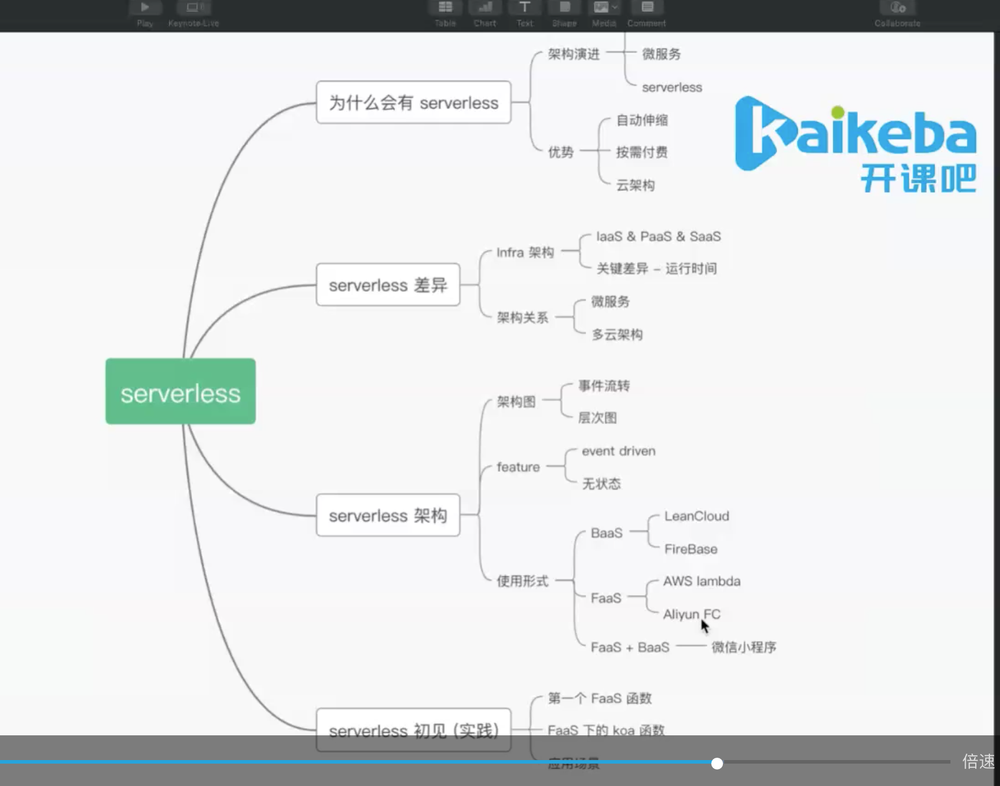
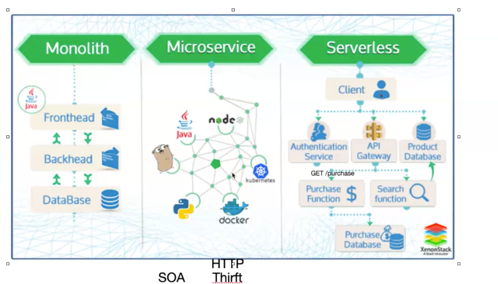
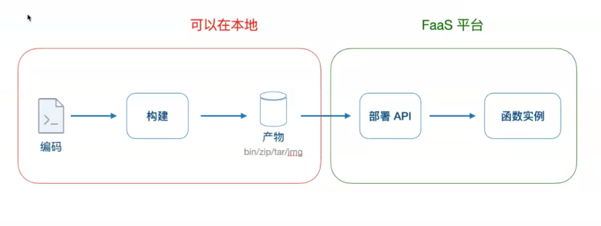
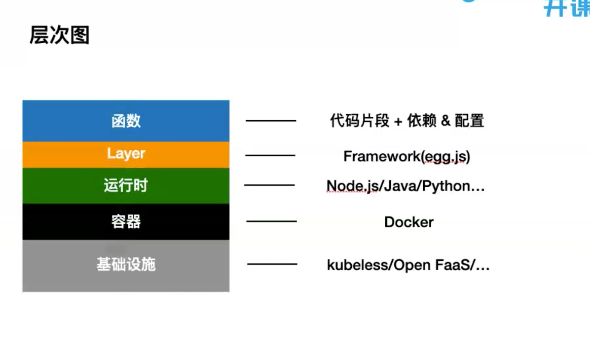
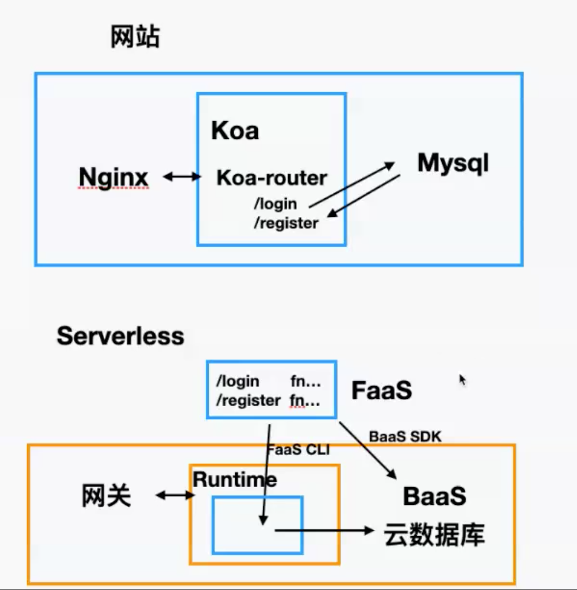
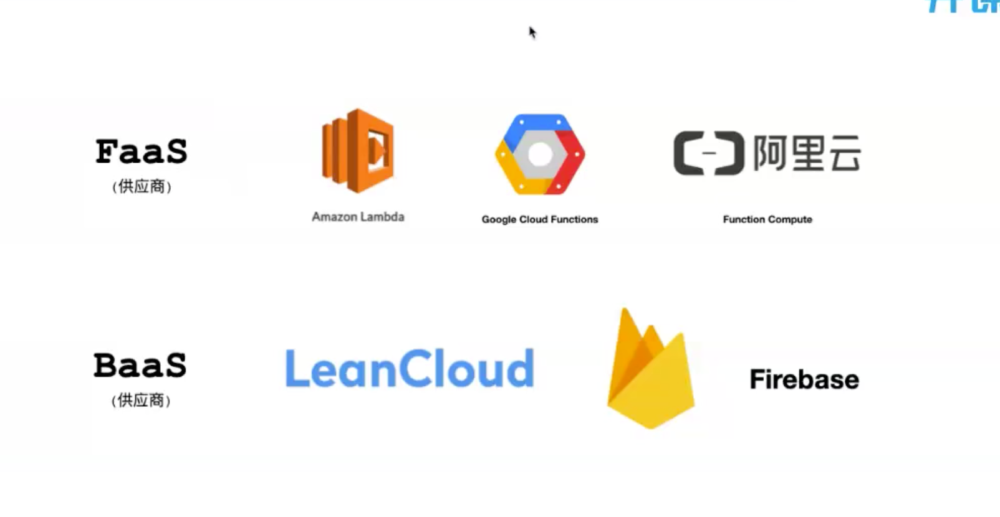
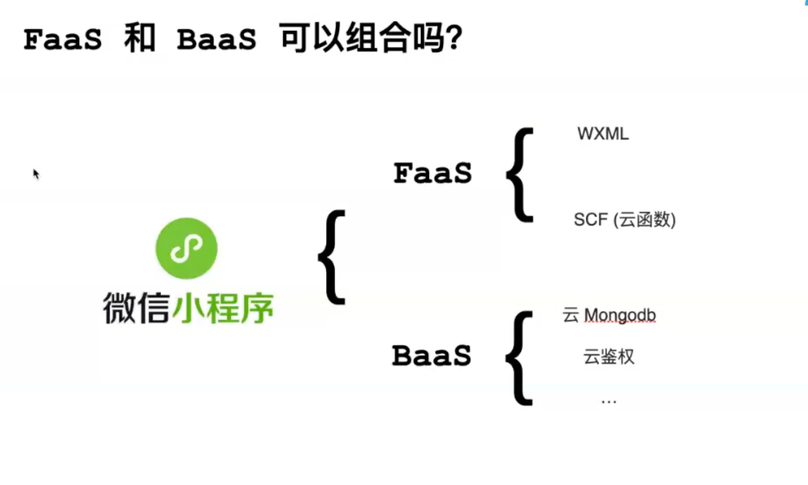
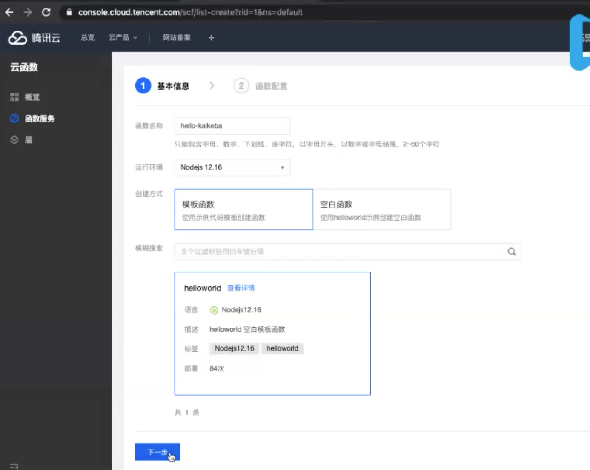

serverless其实是一个代码的部署方式

## 什么是serverless

### 架构演进

单体应用(Application) -> 微服务(Service) -> Serverless应用(云)

**解释**

微服务---拆分、部署、依赖比较麻烦 优势别的服务挂了 不影响自己服务

serverless  放在云(公共服务器) 代码放上去可以直接打包部署

server 服务器   less 不要或少要

假设：一个互联项目就是从零创建并运营一个医院

那么程序员就是医生

代码逻辑就是诊疗方案

1. 开一家诊所(小项目)

单体应用

2. 开一家医院(中大型项目)

微服务

分科室 各自医生 专攻不同方向

3. 未来医疗(未来项目)

网上--诊断--下单--买药

节省成本--无医院化 就近医疗点

#### serverless的优势

无医院医疗  医生值需要思考怎么治病

无服务器应用(serverless)  程序员只需要思考怎么编码

云厂商

1. 自动伸缩
2. 按需付费
3. 云架构

header 1 | header 2
---|---
买地/租门面  | 买租服务器
物业 | IP/域名
水电 | 宽带
消防 | 运维
... | ...

## serverless差异

与传统架构差异

1. IaaS  专门提供场地、物业服务

    与serverless相比，serverless 还提供了弹性服务

2. PaaS   专门提供连锁扩张服务

3. SaaS  基础设计+软件外包服务

    serverless虽然无服务器，代码还是要自己写

:::tip
如果你是一个网站站长，想要建立一个网站。不采用云服务，你所需要的投入大概是：买服务器，安装服务器软件，编写网站程序。
现在你追随潮流，采用流行的云计算，如果你采用IaaS服务，那么意味着你就不用自己买服务器了，随便在哪家购买虚拟机，但是还是需要自己装服务器软件
而如果你采用PaaS的服务，那么意味着你既不需要买服务器，也不需要自己装服务器软件，只需要自己开发网站程序
如果你再进一步，购买某些在线论坛或者在线网店的服务,这意味着你也不用自己开发网站程序，只需要使用它们开发好的程序，而且他们会负责程序的升级、维护、增加服务器等，而你只需要专心运营即可，此即为SaaS。
:::

PaaS | Serverlsss
---|---
专门提供连锁扩张服务  | 自动伸缩服务

如果你的PaaS能够有效的在20毫秒内启动实例并运行半秒，那么就可以称之为serverless---AWS副总裁 Adrian Cockcroft

微服务 | Serverlsss
---|---
模块  | 函数、代码片段
颗粒度  | 细粒度
要运维  | 弱运维

多云 | Serverlsss
---|---
云原声中的一中加购  | 是一种开发部署方式

## Serverless架构

### serverless特性

1. 事件驱动

2. 状态流转

## serverless异同

### serverless 解决方案

编码 = 算法 + 数据结构

应用 = 逻辑 + 存储

1. Faas(逻辑)-- Function as A Service(函数即服务)

2. BaaS(存储)-- Backend as A Service(后端即服务)

Faas | Baas
---|---
Stateless(无状态)  | Statefull(有状态)
代码+依赖配置  | 提供服务API

### 云厂商

## serverless初见

