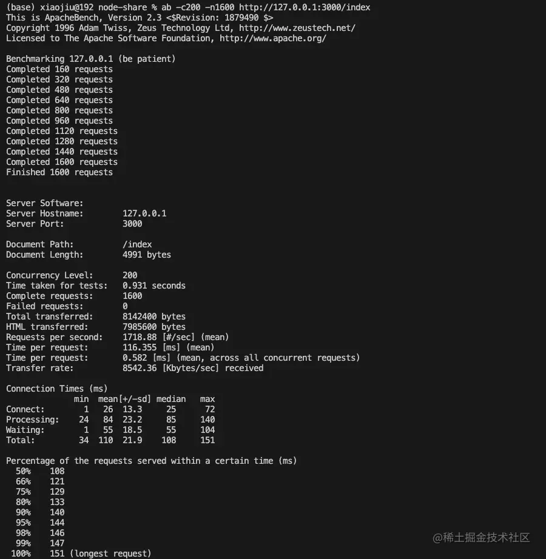
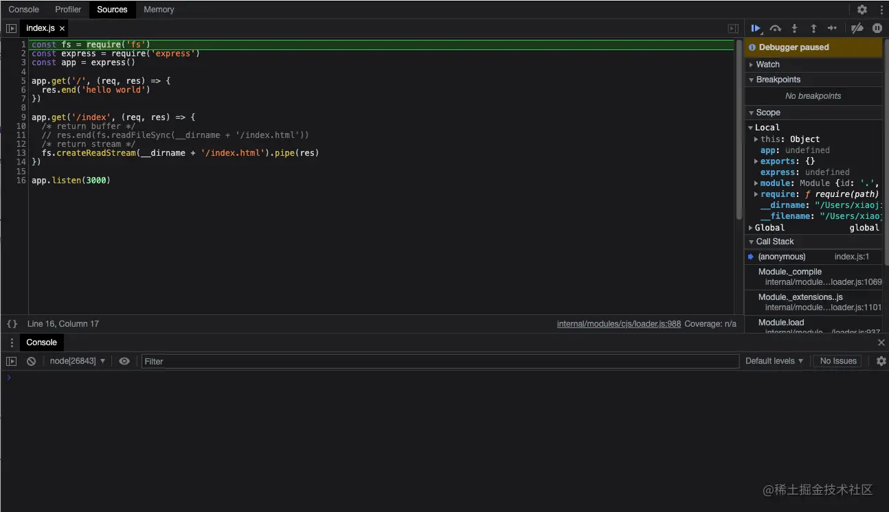
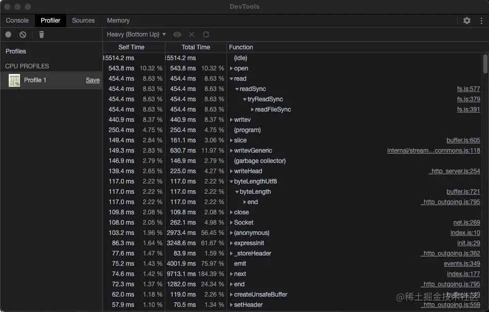
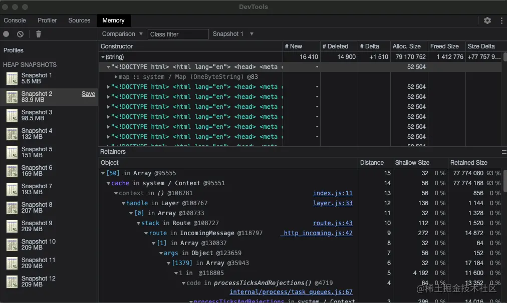

相信对于前端同学而言,我们去开发一个自己的简单后端程序可以借助很多的NodeJS的框架去进行快速搭建，但是从前端面向后端之后，我们会在很多方面会稍显的有些陌生，比如<span style="color:blue">性能分析</span>、<span style="color:blue">性能测试</span>、<span style="color:blue">内存管理</span>、<span style="color:blue">内存查看</span>、<span style="color:blue">使用C++插件</span>、<span style="color:blue">子进程</span>、<span style="color:blue">多线程</span>、<span style="color:blue">Cluster模块</span>、<span style="color:blue">进程守护管理</span>等等NodeJs后端知识，在这里为大家分析一些这些场景和具体实现

## 搭建基础服务
首先我们先来实现一个简单的Http服务器，为了演示方便这里我们使用express，代码如下
```js
const fs = require('fs');
const express = require('express');
const app = express();

app.get('/', (req, res) => {
    res.end('hello world');
})

app.get('/index', (req, res) => {
    const file = fs.readFileSync(__dirname + '/index.html', 'utf-8');
    // return buffer
    res.end(file);
    // return stream
    // fs.createReadStream(__dirname + '/index.html').pipe(res)
})
app.listen(3000);
```
正常情况我们大部分的后端服务是联合db最终返回一些列的接口信息的，但是为了后面的一些测试，这里我们返回了一个文件，因为大一点的返回信息可以直观的感受我们的服务性能和瓶颈。

额外一点，<span style="color: blue">从上面可以看到我们在注释的地方也是用了一个stream流的形式进行了返回，如果我们返回的是文件，第一种的同步读取其实相对更耗时，如果是个大的文件，会在内存空间先去存储，拿到全部的文件之后才会一次返回，这样的性能包括内存占用在文件较大的时候更为明显。所以如果我们做的是ssr或者文件下载之类的东西我们都可以以这样流的形式去做更加高效</span>，至此，我们已经有了一个简单的http服务了，接下来我们对其进行扩展

## 性能测试、压测
首先我们需要借助测试工具模拟在高并发情况下的状态，这里我推荐两种压测工具

- ab[官方文档](https://httpd.apache.org/docs/2.4/programs/ab.html)
- webbench
- autocannon

本次我们使用ab压测工具来进行接下来的操作，所以这里为大家介绍一下ab。ab是apache公司一款工具，mac系统是自带这个工具的，安装教程大家自行去查看，那么mac自带的ab是有并发限制的。

然后我们先随便来一条简单的命令在为大家分析一下具体的参数
```js
ab -c200 -n1600 http://127.0.0.1:3000/index
```
上面这条命令的意思就是测试接口http://127.0.0.1:3000/index 对齐每秒200个请求，并请求总数1600次这样的一个压测，然后我们看看这个工具的其他参数

参数 | 解释
---|---
-c concurrency | 设定并发数，默认并发数是1
-n requests | 设定压测的请求总数
-t timelimit | 设定压测的时长，单位是秒
-p POST-file | 设定POST文件路径，注意设定匹配的-T参数
-T content-type | 设定POST/PUT的数据格式，默认为text/plain
-V | 查看
-w | 以Html表格形式输出

参数并不多很简单，当然我们需要看看压测之后的结果，这才是我们需要的东西



上面的东西其实已经很直观了，最开头的部分就是每秒请求成功了多少个，其实就是请求地址、端口、路径、大小、这些其实不是很重要，我们在浏览器中自己也可以看到，我们主要需要注意的性能指标是下面这些参数

```js
Complete requests:      1600 # 请求完成成功数 这里判断的依据是返回码为200代表成功
Failed requests:        0 # 请求完成失败数
Total transferred:      8142400 bytes # 本次测试传输的总数据
HTML transferred:       7985600 bytes
Requests per second:    2188.47 [#/sec] (mean) # QPS 每秒能够处理的并发量
Time per request:       91.388 [ms] (mean) # 每次请求花费的平均时常
Time per request:       0.457 [ms]  # 多久一个并发可以得到结果
Transfer rate:          10876.09 [Kbytes/sec] received # 吞吐量 每秒服务器可以接受多少数据传输量
```

<span style="color: red">一般而言我们只需要注意最后四条即可，首先可以直观知道当前服务器能承受的并发，同时我们可以知道服务器的瓶颈来自于哪里，如何分析呢？如果这里的吞吐量刚好是我们服务器的网卡带宽一样高，说明瓶颈来自于我们的带宽，而不是来自于其他例如cpn,内存，硬盘等等，那么我们其他的如何查看呢，我们可以借助这两个命令</span>
- <span style="color: blue">top监控计算机cpu和内存使用情况</span>
- <span style="color: blue">iostat检测io设备的代码的</span>

我们就可以使用ab压测的过程中实时查看服务器的状态，看看瓶颈来自于cpu、内存、带宽等等对症下药。

当然存在一种特殊情况，很多场景下Nodejs只能作为BFF这个时候加入我们的Node层能处理600的qps但是后端只支持300，那么这个时候的瓶颈来自于后端。

在某些情况下，负载满了可能也会是NodeJS的计算性能达到了瓶颈，可能是某一处的代码所导致的，我们如何去找到NodeJS的性能瓶颈，这一点我们接下来说

## Nodejs性能分析工具

### profile

NodeJS自带了profile工具，如何使用呢，就是在启动的时候加上**--prof**即可，node --prof index.js，当我们启动服务器的时候，目录下会立马生成一个文件isolate-0x104a0a000-25750-v8.log，我们先不用关注这个文件，我们重新进行一次15秒的压测
```js
ab -c50 -t15 http://127.0.0.1:3000/index
```
等待压测结束后，我们的这个文件就发生了变化，但是里面的数据很长还需要进行解析

使用NodeJS自带的命令 node --prof-process isolate-0x104a0a000-25750-v8.log > profile.txt

这个命令就是把我们生成的日志文件转为txt格式存在当前目录下，并且更为直观可以看到，但是这种文字类型的对我来说也不是足够方便，我们大致说说里面的内容吧，就不上图了，里面包含了，里面有js，c++，gc等等的各种调用次数，占用时间，还有各种的调用栈信息等等，这里你可以手动实现之后看看。

总体来说还是不方便查看，所以我们采用另一种方式。

### chrome devtools
因为我知道NodeJS是基础chrome v8引擎的javascript运行环境，所以我们调试NodeJS也是可以对NodeJS进行调试的。这里我们要使用新的参数--inspect，-brk代表启动调试的同时暂停程序运行，只有我们进入的时候才往下走

```js
node --inspect-brk index.js

(base) xiaojiu@192 node-share % node --inspect-brk index.js
Debugger listening on ws://127.0.0.1:9229/e9f0d9b5-cdfd-45f1-9d0e-d77dfbf6e765
For help, see: https://nodejs.org/en/docs/inspector
```
运行之后我们看到他就告诉我们监听了一个websocket，我们就可以通过这个ws进行调试了。

我们进入到chrome浏览器然后在地址栏输入chrome://inspect


然后我们可以看到other中有一个Target，上面输出了版本，我们只需要点击最后一行的那个inspect就可以进入调试了。进入之后我们发现，上面就可以完完整整看到我们写的源代码了。



并且我们进入的时候已经是暂停状态了，需要我们手动下去，这里和前端调试都大同小异了，相信这里大家都不陌生了。

除此之外，我们可以看到其他几个面板，Console：控制台、Memory：内存监控、Profile：CPU监控，

### CPU监控
我们可以进入到Memory面板,点击左上角的远点表示开始监控，这个时候进行一轮例如上面的15s压测，压测结束后我们店家stop按钮，这个时候就可以生成这个时间段的详细数据，结果如下(Javascript Profiler)



我们也可点击<span style="color:orange">hHeavy按钮</span>切换这个数据展现形式为图表等其他方式，大家自己试试，那么从这个数据中，我们可以得到什么呢？在这其中记录了所有的调用栈，调用时间，耗时等等，我们可以详细的知道，我们代码中每一行或者每一步的花费时间，这样再对代码优化的话是完全有迹可循的，同时我们使用图表的形式也可以更为直观的查看的，当然这里不仅仅可以调试本地的，也可以通过服务器ip在设置中去调试远端服务器的，当然可能速度会相对慢一点，可以自己去尝试。同时我们也可以借助一些其他的三方包，比如clinic，有兴趣的各位可以自己去查看一下。

我们看他的意义是什么呢，当然是分析各个动作的耗时然后对齐进行代码优化了，接下来怎么优化呢？

## 代码性能优化
通过上面的分析，我们可以看到花费时间最长的是readFileSync,很明显是读取代码，那么我们对最初的代码进行分析，可以看到当我们每次访问/index路径的时候都会去重新读取文件，那么很明显这一步就是我们优化的点，我们稍加改造
```js
const fs = require('fs');
const express = require('express');
const app = express();
app.get('/', (req, res) => {
    res.end('hello world');
})

// 提取到外部每次程序只会读取一次，提高性能
const file = fs.readFileSync(__dirname + '/index.html', 'utf-8');
app.get('/index', (req, res) => {
    // return buffer;
    res.end(file);
    // return stream;
    // fs.createReadStream(__dirname + '/index.html').pipe(res);
})
app.listen(3000);
```
为了直观感受，我们在改造前后分别压测一次看看，这里就不上图了，大家可以自己动手，会发现这样的操作可以让你的qps(每秒能处理的并发量)可以直接翻倍，可以看到，这样分析出来的结果，在对代码改造可以提高非常大的效率

同时除此之外，还有一个地方可以优化，<span style="color: blue">我们发现上图我点开的剪头部分byteLengthUtf8这个步骤，可以看出他是获取我们文件的一个长度，因为我们指定了上方的获取格式是utf-8，那么我们想想获取长度是为了什么呢？因为NodeJS的底层是基于C++,最终识别的数据结构还是buffer，所以思路就来了，我们直接为其传递一个buffer是不是就更快了呢？事实确实如此，readFileSync不指定格式的时候默认就是Buffer，当我们去掉指定类型的时候，再去压测，发现qps再次增加了，所以这里我们明白，**在很多操作中使用buffer的形式可以提高代码的效率和性能**</span>

当然还有许多其他的点，那些地方的优化可能就不太容易了，但是我们只需要去处理这些占用大头的点就已经足够了，我们只需要知道去优化的手段与思路，刚刚这个的优化就是把一些需要计算啊或者读取这种需要时间的操作移动到服务启动之前去完成就可以做到一个比较好的性能思想，那么我们性能优化需要考虑哪些点呢？

## 性能优化的准则
- <span style="color: blue">减少不必要的计算:NodeJS中计算会占用相当大的一部分CPU，包含一些文件的编解码等等，尽量避免这些操作</span>
- <span style="color: blue">空间换时间:比如上面这种读取，或者一些计算，我们可以缓存起来，下次读取的时候直接调用</span>

掌握这两点，我们在编码过程中尽量思考某些计算是否可以提前，尽量做到在服务启动阶段去进行处理，把在服务阶段的计算提前到启动阶段就可以做到不错的提升效果

## 内存管理
### 垃圾回收机制
我们都知道javascript的内存管理是由语言自己来做，不需要开发者来做，我们也知道其是通过**GC垃圾回收机制**实现的，我们粗略聊一下，一般来说，垃圾回收机制分为，<span style="color: blue">新生代和老生代两部分，所以新创建的变量都会先进入新生代部分，当新生代内存区域快要分配满的时候，就会进行一些垃圾回收，把无用的变量清除出去给新的变量使用，同时如果一个变量在多次垃圾回收之后依然存在，那么则任务其是一个常用且不会轻易移除的变量，就会将其放入老生代区域，这样一个循环，同时老生代区域容量更大，垃圾回收相对更慢一些</span>

- <span style="color: red">新生代:容量小、垃圾回收更快</span>
- <span style="color: red">老生代:容量大、垃圾回收更慢</span>

所以减少内存的使用也是提高服务性能的手段之一，如果有内存泄露，会导致服务器性能大大降低

### 内存泄露问题处理与修复
刚刚我们上面介绍过Memory面板，可以检测，如何使用呢，点击面板之后点击右上角远点会产生一个快照，显示当前使用了多少内存空间，正常状态呢，我就不为大家演示了，一般如何检测呢，就是在服务启动时截取一个快照，在压测结束后再截取一个看看双方差异，你也可以在压测的过程中截取快照查看，我们先去修改一些代码制造一个内存泄漏的现场，改动如下：
```js
const fs = require('fs');
const express = require('express');
cosnt app = express();
app.get('/', (req, res) => {
    res.end('hello world');
})

const cache = [];
// 提取到外部每次程序只会读取一次，提高性能
const file = fs.readFileSync(__dirname + '/index.html', 'utf-8');
app.get('/index', (req, res) => {
    /* return buffer */
  cache.push(file)
  res.end(file)
  /* return stream */
  // fs.createReadStream(__dirname + '/index.html').pipe(res)
})
app.listen(3000);
```
我们每次请求都把读取的这个文件添加到cache数组，那么意味着请求越多，这个数组将会越大，我们和之前一样 ，先打开调试，同时截取一份快照，然后开始压测，压测结束再截图一份，也可以在压测过程中多次截图，得到如下：



我们在压测过程中不断截取快照发现内存一直在加大，这就很直观的可以看到内存泄露，而且因为我们的文件不大，如果是一个更大的文件，会看起来差异更悬殊，然后我们点击然后我们点击Comparsion按钮位置，选择完快照之后进行比较，然后点击占用最大的那一列，点击之后我们就能看到详细信息了，此次泄漏就是cache变量所导致的，对齐进行修复即可，在我们知道如何修复和检测内存泄漏之后，我们就应该明白，减少内存的使用是提高性能的一大助力，那么我们如何减少内存的使用呢？

### 控制内存使用
在此之前我们聊聊NodeJS的Buffer的内存分配策略，他会分为两种情况，一种是小于8kb的文件，一种是大于8kb的文件，小于8kb的文件NodeJS认为频繁的去创建没有必要，所以每次都会先创建一个8kb的空间，然后得到空间之后的去计算buffer的占用空间，如果小于8kb就在8kb中给它切一部分使用，依次内推，如果遇到一个小于8kb的buffer使余下的空间不够使用的时候就会去开辟新的一份8kb空间，在这期间，如何有任何变量被销毁，则这个空间就会被释放，让后面的使用，这就是NodeJs中Buffer的空间分配机制，这种算法类似于一种池的概览。如果在我们的编码中也会遇到内存紧张的问题，那么我们也可以采取这种策略。

至此我们对于内存监控已经查找已经学会了，接下来我们来看看多进程如何使用与优化

## Node多进程使用优化
现在的计算机一般都搭载了多核的cpu，所以我们在编程的时候可以考虑怎么使用多进程或多线程来尽量利用这些cpu来提高我们的性能。

在此之前，我们要先了解一下进程和线程的概览
- <span style="color: red">进程: 拥有系统挂载运行程序的单元 拥有一些独立的资源，比如内存空间</span>
- <span style="color: red">线程: 进行运算调度的单元 进程内的线程共享进程内的资源，一个进程是可以用有多个线程的</span>

在NodeJS中一般启动一个服务会有一个主线程和四个子线程，我们简单理解其概览呢，可以把进程当做一个公司，线程当做公司的职工，职工共享公司的资源来进行工作

<span style="color: blue">在NodeJS中，主线程运行v8与Javascript，主线程相当于公司老板负责主要流程和下发各种工作，通过事件循环机制、Libbuv再由四个子线程工作</span>

因为js是一门单线程的语言，它正常情况下只能使用到一个cpu，不过其子线程在 底层也使用到了其他cpu，但是依然没有完全解放多核的能力，当计算任务过于繁重的时候，我们就可以也在其他的cpu上跑一个javascript的运行环境，那么我么先来看看如何用子进程来调用吧
## 进程的使用child_process
我们创建两个文件，master.js和child.js，并且写入如下代码
```js
// master.js
// 自带的子进程模块
const cp = require('child_process');
// fork一个地址就是启动了一个子进程
const child_process = cp.fork(__dirname + '/child.js');
// 通过send方法给子进程发送消息
child_process.send('主进程发这个消息给子进程');
// 通过 on message 响应接收到子进程消息
child_process.on('message', str => {
    console.log('主进程:接收到来自子进程的消息', str)
})

// child.js
// 通过 on message 响应父进程传递的消息
process.on('message', str => {
    console.log('子进程，收到消息', str);
    // process是全局变量，通过send发送给父进程
    process.send('子进程发送主进程消息');
})
```
如上，就是一个使用子进程的简单实现了，看起来和ws很像。每fork一次便可以开启一个子进程，我们可以fork多次，fork多少个合适呢，我们后面再说

### 子线程 worker Threads
在V10版本之后，NodeJS也提供了子线程的能力，在官方文档中解释到，官方认为自己的事件循环机制已经做的够好足够使用了，就没必要为开发者提供这个接口，并且在文档中写到，它可以对计算有帮助，但是对IO操作是没有任何变化的，有兴趣可以去看看这个模块，除此之外，我们可以有更简单的方式去使用多核的服务，接下来我们聊聊内置模块cluster

## Cluster模块
在此之前我们来聊聊NodeJS的部署，熟悉NodeJS的同学应该都使用过PM2，利用其可以进程提高部署的性能，其实现原理就是基于这个模块;如果我们可以在不同的核分别去跑一个http服务，那么是不是类似于我们后端的集群，部署多套服务呢？当客户端发送一个Http请求的时候进入到我们的master node，当我们收到请求的时候，我们把其请求发送给子进程，让子进程自己处理完之后返回给我，由主进程将其发送回去，那么这样我们是不是就可以利用服务器的多核呢？答案是肯定的，同时这些都不需要我们做过多的东西，这个模块就帮我们实现了，然后我们来实现一个这样的服务，我们创建两个文件app.js、cluster.js，第一个文件呢就是我们日常的启动文件，我们来简单的，使用我们最开始的那个服务既可
```js
// cluster.js
const cluster = require('cluster');

// 判断如果是主线程那么就启动三个子线程
if(cluster.isMaster) {
    cluster.fork();
    cluster.fork();
    cluster.fork();
} else {
    // 如果是子进程就去加载启动文件
    require('./index.js')
}
```
<span style="color: blue">就这样简单的代码就可以让我们的请求分发到不同的子进程里面，这一点类似于负载均衡，非常简单，同时我们在启用多进程和没启动的前后分别压测，可以发现启用后的qps是前者的2.5倍拥有很大的一个提升了，也可以知道进程直接的通信是损耗的，不然应该就是三倍了， 那么我们要开启多少个子进程比较合适呢。我们可以使用内置模块OS,来获取当前计算机的CPU核数的，我们加一点简单的改造</span>

```js
const cluster = require('cluster');
const os = require('os');

if(cluster.isMaster) {
    // 多少个cpu就启动多少个子进程
    for(let i = 0; i < os.cpus().lengh; i++) cluster.fork();
} else {
    // 如果是子进程就去加载启动文件
    require('./index.js')
}
```
这样我们就可以准确知道计算机有多少个cpu我们最多可以启动多少个子进程了，这时我们进行压测发现qps更多了，<span style="color: red">当然并不是启动的越多就越好，前面我们说到。NodeJS的底层是用到了其他cpu的，所以我们这里一般来说只需要 os.cpus().length /2 的数量最为合适</span>，就这么简单我们就使用到了其他cpu实现了一个类似复杂均衡概念的服务

当然这里有一个疑问，我们手动启动了多次 node app.js为什么不行？很明显会报错端口占用，我们知道，正常情况下计算机的一个端口只能被监听一次，我们这里监听了多次实际就是有NodeJS在其底层完成的，这里的实现就相对复杂需要看源码了，有兴趣的同学可以自己去研究一下。

如果你做完这些操作，相信你的服务性能已经提高了很大一截了。接下来我们来聊聊关于其稳定性的安全。
## NodeJS进程守护与管理
基本上各种NodeJS框架都会有全局捕获错误，但是一般自己去编码的过程中没有去做try catch的操作就可能导致你的服务直接因为一个小错误直接挂掉，为了提高其稳定性，我们要去实现一个守护，我们用原生的node来创建一个服务，不做异常处理的情况下，如果是框架可能很多框架已经帮你做过这部分逗你了，所以我们自己来实现看看吧
```js
const fs = require('fs');
const http = require('http');

const app = http.createServer((req, res) => {
    res.writeHead(200, {'content-type': 'text/html'});
    console.log(window.xxx)
    res.end(fs.readFileSync(__dirname + './index.html', 'utf-8'))
})

app.listen(3000, () => {
    console.log(`listen in 3000`)
})
```
我们在请求时区打印一个不存在的变量，我们去请求的话就会进行一个报错，同时进程直接退出，而我们如果使用多线程启动的话，也会在我们请求多线程的个数之后，主线程退出，因为主线程发现所有子线程全部挂掉了就会退出，基于这种文件我们不希望发生，我们怎么做可以解决呢？内置了一个 **uncaughtException** 可以用来捕获错误，但是官方建议不要再这里组织退出程序，但是我们可以退出程序钱对其进行错误上报，我们对 cluster.js 进行轻微改造既可，同事我们也可以通过cluster模块监控，如果有的时候发生错误导致线程退出了我们也可以进行重启，改下如下
```js
const cluster = require('cluster');
const os = require('os');

if(cluster.isMaster) {
    // 多少个cpu启动多少个子进程
    for(let i = 0; i < os.cpus().length; i++) cluster.fork();

    // 如果有程序退出了，我们就重启一个
    cluster.on('exit', () => {
        setTimeout(() => {
            cluster.fork();
        }, 5000)
    })
} else {
    // 如果是子进程就去加载启动文件
    require('./index.js');
    process.on('uncaughtException', err => {
        console.error(err);
        // 进程错误上报
        process.exit(1);
    })
}
```
如上我们就可以在异常错误的时候重启线程并异常上报，但是这样会出现一个问题，如果重复销毁创建线程可能会进入死循环，我们不确定这个线程的退出是不是可以挽救的情况，所以我们还需要对齐进行完善，首先我们可以在全局监控中判断其内存使用的情况，如果大于我们设置的限制就让其退出程序。我们做如下改造防止内存泄漏导致的w无限重启
```js
else {
    // 如果是子进程就去加载启动文件
    require('./index.js');
    process.on('uncaughtException', err => {
        console.error(err);
        // 进程错误上报
        // 若果进程内存大于xxxx了就让其退出
        if(process.memoryUsage().rss > 734003200) {
            console.log('大于700m,退出程序吧');
            process.exit(1)
        }
        // 退出程序
        process.exit(1)
    })
}
```
这样呢我们就可以对内存泄漏问题进行处理了，同时我们还得考虑一种情况，如果子线程假死了怎么办，僵尸进程如何处理？
## 心跳检测，杀掉僵尸进程
实现这个的思路并不复杂，和我们日常做ws类似，主进程发心跳包，子进程接收并回应心跳包，我们分别改造两个文件
```js
const cluster = require('cluster');
const os = require('os');

if(cluster.isMaster) {
    // 多少个cpu启动多少个子进程
    for(let i = 0; i < os.cpus().length; i++) {
        let timer = null;
        // 记录每一个worker
        const worker = cluster.fork();

        // 记录心跳次数
        let missedPing = 0;
        // 每5秒发送一个心跳包，并记录次数加1
        timer = setInterval(() => {
            missedPing++;
            worker.send('ping');

            // 如果大于5次都没有得到响应说明可能挂掉了就退出，并清楚计时器
            if(missedPing > 5) {
                process.kill(worker.process.pid);
                worker.send('ping');
                clearInterval(timer);
            }
        }, 5000)

        // 如果接收到心跳响应就让记录-1回去
        worker.on('message', msg => {
            msg === 'pong' && missedPing--;
        })
    }
    // 如果有线程退出了，我们就重启一个
    cluster.on('exit', () => {
        cluster.fork();
    })
} else {
    // 如果是子进程就去加载启动文件
    require('./index.js');

    // 心跳回应
    process.on('message', msg => {
        msg === 'ping' && process.send('pong');
    })

    process.on('uncaughtException', err => {
        console.error(err);
        // 进程错误上报
        // 如果程序内存大于xxxm了就让其退出
        if(process.memoryUsage().rss > 734003200) {
            console.log('大于700m了，退出程序吧');
            process.exit(1);
        }
        // 退出程序
        process.exit(1);
    })
}
```
介绍一下流程

- 主线程每隔五秒发送一个心跳包ping，同时记录上发送次数+1，时间根据自己而定 这里五秒是测试方便
- 子线程接收到了ping信号回复一个pong
- 主线程接收到了子线程响应让计算数-1
- 如果大于五次都还没响应可能是假死了，那么退出线程并清空定时器，

至此一个健壮的NodeJs服务已经完成了。


## 资料
[「NodeJs进阶」超全面的 Node.js 性能优化相关知识梳理](https://juejin.cn/post/7095354780079357966#heading-7)