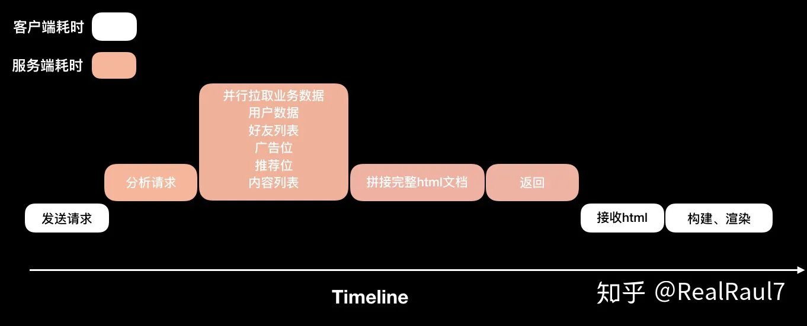
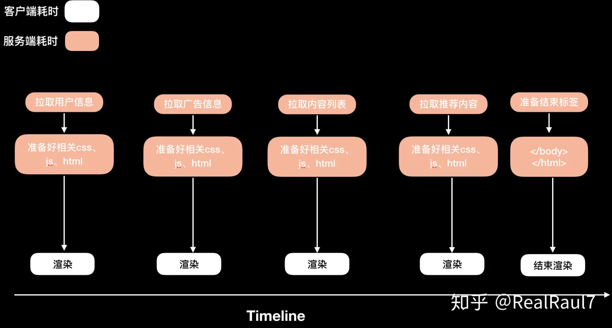

## 什么是bigPipe
bigpipe是由facebook提出来的一种动态网页加载技术。它将网页分解成为pagelets的小块，然后分块传输到浏览器端，进行渲染。他可以有效的提升首屏渲染时间。

为了说清楚什么是bigPipe，先需要介绍下目前的常规渲染方式，以及可以进行优化的方向

## 网页首屏加载方案
> 首屏加载方案指的是在服务端已经吐出页面的方案,也就是说有SSR的方案，那些纯客户端渲染的方案不做比较，因为他们没有首屏要求

现在的网页首屏加载方案一般会经过以下阶段
1. 发送http请求到服务端
2. 服务端接收到并分析请求
3. 服务端根据请求从存储层获取相关数据，这里可能会比较耗时，比如如果首页涉及多个模块(广告位、推荐、内容列表、用户信息、好友列表等)
4. 服务端准备好所有内容，拼接成完成的html文档
5. 发送会客户端
6. 客户端接受完整的html文档
7. 构建dom、cssdom、生成render tree,渲染出指定页面

以上方案的缺点是，当2、3、4、5步在服务端进行的时候，浏览器只能傻傻得等待，做不了任何事情

而且第3步并行拉取业务数据在某些场景下(模块多，业务场景复杂),是会占用比较多的时间的。而且只要其中某个模块的数据如果拉取较慢，会拖慢整个首屏的显示。

更糟糕的情况下，某些模块数据相互依赖，导致需要串行拉取数据，那造成的浏览器的等待则会更久

## 优化方案
以上方案在一些服务端渲染页面中相当常见，不足之处也很明显

而bigPipe就是针对第3、4步进行优化，让服务端在准备好某个模块的数据后，立马返回给客户端显示，而不必要等待完整的数据和html生成，在发送给客户端

客户端在接受到某一部分内容后，就可以开始渲染，显示执行(这里可以动态请求需要的css,js等等)

如下图，客户端拉取业务数据和客户端渲染页面可以并行。如果某一部分比如广告信息拉取超时，也并不影响其他部分率先显示

这样，一个完整的页面就可以拆分成多个部分，分块渲染，而无需等到拿到完整的页面返回，在渲染。要知道，如果要等到完整页面返回，在这之前，浏览器只能是一片空白！

## 关键技术和原理
想要实现以上优化方案，可以利用现成的技术，所以有比较好的兼容性

### 1.分段传输
bigPipie依赖于分段传输html页面，所以这是实现bigPipe的一个基础

- http1.1

    如果在http1.1版本实现，那需要设置Transfer-Encoding为chunked，也就是分块传输编码。

    关于分块传输编码：

    分块传输编码允许服务器为动态生成的内容维护HTTP持久连接。在这种情况下，HTTP Content-Length头来分割内容和下一个HTTP请求/响应，因为内容大小未知

    分块编码的好处是，在返回客户端前不必生成完整的内容,因为它允许将内容作为分块进行流式处理，并明确地发出内容结尾的信号，从而使连接用于下一个HTTP请求/响应

    在头部加入 Transfer-Encoding: chunked 之后，就代表这个报文采用了分块编码。这时，报文中的实体需要改为用一系列分块来传输。

    每个分块包含十六进制的长度值和数据，长度值独占一行，长度不包括它结尾的 CRLF(\r\n)，也不包括分块数据结尾的 CRLF。

    最后一个分块长度值必须为 0，对应的分块数据没有内容，表示实体结束

- http2

    如果你使用的是http2，那则无需设置Transfer-Encoding为chunked，因为http2本身就是支持分开传输协议

## 资料
[bigPipe 原理分析](https://zhuanlan.zhihu.com/p/82398532)

[前端页面优化之bigpipe](https://blog.csdn.net/weixin_34291004/article/details/90620893)