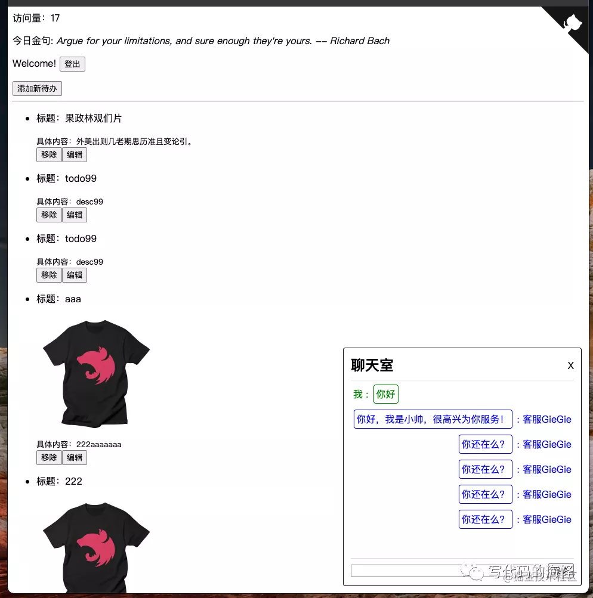
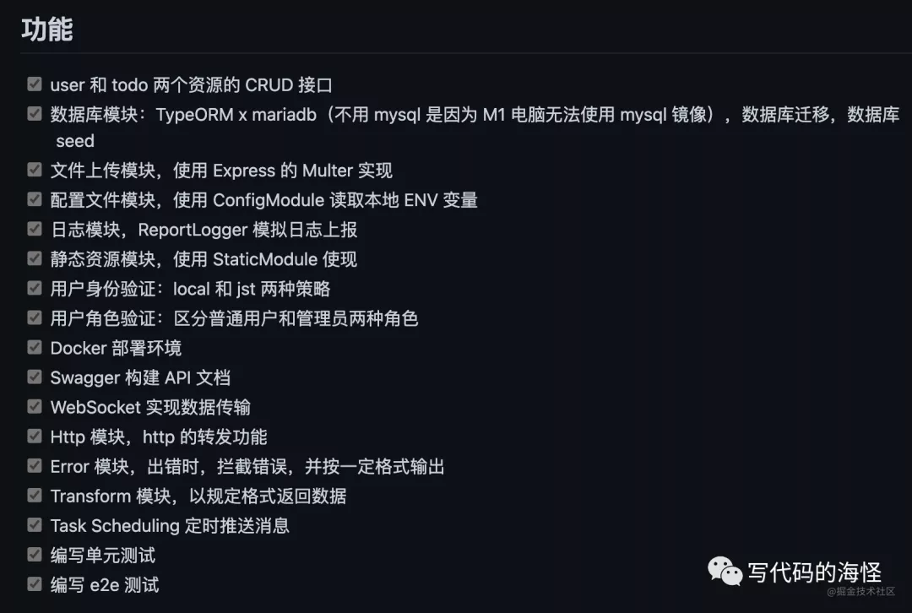
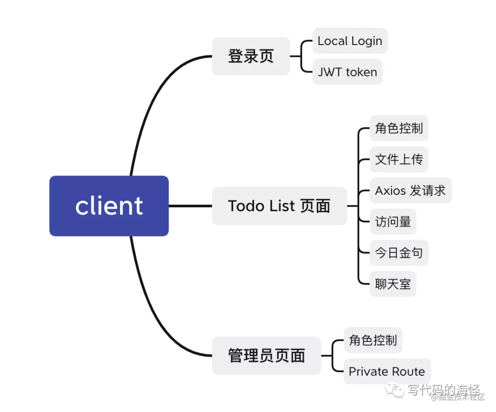
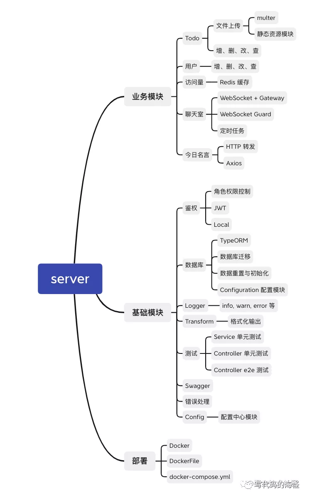

## 前言
[nest-todo项目](https://github.com/haixiangyan/nest-todo)



虽然皮肤很丑，但是项目里包含了大量Nest.js文档里的知识点(除了GrphQL和微服务，这部分平常用的不多就不整了)，能实现的点基本都想个需求实现了



## 为什么
为什么要做这个项目呢？市面上的文章和博客看了不少，很多都是浅尝辄止，写个就CRUD(增删改查)完事了，也太easy了,一行nest g resourece就搞定了。所以就想实现一个大而全的Nest.js的demo出来。

除此之外，这个Demo还能给很多要马上上手的前端一个示范。虽然Nest.js文档也很期权，但是如果你稍微做重一点的业务，它就有些顶不住了，很多东西都要试，这个时候nest-todo就可以站出来说：不会就抄我吧，我肯定能work

## 前端
前端部分主要是使用React来实现，仅有0.00001%的样式，几乎都是JS逻辑，且有100%TypeScript类型提示，可大胆的学习观看

由于本项目以后端为主，所以前端也只有这些东西



## 后端
后端内容则比较多了，主要上就是nest.js，以及非常多的模块



下面例举几个觉得比较重要的模块来说说吧，当然下面的都是一些代码片段，想了解更具体的实现，可以到GitHub的nest-todo查看

## Todo模块
最基础的增、删、改、查。相信很多人在一些博客或者文章都见过这样的写法

TodoController负责路由实现

```TypeScript
@ApiTags('待办事项')
@ApiBearerAuth()
@Controller('todo')
export class TodoController {
    constructor(private readonly todoService: TodoService) {}

    @Post()
    async create(
        @Request() request,
        @Body() createTodoDto: CreateTodoDto,
    ): Promise<Todo> {
        return this.todoService.create(request.user.id, createTodoDto);
    }

    @Get()
    async findAll(@Request() request): Promise<Todo[]> {
        const { id, is_admin } = require.user;

        if (is_admin === 1) {
            return this.todoService.findAll();
        } else {
            return this.todoService.findAllByUserId(id);
        }
    }

    @Get(':id')
    async findOne(@Param('id', ParseIntPipe) id: number): Promise<Todo> {
        return this.todoService.findOne(id);
    }

    @Patch(':id')
    async update(
        @Params('id', ParseIntPipe) id: number,
        @Body() updateTodoDto: UpdateTodoDto,
    ) {
        await this.todoService.update(id, updateTodoDto);
        return updateTodoDto;
    }

    @Delete(':id')
    asycn remove(@Param('id', ParseIntPipe) id: number) {
        await this.todoService.remove(id);
        return { id }
    }
}
```
而TodoService则实现更底层的业务逻辑，这里则要从数据库增、删、改、查：


## 资料
[原文](https://mp.weixin.qq.com/s/DV6k2IbFgz9tyxc9SEaO3w)

[如何选择正确的Node框架：Next, Nuxt, Nest?](https://segmentfault.com/a/1190000019067086)