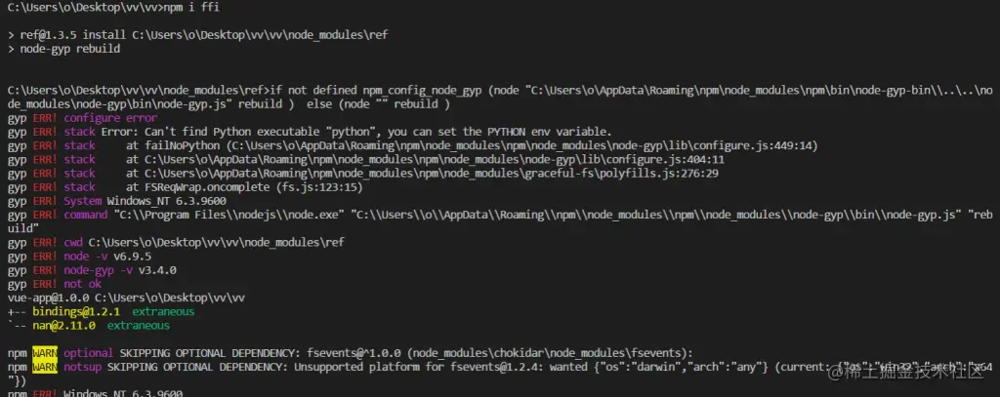

## 为什么要用node.js调用dll
公司项目采用Electron([electronjs.org/](https://electronjs.org/)开发pc应用，会设计到底层硬件设备的通信，所以sdk封装基本上都是通过C++动态链接库dll实现
### 有两种方案可供选择
- <mark>方案一: 使用node-ffi</mark>
- <mark>方案二:使用C++编写一个node addon,通过LoadLibrary调用dll</mark>

以上两种方案都可以解决dll调用问题，方案选型要个人对C++的掌握程序，如果熟悉C++开发，可以直接选择方案二。如果完全不了解C++,那么只能采用方案一

## 什么是node-ffi
[https://www.npmjs.com/package/ffi%EF%BC%89](https://www.npmjs.com/package/ffi%EF%BC%89)

node-ffi是使用纯javascript加载和调用动态库的node addon，它可以用来在不写任何C++代码的情况下调用动态链接库的api接口

ffi究竟干了什么？ 其实他本质上还是一个编译后的Node

addon,node_modules/ffi/build/Release/ffi_bindings.node， ffi_bindings.node就是一个addon ffi充当了nodejs和dll之间的桥梁。

下面一个简单的加载dll的demo实例
```js
var ffi = require('ffi');
var libpath = path.join(__dirname, '/test.dll');
var testLib = ffi.Libary(libpath, {
    'start': ['bool', ['bool']]
})
testLib.start(true); // true
```
## 安装node-ffi
```js
npm install ffi
```
如果本地没有安装编译node addon的环境会报错 如下图所示


无论是使用ffi，还是直接写node addon， 都缺少不了编译node Addon这个步骤，要编译node addon,有两种方法

### 1. [node-gyp](https://www.npmjs.com/package/node-gyp)
```js
npm install node-gyp
```
[具体安装方法](https://github.com/nodejs/node-gyp#installation%E3%80%82)

### 2. [electron-rebuild](https://www.npmjs.com/package/electron-rebuild)
如果采用electron开发应用程序，electron同样也支持node原生模块，但由于和官方的node相比使用了不同的V8引擎，如果你想编译原生模块，则需要手动设置electron的headers的位置。

<span style="color: red">electron-rebuild为多个版本的node和electron提供了一种简单发布预编译二进制原生模块的方法</span>。它可以重建electron模块，识别当前electron版本，帮你自动完成了下载header、编译原生模块等步骤。一个下载electron-rebuld并重新编译的例子 

```bash
npm install --save-dev electron-rebuild

# 每次运行"npm install"时，也运行这条命令
./node_modules/.bin/electron-rebuild

# 在windows下如果上述命令遇到了问题，尝试这个：
.\node_modules\.bin\electron-rebuild.cmd
```
这里需要注意nodejs版本问题，nodejs平台必须跟dll保持一致，同样是32位或者64位，如果两者不一致，会导致调用dll失败。

成功安装ffi模块之后，就可以开始我们下面的ffi调用dll的实例应用。

## 应用举例
在开发需求中，需要调用基于C++编写的TCP数据转发服务的SDK

首先我们来看一下dll头文件接口声明的代码如下：
```js
#ifndef JS_CONNECTION_SDK
#define JS_CONNECTION_SDK


#ifdef JS_SDK
#define C_EXPORT __declspec(dllexport)
#else
#define C_EXPORT __declspec(dllimport)
#endif


extern "C"
{
    typedef void(*ReceiveCallback) (int cmd, int seq, const char *data);

    /*设置读取数据回调*/
    C_EXPORT void _cdecl SetReceiveCallback(ReceiveCallback callback);

    /*
    *设置option
    */
    C_EXPORT void _cdecl SetOption(
        const char* appKey, 
        const char* tk,
        int lc, 
        int rm
    );

    /*
    *创建连接
    */
    C_EXPORT bool _cdecl CreateConnection();

    /*发送数据*/
    C_EXPORT bool _cdecl SendData(int cmd, int seq, const char *data, unsigned int len);

    /*释放连接*/
    C_EXPORT void _cdecl ReleaseConnection();
}

#endif
```
ffi调用dll模块封装，代码如下
```js
try {
    const ffi = require('ffi');
    const path = require('path');
    const Buffer = require('buffer').Buffer;
    const libpath = path.join(APP_PATH, '..', '..', '/testSDK.dll');

    const sdkLib = ffi.Library(libpath, {
        'CreateConnection': ['bool', []],
		'SendData': ['bool', ['int', 'int', 'string', 'int']],
		'ReleaseConnection': ['void', []],
		'SetOption': ['void', ['string', 'string', 'int', 'int']],
		'SetReceiveCallback': ['void', ['pointer']]
    })
    module.exports = {
        createConnection: function() {
            sdkLib.CreateConnection();
        },
        setReceiveCallback(cb) {
            global.setReceiveCallback = ffi.Callback('void', ['int', 'int', 'string'], function(cmd, seq, data){
				cb && cb(cmd, seq, data && JSON.parse(data));
			});
			sdkLib.SetReceiveCallback(global.setReceiveCallback);
        },
		sendData: function(cmd, seq, data){
			data = JSON.stringify(data);
			sdkLib.SendData(cmd, seq, data, data.replace(/[^\x00-\xff]/g, '000').length, 0);
		},
		releaseConnection: function(){
			sdkLib.ReleaseConnection();
		},
		setOption: function (option) {
			sdkLib.SetOption(
				option.appKey,
				option.tk,
				option.lc,
				option.rm
			);
		}
    }
} catch(error) {
    log.info(error);
}
```
### 第一步 通过ffi注册dll接口
```js
const sdkLib = ffi.Library(libpath, {
    'CreateConnection': ['bool', []],
    'SendData': ['bool', ['int', 'int', 'string', 'int']],
    'ReleaseConnection': ['void', []],
    'SetOption': ['void', ['string', 'string', 'int', 'int']],
    'SetReceiveCallback': ['void', ['pointer']]
});
```
ffi.Library方法，第一个参数传入dll路径，第二参数JSON对象配置相关接口

<mark>key对应dll文件中输出的接口，例如C_EXPORT bool _cdecl CreateConnection()；</mark>

<mark>value array配置参数类型，array[0]注册接口函数返回值类型，array[1]注册接口函数传入形参类型。</mark>

1. 基础参数类型bool, char, short, int, long等。

2. 指针类型，需要引入ref模块，如下：

    ```js
    var ref = require('ref');
    var intPointer = ref.refType('char');
    var doublePointer = ref.refType('short');
    var charPointer = ref.refType('int');
    var stringPointer = ref.refType('long');
    var boolPointer = ref.refType('bool');
    ```
3. 回调函数指针pointer，可以通过ffi.Callback创建，如下：

    ```js
    global.setReceiveCallback = ffi.Callback('void', ['int', 'int', 'string'], function(cmd, seq, data){
		cb && cb(cmd, seq, data && JSON.parse(data));
	});
    sdkLib.SetReceiveCallback(global.setReceiveCallback);
    ```
回调函数参数类型配置与dll接口参数类型配置相同，这里就不多说。

这里需要注意一点，回调函数可能会被JavaScript垃圾自动回收机制回收，所以我这里是把回调函数挂载到全局对象global上。
### 第二步接口调用
通过ffi.Library(libpath, {...})注册接口，可以直通过返回的sdkLib对象调用对接的接口。例如：
```js
var bool = sdkLib.CreateConnection();
console.log(bool); // true or false;

var cmd = 0, seq = 0, data = {...};
var dataStr = JSON.stringify(data);
// JavaScript中文字符长度在C++中长度计算要*3
sdkLib.SendData(cmd, seq, data, data.replace(/[^\x00-\xff]/g, '000').length);

global.setReceiveCallback = ffi.Callback('void', ['int', 'int', 'string'], function(cmd, seq, data){
	cb(cmd, seq, data && JSON.parse(data));
});
sdkLib.SetReceiveCallback(global.setReceiveCallback);

```

## 资料
[原文](https://juejin.cn/post/6844903680622198797)

[node js 怎么调用c++ ?](https://blog.csdn.net/liuxunfei15/article/details/125559440)

[node.js调用C++函数的方法示例](https://www.jb51.net/article/147831.htm)

[nodejs调用C++动态链接库FFI](https://www.jianshu.com/p/c0802ad1fb57)

[官网](https://www.nodeapp.cn/addons.html)