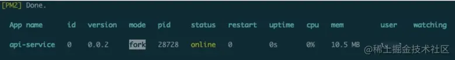
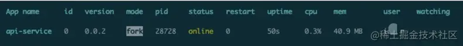
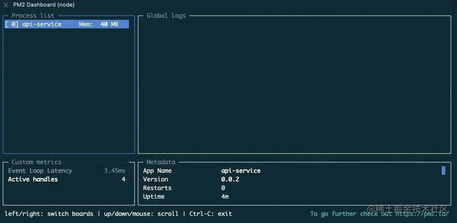
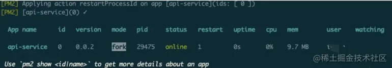

**Node.js默认单进程运行,对于32位系统最高可以使用512MB内存,对于64位最高可以使用1GB内存**。对于多核CPU的计算机来说，这样做效率很低，因为只有一个核在运行，其他核都在闲置，PM2利用的node原生的cluster模块可以顺利解决该问题。

pm2是一个带有负载均衡功能的应用进程管理器，可以使node服务在后台运行。

## 安装
```shell
npm install pm2 -g
```
## PM2常用命令
app.js为api-service服务的启动程序，在生产环境中使用pm2进行管理
- 启动

    ```shell
    pm2 start app.js --name api-service
    pm2 start app.js --watch #实时监控 app.js的方式启动，当app.js文件有变动时，pm2会自动reload
    ```
    

- 查看进程

    ```shell
    pm2 list
    pm2 show 0 # 或者 pm2 info 0 # 查看进程详细信息，0位PM2进程id
    ```
    
- 监控

    ```shell
    pm2 monit
    ```
    
- 停止

    ```shell
    pm2 stop all # 停止PM2列表中所有的进程
    pm2 stop 0 # 停止PM2列表中进程为0的进程
    ```
- 重载

    ```shell
    pm2 reload all # 重载PM2列表中所有的进程
    pm2 reload 0 # 重载PM2列表中进程为0的进程
    ```
- 重启
    
    ```shell
    pm2 restart all # 重启PM2列表中所有的进程
    pm2 restart 0 # 重启pm2列表中进程为0的进程
    ```
- 删除PM2进程

    ```shell
    pm2 delete 0 # 删除PM2列表中进程为0的进程
    pm2 delete all # 删除pm2列表中所有的进程
    ```
## 自动启动文件
### 生成脚本
```shell
pm2 ecosystem
```
创建文件：/api-service/ecosystem.config.js
```js
module.exports = {
    apps: [
        {
            name: "api-service",
            script: "app.js",
            merge_logs: true,
            max_restarts: 20,
            instances: 1,
            max_memory_restart: "2G",
            cwd: "/website/api-service/",
            env: {
                NODE_ENV: "development",
            },
            env_production: {
                NODE_ENV: "production",
            },
        },
    ],
};
```
说明：
- apps:json结构，apps是一个数组，每个数组成员就是对应一个pm2中运行的应用
- name: 应用程序的名称
- cwd: 用用程序所在的目录
- script: 应用程序的脚本路径
- exec_interpreter: 应用程序的脚本类型，这里使用的shell，默认是nodejs
- min_uptime: 最小运行时间，这里设置的是60s即如果应用程序60s内退出，pm2会认为程序异常退出，此时触发重启max_restarts设置数量
- max_restarts: 设置应用程序异常退出重启的次数，默认15次(从0开始计数)
- exec_mode: 应用程序启动模式，这里设置的是cluster_mode(集群),默认是fork
- error_file: 自定义应用程序的错误日志文件
- out_file: 自定义应用程序日志文件
- pid_file: 自定义应用程序的pid文件
- watch: 是否启动监控模式，默认是false, 如果设置成true, 当应用程序变动时，pm2会自动重载，这里也可以设置你要监控的文件

### 执行脚本
```shell
pm2 start /website/api-service/ecosystem.config.js
```


### 重启
```shell
sudo reboot
```
查看进程
```shell
pm2 list
```
## Dockerfile
上面介绍的安装、部署、启动等操作都可以使用Docker简单的完成，关于Dokcer的使用可以参阅[面相WEB开发人员的Docker](https://juejin.cn/column/6965049243660714021)。一般项目完整的环境包括Node作为后台服务，vue或者Angular作为前端，那么生产环境可以选择Nginx + Node + pm2，Nginx作为Web项目的入口。这里在创建Dockerfile是以 nginx:1.21.1-alpine作为基础，完成代码如下
```shell
FROM nginx:1.21.1-alpine

# Stream the nginx logs to stdout and stderr
RUN ln -sf /dev/stdout /var/log/nginx/access.log && \
    ln -sf /dev/stderr /var/log/nginx/error.log

# 安装nodejs
ENV NODE_VERSION 16.6.1

RUN addgroup -g 1000 node \
    && adduser -u 1000 -G node -s /bin/sh -D node \
    && apk add --no-cache \
        libstdc++ \
    && apk add --no-cache --virtual .build-deps \
        curl \
    && ARCH= && alpineArch="$(apk --print-arch)" \
      && case "${alpineArch##*-}" in \
        x86_64) \
          ARCH='x64' \
          CHECKSUM="9c8438a8d9a1e268153812d1d3f7f63b02283e2082dcd39274674f897496a22a" \
          ;; \
        *) ;; \
      esac \
  && if [ -n "${CHECKSUM}" ]; then \
    set -eu; \
    curl -fsSLO --compressed "https://unofficial-builds.nodejs.org/download/release/v$NODE_VERSION/node-v$NODE_VERSION-linux-$ARCH-musl.tar.xz"; \
    echo "$CHECKSUM  node-v$NODE_VERSION-linux-$ARCH-musl.tar.xz" | sha256sum -c - \
      && tar -xJf "node-v$NODE_VERSION-linux-$ARCH-musl.tar.xz" -C /usr/local --strip-components=1 --no-same-owner \
      && ln -s /usr/local/bin/node /usr/local/bin/nodejs; \
  else \
    echo "Building from source" \
    # backup build
    && apk add --no-cache --virtual .build-deps-full \
        binutils-gold \
        g++ \
        gcc \
        gnupg \
        libgcc \
        linux-headers \
        make \
        python3 \
    # gpg keys listed at https://github.com/nodejs/node#release-keys
    && for key in \
      4ED778F539E3634C779C87C6D7062848A1AB005C \
      94AE36675C464D64BAFA68DD7434390BDBE9B9C5 \
      74F12602B6F1C4E913FAA37AD3A89613643B6201 \
      71DCFD284A79C3B38668286BC97EC7A07EDE3FC1 \
      8FCCA13FEF1D0C2E91008E09770F7A9A5AE15600 \
      C4F0DFFF4E8C1A8236409D08E73BC641CC11F4C8 \
      C82FA3AE1CBEDC6BE46B9360C43CEC45C17AB93C \
      DD8F2338BAE7501E3DD5AC78C273792F7D83545D \
      A48C2BEE680E841632CD4E44F07496B3EB3C1762 \
      108F52B48DB57BB0CC439B2997B01419BD92F80A \
      B9E2F5981AA6E0CD28160D9FF13993A75599653C \
    ; do \
      gpg --batch --keyserver hkps://keys.openpgp.org --recv-keys "$key" || \
      gpg --batch --keyserver keyserver.ubuntu.com --recv-keys "$key" ; \
    done \
    && curl -fsSLO --compressed "https://nodejs.org/dist/v$NODE_VERSION/node-v$NODE_VERSION.tar.xz" \
    && curl -fsSLO --compressed "https://nodejs.org/dist/v$NODE_VERSION/SHASUMS256.txt.asc" \
    && gpg --batch --decrypt --output SHASUMS256.txt SHASUMS256.txt.asc \
    && grep " node-v$NODE_VERSION.tar.xz\$" SHASUMS256.txt | sha256sum -c - \
    && tar -xf "node-v$NODE_VERSION.tar.xz" \
    && cd "node-v$NODE_VERSION" \
    && ./configure \
    && make -j$(getconf _NPROCESSORS_ONLN) V= \
    && make install \
    && apk del .build-deps-full \
    && cd .. \
    && rm -Rf "node-v$NODE_VERSION" \
    && rm "node-v$NODE_VERSION.tar.xz" SHASUMS256.txt.asc SHASUMS256.txt; \
  fi \
  && rm -f "node-v$NODE_VERSION-linux-$ARCH-musl.tar.xz" \
  && apk del .build-deps \
  # smoke tests
  && node --version \
  && npm --version

# NODEJS服务
ENV SERVICE_WORKDIR=/webapps/api-service
WORKDIR $SERVICE_WORKDIR
COPY ./api-service/package.json /webapps/api-service/package.json

RUN npm install && npm cache clean --force
RUN npm install pm2 -g


COPY ./api-service/config /webapps/api-service/config
COPY ./api-service/src/controllers /webapps/api-service/src/controllers
COPY ./api-service/src/models /webapps/api-service/src/models
COPY ./api-service/src/services /webapps/api-service/src/services
COPY ./api-service/src/routers /webapps/api-service/src/routers
COPY ./api-service/src/utils /webapps/api-service/src/utils
COPY ./api-service/app.js /webapps/api-service
COPY ./api-service/ecosystem.config.js /webapps/api-service
RUN mkdir ~/.pm2
RUN chmod 755 -R  ~/.pm2

# VUE前端
WORKDIR /webapps/app
COPY ./dist /webapps/app

COPY ./etc/nginx/default.conf /etc/nginx/conf.d/


RUN chmod 755 -R /webapps/app \
    && chmod 755 -R /usr/local/bin \
    && chmod 755 -R /webapps/api-service

EXPOSE 80

WORKDIR /webapps/api-service
COPY start.sh .

CMD [ "./start.sh"  ]
```
./start.sh 的脚本如下
```shell
#!/bin/sh
nginx
pm2 start /webapps/api-service/ecosystem.config.js --no-daemon
```
nginx配置文件./etc/nginx/default.conf的代码如下
```js
server{
        listen 80;
        root /webapps/app;
        index index.html;
        charset                 utf-8;
        add_header "X-UA-Compatible" "IE=Edge,chrome=1";
        proxy_set_header Host $host;
        proxy_set_header X-Real-IP $remote_addr;
        proxy_set_header X-Forwarded-For $proxy_add_x_forwarded_for;
        proxy_set_header X-Forwarded-Proto $scheme;
        location /api {
                proxy_pass http://127.0.0.1:4200;
        }
        location / {
                if ($request_filename ~* ^.*?.(html|htm)$){
                        expires -1s;
                        add_header Cache-Control no-cache,no-store,must-revalidate;
                }
                try_files $uri $uri/ /index.html;
        }
}
```


## 资料
[原文](https://juejin.cn/post/7001729139166150669)