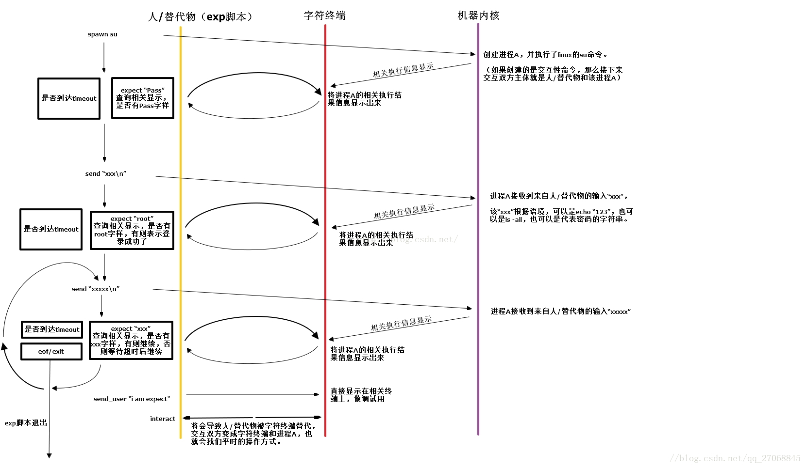

## 举个栗子
```sh
# expect超过超时时间没有检测到要找的字符串，则不执行
set timeout 30

# 获取传入的三个参数
set host [lindex $argv 0]
set code [lindex $argv 1]
set passwd [lindex $argv 2]
set date [exec date "+%Y_%m_%d"]

# 运行ssh连接命令
spawn ssh $host

# 自动传入验证码&密码
expect {
    "Verification code:" { send "$code\n"; exp_continue }
    "Password:": { send "$passwd\n"}
}

# 退出expect返回终端，可以继续输入，否则将一直在expect不能退出到终端
interact
```

## 用法
- spawn: expect脚本中用于向机器发出首个linux命令用，该命令将在系统中创建一个进程
- expect: expect脚本中用于等待和分析机器执行结果用
- send: expect脚本中用于模拟"人"向机器进程发出linux命令用
- interact: expect脚本中用于将交互双方由expect脚本和机器内核改为--字符终端和机器内核(即正常人和机器交互模式)

## sh脚本调用expect
expect只能用来代替人向终端输入指令。有时候在这之前还需要运行一些shell脚本的命令。所以就需要实用sh脚本来调用expect。

```sh
#!/bin/sh
# 登录信息
host="这里是主机地址"
passwd="这里是密码"
secret="这个是用来计算code的加密率，无视他"

# 获得动态码
code = `这里是计算code的命令，继续无视他`

# expect调用login脚本
expect login.sh $host $code $passwd
```

## expect原理




## 安装
```sh
brew install expect

// QA
脚本首行： #!/usr/bin/expect
执行时： ./you.sh
```
## expect获取当前日期，变量保存
```shell
set date [exec date"+%Y_%m_%d_%H_%M_%S"]
```

## demo
```shell
# window下执行的 需要加package require Epect
package require Expect
# 需要本地打包执行 
set key [lindex $argv 0];
set host [lindex $argv 1];
set date [exec date "+%Y_%m_%d"]

send "echo $date\r"
expect "*#"

if {$host == ""} {
    set host ec2-52-83-95-61.cn-northwest-1.compute.amazonaws.com.cn
    expect "*#"
}

send "echo $host\r"
expect "*#"

spawn tar -zcvf dist.tar.gz dist;
expect "*#"

# 改为自己的秘钥所在的位置
spawn scp -i $key -P 2020 dist.tar.gz ec2-user@$host:/home/ec2-user
expect "*#"
set timeout 5
spawn ssh -i $key ec2-user@$host -p 2020
expect "*#"

send "cd /home/ec2-user\r"
expect "*#"

send "pwd\r "
expect "*#"

send "tar -zcvf dist.tar.${date}.gz dist\r "
expect "*#"

send "rm -rf dist\r "
expect "*#"

send "tar -zxvf dist.tar.gz\r";
expect "*#"

send "exit\r"
interact 
```
## 资料

[判断文件是否存在的shell脚本代码](https://www.jb51.net/article/34330.htm)

[expect](https://www.cnblogs.com/steel-chen/p/10636799.html)


http://xstarcd.github.io/wiki/shell/expect_handbook.html

https://www.51cto.com/article/720843.html