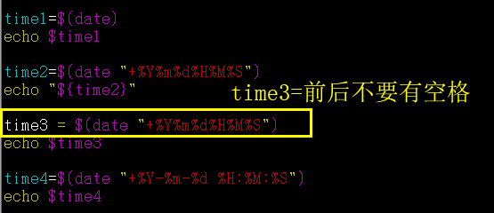

shell实现获取当前实现，并进行格式转换的方法:
1. 原格式输出

    2018年09月30日 星期日 15:88:15 CST
    ```shell
    time1=${date}
    echo $time1
    ```
2. 时间串输出

    20180930155515
    ```js
    #!bin/bash
    time2=$(date "+%Y%m%d%H%M%S")
    echo $time2
    ```
3. 2018-09-30 15:55:15

    ```shell
    #!bin/bash
    time3=$(date "+%Y-%m-%d %H:%M:%S")
    echo $time3
    ```
4. 2018.09.30

    ```shell
    #!bin/bash
    time4=$(date "+%Y.%m.%d")
    echo $time4
    ```
## 注意
1. date后面有个空格，shell对空格要求严格
2. 变量复制前后不要有空格   

    

3. 解释

    ```md
    1 Y显示4位年份，如：2018；y显示2位年份，如：18。
    2 m表示月份；M表示分钟。
    3 d表示天；D则表示当前日期，如：1/18/18(也就是2018.1.18)。
    4 H表示小时，而h显示月份。
    5 s显示当前秒钟，单位为毫秒；S显示当前秒钟，单位为秒。
    ```