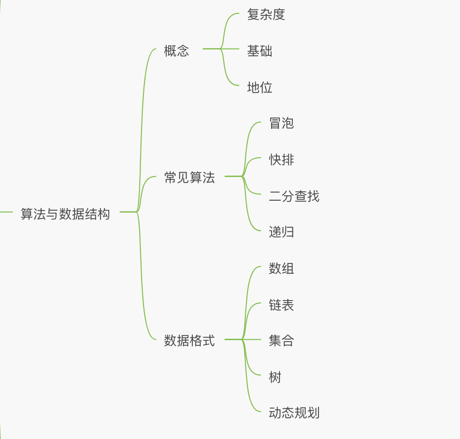
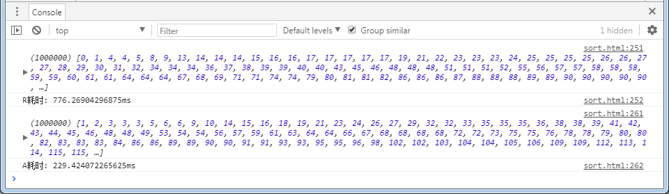
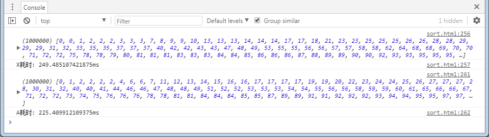
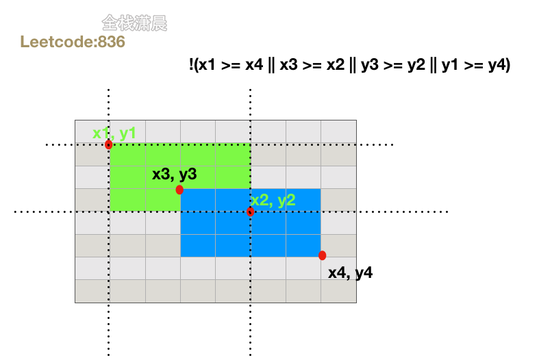

## 牛客
```js
const longStr = str => {
    if(str.length === 0) return 0;
    let len = str.length;
    let left = 0;
    let right = 1;
    let max = 0;
    while(right <= len) {
        let lr = str.slice(left, right);
        let index = lr.indexOf(str[right]);
        if (index > -1) {
            left = left + index + 1;
        } else {
            lr = str.slice(left, right + 1);
            max = Math.max(max, lr.length)
        }
        right++
    }
    return max;
}
var str = readline() // 使用readline()读取
console.log(longStr(str))
```
## 两数之和
```javascript
var twoSum = function(nums, target) {
    let obj = {};
    for (let i = 0; i < nums.length; i++) {
        num = nums[i];
        if (num in obj) {
            return [obj[num], i];
        } else {
            obj[target - num] = i
        }
    }
}
// 第二种
function twoSum(nums, target) {
  for (let i = 0; i < nums.length; i++) {
    let right = i + 1;
    while(right < nums.length) {
      let sum = nums[i] + nums[right];
      if (sum === target) {
        return [i, right];
      } else {
        right++;
      }
    }
  }
}
twoSum([2,7,11,16], 9)
```
## 三数之和
```javascript
var threeSum = function(nums) {
    let ans = [];
    const len = nums.length;
    if(nums == null || len < 3) return ans;
    nums.sort((a, b) => a - b); // 排序
    for (let i = 0; i < len ; i++) {
        if(nums[i] > 0) break; // 如果当前数字大于0，则三数之和一定大于0，所以结束循环
        if(i > 0 && nums[i] == nums[i-1]) continue; // 去重
        let L = i+1;
        let R = len-1;
        while(L < R){
            const sum = nums[i] + nums[L] + nums[R];
            if(sum == 0){
                ans.push([nums[i],nums[L],nums[R]]);
                while (L<R && nums[L] == nums[L+1]) L++; // 去重
                while (L<R && nums[R] == nums[R-1]) R--; // 去重
                L++;
                R--;
            }
            else if (sum < 0) L++;
            else if (sum > 0) R--;
        }
    }        
    return ans;
};
var nums = [-1, 0, 1, 2, -1, -4]
console.log(threeSum(nums));
```
[力扣三数之和](https://leetcode-cn.com/problems/3sum/solution/hua-jie-suan-fa-15-san-shu-zhi-he-by-guanpengchn/)
## 快排

### 阮一峰老师的js快排实现
1. 选择数组中间数作为基数，并从数组中取出此基数
2. 准备两个数组容器，遍历数组，逐个与基数比对，较小的放左容器，较大的放右容器
3. 递归处理两个容器的元素，并将处理后的数据与基数按大小合并成一个数组返回

```javascript
var quickSort = function(arr) {
    if (arr.length <= 1) return arr;
    var pivotIndex = Math.floor(arr.length / 2);
    var pivot = arr.splice(pivotIndex, 1)[0];
    var left = [];
    var right = [];
    for (var i = 0; i < arr.length; i++) { // 需要注意 arr.length 需要splice之后获取
        if (arr[i] < pivot) {
            left.push(arr[i]);
        } else {
            right.push(arr[i]);
        }
    }
    return quickSort(left).concat([pivot], quickSort(right));
}
```
**总结**

思路非常清晰，选择基数作为参照，划分数组,分而治之，对于新手来理解快排的核心思想"参照-划分-递归"，很容易理解

既实现了排序，又符合快速排序的思想，为什么还会有人诟病呢，是因为：

1. 取基数用的是splice()函数取，而不是算法中常用的取下标。基数只是一个参照对象，在比对的时候，只要能从数组中取到就好，所以只需要知道它的索引，调用函数删除基数只会更耗时。

2. 根据基数来划分时,专门生成两个数组来存储，从而占用更多的存储空间(增加了空间复杂度)

严格来讲，还有更多改进之处

### 文章中提出的快排js实现

思路：

1、通过下标取中间数为基数；

2、从起点往后寻找比基数大的，记录为下标 i；再从终点往前寻找比基数小的，记录为下标 j，当 i <= j时，原地交换数值；

3、重复步骤2，直到遍历所有元素，并记录遍历的最后一个下标 i，以此下标为分界线，分为左右两边，分别重复步骤1~3实现递归排序；

实现（为方便理解，在原文基础上有所合并）：

```javascript
// 快排改进——黄佳新
var devide_Xin = function (array, start, end) {
    if(start >= end) return array;
    var baseIndex = Math.floor((start + end) / 2), // 基数索引
            i = start,
            j = end;

    while (i <= j) {
        while (array[i] < array[baseIndex]) {
            i++;
        }
        while (array[j] > array[baseIndex])  {
            j--;
        }

        if(i <= j) {
            var temp = array[i];
            array[i] = array[j];
            array[j] = temp;
            i++;
            j--;
        }
    }
    return i;
}

var quickSort_Xin = function (array, start, end) {
    if(array.length < 1) {
        return array;
    }
    var index = devide_Xin(array, start, end);
    if(start < index -1) {
        quickSort_Xin(array, start, index - 1);
    }
    if(end > index) {
        quickSort_Xin(array, index, end);
    }

    return array;
}
```
总结：

1、用下标取基数，只有一个赋值操作，跟快；

2、原地交换，不需要新建多余的数组容器存储被划分的数据，节省存储；

比较：

相较而言，理论分析，实现二确实是更快速更省空间，那么事实呢？



以上是实现一与实现二在chrome上测试耗时的统计结果，测试方案为：各自随机生成100万个数（乱序）,分别完成排序，统计耗时。

结论：

事实上，乱序排序，实现二更快。

### 三、网上其他的快排js实现

思路：

1、通过下表取排序区间的第0个数为基数

2、排序区间基数以后，从右往左，寻找比基数小的，从左往右，寻找比基数大的，原地交换；

3、重复步骤2直到 i >= j；

4、将基数与下标为 i 的元素原地交换，从而实现划分；

5、递归排序基数左边的数，递归排序基数右边的数，返回数组。

```javascript
var quickSort_New = function(ary, left, right) {
    if(left >= right) {
        return ary;
    }

    var i = left,
            j = right;
            base = ary[left];

    while (i < j) {
        // 从右边起，寻找比基数小的数
        while (i<j && ary[j] >= base) {
            j--;
        }

        // 从左边起，寻找比基数大的数
        while (i<j && ary[i] <= base) {
            i++
        } 

        if (i<j) {
            var temp = ary[i];
            ary[i] = ary[j];
            ary[j] = temp;
        }
    }

    ary[left] = ary[i];
    ary[i] = base;

    quickSort_New(ary, left, i-1);
    quickSort_New(ary, i+1, right);

    return ary;
}
```

总结：

除选基数不同以外，其他与实现二类似。

另外：

比较一下实现二与实现三的速度，结果如下：

多次测试结果均为：实现二耗时略小于实现三，偶尔出现大于的情况，但相差不大。

## 二分查找

```javascript
function binary_search(arr, low, high, key) {
    if (low > high) retrun -1;
    var mid = parseInt((low + high) / 2);
    if (arr[mid] === key) {
        return mid;
    } else if (arr[mid] > key) {
        high = mid - 1;
        return binary_search(arr, low, high, key);
    } else if (arr[mid] < key) {
        low = mid + 1;
        return binary_search(arr, low, high, key);
    }
}
```

第二种
```javascript
var search = function(nums, target) {
    let left = 0;
    let right = nums.length - 1;
    while(left <= right) {
        let mid = Math.floor((left + right) / 2);
        console.log(mid)
        if(nums[mid] === target) {
            return mid;
        }
        if (nums[mid] > target) {
            right = mid - 1;
        }
        if (nums[mid] < target) {
            left = mid + 1;
        }
    }
    return -1;
}
```

## 扑克牌问题

  有一堆扑克牌，将牌第一张放到桌子上，在将接下来牌的第一张放到牌底，如此往复；最后桌子上的牌顺序为:(牌底)1，2，3，4，5，6，6，7，8，9，10，11，12，13(牌顶)；<br/>
  问：原来牌的顺序，用函数实现
  ```javascript
  let arr = [1,2,3,4,5,6,7,8,9,10,11,12,13];
  let _arr = [];
  function sortPoke() {
      while(arr.length > 0) {
          //选择抽取哪张牌
          if(arr.length % 2 === 1) {
              _arr.push(arr.pop());
          } else {
              _arr.push(arr.shift());
          }
      }
      return _arr;
  }
  console.log(sortPoke())
  //[13, 1, 12, 2, 11, 3, 10, 4, 9, 5, 8, 6, 7]
  ```
### 有A、B两个数组
A: [1,2,3,4,5]

B: [5,1,4,2,3]
```javascript
function formatArr(nums) {
    let arr = [];
    while(nums.length > 0) {
        if (arr.length % 2 === 1) {
            arr.push(nums.shift());
        } else {
            arr.push(nums.pop())
        }
    }
    return arr;
}
console.log(formatArr([1,2,3,4,5]))
```
[洗牌函数](/front-end/interview/coding.html#如何实现一个数组的洗牌函数)
## JavaScript 深拷贝
  ```javascript
  //
  function copyObj(obj) {
      var newobj = {};
      for(const key in obj) {
          if(typeof obj[key] === 'object') {
              newobj[key] = copyObj(obj[key])
          } else {
              newobj[key] = obj[key]
          }
      }
      return newobj;
  }
  /** MessageChannel接口允许创建一个新的消息通道，并通过它的两个MessagePort属性发送数据。MessageChannel接口实例化以后，会有两个属性port1和port2.**/
  function copyObj(obj) {
      return new Promise(resolve => {
          const { port1, port2 } = new MessageChannel();
          port1.postMessage(obj);
          port2.onmessage = ev => resolve(ev.data);
      })
  }
  var obj1 = {a:1}
  var clone1 = await structuralClone(obj1)
  ```
[深拷贝的实现，如果遇到function怎么办-3](/front-end/interview/record-02.html)
## 盛水最多的容器---双指针法
  ```javascript
  var maxArea = function(height) {
    let left = 0;//左下标
    let right = height.length - 1;//右下标
    let max = 0;//最大装水量
    while(left < right){
        let now = (right - left) * Math.min(height[right], height[left]);
        max = now > max ? now : max;
        if(height[left] > height[right]){
            right--;
        }else{
            left++;
        }
    }
    return max;
  };
  ```
[leecode](https://leetcode-cn.com/problems/container-with-most-water/)

## 接雨水
给定n个非负整数表示每个宽度为1的柱子的高度图，计算按此排列的柱子，下雨之后能接多少雨水

```
输入：height = [0,1,0,2,1,0,1,3,2,1,2,1]
输出：6
解释：上面是由数组 [0,1,0,2,1,0,1,3,2,1,2,1] 表示的高度图，在这种情况下，可以接 6 个单位的雨水（蓝色部分表示雨水）。
```
解答：
```js
var trap = function(height) {
    let ans = 0;
    let left = 0, right = height.length - 1;
    let leftMax = 0, rightMax = 0;
    while (left < right) {
        leftMax = Math.max(leftMax, height[left]);
        rightMax = Math.max(rightMax, height[right]);
        if (height[left] < height[right]) {
            ans += leftMax - height[left];
            left++;
        } else {
            ans += rightMax - height[right];
            right--;
        }
    }
    return ans;
};
```
[leetcode](https://leetcode-cn.com/problems/trapping-rain-water/solution/jie-yu-shui-by-leetcode-solution-tuvc/)
## 大数相加

  思路遍历两个字符串从个位数算起开始相加，定义temp接受两个数之和，除以10取余拼接上结果，最后判断temp是否大于0，如果大于9则进位temp=1

```javascript
var addstring = function(num1, num2) {
    var len1 = num1.length, len2 = num2.length; temp = 0; res = '';
    while(len1 || len2) {
        if(len1) {
            temp += +num1[--len1];
        }
        if(len2) {
            temp += +num2[--len2];
        }
        res  = temp % 10 +res;
        if(temp > 9) {
            temp =1;
        } else {
            temp = 0;
        }
        if (temp) {
            res = 1 +res; 
        }
    }
    return res;
}
```

## sqrt

  ```javascript
  var mySqrt = function(x) {
       if (x < 2) return x
       let left = 1, mid, right = Math.floor(x / 2);
       while (left <= right) {
          mid = Math.floor(left + (right - left) / 2)
          if (mid * mid === x) return mid
          if (mid * mid < x) {
              left = mid + 1
          }else {
              right = mid - 1
          }
       }
       return right
  };
  ```

## [动态规划]恢复空格

  哦，不！你不小心把一个长篇文章中的空格、标点都删掉了，并且大写也弄成了小写。像句子"I reset the computer.It still didn't boot!"已经变成'iresetthecomputeritstilldidntboot'。在处理标点符号和大小写之前，你得先把它断成词语。当然了，你有一本厚厚的词典dictionary,不过有些词没在词典里。假设文章用sentence表示，设计一个是算法，把文章断开，要求未识别的字符最少，返回未识别的字符数。

  注意：本题对原题稍作改动，只需返回未识别的字符数

  ```javascript
  //示例
  输入：dictionary = ['looked', 'just', 'like', 'her', 'brother'];
  sentence = 'jesslookedjustliketimherbrother';
  输出 7
  解释：断句后'jess looked just like tim her brother',共7个未识别字符。

  var respace = function(dictionary, sentence) {
       if(sentence.length == 0) return 0;
      let dp = new Array(sentence.length).fill(0);
      for(let i = 1;i<=sentence.length;i++){
          dp[i] = dp[i-1]+1;
          // 上面表示，如果没有匹配那么dp[i]相比于dp[i-1]直接多1
          // 接着讨论如果新加一个字符，组成了一个词的情况
          for(let j=0;j<dictionary.length;j++){
              let word = dictionary[j].length;
              if(dictionary[j] == sentence.substring(i-word,i) && word<=i){
                  dp[i] = Math.min(dp[i],dp[i-word]);
              }
          }
      }
      return dp[sentence.length]
  };
  ```
## 两个数组的交集

  ```javascript
  /**
  给定两个数组，编写一个函数来计算它们的交集。
  示例1：
  输入：nums1 = [1,2,2,1], num2 = [2,2];
  输出： [2,2]
  说明：
     输出结果中每个元素出现的次数，应与元素在两个数组中出现的次数一致
     我们可以不用考虑输出结果的顺序
  **/
  var intersect = function(nums1, nums2) {
      let tmp = [], arr = [];
      if(nums1.length > nums2.length) {
          tmp = nums1;
          nums1 = nums2;
          nums2 = tmp;
      }
      for (let key of nums1) {
          temp = nums2.indexOf(key);
          if(temp > -1) {
              arr.push(key);
              nums2.splice(temp, 1);
          }
      } 
      return arr;
  }


  // 交集并集差集
    var set1 = new Set([1,2,3]);
    var set2 = new Set([2,3,4]);

    并集
    let union = new Set([...set1, ...set2]);

    交集
    let intersect = new Set([...set1].filter( x => set2.has(x)));

    差集
    let difference = new Set([...set1].filter(x => !set2.has(x)));


  ```
  [参考](https://blog.csdn.net/u010003835/article/details/79042135)
## 统计字符串出现最多的字符

```javascript
function getMax(str) {
    var hash = {}, maxStr, max = 1;
    for (var i = 0; i < str.length; i++) {
        if (!hash[str[i]]){
            hash[str[i]] = 1;
        } else {
            hash[str[i]]++;
        }
        if (hash[str[i]] > max) {
            max = hash[str[i]];
            maxstr = str[i];
        }
    }
    return masStr;
}
```
## 无重复字符的最长子串--单指针
[参考](/front-end/interview/dachang2.html#简单)

```javascript
var getSubString = function(str) {
    if (!str.length) return 0;
    let tempStr = '';
    let maxStrlen = 0;
    let len = str.length;
    let left = 0;
    for (var i = 0; i < len; i++) {
        if (tempStr.indexOf(str[i]) !== -1) {
            left += (str.slice(left, i)).indexOf(str[i]) + 1;
            continue;
        }
        tempStr = str.slice(left, i + 1);
        maxStrlen = Math.max(maxStrlen, tempStr.length);
    }
    return maxStrlen
}
```
## 查找一个字符中指定的子串的所有位置

```javascript
var str = 'fdhfgcsaedvcfhgfh';
var index = str.indexOf('f'); // 字符出现的位置
var num = 0; // 这个字符出现的次数

while(index !== -1){
    console.log(index);
    num++;
    index = str.indexOf('f', index + 1); // 从字符串出现的位置的下一个位置开始继续查找
}
console.log('f一共出现了'+num+'次');
```
## 缺失的第一个正数
:::tip
给一个未排序的正数数组，找出没有出现的最小正正数

[1,2,0] => 3

[3, 4, -1, 1] => 2

[7, 8, 9,11, 12] => 1
:::

```javascript
var firstMissingPositive = function(nums) {
    let result = 1;
    while(nums.includes(result)) {
        result++;
    }
    return result;
}
```
## 寻找两个正序数组的中位数
```
输入：nums1 = [1,3], nums2 = [2]
输出：2.00000
解释：合并数组 = [1,2,3] ，中位数 2
```
```js
const findMedianSortedArrays = (nums1, nums2) => {
    const newArr = [...nums1, ...nums2].sort((a, b) => a - b);
    let result = 0;
    if(newArray.length / 2 === parseInt(newArr.length / 2)) {
        result = (newArr[parseInt(newArr.length / 2)] + newArr[parseInt(newArr.length / 2) - 1]) / 2;
    } else {
        result = newArr[parseInt(newArr.length / 2)]
    }
    return result;
}
```
[leetcode](https://leetcode-cn.com/problems/median-of-two-sorted-arrays/)
## [数组]合并区间
以数组 intervals 表示若干个区间的集合，其中单个区间为 intervals[i] = [starti, endi] 。请你合并所有重叠的区间，并返回 一个不重叠的区间数组，该数组需恰好覆盖输入中的所有区间 。

```
输入：intervals = [[1,3],[2,6],[8,10],[15,18]]
输出：[[1,6],[8,10],[15,18]]
解释：区间 [1,3] 和 [2,6] 重叠, 将它们合并为 [1,6].
```
解答
```js
const merge = intervals => {
    // 先按第一个元素排序
    intervals.sort((a, b) => a[0] - b[0])

    // 计算合并
    let res = []
    for (let i = 1; i < intervals.length; i++) {
        // 对于 [1,3] 和 [2,6], 比较 3 和 2, 3 >= 2 则合并
        if (intervals[i][0] <= intervals[i - 1][1])
            intervals[i] = [intervals[i - 1][0], Math.max(intervals[i - 1][1], intervals[i][1])]
        else
            // 不能合并则将上一个合并结果加入 
            res.push(intervals[i - 1])
    }
    // 最后一次的结果需要额外放入
    res.push(intervals[intervals.length - 1])
    return res
}
```
## [数组]除自身以外的数组的乘积
```
输入: nums = [1,2,3,4]
输出: [24,12,8,6]
```
解答
```js
const productExceptSelf = nums => {
    const n = nums.length;
    const output = [];
    output[0] = 1;
    for (let i = 1; i < n; i++) { // output[i]是nums[i]的左编辑
        output[i] = output[i - 1] * nums[i - 1];
    }
    let right_output = 1; // 保存nums[i]的左边积
    for(let i = n - 1; i >= 0; i--) {
        output[i] *= right_output // 左边积 乘上 右边积
        right_output *= nums[i]; // 更新右边积
    }
    return output;
}
```
[leetcode](https://leetcode-cn.com/problems/product-of-array-except-self/solution/output-shu-zu-cheng-dan-liang-chong-jiao-se-yi-ci-/)
## 数组中的第K个最大元素
输入: [3,2,1,5,6,4] 和 k = 2

输出: 5

使用堆排序来解决这个问题——建立一个大顶堆，做k−1 次删除操作后,堆顶元素就是我们要找的答案（堆排序过程中，不全部下沉，下沉nums.length-k+1,然后堆顶可以拿到我们top k答案了）

1. 首先构建一个大顶堆
2. 获取数组减去K 之后的重新构建大顶堆
3. 大顶堆最上面的就是

```javascript
// 第一种
var findKthLargest = function(nums, k) {
    nums = nums.sort((a, b) => a -b);
    return nums[k - 1]
}
// 堆排序--大顶堆
//整个流程就是上浮下沉
var findKthLargest = function(nums, k) {
  let heapSize = nums.length;
  buildMaxHeap(nums, heapSize); // 构建好了一个大顶堆
  // 进行下沉 大顶堆是最大元素下沉到末尾
  for(let i = nums.length - 1; i >= nums.length - k + 1; i--) {
    swap(nums, 0, i);
    --heapSize; // 下沉后的元素不参与到大顶堆的调整
    // 重新调整大顶堆
    maxHeapify(nums, 0, heapSize);
  }
  return nums[0];
  
  // 自下而上构建一个大顶堆
  function buildMaxHeap(nums, heapSize) {
    for (let i = Math.floor(heapSize / 2) - 1; i >= 0; i--) {
      maxHeapify(nums, i, heapSize);
    }
  }
  // 从左向右，自上而下的调整节点
  function maxHeapify(nums, i, heapSize) {
    let l = i * 2 + 1;
    let r = i * 2 + 2;
    let largest = i;
    if (l < heapSize && nums[l] > nums[largest]) {
      largest = l;
    }
    if (r < heapSize && nums[r] > nums[largest]) {
      largest = r;
    }
    if (largest !== i) {
      swap(nums, i, largest); // 进行节点调整
      // 继续调整下面的非叶子节点
      maxHeapify(nums, largest, heapSize)
    }
  }
  function swap(a, i, j) {
    let temp = a[i];
    a[i] = a[j];
    a[j] = temp;
  }
}
```
[力扣官方](https://leetcode-cn.com/problems/kth-largest-element-in-an-array/solution/shu-zu-zhong-de-di-kge-zui-da-yuan-su-by-leetcode-/)

[数组中的第K个最大元素](https://leetcode-cn.com/problems/kth-largest-element-in-an-array/solution/xie-gei-qian-duan-tong-xue-de-ti-jie-yi-kt5p2/)

## [数组]最大序数和/连续子数组的最大值

```javascript
var maxSubArray = function(nums) {
    var cur = 0; maxSub = nums[0];
    nums.forEach(x => {
        cur = Math.max(cur + x, x);
        maxSub = Math.max(maxSub, cur);
    })
    return maxSub;
};
var arr = [1,2,3, 1,3,4, -19, 34,-23];
console.log(masSubArray(arr)); // 34
```
[leetcode](https://leetcode-cn.com/problems/lian-xu-zi-shu-zu-de-zui-da-he-lcof/solution/lian-xu-zi-shu-zu-de-zui-da-he-by-leetco-tiui/)
## [数组]长度最小的子数组(掌握滑动窗口&指针)
给定一个含有 n 个正整数的数组和一个正整数 target 。
:::tip
s = 7； nums = [2, 3,1, 2, 4, 3];

输出2， 子数组[4, 3] 最小的连续子数组

:::

```javascript
var minSubArrayLen = function(s, nums) {
    let n = nums.length;
    let left = 0, res = Infinity, sum = 0;
    for (let right = 0; right < n; right++) {
        //记录和
        sum += nums[right];
        //满足条件,收缩左指针
        while(sum >= s) {
            //收缩之前，取最小值  
            res = Math.min(res, right - left + 1);
            sum -= nums[left++];
        }
    }
    //注意数组全部加起来或者数组为0的时候，res不变；
    return res == Infinity ? 0 : res;
}
// 方法二 等同一？
var minSubArrayLen = function(target, nums) {
    const n = nums.length;
    
    // S1 初始化窗口左右指针、窗口长度结果以及当前窗口和
    let left = 0;
    let right = 0;
    let ans = Infinity;
    let sum = 0; 
    
    // S2 模拟像右滑动
    while(right<n){
        // S3 寻找可行解
        sum+=nums[right];
        right++;

        // S4 当已找到可行解时，缩小窗口以优化
        while(sum>=target){
            // S4-1 更新结果值
            ans = Math.min(ans, right-left);
            // S4-2 缩小窗口
            sum-=nums[left];
            left++;
        }
    }

    // 如果 ans 不变，则说明没有符合条件的子数组
    return ans === Infinity ? 0 : ans;
};
```
[leetcode](https://leetcode-cn.com/problems/minimum-size-subarray-sum/solution/xing-dai-lu-hua-dong-chuang-kou-suan-fa-8sei6/)

## [数组]分割数组最大值

**定一个非负整数数组 nums 和一个整数 m ，你需要将这个数组分成 m 个非空的连续子数组。**

设计一个算法使得这 m 个子数组各自和的最大值最小。

```
输入：nums = [7,2,5,10,8], m = 2
输出：18
解释：
一共有四种方法将 nums 分割为 2 个子数组。 
其中最好的方式是将其分为 [7,2,5] 和 [10,8] 。
因为此时这两个子数组各自的和的最大值为18，在所有情况中最小。

```
解答
```javascript
//贪心算法
var splitArray = function(nums, m) {
    let left = 0; right = 0;
    let len = nums.length;
    for(let i = 0; i < len; i++) {
        right += nums[i];
        if(left < nums[i]) {
            left = num[i];
        }
    }
    function check(mid, m) {
        let sum = 0;
        let cnt = 1;
        for (let i = 0; i < len; i++) {
            if (sum + nums[i] > mid) {
                cnt++;
                sum = nums[i];
            } else {
                sum += nums[i];
            }
        }
        return cnt <= m;
    }
    while(left < right) {
        let mid = Math.floor((left + right) / 2);
        if (check(mid, m)) {
            right = mid;
        } else {
            left = mid + 1;
        }
    }
    return left;
}
// 动态规划
const splitArray = (nums, m) => {
    let len = nums.length;
    let sumList = Array(len + 1).fill(0);
    let dp = Array.from(Array(len + 1), () => Array(m + 1).fill(Infinity));
    // 逐位增加，反面后面根据区间求区间和
    for (let i = 0; i < len; i++) {
        sumList[i + 1] = sumList[i] + nums[i];
      }
    // 默认值
    dp[0][0] = 0;
    for (let i = 1; i <= len; i++) {
        for (let j = 1; j <= Math.min(m, i); j++) {
            // 前i个数分成j段
            for (let x = j - 1; x < i; x++) {
                // x最后一段的起点
                // perv本轮分割完成 分段中最大的和
                let prev = Math.max(dp[x][j - 1], sumList[i] - sumList[x])
                // 该分割情况下最大分段和的最小值
                dp[i][j] = Math.min(prev, dp[i][j])
            }
        }
    }
    return dp[len][m]
}
```
[leetcode](https://leetcode-cn.com/problems/split-array-largest-sum/solution/javscriptdong-tai-gui-hua-ji-lu-numswei-zhi-ji-fen/)
## [数组]长度为k的最大子数组

给定一组大小为n的整数数组，计算长度为k的子数组和的最大值

```javascript
// 方式一
const add = (array, k) => {
    let index = 0, maxSum = 0;
    for (let i = 0; i < k; i++) {
        maxSum += array[i]
    }
    for (let i = 0; i <= array.length - k; i++) {
        let curSum = 0;
        for (let j = 0; j < k; j++) {
            curSum += array[i + j];
        }
        if (curSum > maxSum) {
            maxSum = curSum;
            index = i;
        }
    }
    return maxSum;
}
// 方式二
const add = (array, k) => {
    let index = 0, maxSum = 0;
    for (let i = 0; i < k; i++) {
        maxSum += array[i];
    }
    let curWindowSum = maxSum;
    for (let i = 1; i <= array.length - k; i++) {
        curWindowSum = curWindowSum - array[i - 1] + array[k + i - 1];
        if (curWindowSum > maxSum) {
            maxSum = curWindowSum;
            index = i;
        }
    }
    return maxSum;
}
console.log(add([1,4,4], 2))
```
## [数组]找到和最大的 长度为 K 的子序列
给你一个整数数组 nums 和一个整数 k 。你需要找到 nums 中长度为 k 的 子序列 ，且这个子序列的 和最大 。

请你返回 任意 一个长度为 k 的整数子序列。

**子序列 定义为从一个数组里删除一些元素后，不改变剩下元素的顺序得到的数组。**

```
输入：nums = [2,1,3,3], k = 2
输出：[3,3]
解释：
子序列有最大和：3 + 3 = 6 。
```
解答
```javascript
var maxSubsequence = function(nums, k) {
    let num = nums.map((num, index) => ({
        num,
        index,
    }));
    num = num.sort((x, y) => y.num - x.num).slice(0,k);
    num = num.sort((x, y) => x.index - y.index);
    return num.map((item) => item.num);
};

```
[leetcode](https://leetcode-cn.com/problems/find-subsequence-of-length-k-with-the-largest-sum/solution/zhou-sai-t1-by-lianxin-kicz/)
## [数组-回溯]数组组合
[力扣地址](https://leetcode-cn.com/problems/combinations/)
给定两个整数n和k,返回1...n中所有可能的k个数的组合。

示例：
```javascript
输入: n = 4， k = 2;

输出：
[
    [2,4],
    [3,4],
    [2,3],
    [1,2],
    [1,3],
    [1,4]
]
```

**题解**
```javascript
const combine = function(n, k) {
    const res = [];
    const could = [];
    if (k === 0) {
        return [[]];
    }
    function dfs(start, n, k, res, could) {
        if (could.length === k) {
            res.push(could.slice(0));
            return;
        }
        for (let i = start; i < n + 1; i++) {
            could.push(i);
            dfs(i+1, n, k, res, could);
            could.pop();
        }
        return res;
    }
    return dfs(1, n, k, res, could);
}
```
## 最长连续序列
给定一个未排序的整数数组 nums ，找出数字连续的最长序列（不要求序列元素在原数组中连续）的长度。

请你设计并实现时间复杂度为 O(n) 的算法解决此问题。

 
```
示例 1：

输入：nums = [100,4,200,1,3,2]
输出：4
解释：最长数字连续序列是 [1, 2, 3, 4]。它的长度为 4。
```
```javascript
var longestConsecutive = function(nums) {
    //nums未排序，找出数字连续的最长序列，要求O(n)
    let set = new Set(nums);//数组去重放入set中
    let max_len = 0;
    for(let num of set){//遍历集合
        let len =1;
        // 从中心向两边扩散查找
        let left=num-1,right=num+1;
        while(set.has(left)){
            //找到就删掉，避免重复遍历，导致超时
            set.delete(left);
            left--;
            len++;
        }
        while(set.has(right)){
            set.delete(right);
            right++;
            len++;
        }
        max_len = Math.max(len,max_len);
    }
    return max_len;
};
```
## [动态规划]最长递增子序列
给你一个整数数组 nums ，找到其中最长严格递增子序列的长度。

子序列 是由数组派生而来的序列，删除（或不删除）数组中的元素而不改变其余元素的顺序。例如，[3,6,2,7] 是数组 [0,3,1,6,2,2,7] 的子序列。

```
输入：nums = [10,9,2,5,3,7,101,18]
输出：4
解释：最长递增子序列是 [2,3,7,101]，因此长度为 4 。
```
答案
```javascript
var lengthOfLIS = function(nums) {
    const dp = new Array(nums.length).fill(1);
    for (let i = 0; i < nums.length; i++) {
        // i与i签名的元素比较
        for(let j = 0; j < i;j++) {
            // 找到比i小的元素，找到一个，就让当前的序列的最长序列长度加你
            if(nums[i] > nums[j]) {
                dp[i] = Math.max(dp[i], dp[j] + 1);
            }
        }
    }
    return Math.max(...dp)
}
```
[leetcode](https://leetcode-cn.com/problems/longest-increasing-subsequence/solution/dong-tai-gui-hua-he-er-fen-cha-zhao-lian-x7dh/)
## [动态规划]最长递增序列的个数
给定一个未排序的整数数组 nums ， 返回最长递增子序列的个数 。

注意 这个数列必须是 严格 递增的。
```
输入: [1,3,5,4,7]
输出: 2
解释: 有两个最长递增子序列，分别是 [1, 3, 4, 7] 和[1, 3, 5, 7]。
```
解答
```javascript
const findNumberOfFIS = nums => {
    let n = nums.length, maxLen = 0, ans = 0;
    const dp = new Array(n).fill(0);
    const cnt = new Array(n).fill(0);
    for (let i = 0; i < n; ++i) {
        dp[i] = 1;
        cnt[i] = 1;
        for (let j = 0; j < i; ++j) {
            if (nums[i] > nums[j]) {
                if (dp[j] + 1 > dp[i]) {
                    dp[i] = dp[j] + 1;
                    cnt[i] = cnt[j]; // 重置计数
                } else if (dp[j] + 1 === dp[i]) {
                    cnt[i] += cnt[j];
                }
            }
        }
        if (dp[i] > maxLen) {
            maxLen = dp[i];
            ans = cnt[i]; // 重置计数
        } else if (dp[i] === maxLen) {
            ans += cnt[i];
        }
    }
    return ans;
}
```

[leetcode](https://leetcode-cn.com/problems/number-of-longest-increasing-subsequence/solution/zui-chang-di-zeng-zi-xu-lie-de-ge-shu-by-w12f/)
## 字符串有效性检查
```javascript
// '{}[]()'

var isValid = function(s) {
    const stack = [];
    for (let val of s) {
        console.log(stack)
        if (val === '(') stack.push(')');
        else if (val === '[') stack.push(']');
        else if (val === '{') stack.push('}');
        else if (stack.length === 0 || val !== stack.pop()) return false;
    }
    return stack.length === 0;
};
```
[leecode](https://leetcode-cn.com/problems/valid-parentheses/solution/guan-fang-tui-jian-ti-jie-you-xiao-de-gu-zyzg/)
## 会议室问题
1. 会议室①
  给定一个会议时间安排的数组intervals，每个会议时间都会包括开始和结束时间intervals[i] = [starti, endi],请你判断一个人是否能够参加里面的全部会议
  示例
  ```markdown
  输入:intervals = [[0, 30], [5, 10], [15, 20]]
  输出false
  ```
  解题：
  ```javascript
  /**
   * 方法一暴力法
   * 最简单的方法是将数组中的会议室量量比较，判断他们是否冲突(即他们之间是否有交叠)，如果一个会议室开的时候，另一个依然没有结束，则他们存在交叠，就没法同时参加
  */
  var canAttendMeetings = function(intervals) {
    for(let i = 0; i < intervals.length; i++) {
      for (let j = i + 1; j < intervals.length; j++) {
        if (overlap(intervals[i], intervals[j])) {
          return false;
        }
      }
    }
    return true;
  }
  function overlap(nums1, nums2) {
    return ((nums1[0] >= nums2[0] && nums1[0] < nums2[1]) || (nums2[0] >= nums1[0] && nums2[0] < nums1[1]))
  }
  // 方法二排序
  // 思路是按照开始时间进行排序，接着一次遍历会议，检查它是否在下一个会议的开始前结束
  var canAttendMeetings = function(intervals) {
    // 将传入的数组按照 第一个数字升序排列
    intervals.sort((a, b) => b[0] - a[0]);

    for (let i = 0; i < intervals.length; i++) {
      if (intervals[i][1] > intervals[i + 1][0]) {
        return false;
      }
    }
    return true;
  }
  ```

2. 会议室②
  给定一个会议时间安排的数组，每个会议时间都会包括开始和结束的时间 [[ s1 , e1 ] ，[ s2 , e2 ]，…] (si < ei) ，为避免会议冲突，同时要考虑充分利用会议室资源，请你计算至少需要多少间会议室，才能满足这些会议安排。
  例如:

  输入: [[0, 30],[5, 10],[15, 20]]

  输出: 2

  面试现场讨论了算法原理，未有时间编码调试：

  ```javascript
  function fn(arr) {
      const sortArr = arr.sort((a,b) => a[0] - b[0]);
      console.log(sortArr);
      let number = 1;
      let end = sortArr[0][1];
      for (let i = 1; i < sortArr.length; i++) {
          if (sortArr[i][0] < end) {
              end !== sortArr[i][0] ? number++ : '';
          }
          end = sortArr[i][1];
      }
      return number;
  }
  console.log(fn([[0, 30],[5, 10],[15, 20], [10,35], [20, 30]]));

  解题思路
  [u, v] 代表一个人在 u 时刻上车， v 时刻下车

  把上下车的事件全部排序，同时先下后上。

  求在车上的最大人数。

  var minMeetingRooms = function(intervals) {
      let nums = [];

      //转换为上下车问题
      for (let [u, v] of intervals){
          nums.push([u, 1]);
          nums.push([v, -1]);
      }
      nums.sort((a, b) => a[0] == b[0] ? a[1] - b[1] : a[0] - b[0]);

      let ans = 0, cur = 0;
      for (let [time, e] of nums){
          cur += e;
          ans = Math.max(cur, ans);
      }
      return ans;
  };

  ```

## 加油站
[leetcode](https://leetcode-cn.com/problems/gas-station/solution/tan-xin-si-xiang-by-value-9-v9dd/)
```
输入: 
gas  = [1,2,3,4,5]
cost = [3,4,5,1,2]

输出: 3

解释:
从 3 号加油站(索引为 3 处)出发，可获得 4 升汽油。此时油箱有 = 0 + 4 = 4 升汽油
开往 4 号加油站，此时油箱有 4 - 1 + 5 = 8 升汽油
开往 0 号加油站，此时油箱有 8 - 2 + 1 = 7 升汽油
开往 1 号加油站，此时油箱有 7 - 3 + 2 = 6 升汽油
开往 2 号加油站，此时油箱有 6 - 4 + 3 = 5 升汽油
开往 3 号加油站，你需要消耗 5 升汽油，正好足够你返回到 3 号加油站。
因此，3 可为起始索引。
```

```javascript
var canCompleteCircuit = function(gas, cost) {
    let curSum = 0, // 当前站点的剩余油料
        start = 0,
        totalSum = 0; // 总的剩余油料

    for(let i = 0; i < cost.length; i++) {
        curSum += gas[i] - cost[i];
        if(curSum < 0) {
            start = i+1;
            curSum = 0;
        }
        totalSum += gas[i] - cost[i];
    }

    return start >= gas.length || totalSum < 0  ? -1 : start;
};

```

## 山脉数组的峰顶索引
```javascript
// 方法一:枚举
var peakIndexInMountainArray = function(arr) {
    const n = arr.length;
    let ans = -1;

    for (let i = 1; i < n - 1; ++i) {
        if (arr[i] > arr[i + 1]) {
            ans = i;
            break;
        }
    }
    return ans;
};

// 二分查找
var peakIndexInMountainArray = function(arr) {
    const n = arr.length;
    let left = 1, right = n - 2, ans = 0;
    while(left <= right) {
        const mid = Math.floor((left + right) / 2);
        if (arr[mid] > arr[mid + 1]) {
            ans = mid;
            right = mid - 1;
        } else {
            left = mid + 1;
        }
    }
    return ans;
}
```
[leecode](https://leetcode-cn.com/problems/B1IidL/solution/shan-feng-shu-zu-de-ding-bu-by-leetcode-9j8lk/)
## 山脉数组中查找目标值

输入：array = [1,2,3,4,5,3,1], target = 3

输出：2

解释：3 在数组中出现了两次，下标分别为 2 和 5，我们返回最小的下标 2。

```javascript
var findInMountainArray = function(target, mountainArr) {
    let l = 0, r = mountainArr.length() - 1
    
    // 二分求 峰顶
    while (l < r) {
        let mid = Math.floor((l + r) / 2)
        
        if (mountainArr.get(mid) > mountainArr.get(mid + 1)) {
            r = mid
        } else {
            l = mid + 1
        }
    }
        
    let peak = r;

    // 搜索左边
    let index = binary_search(mountainArr, target, 0, peak, x => x)
    
    // 如果目标在左边, 返回
    if (index !== -1) return index
    
    // 如果目标不在左边, 搜索右边
    return binary_search(mountainArr, target, peak + 1, mountainArr.length() - 1, x => -x)
};

function binary_search(mountain, target, l, r, callback) { // callback 方法处理递增还是递减
    
    target = callback(target)

    while (l <= r) {
        let mid = Math.floor((l + r) / 2)
        let midValue = callback(mountain.get(mid))
        
        if (midValue === target) {
            return mid
        } else if (midValue < target) {
            l = mid + 1
        } else {
            r = mid - 1
        }  
    } 
    return -1
}
```
## 螺旋矩阵
给你一个m行n列的矩阵matrix，请按照顺时针螺旋顺序，返回矩阵中所有元素

输入：matrix = [[1,2,3],[4,5,6],[7,8,9]]

输出：[1,2,3,6,9,8,7,4,5]


- 如果一条边从头遍历到底，则下一条边遍历的起点随之变化
- 如果不遍历到底，可以减小横向、竖向遍历之间的影响
- 一轮迭代结束时，4条边的两端同事收窄1
- 一轮迭代所有的事情变得很清晰：**遍历一个圈，遍历的返回收缩为内圈**
- 不再形成环了，就会剩下下一行或一列，然后单独判断

```js
var spiralOrder = function(matrix) {
    if(matrix.length === 0) return [];
    const res = [];
    let top = 0;
    let bottom = matrix.length - 1;
    let left = 0;
    let right = matrix[0].length - 1;
    while(top < bottom && left < right) {
        for (let i = left; i < right; i++) res.push(matrix[top][i]); // 上层
        for (let i = top; i < bottom; i++) res.push(matrix[i][right]); // 右层
        for (let i = right; i > left; i--) res.push(matrix[bottom][i]); // 下层
        for (let i = bottom; i > top; i--) res.push(matrix[i][left]); // 左层
        right--;
        top++;
        left++;
        bottom--; // 四个边界同事收缩，进入内层
    }
    if(top === bottom) { // 剩下一行，从左到右依次添加
        for (left i = left; i <= right; i++) res.push(matrix[top][i]);
    } else if(left === right) { // 剩下一列，从上到下依次添加
        for (let i = top; i <= bottom; i++) res.push(matrix[i][left]);
    }
    return res;
}

```
[螺旋数组](https://leetcode-cn.com/problems/spiral-matrix/solution/shou-hui-tu-jie-liang-chong-bian-li-de-ce-lue-kan-/)

## LRU 缓存机制
问题
```
输入
["LRUCache", "put", "put", "get", "put", "get", "put", "get", "get", "get"]
[[2], [1, 1], [2, 2], [1], [3, 3], [2], [4, 4], [1], [3], [4]]
输出
[null, null, null, 1, null, -1, null, -1, 3, 4]
```

答题
```js
var LRUCache = function(capacity) {
    this.map = new Map();
    this.capacity = capacity;
}

LRUCache.prototype.get = function(key) {
    if (this.map.has(key)) {
        var temp = this.map.get(key);
        this.map.delete(key);
        this.map.set(key, temp);
        return temp
    } else {
        return -1
    }
}

LRUCache.prototype.put = function(key, value) {
    if(this.map.has(key)) {
        this.map.delete(key);
    }
    this.map.set(key, value);
    if(this.map.size > this.capacity) {
        this.map.delete(this.map.keys().next().value);
    }
}

```
[力扣](https://leetcode-cn.com/problems/lru-cache/)

扩展
```
var arr = [1,2,3,4,5]
arr.keys().next(); // {value: 0, done: false}

arr.keys() // Array Iterator {}
```
## [贪心]超级洗衣机
假设有 n 台超级洗衣机放在同一排上。开始的时候，每台洗衣机内可能有一定量的衣服，也可能是空的。

在每一步操作中，你可以选择任意 m (1 <= m <= n) 台洗衣机，与此同时将每台洗衣机的一件衣服送到相邻的一台洗衣机。

给定一个整数数组 machines 代表从左至右每台洗衣机中的衣物数量，请给出能让所有洗衣机中剩下的衣物的数量相等的 最少的操作步数 。如果不能使每台洗衣机中衣物的数量相等，则返回 -1 。

示例 1：

输入：machines = [1,0,5]

输出：3

解释：

第一步:    1     0 <-- 5    =>    1     1     4

第二步:    1 <-- 1 <-- 4    =>    2     1     3    

第三步:    2     1 <-- 3    =>    2     2     2   

```js
var findMinMoves = function(machines) {
    const tot = eval(machines.join('+'));
    const n = machines.length;
    if (tot % n !== 0) {
        return -1;
    }
    let avg = Math.floor(tot / n);
    let ans = 0, sum = 0;
    for (let num of machines) {
        num -= avg;
        sum += num;
        ans = Math.max(ans, Math.max(Math.abs(sum), num));
    }
    return ans;
}
```
[力扣地址](https://leetcode-cn.com/problems/super-washing-machines/)

## [动态规划]编辑距离
给你两个单词word1和word2,请你计算出将word1转换成word2所使用的最少操作数

你可以对一个单词进行如下三种操作
- 插入一个字符
- 删除一个字符
- 替换一个字符

实例
```
示例 1：

输入：word1 = "horse", word2 = "ros"
输出：3
解释：
horse -> rorse (将 'h' 替换为 'r')
rorse -> rose (删除 'r')
rose -> ros (删除 'e')

示例 2：
输入：word1 = "intention", word2 = "execution"
输出：5
解释：
intention -> inention (删除 't')
inention -> enention (将 'i' 替换为 'e')
enention -> exention (将 'n' 替换为 'x')
exention -> exection (将 'n' 替换为 'c')
exection -> execution (插入 'u')
```
编写
```javascript
// 暴力解-- 容易理解
var minDistance = function(word1, word2) {
    const dp = (i, j) => {
        // 因为递归传入的是上一次(i - 1, j -1 )所以这里都需要 + 1;
        if (i === -1) return j + 1; // s1走完了，将s2剩下的插入s1，需要j + 1步
        if (j === -1) return i + 1; // s2走完了，删除s1剩下的，需要i+ 1步
        if(word1[i] === word2[j]) {
            return dp(i - 1, j - 1); // 什么都不做，i,j向前移一位
        } else {
            // 找出最小的
            return Math.min(
                dp(i, j - 1) + 1, // 插入，在word1中插入word2[j]一样的字符，相当于把word2向前移动1位，word1不动
                dp(i - 1, j) + 1, // 删除，把word1[i]删除，相当于word1向前移动1位，word2不动
                dp(i - 1, j - 1) + 1 // 替换操作，都向前移动1位
            )
        }
    }
    // 从后往前遍历，i， j 初始化指向最后一个索引
    return dp(word1.length - 1, word2.length - 1)
}
// 动态规划
function minDistance(word1, word2) {
    const m = word1.length, n = word2.length;
    // 我们要多添加一行一列，用来base case
    const dp = Array.from(Array(word1.length + 1), () => Array(word1.length + 1).fill(0));
    // 添加一列base case
    for(let i = 1; i < m; i++) {
        dp[i][0] = i;
    }
    // 添加一行 base case
    for(let i = 1; i < n; i++) {
        dp[i][i] = i
    }
    // 因为我们补了一行/列base case 这里都从1开始
    for (let i = 1; i <= m; i++) {
        for (let j = 1; j <= n; j++) {
            if (word1[i - 1] === word2[j - 1]) { // 相等什么都不做
                dp[i][j] = dp[i - 1][j - 1];
            } else {
                dp[i][j] = Math.min(
                    dp[i - 1][j] + 1, // s1删除操作
                    dp[i][j - 1] + 1, // s1插入操作
                    dp[i - 1][j - 1]+ 1 // 替换
                )
            }
        }
    }
    return dp[m][n]
}
```
[参考](https://leetcode-cn.com/problems/edit-distance/solution/bian-ji-ju-chi-qiong-ju-ji-yi-hua-sou-su-8bff/)

## 单词接龙
字典 wordList 中从单词 beginWord 和 endWord 的 转换序列 是一个按下述规格形成的序列 beginWord -> s1 -> s2 -> ... -> sk：

每一对相邻的单词只差一个字母。
 对于 1 <= i <= k 时，每个 si 都在 wordList 中。注意， beginWord 不需要在 wordList 中。
sk == endWord
给你两个单词 beginWord 和 endWord 和一个字典 wordList ，返回 从 beginWord 到 endWord 的 最短转换序列 中的 单词数目 。如果不存在这样的转换序列，返回 0 。
```
输入：beginWord = "hit", endWord = "cog", wordList = ["hot","dot","dog","lot","log","cog"]
输出：5
解释：一个最短转换序列是 "hit" -> "hot" -> "dot" -> "dog" -> "cog", 返回它的长度 5。
```

```js
const ladderLength = (beginWord, endWord, wordList) => {
    const wordSet = new Set(wordList);
    const queue = [];
    queue.push([beginWord, 1]);
    while(queue.length) {
        const [word, level] = queue.shift(); // 当前出列的单词
        if(word === endWord) {
            return level
        }
        for (let i = 0; i < word.length; i++) { // 遍历当前单词的所有字符
            for(let c = 97; c <= 122; c++) { // 对应26个字母
                const newWord = word.slice(0, i) + String.fromCharCode(c) + word.slice(i + 1); // 形成新词
                if (wordSet.has(newWord)) { // 单词表里有这个新词
                    queue.push([newWord, level + 1]); // 作为下一层的词入列
                    wordSet.delete(newWord);  // 避免该词重复入列
                }
            }
        }
    }
    return 0; // bfs结束 始终没有遇到终点
}
```
[leetcode](https://leetcode-cn.com/problems/word-ladder/solution/shou-hua-tu-jie-127-dan-ci-jie-long-bfsde-dian-x-2/)
## 所有子字符串美丽值之和
一个字符串的<span style="color: blue">美丽值</span>定义为:出现频率最高字符与出现频率最低字符的出现次数之差。
- 比方说, 'abaacc'的美丽值为3-1 = 2；
给你一个字符串<u>s</u>,请你放回它所有字符串的<span style="color: blue">美丽值之和</span>

示例1
```
输入：s = "aabcb"
输出：5
解释：美丽值不为零的字符串包括 ["aab","aabc","aabcb","abcb","bcb"] ，每一个字符串的美丽值都为 1 。
```
求解
```javascript
/**
 * 暴力解
*/
var beautySum = function(s) {
  let ret = 0;
  for (let i = 1; i <= s.length; i++) {
    for (let j = 0; j < i; j++) {
      let tmp = s.slice(j, i);
      let map = {}

      let min = Infinity;
      let max = -Infinity;
      for(let i = 0; i < tmp.length; i++) {
        map[tmp[i]] = map[tmp[i]] || 0;
        map[tmp[i]]++;
      }
      for (let item in map) {
        min = Math.min(min, map[item]);
        max = Math.max(max, map[item]);
      }
      ret += (max - min)
    }
  }
  return ret;
}

// 解题思路
// 双循环的思路最简单，直接里外两层循环 排列组合所有可能的子字符串，然后统计他们出现的次数，最大值 - 最小值 累积。

// 这里用了一个小技巧：使用数组来记录出现的次数。这样做的原因是，通过 fromCharCode() 方法转换，得到字符和数字之间的关系，也推导得到统计数组的下标关系。
var beautySum = function(s) {
  const len = s.length
  if (len < 3) { return 0 }

  const map = {}
  for (let i = 0; i < 26; i++) {
    map[String.fromCharCode(97 + i)] = i
  }

  let i = 0, j = 0
  let min = 0, sum = 0
  let countArr = []
  while (i < len) {
    j = i + 2
    countArr = (new Array(26)).fill(0)
    countArr[map[s[i]]] += 1
    countArr[map[s[i + 1]]] += 1
    while (j < len) {
      countArr[map[s[j]]] += 1
      min = Math.min(...(countArr.filter(i => i > 0)))
      if (isFinite(min)) {
        sum = sum + Math.max(...countArr) - min
      }

      j++
    }

    i++
  }

  return sum
};
```
[leetcode](https://leetcode-cn.com/problems/sum-of-beauty-of-all-substrings/solution/javascript-bao-li-jie-by-lianxin-qtr7/)

## N皇后
n皇后问题研究的是如何将n个换后放置在n * n的棋盘上，并且使皇后彼此之间不能相互攻击。

给你一个整数n,返回所有不同的n皇后问题的解决方案。

每一种解法包含一个不同的 n 皇后问题 的棋子放置方案，该方案中 'Q' 和 '.' 分别代表了皇后和空位。


```
输入：n = 4
输出：[[".Q..","...Q","Q...","..Q."],["..Q.","Q...","...Q",".Q.."]]
解释：如上图所示，4 皇后问题存在两个不同的解法。
```

```javascript
const solveQueens = n => {
    const board = Array.from(Array(n), ()=> Array(n).fill('.')); // 棋盘初始化
    const res = [];
    const isValid = (row, col) => {
        for (let i = 0; i < row; i++) { // 之前的行
            for(let j = 0; j < n; j++) { // 所有的列
                if(board[i][j] === 'Q' && 
                    (j === col || i + j === row + col || i - j === row - col)) { //发现了皇后 并且和自己同列/对角线
                    return false; // 不是合法选择
                }
            }
        }
        return true;
    }
    const helper = row => { // 放置当前行的皇后
        if(row === n) { // 递归的出口，超出了最后一行
            const stringsBoard = board.slice(); // 拷贝一份board
            for(let i = 0; i < n; i++) {
                stringsBoard[i] = stringsBoard[i].join(''); // 将每一行拼成字符串
            }
            res.push(stringsBoard); // 推入res数组
            return;
        }
        for(let col = 0; col < n; col++) { // 枚举出所有选择
            if(isValid(row, col)) { // 剪掉无效的选择
                board[row][col] = 'Q'; // 做出选择，放置皇后
                helper(row + 1); // 继续选择，往下递归
                board[row][col] = '.'; // 撤销当前选择
            }
        }
    }
    helper(0); // 从第0行开始放置
    return res;
}
```
[leetcode](https://leetcode-cn.com/problems/n-queens/solution/shou-hua-tu-jie-cong-jing-dian-de-nhuang-hou-wen-t/)

## 矩形重叠
矩形以列表 [x1, y1, x2, y2] 的形式表示，其中 (x1, y1) 为左下角的坐标，(x2, y2) 是右上角的坐标。矩形的上下边平行于 x 轴，左右边平行于 y 轴。

如果相交的面积为 正 ，则称两矩形重叠。需要明确的是，只在角或边接触的两个矩形不构成重叠。

给出两个矩形 rec1 和 rec2 。如果它们重叠，返回 true；否则，返回 false 。
```
示例 1：

输入：rec1 = [0,0,2,2], rec2 = [1,1,3,3]
输出：true
```


```javascript
const isRectangleOverlap = (rec1, rec2) => {
    const [x1, y1, x2, y2] = rec1;
    const [x3, y3, x4, y4] = rec2;
    return !(x1 >= x4 || x3 >= x2 || y3 >= y2 || y1 >= y4);
}
```
## 矩形面积
给你 二维 平面上两个 由直线构成且边与坐标轴平行/垂直 的矩形，请你计算并返回两个矩形覆盖的总面积。

每个矩形由其 左下 顶点和 右上 顶点坐标表示：

第一个矩形由其左下顶点 (ax1, ay1) 和右上顶点 (ax2, ay2) 定义。
第二个矩形由其左下顶点 (bx1, by1) 和右上顶点 (bx2, by2) 定义。

示例 1：

```
输入：ax1 = -3, ay1 = 0, ax2 = 3, ay2 = 4, bx1 = 0, by1 = -1, bx2 = 9, by2 = 2
输出：45
```
解题：两个矩形覆盖的总面积等于两个矩形的面积之和减去两个矩形的重叠部分的面积。由于两个矩形的左下顶点和右上顶点已知，因此两个矩形的面积可以直接计算。如果两个矩形重叠，则两个矩形的重叠部分也是矩形，重叠部分的面积可以根据重叠部分的边界计算。
```javascript
const computeArea = (ax1, ay1, ax2, ay2, bx1, by1, bx2, by2) => {
    const area1 = (ax2 - ax1) * (ay2 - ay1), area2 = (bx2 - bx1) * (by2 - by1);
    const overlapWidth = Math.min(ax2, bx2) - Math.max(ax1, bx1);
    const overlapHeight = Math.min(ay2, by2) - Math.max(ay1, by1);
    const overlapArea = Math.max(overlapWidth, 0) * Math.max(overlapHeight, 0);
    return area1 + area2 - overlapArea;
}
```
[leetCode](https://leetcode-cn.com/problems/rectangle-area/)

## 最小面积矩形
给定在xy平面上的一组点，确定由这些点组成的矩形的最小面试，其中矩形的边平行于x轴和Y轴，如果没有返回任何矩形，就返回0
```
输入：[[1,1],[1,3],[3,1],[3,3],[2,2]]
输出：4
```
解答
```javascript
// 1.先对点集按x后y,值从小到大排序；
// 2. 暴力枚举矩形的左下、右上点，查看是否存在对应的左上、右下点即可
var minAreaRect = function(points) {
    // 1.map
    // 左下，右上枚举
    points.sort((a, b) => a[0] - b[0]);
    let m = new Map();
    let res = Infinity;
    for (let [x, y] of points) {
        if (!m.has(x)) m.set(x, new Set());
        m.get(x).add(y);
    }
    for (let i = 0; i < points.length - 1; i++) {
        for (j = i + 1; j < points.length; j++) {
            let [x1, y1] = points[i];
            let [x2, y2] = points[j];
            if (x1 < x2 && y1 < y2) {
                if (m.get(x1).has(y2) && m.get(x2).has(y1)) {
                    res = Math.min(res, (x2 - x1) * (y2 - y1))
                }
            }
        }
    }
    return res === Infinity ? 0 : res;
}
```
## 岛屿数量
给你一个由 '1'（陆地）和 '0'（水）组成的的二维网格，请你计算网格中岛屿的数量。

岛屿总是被水包围，并且每座岛屿只能由水平方向和/或竖直方向上相邻的陆地连接形成。

此外，你可以假设该网格的四条边均被水包围。
```
输入：grid = [
  ["1","1","1","1","0"],
  ["1","1","0","1","0"],
  ["1","1","0","0","0"],
  ["0","0","0","0","0"]
]
```
```javascript
// dfs
const numIslands = (grid) => {
    let count = 0
    for (let i = 0; i < grid.length; i++) {
        for (let j = 0; j < grid[0].length; j++) {
            if (grid[i][j] === '1') {
                count++
                turnZero(i, j, grid)
            }
        }
    }
    return count
}
function turnZero(i, j, grid) {
    if (i < 0 || i >= grid.length || j < 0 || j >= grid[0].length || grid[i][j] === '0') return
    grid[i][j] = '0'
    turnZero(i, j + 1, grid)
    turnZero(i, j - 1, grid)
    turnZero(i + 1, j, grid)
    turnZero(i - 1, j, grid)
}
```
[leetcode](https://leetcode-cn.com/problems/number-of-islands/solution/tong-ji-wan-yi-ge-dao-hou-yao-ba-ta-chen-liao-200-/)

[岛屿面积](https://leetcode-cn.com/problems/ZL6zAn/solution/javascript-shi-xian-tu-de-dfs-by-pzhasak-cdkj/)
```js
const maxAreaOfIsland = grid => {
    const n = grid.length;
    const m = grid[0].length;
    let res = 0;
    // 将每一个岛屿看成图的每一个节点
    // 记录每一个节点的颜色：1未访问 0 被访问过了
    let colors = new Array(n).fill(0).map(() => new Array(m).fill(1));
    for (let i = 0; i < n; i++) {
        for (let j = 0; j < m; j++) {
            if (grid[i][j] == 1) {
                let result = dfs(i, j);
                result > res && res = result;
            }
        }
    }
    return res;
}
// dfs
function dfs(i, j) {
    if (i < 0 || j >=n || j < 0 || j >=m) return 0;
    let result = 0;
    const num = grid[i][j];
    const color = colors[i][j];
    colors[i][j] = 0;
    if (num && color) {
        result += dfs(i + 1, j);
        result += dfs(i - 1, j);
        result += dfs(i, j - 1);
        result += dfs(i, j + 1);
        result++;
    }
    return result;
}
```

## 种花
假设有一个很长的花坛，一部分地块种植了花，另一部分却没有。可是，花不能种植在相邻的地块上，它们会争夺水源，两者都会死去。

给你一个整数数组  flowerbed 表示花坛，由若干 0 和 1 组成，其中 0 表示没种植花，1 表示种植了花。另有一个数 n ，能否在不打破种植规则的情况下种入 n 朵花？能则返回 true ，不能则返回 false。
```
输入：flowerbed = [1,0,0,0,1], n = 1
输出：true
```
```js
const canPlaceFlwers = (flowerbed, n) => {
    let count = 0;
    for (let i = 0, length = flowerbed.length;i < length; i++) {
        // 当前位置是0， 并且前后都不是1，考虑在最前和最后的情况
        if(flowerbed[i] === 0 && flowerbed[i - 1] !=== 1 && flowerbed[i + 1] !== 1) {
            count++;
            i++
        }
    }
    return count >= n;
}
```
[leetcode](https://leetcode-cn.com/problems/can-place-flowers/solution/605-chong-hua-wen-ti-by-chen-wei-f-9wa9/)
## 鸡蛋掉落
```
示例 1：

输入：k = 1, n = 2
输出：2
解释：
鸡蛋从 1 楼掉落。如果它碎了，肯定能得出 f = 0 。 
否则，鸡蛋从 2 楼掉落。如果它碎了，肯定能得出 f = 1 。 
如果它没碎，那么肯定能得出 f = 2 。 
因此，在最坏的情况下我们需要移动 2 次以确定 f 是多少。 
```
解答
```js
// 递归
var superEggDrop = function(k, n) {
    const memo = new Map();
    function dp (k, n) {
        if (k === 1) return n; // 当k为1时，只能线性扫描所有楼层
        if (n === 0) return 0;
        if (memo.has(k + '' + n)) {
            return memo.get(k + '' + n)
        }
        let res = Infinity;
        for (let i = 1; i <= n; i++) {
            res = Math.min(
                res,
                Math.max(
                    dp(k, n - i),
                    dp(k - 1, i - 1)
                ) + 1
            )
        }
        memo.set(k + '' + n, res)
        return res;
    }
    return dp(k, n)
};
// 动态规划
var superEggDrop = function (k, n) {
  // 不选择dp[k][M]的原因是dp[M][k]可以简化操作
  const dp = Array(n + 1).fill(0).map((_) => Array(k + 1).fill(0));

  let m = 0;
  while (dp[m][k] < n) {
    m++;
    for (let j = 1; j <= k; ++j) dp[m][j] = dp[m - 1][j - 1] + 1 + dp[m - 1][j];
  }
  return m;
};
```
[leetcode](https://leetcode-cn.com/problems/super-egg-drop/solution/diu-ji-dan-wen-ti-zhong-zhi-ban-lai-xi-by-fe-lucif/)

## [拓扑]课程表
你这个学期必须选修 numCourses 门课程，记为 0 到 numCourses - 1 。

在选修某些课程之前需要一些先修课程。 先修课程按数组 prerequisites 给出，其中 prerequisites[i] = [ai, bi] ，表示如果要学习课程 ai 则 必须 先学习课程  bi 。

例如，先修课程对 [0, 1] 表示：想要学习课程 0 ，你需要先完成课程 1 。
请你判断是否可能完成所有课程的学习？如果可以，返回 true ；否则，返回 false 。

```
输入：numCourses = 2, prerequisites = [[1,0]]
输出：true
解释：总共有 2 门课程。学习课程 1 之前，你需要完成课程 0 。这是可能的。
示例 2：

输入：numCourses = 2, prerequisites = [[1,0],[0,1]]
输出：false
解释：总共有 2 门课程。学习课程 1 之前，你需要先完成​课程 0 ；并且学习课程 0 之前，你还应先完成课程 1 。这是不可能的。
```
```js
const canFinish = (numCourses, prerequisites) => {
    const inDegree = new Array(numCourses).fill(0); // 入度数组
    const map = {}; // 邻接表
    for(let i = 0; i < prerequisites.length; i++) {
        inDegree[prerequisites[i][0]]++; // 求课的初始入度值
        if(map[prerequisites[i][1]]) { // 当前课已经存在于邻接表
            map[prerequisites[i][1]].push(prerequisites[i][0]); // 添加依赖它的后续课
        } else { // 当前可不存在邻接表
            map[prerequisites[i][1]] = [prerequisites[i][0]]
        }
    }
    const queue = [];
    for (let i = 0; i < inDegree.length; i++) { // 所有入度为0的课入列
    if (inDegree[i] == 0) queue.push(i);
  }
  let count = 0;
  while (queue.length) {
    const selected = queue.shift();           // 当前选的课，出列
    count++;                                  // 选课数+1
    const toEnQueue = map[selected];          // 获取这门课对应的后续课
    if (toEnQueue && toEnQueue.length) {      // 确实有后续课
      for (let i = 0; i < toEnQueue.length; i++) {
        inDegree[toEnQueue[i]]--;             // 依赖它的后续课的入度-1
        if (inDegree[toEnQueue[i]] == 0) {    // 如果因此减为0，入列
          queue.push(toEnQueue[i]);
        }
      }
    }
  }
  return count == numCourses; // 选了的课等于总课数，true，否则false
}
```
[leetcode](https://leetcode-cn.com/problems/course-schedule/solution/bao-mu-shi-ti-jie-shou-ba-shou-da-tong-tuo-bu-pai-/)

## 自除数
[leetcode](https://leetcode-cn.com/problems/self-dividing-numbers/)

## 水仙花数
如果一个三位数，它每个位上的数字的 3 次幂之和等于它本身，那么这个数就是一个水仙花数。

水仙花数是自幂数中的一种，自幂数是指一个 n 位数，它的每个位上的数字的 n 次幂之和等于它本身

当这个 n=3 的时候，这个自幂数也被称为水仙花数

与水仙花数类似的还有四叶玫瑰数(n=4)、五角星数(n=5)等等

```js
// 判断是否
function isSelfPower(num) {
    // 将数字转为字符串
    const n = num.toString();
    const len = n.length;
    const sum = n.split('').reduce((res, i) => {
        // 累加没位数的len次幂
        return res + Math.pow(i, len); // res + i ** len
    }, 0)
    return `${sum}` === `${num}`;
}
(function() {
    const arr = [];
    for (let i = 100; i < 1000; i++) {
        isSelfPower(i) && arr.push(i);
    }
    console.log('水仙花数有:', arr)
})()

// 另一个 十位数n的包含的水仙花数
function flownumber(n) {
    const digits = Array.from({length: 10}, (_, i) => i ** n);

    function isFlower(num) {
        return [...String(num)].reduce((a, b) =>  a + digits[+b], 0) === num; // 例如：i ** len 3**10
    }

    let result = [];
    let start = 10 ** n;
    let end = 10 ** (n + 1) - 1;
    for (let i = start; i <= end; i++) {
        if (isFlower(i)) {
            result.push(i);
        }
    }
    return result;
}
```
## 逻辑思维
+ 一个班级60%喜欢足球，70%喜欢篮球，80%喜欢排球，问即三种球都喜欢占比有多少？
  三个都喜欢的人数最多时，就尽量重复排列
  60 70(10人喜欢一个)
  70 80(现共有80人， 60人喜欢三个 ，10人喜欢两个， 10人喜欢一个)

  所以10%- 60%


## 赛马
25匹马求出前三名 最少赛马几次

## 9个球问题
9个一样的球 有一个和其他不同


[算法面试题汇总](https://leetcode-cn.com/leetbook/read/top-interview-questions/xmlwi1/)

[算法学习](https://xiaochen1024.com/courseware/60b4f11ab1aa91002eb53b18/61963bcdc1553b002e57bf13)