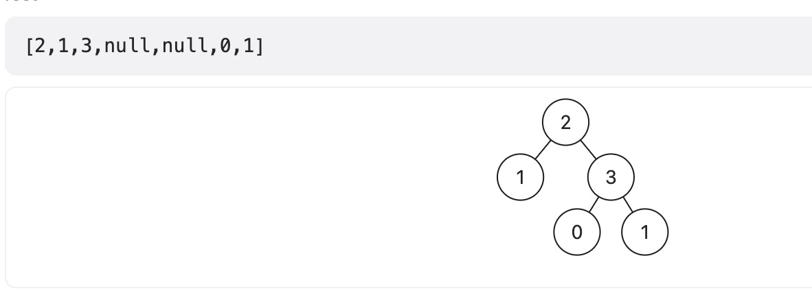

## 强密码检查器
```js
// 如果一个密码满足以下所有条件，我们称它是一个 强 密码：

// 它有至少 8 个字符。
// 至少包含 一个小写英文 字母。
// 至少包含 一个大写英文 字母。
// 至少包含 一个数字 。
// 至少包含 一个特殊字符 。特殊字符为："!@#$%^&*()-+" 中的一个。
// 它 不 包含 2 个连续相同的字符（比方说 "aab" 不符合该条件，但是 "aba" 符合该条件）。
// 给你一个字符串 password ，如果它是一个 强 密码，返回 true，否则返回 false 。

// 输入：password = "IloveLe3tcode!"
// 输出：true
// 解释：密码满足所有的要求，所以我们返回 true 。
var strongPasswordCheckerII = password => {
    return /^(?=.*\d)(?=.*[a-z])(?=.*[A-Z])(?=.*[!@#$%^&*()\-+])(?!.*(.)\1+).{8,}$/.test(password)
}
```
[前向查找/负前向查找](/front-end/JavaScript/a-exgrep1.html#子表达式)

## 兼具大小写的最好英文字母
```js
// 给你一个由英文字母组成的字符串 s ，请你找出并返回 s 中的 最好 英文字母。返回的字母必须为大写形式。如果不存在满足条件的字母，则返回一个空字符串。

// 最好 英文字母的大写和小写形式必须 都 在 s 中出现。

// 英文字母 b 比另一个英文字母 a 更好 的前提是：英文字母表中，b 在 a 之 后 出现。

// 输入：s = "lEeTcOdE"
// 输出："E"
// 解释：
// 字母 'E' 是唯一一个大写和小写形式都出现的字母。

const greatestLetter = s => {
    const ht = new Set();
    for(let i = 0; i < s.length; i++) {
        const c = s[i];
        ht.add(c);
    }
    for(let i = 25; i >= 0; i--) {
        if(ht.has(String.fromCharCode('a'.charCodeAt() + i)) && ht.has(String.fromCharCode('A'.charCodeAt() + i))) {
            return String.fromCharCode('A'.charCodeAt() + i);
        }
    }
    return '';
}
```
## 具有给定数值的最小字符--贪心
```js
// 小写字符 的 数值 是它在字母表中的位置（从 1 开始），因此 a 的数值为 1 ，b 的数值为 2 ，c 的数值为 3 ，以此类推。

// 字符串由若干小写字符组成，字符串的数值 为各字符的数值之和。例如，字符串 "abe" 的数值等于 1 + 2 + 5 = 8 。

// 给你两个整数 n 和 k 。返回 长度 等于 n 且 数值 等于 k 的 字典序最小 的字符串。

// 注意，如果字符串 x 在字典排序中位于 y 之前，就认为 x 字典序比 y 小，有以下两种情况：

// x 是 y 的一个前缀；
// 如果 i 是 x[i] != y[i] 的第一个位置，且 x[i] 在字母表中的位置比 y[i] 靠前。
 
// 输入：n = 3, k = 27
// 输出："aay"
// 解释：字符串的数值为 1 + 1 + 25 = 27，它是数值满足要求且长度等于 3 字典序最小的字符串。

const getSmallestString = function(n, k) {
    let ans = '';
    for(let i = 1; i <= n; i++) {
        let lower = Math.max(1, k - (n - i) * 26);
        k -= lower;
        ans += String.formCharCode('a'.charCodeAt() + lower - 1);
    }
    return ans;
}
```
[具有给定数值的最小字符](https://leetcode.cn/problems/smallest-string-with-a-given-numeric-value/description/)

## 生成平衡数组的方案数
给你一个整数数组 nums 。你需要选择 恰好 一个下标（下标从 0 开始）并删除对应的元素。请注意剩下元素的下标可能会因为删除操作而发生改变。

比方说，如果 nums = [6,1,7,4,1] ，那么：

选择删除下标 1 ，剩下的数组为 nums = [6,7,4,1] 。

选择删除下标 2 ，剩下的数组为 nums = [6,1,4,1] 。

选择删除下标 4 ，剩下的数组为 nums = [6,1,7,4] 。

如果一个数组满足奇数下标元素的和与偶数下标元素的和相等，该数组就是一个 平衡数组 。

请你返回删除操作后，剩下的数组 nums 是 平衡数组 的 方案数 。
```js
// 输入：nums = [2,1,6,4]
// 输出：1
// 解释：
// 删除下标 0 ：[1,6,4] -> 偶数元素下标为：1 + 4 = 5 。奇数元素下标为：6 。不平衡。
// 删除下标 1 ：[2,6,4] -> 偶数元素下标为：2 + 4 = 6 。奇数元素下标为：6 。平衡。
// 删除下标 2 ：[2,1,4] -> 偶数元素下标为：2 + 4 = 6 。奇数元素下标为：1 。不平衡。
// 删除下标 3 ：[2,1,6] -> 偶数元素下标为：2 + 6 = 8 。奇数元素下标为：1 。不平衡。
// 只有一种让剩余数组成为平衡数组的方案。

// 动态规划
const waysToMakeFair = nums => {
    let odd1 = 0, even1 = 0;
    let odd2 = 0, even2 = 0;
    for(let i = 0; i < nums.length; i++) {
        if((i & 1) !== 0) {
            odd2 += nums[i];
        } else {
            even2 += nums[i];
        }
    }
    let res = 0;
    for(let i = 0; i < nums.length; i++) {
        if((i & 1) != 0) {
            odd2 -= nums[i];
        } else {
            even2 -= nums[i];
        }
        if(odd1 + even2 === odd2 + even1) {
            res++;
        }
        if((i & 1) !== 0) {
            odd1 += nums[i];
        } else {
            even1 += nums[i]
        }
    }
    return res;
}
```
[生成平衡数组的方案数](https://leetcode.cn/problems/ways-to-make-a-fair-array/description/?languageTags=javascript)

## 统计星号--简单
```js
// 输入：s = "l|*e*et|c**o|*de|"
// 输出：2
// 解释：不在竖线对之间的字符加粗加斜体后，得到字符串："l|*e*et|c**o|*de|" 。
// 第一和第二条竖线 '|' 之间的字符不计入答案。
// 同时，第三条和第四条竖线 '|' 之间的字符也不计入答案。
// 不在竖线对之间总共有 2 个星号，所以我们返回 2 。
var countAsterisks = s => {
    return s.replace(/\|[\w\*]*\|/g, '').replace(/\w+/g, '').length;
}
// 模拟
var countAsterisks = s => {
    let valid = true;
    let res = 0;
    for(let i = 0; i < s.length; i++) {
        let c = s[i];
        if(c === '|') {
            valid = !valid;
        } else if(c === '*' && valid) {
            res++;
        }
    }
    return res;
}
```

## 计算布尔二叉树的值

```js
// 输入：root = [2,1,3,null,null,0,1]
// 输出：true
// 解释：上图展示了计算过程。
// AND 与运算节点的值为 False AND True = False 。
// OR 运算节点的值为 True OR False = True 。
// 根节点的值为 True ，所以我们返回 true 。
var evaluateTree = root => {
    if(!root.left) {
        return root.val == 1
    }
    if(root.val === 2) {
        return evaluateTree(root.left) || evaluateTree(root.right);
    } else {
        return evaluateTree(root.left) && evaluateTree(root.right);
    }
}
```
## 删除子文件夹---排序
你是一位系统管理员，手里有一份文件夹列表folder,你的任务是要删除该列表中的所有子文件夹，并以任意顺序返回剩下的文件夹。

如果文件夹 folder[i] 位于另一个文件夹 folder[j] 下，那么 folder[i] 就是 folder[j] 的 子文件夹 。

文件夹的「路径」是由一个或多个按以下格式串联形成的字符串：'/' 后跟一个或者多个小写英文字母。

例如，"/leetcode" 和 "/leetcode/problems" 都是有效的路径，而空字符串和 "/" 不是。
```js
// 输入：folder = ["/a","/a/b","/c/d","/c/d/e","/c/f"]
// 输出：["/a","/c/d","/c/f"]
// 解释："/a/b" 是 "/a" 的子文件夹，而 "/c/d/e" 是 "/c/d" 的子文件夹。

// 输入: folder = ["/a/b/c","/a/b/ca","/a/b/d"]
// 输出: ["/a/b/c","/a/b/ca","/a/b/d"]
var removeSubfolders = function(folder) {
    folder.sort();
    const ans = [folder[0]];
    for(let i = 1; i < folder.length; i++) {
        const prev = ans[ans.length -1].length;
        if(!(prev < folder[i].length && ans[ans.length - 1] === (folder[i].substring(0, prev)) && folder[i].charAt(prev) === '/')) {
            ans.push(folder[i]);
        }
    }
    return ans;
}
```


[计算布尔二叉树的值](https://leetcode.cn/problems/evaluate-boolean-binary-tree/description/?languageTags=javascript)