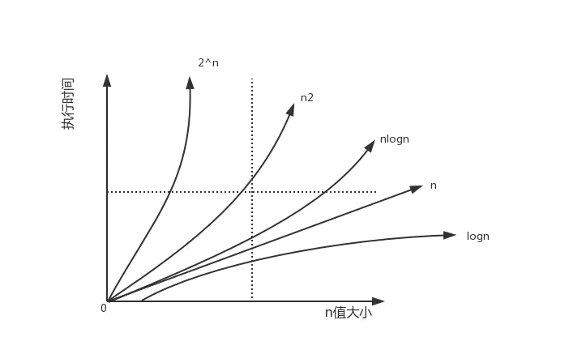

## 资料
[原文地址](https://www.jianshu.com/p/ffbb25380904)
[时间复杂度计算](https://www.jianshu.com/p/5b32849002f8)

:::tip
重要的知识点:时间复杂度和空间复杂度。
先给大家出个思考题：sum = 1+ 2+3+...+n,计算sum的值。
:::

## 为什么需要复杂度分析

- 学习数据和算法就是为了了解"快"和"省"的问题，也就是如何设计你的代码才能使运算小了更快，占用空间更小。那如何来计算代码执行效率呢？这里就会用到复杂度分析
- 虽然我们可以用代码准确的计算出执行事件，但是这也会有很多局限性
- 数据规模的不同直接影响到测试结果。比如说同一个排序算法，排序顺序不一样，那么最后的计算效率的结果也会不一样；如果恰好已经是排序好了的数组，那么执行时间就会更短。有比如说如果数据规模比较小的话，测试结果可能也无法反应算法的性能。
- 测试的环境不同也会影响到测试结果。比如说同一套代码分别在i3和i7处理器上进行测试，那么i7上的测试事件肯定会比i3d短

所以需要一个不用准确的测试结果来衡量，就可以粗略的估计代码执行事件的方法。这就是复杂度分析

## 大O复杂度表示法

以一个例子开始，请估算下面代码的执行时间
```
function total(n) { // 1
    var sum = 0; // 2
    for (var i = 0; i < n; i++) { // 3
        sum += i; // 4
    } // 5
} // 6
```
我们假设每行执行的事件都是一样，记为t，那么上面的函数中的第2行需要1个t的时间，第3和第4行分别需要n个t的事件，那么这段代码总得执行时间为(2n+1)*t

那么按照上面的分析方法，请估算下面代码的执行时间
```
function total(n) { // 1
    var sum = 0; // 2
    for (var i = 0; i < n; i++) { // 3
        for (var j = 0; j < n; j++) { // 4
            sum = sum + i + j; // 5
        }
    }
}
```
第2行需要一个t的事件，第三行需要n个t的事件，第4和第5行分别需要n<sup>2</sup> 个的时间，那么这段代码总的执行时间为 (2n<sup>2</sup>+n+1)*t 的时间。

从数学角度来看，我们可以得出个规律：代码的总执行事件T(n)与每行代码的执行次数程正比

> T(n) = O(f(n))

在这个公式中，T(n)表示代码的执行时间；n表示数据规模的大小;f(n)表示每行代码执行的次数总和；O表示代码的执行时间T(n)与f(n)表达式成正比。

所以上边两个函数的执行时间可以标记为T(n) = O(2n + 1)和T(n) = O(2n<sup>2</sup> + n + 1)。这就是**大O时间复杂度表示法**，它不代表代码真正的执行时间，而是代表**代码随数据规模增长的变化趋势**，简称**时间复杂度**

而且当n很大时，我们可以忽略常数项，只保留一个最大量级即可。所以上面的代码执行时间可以简单标记为T(n) = O(n)和T(n) = O(n<sup>2</sup>)。

## 时间复杂度分析

那如何分析一段代码的时间复杂度，可以利用下面的几个方法

### 只关注循环执行次数最多的一段代码

我们在分析一段代码的时间复杂度时，我们只要关注循环次数最多的那一段代码就ok了。
```
function total(n) { // 1
    var sum = 0; // 2
    for (var i = 0; i < n; i++) { // 3
        sum += i; // 4
    } // 5
} // 6
```
只要第3行和第4行是执行次数最多的，分别执行了n次,那么忽略常数项，所以此段代码的时间复杂度就是O(n).

### 加法法则：总复杂度等于量级最大的那段代码的复杂度
```
function total(n) {
    // 第一个for循环
    var sum1 = 0;
    for (var i = 0; i < n; i++) {
        for (var j = 0; j < n; j++) {
            sum1 = sum1 + i + j;
        }
    }
    // 第二个for循环
    var sum2 = 0;
    for (var i = 0; i < 1000; i++) {
        sum2 = sum2 + i;
    }
    // 第三个for循环
    var sum3 = 0; 
    for (var i = 0; i < n; i++) {
        sum3 = sum3 + i;
    }
}
```
我们先分别分析每段for循环的时间复杂度，在取他们中最大的量级来作为整段代码的时间复杂度。

第一段for循环的时间复杂度为O(n<sup>2</sup>).

第二段for循环执行了1000次，是个常数量级，尽管对代码的执行时间会有影响，但是当n无限大的时候，就可以忽略。因为它本身对增长趋势没有影响，所以这段代码的时间复杂度可以忽略。

第三段for循环的事件复杂度是O(n).

总上，取最大量级，所以整段代码的时间复杂度为O(n<sup>2</sup>)

### 乘法法则：嵌套代码的复杂度等于嵌套内外代码复杂度的乘积。

```
function f(i) {
    var sum = 0;
    for (var j = 0; j < i; j++) {
        sum += i;
    }
    return sum;
}
function total(n) {
    var res = 0;
    for (var i = 0; i < n; i++) {
        res = res + f(i); // 调用f函数
    }
    return res;
}
```

单独看total函数的事件复杂度就是为T1(n)=O(n),但是考虑到f函数的时间复杂度也为T2(n) = O(n).

所以整段代码的事件复杂度为T(n) = T1(n) * T2(n) = O(n * n) = O(n<sup>2</sup>)

## 几种常见的时间复杂度分析

只看最高级的复杂度

操作数量实例 | 大O表示法 | 术语
---|---|---
15| O(1) | 常数阶
3Logn | O(logn) | 对数阶
3n + 5 | O(n) | 线性阶
5n<sup>^</sup>2 + 3n + 1 | O(n<sup>^</sup>2) | 平方阶 
6n<sup>^</sup>3 + 4n + 2 | O(n<sup>^</sup>3) | 立方阶 
2<sup>^</sup>n + ` | O(2<sup>^</sup>n) | 指数阶 
n!+3 | O(n!) | 阶乘阶 

如上图可以粗略的分为两类，**多项式量级和非多项式量级**。其中，非多项式两节只有两个O(2<sup>n</sup>)和O(n!)

对应的增长率如



当数据规模n增长,非多项式量级的执行时间就会急剧增加，所以，非多项式量级的代码算法是非常低效的算法。

### O(1)

O(1)只是常量级时间复杂度表示法，并不是代码只有一行,例如
```
function total() {
    var sum = 0;
    for (var i = 0; i < 100; i++) {
        sum += i;
    }
}
```
虽然有这么多行，即使for循环执行了100次，但是代码执行时间不随n的增大而增长，所以这样的嗲吗复杂度就是O(1)

2. O(login)、O(nlogn)

对数阶时间复杂度的常见代码如下

```
function total1(n) {
    var sum = 0;
    var i = 1;
    while(i <= n) {
        sum += i;
        i = i * 2;
    }
}
function total2(n) {
    var sum = 0;
    for (var i = 1; i <= n; i = i * 2) {
        sum += i;
    }
}
```
上面两个函数都有一个共同点，变量i从1开始取值，每循环一次乘2，当大于n时，循环结束。实际上，i的取值就是一个等比数列。就想下面这样

> 2<sup>0</sup>2<sup>1</sup>2<sup>2</sup>...2<sup>k</sup>...2<sup>x</sup> = n

所以只要知道x的值，就可以知道这两个函数的执行次数了。那由2<sup>x</sup> = n 可以得出x = log<sub>2</sub>n,所以这两个函数的时间复杂度为O(log<sub>2</sub>n)

在看下面这两个的事件复杂度
```
function total1(n) {
    var sum = 0;
    var i = 1;
    while(i <= n) {
        sum += i;
        i = i * 3;
    }
}
function total2(n) {
    var sum = 0;
    for (var i = 1; i <= n; i = i * 3) {
        sum += i;
    }
}
```
由上可以得知，这两个函数的时间复杂度为O(log<sub>3</sub>n).

由于我们可以忽略常数，也可以忽略对数中的底数，所以在对数阶复杂度中，统一表示为O(logn);那O(nlogn)的含义就明确了，时间复杂度为O(logn)的代码执行了n次。

### O(m + n)、O(m * n)
```
function total(m, n) {
    var sum1 = 0;
    for (var i = 0; i < n; i++) {
        sum1 += i;
    }
    var sum2 = 0;
    for (var i = 0; i < m; i++) {
        sum2 += i;
    }
    return sum1 + sum2
}
```
因为我们无法评估m和n谁的量级比较大，所以就不能忽略掉其中一个，这个函数的复杂度就是这两个数据的量级来决定的，所以次函数的事件复杂度为O(m + n); 那么O(m * n) 的时间复杂度类似

## 空间复杂度分析

空间复杂度的话和时间复杂度类似推演即可。

所谓空间复杂度就是**表示算法的存储空间和数据规模之间的关系**

比如说分析下面代码的空间复杂度

```
function initArr(n) {
    var arr = [];
    for (var i = 0; i < n; i++) {
        arr[i] = i;
    }
}
```

根据时间复杂度的推算，忽略掉常数量级,每次数组赋值都会申请一个空间存储变量，所以此函数的空间复杂度为O(n).

常见的空间复杂度只有O(1)、O(n)、O(n<sup>2</sup>),其他的话很少用到。

## 思考题解答
现在我们回到开始的思考题，代码实现很简单
```
function tatoal(n) {
    var sum = 0;
    for (var i = 1; i <= n; i++) {
        sum += i;
    }
    return sum;
}
```

此函数的时间复杂度你现在应该很容易看出来了为O(n).

我觉得这个事件复杂度有点高了，我想要O(1)的事件复杂度函数来实现这个算法可以嘛？

可以的，小数学申通高斯教会我们一招
```
function total(n) {
    var sum = n*(n + 1) / 2
    return sum
}
```
此函数的时间复杂度仅仅为O(1),在数据规模比较庞大的时候，下面的函数是不是明显比上面的函数运算效率更好呢

## 总结
复杂度也叫渐进复杂度，包括时间复杂度和空间复杂度，一个表示执行的快慢，一个表示内存的消耗，用来分析算法执行效率与数据规模之间的增长关系，可以粗略的表示，越高阶复杂度的算法，执行效率越低。

