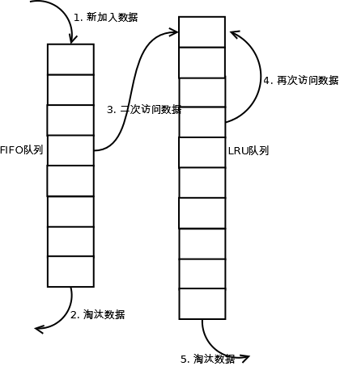
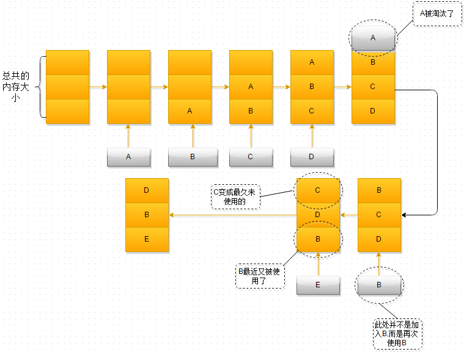

> 其实就是程序的局部性原理

一个用hash表作为底层结构的数据库，当然少不了缓存淘汰算法。

LRU（Least recently used，最近最少使用）算法根据数据的历史访问记录来进行淘汰数据，其核心思想是“如果数据最近被访问过，那么将来被访问的几率也更高”。

1. 新数据插入到链表头部;
2. 每当缓存命中(即缓存数据被访问),则将数据移动到链表头部
3. 当链表满的时候，将链表尾部的数据丢弃

过程如下：

1. 最开始时，内存空间是空的，因此依次进入A、B、C是没问题的
2. 当加入D时，就出现了问题，内存空间不够了，因此根据LRU算法，内存空间A待的时间最为久远，选择A，将其淘汰
3. 当再次引用B，内存空间中的B处于活跃状态，而C则变成了内存空间中，近段时间最久未使用的
4. 当再次向内存空间加入E时，这时内存空间又不足了，选择在内存空间待的最久的C将其淘汰出内存，这时候内存空间存放的对象就是E->B->D

[原文](https://zhuanlan.zhihu.com/p/34989978)
