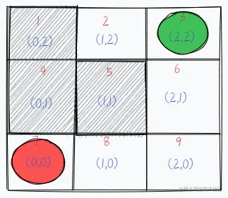
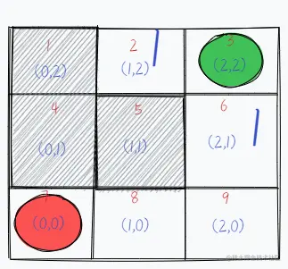
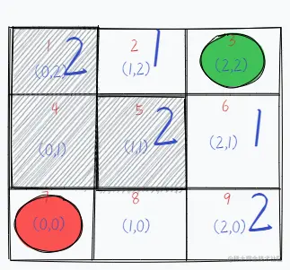
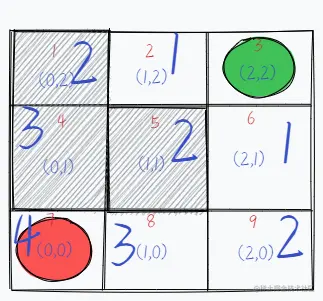

## DFS
Depth first search 成为」深度优先遍历「

下面结合具体例子来理解。如图所示，在一个九宫格图中，绿色位置代表起始位置，红色位置代表重点位置，灰色区域和宫格图的边界代表此路不通，请从起始位置按照每次只能移动一格的方法移动到终点位置



我们用DFS的方法去解这道题,由图可知,我们可以走上下左右四个方向，我们不妨先约定"左>上>右>下"的顺序走，即,如果左边可以走，我们先走左边。然后」递归「下去，没达到终点，我们在原路返回，等又返回到这个位置时，左边已经走过了，那么我们就走上面，按照这个顺序走。并且我们把走过的路(方向)作为标记表示"不能走回头路"

按照约定,我们先从起点首先向左走到位置2，这时发现左边不能走了，这时我们就考虑往上走，发现也不能走，同理，下面也不能走。按照约定，我们先从起点首先向左走到位置 2，这时发现左边不能走了，这时我们就考虑往上走，发现也不能走，同理，下边也不能走。右边刚才已经走过了也不能走，这时候无路可走了，代表这条路不能通往终点，所以现在「无路可走」的时候，沿着原路返回，直到回到了还有未走过的路的路口，尝试继续走没有走过的路径。

于是我们只有回到最初的位置 1，然后判断左边刚才已经走过了并且证实这个方向行不通，那就不必走了，上和右也是不通，所以我们走下边。于是走到了 6 的位置，此时还是按照约定“左>上>右>下” 的顺序走，左边和右边依然不通，上边刚才已经走过了，所以得继续往下走。
继续往下那就是位置 9 了，到了这个路口我们继续按照约定“左>上>右>下” 的顺序，先往左发现可以走，那么就继续走到位置 8，到了位置 8 还是按照刚才的思路继续往左，发现还可以走，并且最终到达终点位置 7。
综上所述，这个过程就是「深度优先遍历」。

<span style="color: red">DFS的重点在于状态回溯，</span>因此我们做个思路总结：

- 深度优先遍历 **只有前面有可以走的路**,就会一直向前走，直到五路可走才会回头
- 」无路可走「有两种情况:① 遇到了墙；②遇到了已经走过的路
- 在」无路可走「的时候，**沿着原路返回**，直到回到了还有未走过的路的路口，尝试继续走没有走过的路径；
- 有一些路径没有走到，这是因为找到了出口，程序就停止了
- 」深度优先遍历「也叫」深度优先搜索「，遍历是行为的描述，搜索是目的(用途)
- 遍历不是很深奥的事情，把所有的可能情况都遍历一遍，才能说」找到了目标元素「或者」没有找到目标元素「。遍历也叫穷举，穷举的思想在人类看来虽然很不起眼，但借助计算机强大的计算能力，穷举可以帮助我们解决很多专业领域知识不能解决的问题。

> 使用DFS来解答刚才题目的代码如下

```js
// 我们以红点位置为坐标{0, 0},绿色位置坐标为{2,2}
// 目标的坐标位置
let target = {
    x: 0, 
    y: 0
}
// 绿色起点坐标位置
let currentLocation = {
    x: 2,
    y: 2
}
let used = []; // 用来标记地图上哪些点是走过的
let reached = false; //是否能到达目标位置
// 表示灰色区域的格子
const illegalLocation = [
    { x: 0, y: 2 }, // 序号1的坐标
    { x: 0, y: 1 }, // 序号4的坐标
    { x:1, y: 1} // 序号5的坐标
]
function isLegalLocation({x, y}, illegalLocation) {
    let flag = true;
    // 位置不能在地图坐标之外
    if(x < 0 || x > 2 || y < 0 || y > 2) {
        return (flag = false);
    }
    // 不能走的路径
    for(const { x: locX, y: locY } of illegalLocation) {
        if(x === locX && y === locY) {
            flag = false;
        }
    }
    return flag;
}
//向左移动
function toLeft({ x, y }) {
    return { x: x - 1, y };
}

//向上移动
function toTop({ x, y }) {
    return { x, y: y + 1 };
}

//向右移动
function toRight({ x, y }) {
    return { x: x + 1, y };
}

//向下移动
function toBottom({ x, y }) {
    return { x, y: y - 1 };
}

function dfs(target, location, illegalLocation, used) {
    // 如果当前位置与目标坐标相同表示可以达到
    if(Object.entries(target).toString() === Object.entries(location).toString()) {
        return (reached = true);
    }
    let current = location;
    const newIllegalLocation = illegalLocation.concat(used);
    if(isLegalLocation(toLeft(location), newIllegalLocation)) {
        current = toLeft(location);
    } else if(isLegalLocation(toTop(location), newIllegalLocation)) {
        current = toTop(location);
    }else if (isLegalLocation(toRight(location), newIllegalLocation)) {
        current = toRight(location);
    } else if (isLegalLocation(toBottom(location), newIllegalLocation)) {
        current = toBottom(location);
    } else {
        //走不通了就直接返回
        return false
    }
    used.push(current); // 将刚才走过的格子标记为已走过
    return dfs(target, current, illegalLocation, used); // 递归下去
} 
dfs(target, currentLocation, illegalLocation, used)
```
## BFS(Breadth first search)
Breadth first search 称作」广度优先遍历「

BFS较之 DFS 不同在于，BFS旨在面临一个路口时，把所有的岔路口都记下来，然后选择其中一个进入，然后将它的分路情况记录下来，然后在返回进入另外一个岔路，并重复这样的操作，用图形来表示是这样的



从绿色起点出发，记录所有的岔路口，并标记为走一步可以到达的。然后选择其中一个方向走进去，我们走绿色左边（序号为 2）的那个格子，然后将这个路口可走的方向记录下来并标记为 2，意味走两步可以到达的地方。



接下来，我们回到起点下面 1 的方块上（序号为 6），并将它能走的方向也记录下来，同样标记为 2，因为也是走两步便可到达的地方。这样走一步以及走两步可以到达的地方都搜索完毕了，后续同理，我们可以把走三步的格子给标记出来。


再之后是第四步。我们便成功寻找到了路径，并且把所有可行的路径都求出来了。



> 注意:格子序号分别为1、4、5的地方是灰色区域表示此路不通

使用BFS来解答刚才题目代码如下
```js
// 我们以红点位置为坐标{0, 0},绿色位置坐标为{2,2};
// 目标的坐标位置
let target = {
    x: 0, 
    y: 0
}
// 绿色起点的坐标位置
let currentLocation = {
    x: 2, 
    y: 2
}
// 表示灰色区域的格子
const illegalLocation = [
    { x: 0, y: 2 }, // 序号1的坐标
    { x: 0, y: 1 }, // 序号4的坐标
    { x: 1, y: 1 } // 序号5的坐标
]

function isLegalLocation({ x, y }, illegalLocation) {
    let flag = true;
    // 位置不能在地图坐标之外
    if(x < 0 || x > 2 || y < 0 || y > 2) {
        return (flag = false)
    } 
    // 不能走的路径
    for(const { x: locX, y: locY } of illegalLocation) {
        if(x === locX && y === locY) {
            flag = false;
        }
    }
    return flag
}
//向左移动
function toLeft({ x, y }) {
  return { x: x - 1, y };
}

//向上移动
function toTop({ x, y }) {
  return { x, y: y + 1 };
}

//向右移动
function toRight({ x, y }) {
  return { x: x + 1, y };
}

//向下移动
function toBottom({ x, y }) {
  return { x, y: y - 1 };
}

function bfs(target, location, illegalLocation) {
    let reached = false; // 是否能够达到目标位置
    let stack = [];
    let searched = new Set(); // 已经走过的格子
    stack.push(location);
    while(stack.length) {
        let temp = stack.pop();
        const newIllegalLocation = illegalLocation.concat([...searched]);
        //假设按照“左>上>右>下”的顺序走
        if (isLegalLocation(toLeft(temp), newIllegalLocation)) {
            temp = toLeft(temp);
        } else if (isLegalLocation(toTop(temp), newIllegalLocation)) {
            temp = toTop(temp);
        } else if (isLegalLocation(toRight(temp), newIllegalLocation)) {
            temp = toRight(temp);
        } else if (isLegalLocation(toBottom(temp), newIllegalLocation)) {
            temp = toBottom(temp);
        } else {
            //没有通路就直接返回
            return false
        }
        searched.add(temp);
        stack.push(temp);
        for(const {x: locX, y: locY} of searched) {
            if(target.x === locX && target.y === locY) {
                // 如果当前位置与目标坐标相同表示可以达到
                reached = true;
                stack = [];
                break;
            }
        }
    }
    return reached;
}
bfs(target, currentLocation, illegalLocation)
```
」广度优先遍历「 的思想在生活中随处可见
- 如果我们要找一个律师，我们先会在朋友中查找，如果没有找到，继续在朋友的朋友中查找，知道找到为止
- 把一块湿透投入平静的水面，激起的一层一层波纹就呈现「广度优先遍历」的特点。

## 总结
- 」一条路走到底，不撞南墙不回头「 是对DFS的最直观描述。因此DFS可以借助」递归「 实现
- BFS呈现出」一层一层向外扩张「 的特点，先看到的节点先遍历，后看到的节点后遍历，因此BFS可以借助」队列「 实现。(遍历到一个节点时，如果这个节点有左(右)孩子节点，一次将他们加入队列)
- DFS适合目标明确的寻找，而BFS适合大范围的寻找


## 资料
[遍历方式中最基础的两种算法之DFS & BFS](https://juejin.cn/post/7185539936722878525)