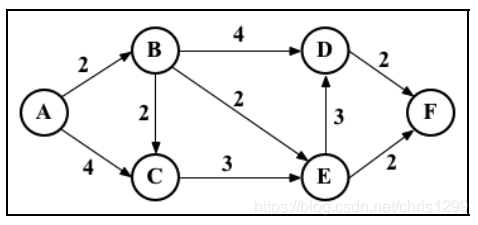

Dijkstra算法(迪杰斯特拉算法)是一种计算从单个源到所有其他源的最短路径的贪心算法(无法解决边权值为负的情况)

考虑下图



```js
let graph = [
    [0, 2, 4, 0, 0, 0],
    [0, 0, 2, 4, 2, 0],
    [0, 0, 0, 0, 3, 0],
    [0, 0, 0, 0, 0, 2],
    [0, 0, 0, 3, 0, 2],
    [0, 0, 0, 0, 0, 0]
];
// a-b-c-d-e-f    b-a-b-c-d-e-f c-a-b-c-d-e-f ...
let INF = Number.MAX_SAFE_INTEGER // MAX_SAFE_INTEGER属性表示在JavaScript的最大安全整数

// 从尚未处理的顶点选出距离最近的顶点
function minDistance(dist, visited) {
    let min = INF;
    let minIndex = -1;
    for(let i = 0; i < dist.length; i++) {
        if(!visited[i] && dist[i] < min) {
            minIndex = i;
            min = dist[i];
        }
    }
    return minIndex;
}
function dijkstra(src) {
    let dist = [];
    let visited = [];
    let length = graph.length;
    for(let i = 0; i < length; i++) { // (1)
        dist[i] = INF;
        visited[i] = false;
    }
    dist[src] = 0; // (2);
    for(let j = 0; j < length - 1; j++) { // (3)
        let u = minDistance(dist, visited); // (4)
        visited[u] = true; // (5)
        for(let v = 0; v < length; v++) {
            if(
                !visited[v] && // (6)
                dist[u] != INF && // (7)
                graph[u][v] != 0 && // (8)
                dist[u] + graph[u][v] < dist[v] // (9)
            ) {
                dist[v] = dist[u] + graph[u][v] // (10)
            }
        }
    }
    return dist // (11)
}
const res = dijkstra(0);
console.log(res, 'res'); // [0, 2,4, 5, 4,6];
// 求B点到其他点的最短距离
// const res = dijkstra(1);
// Infinity表示点B与点A不相邻，从上图可知A与B相邻，而B与A不相邻
// [ Infinity, 0, 2, 4, 2, 4 ]
```
算法解析
1. 首先，把所有的距离初始化为无限大(INF = Number.MAX_SAFE_INTEGER),将visited[]出生计划为false
2. 然后，将源顶点到自己的距离设为0;
3. 接下来，要找出到其余顶点的最短距离(只需要算length - 1，最后一次，其他点都已经被visited过了，所以无需在算了)
4. 为此，我们需要从尚未处理的顶点中选出距离最近的顶点
5. 把选出的顶点标为visited，以避免重复计算
6. 已经被处理过的点，已经得到了最短的距离，无需在计算
7. 这种情况出现与dijkstra(1)这种情况，源点(src)存在无法到达某一点A，当然这里不会走到这一步，因为只循环了length- 1次，如果存在两个无法到达的点，那么在处理最后一次时，便会出现这种情况
8. 当前处理u点和v点不相邻
9. 如果找到了更短的路径，则更新最短路径的值
10. 处理完所有顶点后，返回源顶点(src)到图中其他顶点最短路径的结果


- 实例
```js
const graph = {
    ndoes: [1,2,3,4,5,6],
    edges: [[1,2], [2,3], [3,5], [5,6], [2,4],[2,6]]
}
const findPath = (graph, start, end) => {
    let path = [];
    let res = [];
    let map = new Map();
    let min = Infinity
    const dfs = (graph, start, end, path, map, res) => {
        if(path.length && path[path.length - 1][1] === end) {
            res.push([...path]);
            return;
        }
        for(let i = 0; i < graph.edges.length; i++) {
            let item = graph.edges[i];
            if(!map[item]) {
                if(item[0] === start || (path.length && path[path.length - 1][1] === item[0])) {
                    map[item] = true;
                    path.push(item);
                    dfs(graph, start, end, path, map, res);
                    path.pop();
                    map[item] = false;
                }
            }
        }
    }
    dfs(graph, start, end, path, map, res) 
    let result = []
    for(let i = 0; i < res.length; i++) {
        if(res[i].length < min) {
            result = res[i];
        }
    }
    return result.length > 0 ? result : null;
}
console.log(findPath(graph, 1, 6))
```
## 资料
[js 版迪杰斯特拉算法(Dijkstra)代码实现](https://www.jianshu.com/p/bfe0cc07175f)

[js实现Dijkstra算法详解](https://blog.csdn.net/chris1299/article/details/118732978)