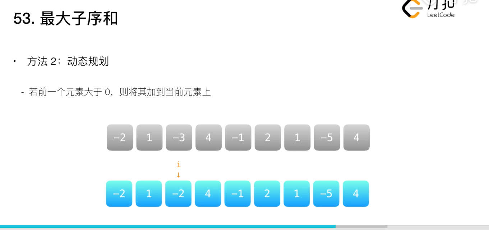

## 什么是动态规划

动态规划是求解决策过程最优化的数学方法。把多个过程转化成一些列单阶段问题，利用各阶段之间的关系，逐个求解，创立了解决这类过程优化问题的新方法-动态规划

## 什么时候要用动态规划

如果要求一个问题的最优化(通常是最大值或最小值)，而且该问题能够**分解成若干个子问题，并且小问题之间也存在重叠的子问题，则考虑采用动态规划。

## 怎么使用动态规划
1. 判断题意是否找出一个问题的最优解
2. 从上往下分析问题，大问题可以分解成子问题，子问题中还有更小的子问题
3. 从下往上分析，找出这些问题之间的关联(状态转移方程)
4. 讨论底层的边界问题
5. 解决问题(童男长使用数据进行迭代求出最优解)

## 最大子序和

[leetcode地址](https://leetcode-cn.com/problems/maximum-subarray/solution/zui-da-zi-xu-he-by-leetcode-solution/)

给定一个整数数组nums，找到一个具有最大和的连续子数组(子数组最少包含一个元素),返回其最大和

输入： nums = [-2, 1, -3, 4, -1, 2,1, -5, 4]

输出：6

解释：连续子数组[4, -1, 2, 1]的和最大为6



```js
var maxSubArray = function(nums) {
    var cur = 0; maxSub = nums[0];
    nums.forEach(x => {
        cur = Math.max(cur + x, x);
        maxSub = Math.max(maxSub, cur);
    })
    return maxSub;
};
```

## 爬楼梯

```js
var climbStairs = function(n) {
    var dp = [];
    dp[0] = 1;
    dp[1] = 1;
    for (var i = 2; i <= n; i++) {
        dp[i] = dp[i - 1] + dp[i - 2]
    }
    return dp[n];
}
```

## 最长回文串
给定一个字符串 s，找到 s 中最长的回文子串。你可以假设 s 的最大长度为 1000。
```
输入: "babad"
输出: "bab"
注意: "aba" 也是一个有效答案。
```
1. 定义状态
    dp[i][j]表示子串s[i...j]是否为回文串，这里子串s[i..j]定义为左闭右闭区间，可以取到s[i]和s[j]。

2. 思考状态转移方程
    对于一个子串而言，如果它是回文串，那么它的收尾增加一个相同字符，它仍然是个回文串
    ```
    dp[i][j] = (s[i] === s[j]) && dp[i + 1][j - 1]
    ```
3. 初始状态
    ```
    dp[i][j] = true // 单个字符是回文串
    if(s[i] === s[s+1]) dp[i][i+ 1] = true; // 连续两个相同字符是回文串 
    ```
4. 代码实现

```js
const logestPalindrome = s => {
    if (s.length < 2) return s;
    let res = s[0], dp = Array.from(Array(s.length), () => Array(s.length).fill(0))
    for (let i = 0; i < s.length; i++) {
        dp[i][i] = true;
    }
    for (let j = 1; j < s.length;; j++) {
        for (let i = 0; i < j; i++) {
            if (j - i === 1 && s[i] === s[j]) {
                dp[i][j] =  true;
            } else if (s[i] === s[j] && dp[i+ 1][j - 1]) {
                dp[i][j] = true;
            }
            // 获取当前最长回文子串
            if(dp[i][j] && j - i + 1 > res.length) {
                res = s.substring(i, j+ 1);
            }
        }
    }
    return res;
}

// 第二种
var longestPalindrome = function(s) {
    let ans = '';
    let n = s.length;
    let dp = Array.from(Array(n), (_, i) => Array(n).fill(0));
    for(let i = n-1; i >=0; i--) {
        for (let j = i; j < n; j++) {
            dp[i][j] = s[i] === s[j] && ( j - i < 2 || dp[i+1][j-1])
            if (dp[i][j] && j - i + 1 > ans.length) {
                ans = s.substr(i, j - i + 1)
            }
        }
    }
    return ans;
};
```
复杂度分析：

时间复杂度：O(n^2^)

空间复杂度：O(n^2^)

## 分割回文串
给你一个字符串 s，请你将 s 分割成一些子串，使每个子串都是 回文串 。返回 s 所有可能的分割方案。

回文串 是正着读和反着读都一样的字符串。

```
输入：s = "aab"
输出：[["a","a","b"],["aa","b"]]
```
解答
```js
const partition = s => {
    const dfs = (i) => {
        if (i === n) {
            ret.push(ans.slice());
            return;
        }
        for (let j = i; j < n; ++j) {
            if (f[i][j]) {
                ans.push(s.slice(i, j + 1));
                dfs(j + 1);
                ans.pop();
            }
        }
    }
    
    const n = s.length;
    const f = new Array(n).fill(0).map(() => new Array(n).fill(true));
    let ret = [], ans = [];
    
    for (let i = n - 1; i >= 0; --i) {
        for (let j = i + 1; j < n; ++j) {
            f[i][j] = (s[i] === s[j]) && f[i + 1][j - 1];
        }
    }
    dfs(0);
    return ret;
}
```

## 单词划分
```
输入: s = "leetcode", wordDict = ["leet", "code"]
输出: true
解释: 返回 true 因为 "leetcode" 可以由 "leet" 和 "code" 拼接成。
```
解答
```js
var wordBreak = function(s, wordDict) {
    const wordSet = new Set(wordDict);
    const len = s.length;
    const dp = new Array(len + 1).fill(false);
    dp[0] = true;
    for (let i = 1; i <= len; i++) {
        for (let j = i - 1; j >= 0; j--) {
            if (dp[i] === true) break;
            if (dp[j] === false) continue;
            const suffix = s.slice(j, i);
            if (wordSet.has(suffix) && dp[j] = true) {
                dp[i] = true;
                break;
            }
        }
    }
    return dp[s.length]
}
```

## 割绳子
给你一根长度为 n 的绳子，请把绳子剪成整数长的 m 段（ m 、 n 都是整数， n > 1 并且 m > 1 ， m <= n ），每段绳子的长度记为 k[1],...,k[m] 。请问 k[1]*k[2]*...*k[m] 可能的最大乘积是多少？例如，当绳子的长度是 8 时，我们把它剪成长度分别为 2、3、3 的三段，此时得到的最大乘积是 18 。

```js
var cuttingRope = function(n) {
    let i, j, dp = new Array(n + 1).fill(0), nowBigger;
    dp[2] = 1;
    // 如果只剪掉长度为1，对最后的乘积无任何增益，所以从长度为2开始剪
    for(i = 2; i <= n; i++) {
        for(j = 1; j < i; j++) {
            // 剪了第一段后，剩下(i - j)长度可以剪也可以不剪。如果不剪的话长度乘积即为j * (i - j)；如果剪的话长度乘积即为j * dp[i - j]。取两者最大值
            nowBigger = Math.max(j * (i - j), j * dp[i - j]);
            // 对于同一个i，内层循环对不同的j都还会拿到一个max，所以每次内层循环都要更新max
            dp[i] = Math.max(dp[i], nowBigger);
        }
    }
    return dp[n];
};
```
## 最长公共子序列
```
输入：text1 = "abcde", text2 = "ace" 
输出：3  
解释：最长公共子序列是 "ace" ，它的长度为 3 。
```
解答
```js
const longestCommonSubsequence = (str1, str2) => {
    let n = str1.length;
    let m = str2.length;
    let dp = Array.from(Array(n + 1), (_, i) => Array(m + 1).fill(0));
    for(let i = 1; i <= n; i++) {
        let c1 = str1[i - 1];
        for(let j = 1; j <= m; j++) {
            let c2 = str2[j - 1];
            if(c1 === c2) {
                dp[i][j] = dp[i - 1][j - 1] + 1
            } else {
                dp[i][j] = Math.max(dp[i - 1][j], dp[i][j - 1])
            }
        }
    }
    return dp[n][m]
}
```

[leetcode](https://leetcode-cn.com/problems/jian-sheng-zi-lcof/)