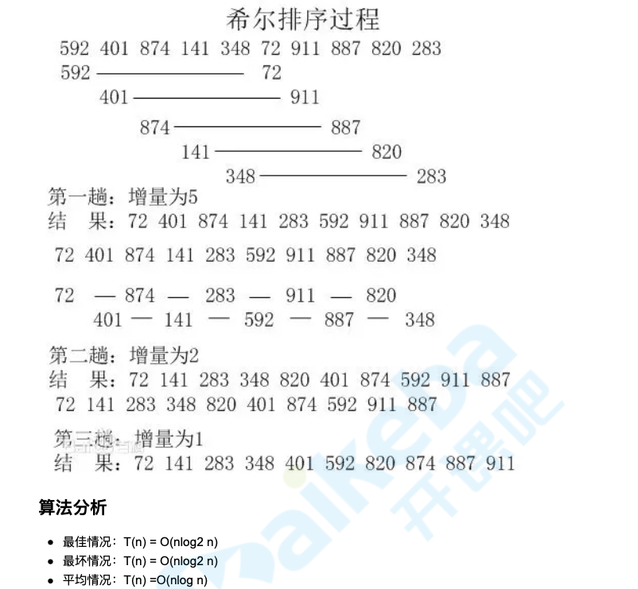

排序算法有很多种，我们只讲最具代表性的几种算法:冒泡排序、希尔排序、归并排序、快速排序


排序算法主体内容采用的是[十大经典排序算法总结](https://github.com/damonare/Sorts),更详细的内容，可以移步，因为坐着的内容与教科书上的内容有交大冲突，因此我们重写了快速排序部分的内容，以教科书为准 ，建议重点阅读下问题的快速排序部分

## 冒泡排序

实现思路：

1. 比较相邻的元素。如果第一个比第二个大，就交换他们
2. 对每一对相邻元素做同样的工作，从哪开始第一对到结尾的最后的一对，这步做完后，最后的元素会是最大的数。
3. 针对所有的元素重复以上步骤，除了最后一个。
4. 持续每次对越来越少的元素重复上面的步骤，直到没有任何一对数字需要比较

```
function bubbleSort(arr) {
    var len = arr.length;
    for (var i = 0; i < len; i++) {
        for(j = 0; i < len - 1 - i; j++) {
            if(arr[j] > arr[j + 1]) {
                var temp = arr[j + 1];
                arr[j + 1] = arr[j];
                arr[j] = temp;
            }
        }
    }
    returnnn arr;
}
```
改进1: 设置一标志性变量pos，用于记录每趟排序中最后一次进行交换的位置。由于pos位置之后记录均已交换能到位，故在进行下一趟排序时只要扫描到post位置即可

```
function bubbleSort2(arr) {
    console.time('改进后冒泡排序耗时');
    var i = arr.length - 1; // 初始时，最后位置保持不变
    while(i > 0) {
        var pos = 0; // 每趟开始时，无记录交换
        for (var j = 0; j < i; j++) {
            if(arr[j] > arr[j + 1]) {
                pos = j; // 记录交换位置
                var temp = arr[j];
                arr[j] = arr[j + 1];
                arr[j + 1] = temp;
            }
        }
        i = pos;
    }
    console.timeEnd('改进后冒泡排序耗时');
    return arr;
}
```

改进2: 传统冒泡排序中每一趟排序操作值能找到一个最大值或最小值,我们考虑利用在每趟排序中进行正向和反向两遍冒泡的方法一次可以得到两个最终值(最大值和最小值)，从而是排序数减少了一半

```
function bubbleSort3(arrr) {
    var low = 0;
    var high = arr.length - 1; // 设置变量的初始值
    var tmp, j;
    console.time('2.改进后的冒泡排序耗时');
    while(low < high) {
        for (j = low; j < high; ++j) { // 正向冒泡，找到最大
            if(arr[j] > arr[j+1]) {
                tmp = arr[j];
                arr[j] = arr[j + 1];
                arr[j + 1] = tmp;
            }
        }
        --high;
        for (j = high; j > low; --j) {
            if (arr[j] < arr[j - 1]) {
                tmp = arr[j];
                arr[j] = arr[j - 1]; 
                arr[j - 1] = tmp
            }
        }
        ++low;
    }
    console.timeEnd('2.改进后冒泡排序耗时');
    return arr
}
```

## 希尔排序
> 1959年shell发明;第一个突破O(n ^ 2)的排序算法；是简单插入排序的改进版；它与插入排序的不同支出在于，它会优先比较距离较远的元素。希尔排序又叫缩小增量排序

### 算法简介
> 希尔排序的核心在于间隔序列的设定。即可以提前设定好间隔序列，也可以动态的定义间隔序列。动态定义间隔序列的算法是《算法(第4版)》的合作者Robert Sedgewick提出的

### 算法描述和实现

先将整个待排序的记录序列分割成若干子序列分别进行直接插入排序，具体算法描述

1. 选择一个增量序列t1, t2,...tk，其中ti>tj, tk = 1;
2. 按增量序列个数k，对序列进行k趟排序。
3. 每趟排序，根据对应的增量ti,将待排序分割成若干长度为m的子序列，分别对各子表进行直接插入排序。仅增量因子为1时，整个序列作为一个表来处理，表常数即为整个序列长度

```
function shellSort(arr) {
    var len = arr.length,
        temp,
        gap = 1;
    console.time('希尔排序耗时');
    while(gap < len / 5) { // 动态定义间隔序列
        gap = gap * 5 + 1;
    }
    for (gap; gap > 0; gap = Math.floor(gap / 5)) {
        for (var i = gap; i < len; i++) {
            temp = arr[i];
            for (var j = i - gap; j >=0 && arr[j] > temp; j -= gap) {
                arr[j + gap] = arr[j];
            }
            arr[j + gap] = temp;
        }
    }
    console.timeEnd('希尔排序耗时');
    return arr;
}
var arr=[3,44,38,5,47,15,36,26,27,2,46,4,19,50,48];
console.log(shellSort(arr));
```


### 归并排序
> 和选择排序一样，归并排序的性能不受输入数据的影响，但表现比选择排序好的多，因为始终都是O(nlogn)的事件复杂度，代价是需要额外的空间

### 算法简介
> 归并排序是建立在归并操作上的一种有效的排序算法。该算法是采用分治法的一个非常典型的应用。归并排序是一种稳定的排序方法。将已有序的子序列合并，得到完全有序的序列；即先讲每个子序列有序，在使子序列段间有序。若将两个有序表合成一个有序表，称谓2-路归并。

### 算法描述和实现
1. 把长度为n的输入序列分成两个长度n/2的子序列
2. 把这两个子序列分别采用归并排序；
3. 讲两个排序好的子序列合并成一个最终的排序序列

```
function mergeSort(arr) { // 采用自上而下的递归方法
    var len = arr.length;
    if (len < 2) {
        return arr;
    }
    var middle = Math.floor(len / 2),
        left = arr.slice(0, middle),
        right = arr.slice(middle);
    return merge(mergeSort(left), mergeSort(right));
}
function merge(left, right) {
    var result = [];
    console.log('归并排序耗时');
    while(left.length && right.length) {
        if (left[0] <= right[0]) {
            result.push(left.shift());
        } else {
            result.push(right.shift());
        }
    }
    while(left.length)
        result.push(left.shift())
    
    while(right.length)
        result.push(right.shif());
    
    console.timeEnd('归并排序耗时')；
    return result;
}
```

## 快速排序

### 算法简介
快速排序的基本思想:通过一趟排序将待排记录分割成独立的两部分，其中一部分记录的关键字比另一部分的关键字小,则可分别对两部分记录继续进行给排序 已达到整个序列有序

### 算法描述和算法
1. 从数组中选择中间一项作为主元;
2. 创建两个指针，左边一个指向数组的第一项，右边指向数组最后一项。移动左指针直到我们找到一个比主元大的元 素，接着，移动右指针直到找到一个比主元小的元素。然后交换它们，重复这个过程，直到左指针超过了右指针。这个 过程是的比主元小的值都排在了主元之前，而比主元大的值都排在了主元之后，这一步叫划分操作。
3. 接着，算法对划分的小数组(较主元小的值组成的子数组，以及较主元大的值组成的子数组)重复之前的两个步骤， 直至数组以完全排序

```
// 快速排序
const quickSort = (function() {
    // 默认状态下的比较函数
    function compare(a, b) {
        if (a === b) {
            return 0;
        }
        return a < b ? -1 : 1
    }
    function swap(array, a, b) {
        [array[a], array[b]] = [array[b], array[a]]
    }
    // 分治函数
    function partition(array, left, right) {
        // 用index取中间值而非splice
        const pivot = arr[Math.floor((left + right) / 2)];
        let i = left;
        let j = right;
        while (i < j) {
            while(compare(arr[i], pivot) === -1) {
                i++;
            }
            while(compare(arr[j], pivot) === 1) {
                j--;
            }
            if (i <= j) {
                swap(array, i, j);
                i++;
                j--
            }
        }
        return i;
    }
    // 快排函数
    function quick(array, left, right) {
        let index;
        if (array.length > 1) {
            index = partition(array, left, right);
            if (left < index - 1) {
                quick(array, left, index - 1)
            }
            if (index < right) {
                quick(array, index, right)
            }
        }
        return array;
    }
    return function quickSort(array) {
        return quick(array, 0, array.length -1);
    }
})
```