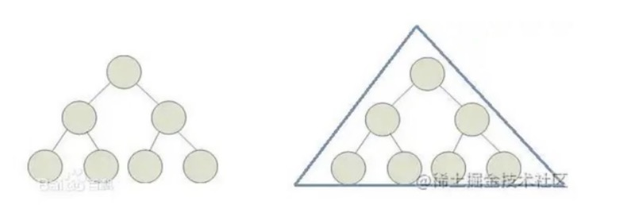
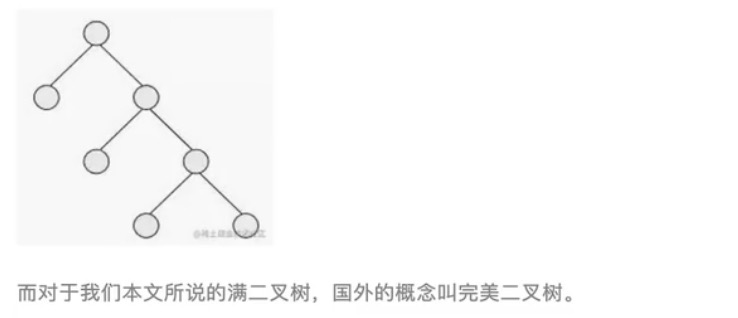
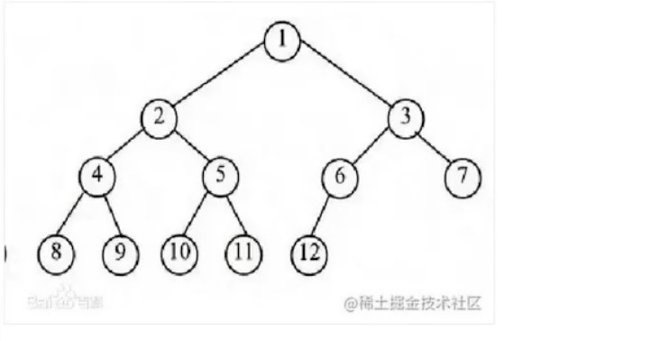
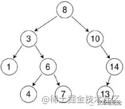
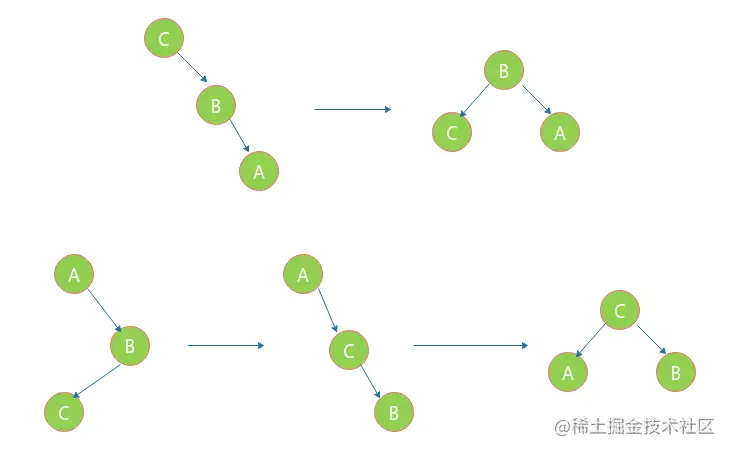
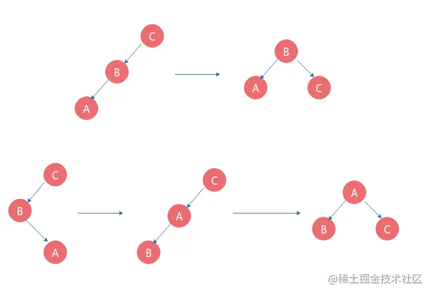
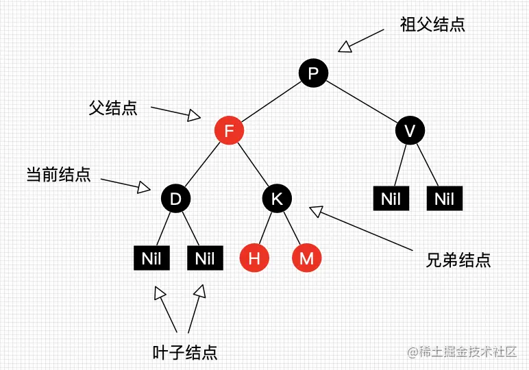

## 二叉树
是指树中节点的度不大于2的有序树，它是一种最简单且最重要的树

## 满二叉树
除最后一层无任何子节点外，每一层上的所有节点都有两个子节点的二叉树。

从图形形态上看，满二叉树是一个三角形。

如果一个二叉树的层数为K，且节点总数是(2^K) - 1, 则它是满二叉树



:::tip
注意：关于满二叉树定义里，国内外定义有分歧，本文采用的是国内定义。满二叉树英文是Full Binary Tree，是指所有的节点的度只能是0或者2,
如下图，国外也为人是Full Binary Tree
:::


## 完全二叉树
一颗深度为K的有n个节点的二叉树，对树中的节点按照从上到下、从左到右的顺序进行编号，如果编号为i(1<= i<=n)的节点与满二叉树中编号为i的节点在二叉树中的位置相同，则这颗二叉树成为完全二叉树。叶子节点只可能在最大的两层出现



## 二叉搜索树
### 特点
1. 若左子树不为空，则左子树上所有节点的值均小于它的根节点的值
2. 若右子树不为空，则右子树上所有节点的值均大于等会它的根节点的值
3. 左、右树也分别为二叉排序树



也就是说,<span style="color:blue">二叉查找树，左子树都都比节点小，右子树都比节点大，递归定义</span>

根据二叉排序树这个特点我们可以知道：**二叉排序树的中序遍历一定是从小到大的**

比如上图，中序遍历结果是：
```
1 3 4 6 7 8 10 13 14
```

[搞定二叉搜索树，9图足矣！](https://juejin.cn/post/6884625649256890382)

## 平衡二叉树(AVL树)
平衡二叉树是任何两个子树的高度差不超过1(平衡因子)的二叉树(可以是空树)

平衡而出为了保持"完全平衡"，当由于增删数据发生不平衡时，会通过旋转达到平衡的目的。旋转方式
- 左转

    

- 右转

    

## 红黑树
红黑树是一种含有红黑节点，并能自平衡的二叉查找树。红黑树必须具有一下特性：
- 所有节点必须是红色或者黑色
- 根节点必须是黑色
- 所有叶子节点(NIL)d都是黑色
- 每个红色节点的两个子节点一定都是黑色
- 每个节点到叶子节点的路径上，都包含相同数量的黑色节点
- 如果一个节点为黑色，那么这个节点一定有两个子节点



红黑树是一种完全平衡的二叉查找树，如图，根节点的左子树明显比右子树高，但是左子树和右子树的黑色节点的层数是相等的，即属性5。每次添加、删除节点，红黑树会通过旋转和变色来保持自平衡，且旋转次数最多为3，复杂度是O(lgn)。


## 遍历方法
1. 层序遍历
2. 递归(一般用于深度优先  也可以层序遍历)

## 资料
[二叉树、平衡二叉树、红黑树](https://juejin.cn/post/6989602410364665864)

[3 分钟理解完全二叉树、平衡二叉树、二叉查找树](https://juejin.cn/post/6844903606408183815)