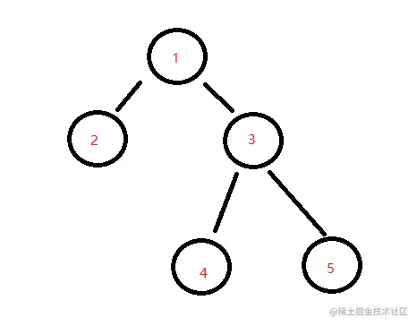

## 基本概念
<span style="color: red">**数据结构是计算机的基础，算法是计算机科学**</span>

常听到算法的时候,就会有人说到**时间复杂度，空间复杂度**。那么这两个是什么意思呢？


### 时间复杂度
其实就是一个函数，用大O表示，比如O(1)、O(n)...

<span style="color: blue">它的作用就是用来定义没描述算法的运行时间</span>

- O(1)

    ```js
    let i = 0; 
    i += 1;
    ```
- O(n): 如果是O(1) + O(n)则还是O(n)

    ```js
    for(let i = 0; i < n; i++) {
        console.log(i)
    }
    ```
- O(n^2): O(n) * O(n^2),也就是双层循环，自此类推:O(n ^ 3)

    ```js
    for (let i = 0; i < n; i += 1) {
        for(let j = 0; j < n; j += 1) {
            console.log(i, j)
        }
    }
    ```
- O(logn): 就是求log以2为底的多少次方等于n

    ```js
    // 例：2^3 =8
    // 那么 log(2) 8 = 3

    // 这个例子就是求2的多少次方会大于n,然后就会结束循环。这就是一个典型的O(logn);
    let i = 1;
    while(i < n) {
        console.log(i);
        i *= 2;
    }
    ```
### 空间复杂度
和时间复杂度一样，空间复杂度也是用大O表示，比如O(1)、O(n)...

<span style="color: red">**它用来定义描述算法运行过程中临时占用的存储空间大小**</span>

> 占用越少，代码写的就越好

- O(1):单个变量，所以占用永远是O(1)

    ```js
    let i = 0; 
    i += 1;
    ```
- O(n): 声明一个数组，添加n个值，相当于占用了n个空间单元

    ```js
    const arr = [];
    for(let i = 0; i < n; i += 1) {
        arr.push(i);
    }
    ```
- O(n ^ 2):类似一个矩阵的概念，就是二维数组的意思

    ```js
    const arr = [];
    for(let i = 0; i < n; i += 1) {
        arr.push([]);
        for(let j = 0; j < n; j += 1) {
            arr[i].push(j);
        }
    }
    ```
## 数据结构
### 1.栈
<span style="color: red">一个先进后出的数据结构</span>

按照常识理解就是有序的挤公交，最后上车的人会在门口，然后门口的人会最先下车


> js中没有栈的数据类型,但我么可以通过Array来模拟一个
```js
const stack = [];

stack.push(1); // 入栈
stack.push(2); // 入栈

const item1 = stack.pop(); // 出栈元素
```
- 十进制转二进制

    ```js
    // 时间复杂度O(n) n为二进制的长度
    // 空间复杂度O(n) n为二进制长度
    const dec2bin = dec => {
        // 创建一个字符串
        let res = '';

        // 创建一个栈
        let stack = [];

        // 遍历数字 如果大于0 就可以继续转换2进制
        while(dec > 0) {
            // 将数字的余数入栈
            stack.push(dec % 2);

            // 除以2
            dec = dec >> 1;
        }
        // 取出栈中的数字
        while(stack.length) {
            res += stack.pop();
        }
        // 返回这个字符串
        return res;
    }
    ```
- 判断字符串的有效符号

    ```js
    // 时间复杂度O(n) n为s的length
    // 空间复杂度O(n)
    const isValid = s => {
        // 如果长度不等于2的倍数肯定不是一个有效的括号
        if(s.length % 2 === 1） return false;

        // 创建一个栈
        let stack = [];
        // 遍历字符串
        for(let i = 0; i < s.length; i++) {
            const c = s[i];
            // 如果是左括号就入栈
            if(c === '(' || c === '{' || c === '[') {
                stack.push(c);
            } else {
                // 如果不是左括号，且栈为空 肯定不是一个有效括号 返回false
                if(!stack.length) return false;
                // 拿到最后一个左括号
                const top = stack[stack.length - 1];
                // 如果是右括号和左括号能匹配就出栈
                if((top === '(' && c === ')') || (top === '{' && c === '}') || (top === '[' && c === ']')) {
                    stack.pop();
                } else {
                    // 否则就不是一个有效的括号
                    return false;
                }
            }
        }
        return stack.length === 0;
    }
    ```
### 2.队列
<span style="color: red">和栈相反先进先出的一个数据结构</span>

按照尝试理解就是银行排号办理业务，先去领号排队的人，先办理业务


> 同样js中没有栈的数据类型，但同样可以通过Array来模拟一个

```js
const queue = [];
// 入队
queue.push(1);
queue.push(2);

// 出队
const first = queue.shift();
const end = queue.shift();
```
- 最近的请求次数

    ```js
    const RecentCounter = function() {
        // 初始化队列
        this.q = [];
    }
    // 输入 inputs = [[],[1],[100],[3001],[3002]] 请求间隔为 3000ms
    // 输出 outputs = [null,1,2,3,3]   

    // 时间复杂度 O(n) n为剔出老请求的长度
    // 空间复杂度 O(n) n为最近请求的次数
    RecentCounter.prototype.ping = function(t) {
        // 如果传入的时间小宇等于最近请求的时间，则直接返回0
        if(!t) return null;
        // 将传入的时间放入队列
        this.q.push(t);
        // 如果队头小于t - 3000 则剔除对垒
        while(this.q[0] < t - 3000) {
            this.q.shift();
        }
        // 返回最近的请求次数
        return this.q.length;
    }
    ```
- 滑动窗口最大值

    ```js
    // 给你一个整数数组 nums，有一个大小为 k 的滑动窗口从数组的最左侧移动到数组的最右侧。你只可以看到在滑动窗口内的 k 个数字。滑动窗口每次只向右移动一位。

    // 返回 滑动窗口中的最大值 。
    // 输入：nums = [1,3,-1,-3,5,3,6,7], k = 3
    // 输出：[3,3,5,5,6,7]
    // 解释：
    // 滑动窗口的位置                最大值
    // ---------------               -----
    // [1  3  -1] -3  5  3  6  7       3
    // 1 [3  -1  -3] 5  3  6  7       3
    // 1  3 [-1  -3  5] 3  6  7       5
    // 1  3  -1 [-3  5  3] 6  7       5
    // 1  3  -1  -3 [5  3  6] 7       6
    // 1  3  -1  -3  5 [3  6  7]      7
    const maxSlidingWindow = (nums,k) => {
        // const n = nums.length;
        // const q = [];
        // for (let i = 0; i < k; i++) {
        //     while (q.length && nums[i] >= nums[q[q.length - 1]]) {
        //         q.pop();
        //     }
        //     q.push(i);
        // }
        // const ans = [nums[q[0]]];
        // for (let i = k; i < n; i++) {
        //     while (q.length && nums[i] >= nums[q[q.length - 1]]) {
        //         q.pop();
        //     }
        //     q.push(i);
        //     while (q[0] <= i - k) {
        //         q.shift();
        //     }
        //     ans.push(nums[q[0]]);
        // }
        // return ans;
        let queue = [], result = [];
        for(let i = 0; i < nums.length; i++) {
            // 如果队列不为空，且要入队的元素大于队尾元素，队尾元素出队 ---这种方式替代Math.max.apply(null, arr)
            while(queue.length > 0 && nums[i] > nums[queue[queue.length - 1]]) {
                queue.pop();
            }
            queue.push(i);
            // j是把i作为滑动窗口最后一个值时滑动窗口第一个值的索引
            const j = i - k + 1;
            // j >= 0 说明滑动窗口已构建完毕
            if(j >= 0) {
                // 当队首元素不属于当前滑动窗口时出队
                if(queue[0] < j) queue.shift();
                result.push(nums[queue[0]]);
            }
        }
        return result;
    }
    ```
### 3.链表
<span style="color: red">多个元素组成的列表，元素存储不连续，通过next指针来链接，最底层为null</span>

就类似于父辈链接关系吧，比如:你爷爷的儿子是你爸爸，你爸爸的儿子是你，而你假如目前还没有结婚生子，那你就暂时木有儿子


> js中类似于链表的典型就是原型链，但是js中没有链表这种数据结构，我们可以通过一个object来模拟链表
```js
const a = {
    val: 'a'
}
const b = {
    val: 'b'
}
const c = {
    val: 'c'
}
const d = {
    val: 'd'
}
a.next = b;
b.next = c;
c.next = d;

// 得到
const linkList = {
    val: 'a',
    next: {
        val: 'b',
        next: {
            val: 'c',
            next: {
                val: 'd',
                next = null
            }
        }
    }
}

// 遍历链表
let p = a;
while(p) {
    console.log(a.val);
    p = p.next;
}
// 插入
const e = {val: 'e'};
c.next = e;
e.next = d;

// 删除
c.next = d;
```
- 手写instaceOf

    ```js
    const myInstanceof = (A, B) => {
        // 声明一个指针
        let p = A;
        // 遍历这个链表
        while(p) {
            if(p === B.prototype) return false;
            p = p.__proto__;
        }
        return false;
    }
    myInstanceof([], Object.assign)
    ```
- 删除链表中的节点
    
    ```js
    // 时间复杂和空间复杂度都是O(1)
    const deleteNode = node => {
        // 把当前链表的指针指向下一个链表的值就可以了
        node.val = node.next.val;
        node.next = node.next.next;
    }
    ```
- 删除链表中的重复元素

    ```js
    // 1 -> 1 -> 2 -> 3 -> 3 
    // 1 -> 2 -> 3 -> null

    // 时间复杂度 O(n) n为链表的长度
    // 空间复杂度 O(1)
    const deleteDuplicates = head => {
        let p = head;
        while(p && p.next) {
            if(p.val === p.next.val) {
                p.next = p.next.next;
            } else {
                p = p.next;
            }
        }
        return head;
    }
    ```
- 反转链表

    ```js
    // 1 -> 2 -> 3 -> 4 -> 5 -> null
    // 5 -> 4 -> 3 -> 2 -> 1 -> null

    // 时间复杂度O(n) n为链表的长度
    // 空间复杂度O(1);
    const reverseList = head => {
        // 创建一个指针
        let p1 = head;
        // 创建一个新指针
        let p2 = null;
        // 遍历链表
        while(p1) {
            // 创建一个临时遍历
            let temp = p1.next;
            // 将当前节点的下一个节点指向新链表
            p1.next = p2;
            // 将新链表指向当前节点
            p2 = p1;
            // 将当前节点指向临时遍历
            p1 = tem;
        }
        // 最后返回新的这个链表
        return p2;
    }
    ```
### 4.集合
<span style="color: red">一种无序且唯一的数据结构</span>

> ES6中有集合Set类型
```js
const arr = [1, 1, 1, 2, 2, 3];

// 去重
const arr2 = [...new Set(arr)];

// 判断元素是否在集合中
const set = new Set(arr);
set.has(2) // true

//  交集
const set2 = new Set([1, 2]);
const set3 = new Set([...set].filter(item => set.has(item)));
```
- 去重
- 两个数组的交集

    ```js
    // 时间复杂度 O(n^2) n为数组长度
    // 空间复杂度 O(n)  n为去重后的数组长度
    const intersection = (nums1, nums2) => {

        // 通过数组的filter选出交集
        // 然后通过 Set集合 去重 并生成数组
        return [...new Set(nums1.filter(item => nums2.includes(item)))];
    }
    ```
### 5. 字典
<span style="color: red">与集合类似，一个存储唯一值的结构，以键值对的形式存储</span>

> js中有字典数据结构,就是Map类型
- 两数之和

    ```js
    // nums = [2, 7, 11, 15] target = 9

    // 时间复杂度O(n) n为nums的length
    // 空间复杂度O(n)
    const twoSum = function(nums, target) {
        // 建立一个字典数据结构来保存需要的值
        const map = new Map();
        for(let i = 0; i < nums.length; i++) {
            // 获取当前的值，和需要的值
            let n = nums[i];
            let n2 = target - n;
            // 如果字典中有需要的值，则匹配成功
            if(map.has(n2)) {
                return [map.get(n), i];
            } else {
                map.set(n, i);
            }
        }
    }
    ```
- 两个数组的交集

    ```js
    // nums1 = [1,2,2,1], nums2 = [2,2];
    //输出[2];

    // 时间复杂度 O(m + n) m为nums1长度， n 为nums2的长度
    // 空间复杂度O(m) m为交集的数组长度
    const intersection = (nums1, nums2) => {
        let map = new Map();
        nums1.forEach(n => map.set(n, true));

        // 创建一个新数组
        let res = [];
        nums2.forEach(n => {
            if(map.has(n)) {
                res.push(n);
                map.delete(n);
            }
        })
        return res;
    }
    ```
- 字符的有效的括号
    ```js
    // 用字典优化
    // 时间复杂度O(n) n为s的字符长度
    // 空间复杂度 O(n)
    const isValid = s => {
        // 如果长度不等于2的倍数肯定不是一个有效的括号
        if(s.length % 2 !=== 0) return false;
        // 创建一个字典
        const map = new Map();
        map.set('(', ')');
        map.set('[', ']');
        map.set('{', '}');

        // 创建一个栈
        const stack = [];

        // 遍历字符串
        for(let i = 0; i < s.length; i++) {
            // 取出字符
            const c = s[i];
            // 如果是左括号就入栈
            if(map.has(c)) {
                stack.push(c);
            } else {
                // 取出栈顶
                const t = stack[stack.length - 1];

                // 如果字典中有这个值 就出栈
                if(map.get(t) === c) {
                    stack.pop();
                } else {
                    return false;
                }
            }
        }
        return stack.length === 0;
    }
    ```
- 最小覆盖子串

    ```js
    // 输入：s = "ADOBECODEBANC", t = "ABC"
    // 输出："BANC"

    // 时间复杂度 O(m + n) m是t的长度 n是s的长度
    // 空间复杂度 O(k) k是字符串中不重复字符的个数
    const minWindow = (s, t) => {
        // 定义双指针维护一个滑动窗口
        let l = 0;
        let r = 0;
        // 建立一个字典
        const need = new Map();

        // 遍历t
        for (const c of t) {
            need.set(c, need.has(c) ? need.get(c) + 1 : 1)
        }

        let needType = need.size;

        // 记录最小子串
        let res = ''
        // 移动右指针
        while(r < s.length) {
            // 获取当前字符
            const c = s[r];
            // 如果字典里有这个字符
            if(need.has(c)) {
                // 减少字典里面的次数
                need.set(c, need.get(c) - 1);
                // 减少需要的值
                if(need.get(c) === 0) needType -= 1;
            }
            // 如果字典里所有所有的值都为0了,就说明找到了一个最小子串
            while(needType === 0) {
                // 取出当前符合的子串
                const newRes = s.substring(l, r + 1);

                // 如果当前子串是小于上次的子串就进行覆盖
                if(!res || newRes.length < res.length) res = newRes;
                // 获取左指针的字符
                const c2 = s[l];
                // 如果字典里有这个字符
                if(need.has(c2)) {
                    // 增加字典里的次数
                    need.set(c2, need.get(c2) + 1);
                    // 增加需要的值
                    if(need.get(c2) === 1) needType += 1;
                }
                l += 1;
            }
            r += 1;
        }
        return res;
    }
    ```

### 5. 树
<span style="color: red">一种分层数据的抽象模型，比如DOM树、树形控件</span>
> js中没有树，但是可以用Object和Array构件数

#### 普通树
    ```js
    // 这就是一个常见的普通树形结构
    const tree = {
        val: "a",
        children: [
            {
            val: "b",
            children: [
                {
                val: "d",
                children: [],
                },
                {
                val: "e",
                children: [],
                }
            ],
            },
            {
            val: "c",
            children: [
                {
                val: "f",
                children: [],
                },
                {
                val: "g",
                children: [],
                }
            ],
            }
        ],
    }
    ```
- 深度优先遍历

    - 尽可能深的搜索树的分支，就比如遇到一个节点就会直接去遍历他的子节点，不会立刻去遍历他的兄弟节点
    - 口诀：访问根节点，对根节点的childrend挨个进行深度优先遍历
    ```js
    // 深度优先遍历
    const dfs = tree => {
        tree.children.forEach(dfs);
    }
    ```
- 广度优先遍历
    - 先访问离根节点最近的节点, 如果有兄弟节点就会先遍历兄弟节点，再去遍历自己的子节点
    - 口诀：新建一个队列 并把根节点入队；把对头出队并访问；把队头的childrend挨个入队；重复第二、三步，直到队列为空
    ```js
    // 广度优先遍历
    const bfs = tree => {
        const q = [tree];
        while(q.length) {
            const n = q.shift();
            console.log(n.val);
            n.children.forEach(c => q.push(c))
        }
    }
    ```
#### 二叉树
<span style="color: red">树中每个节点 最多只能有两个子节点</span>



```js
const bt = {
    val: 1,
    left: {
        val: 2,
        left: null,
        right: null;
    },
    right: {
        val: 3,
        left: {
            val: 4,
            left: null,
            right: null
        },
        right: {
            val: 5,
            left: null,
            right: null
        }
    }
}
```
- 二叉树的先序遍历

    ```js
    // 先序遍历，递归
    const preOrder = tree => {
        if(!tree) return;
        console.log(tree.val);
        preOrder(tree.left);
        preOrder(tree.right);
    }
    // 非递归 循环的形式
    const preOrder2 = tree => {
        if(!tree) return;
        const stack = [tree];
        while(stack.length) {
            const n = stack.pop();
            console.log(n.val);
            if(n.right) stack.push(n.right);
            if(n.left) stack.push(n.left);
        }
    }
    ```
- 二叉树的中序遍历

    ```js
    // 中序遍历 递归
    const inOrder = tree => {
        if(!tree) return;
        inorder(tree.left);
        console.log(tree.val);
        inorder(tree.right);
    }
    // 循环形式
    const inorder2 = tree => {
        if(!tree) return;
        const stack = [];
        // 先遍历所有的左节点
        let p = tree;
        while(stack.length || p) {
            while(p) {
                stack.push(p);
                p = p.left;
            }
            const n = stack.pop();
            console.log(n.val);
            p = n.right;
        }
    }
    ```
- 二叉树的后序遍历

    ```js
    // 后序遍历 递归
    const postOrder = tree => {
        if(!tree) return;
        postOrder(tree.left)
        postOrder(tree.right)
        console.log(tree.val)
    }
    // 循环
    const postOrder2 = tree => {
        if(!tree) return;
        const stack = [tree];
        const outputStack = [];
        while(stack.length) {
            const n = stack.pop();
            outputStack.push(n)
            if(n.left) stack.push(n.left);
            if(n.right) stack.push(n.right);
        }
        while(outputStack.length) {
             const n = outputStack.pop();
             console.log(n.val)
        }
    }
    ```
- 二叉树的最大深度
    ```js
    // 给一个二叉树，需要你找出其最大的深度，从根节点到叶子节点的距离

    // 时间复杂度 O(n) n为树的节点数
    // 空间复杂度 有一个递归调用的栈 所以为 O(n) n也是为二叉树的最大深度
    const maxDepth = function(root) {
        let res = 0;
        const dfs = (n, l) => {
            if(!n) return;
            if(!n.left && !n.right) {
                // 没有叶子节点就把深度数量更新
                res = Math.max(res, l);
            }
            dfs(n.left, l + 1);
            dfs(n.right, l + 1)
        }
        dfs(root, 1)
        return res;
    }
    ```
- 二叉树的最小深度

    ```js
    // 给一个二叉树，需要你找出其最小的深度， 从根节点到叶子节点的距离
    // 时间复杂度O(n) n是树的节点数量
    // 空间复杂度O(n) n是树的节点数量
    const minDepth = root => {
        if(!root) return 0;
        let stack = [[root, 1]];
        while(stack.length) {
            const [n, l] = stack.shift();
            if(!n.left && !n.right) return l;
            n.left && stack.push([n.left, l + 1]);
            n.right && stack.push([n.right, l + 1]);
        }
    }
    ```
    [二叉树的最大深度](/front-end/Code/tree.html#二叉树的最大深度)

### 7.图
<span style="color: red">图是网络结构的抽象模型，是一组由边连接的节点</span>

> js中可以利用Object和Array构建图
```js
// 上图可以表示为
const graph = {
  0: [1, 2],
  1: [2],
  2: [0, 3],
  3: [3]
}

// 深度优先遍历，对根节点没有访问过的相邻节点挨个进行遍历
{
    // 记录节点是否访问过
    const visited = new Set();
    const dfs = n => {
        visited.add(n);
        // 遍历相邻节点
        graph[n].forEach(c => {
            // 没访问过才可以，进行递归访问
            if(!visited.has(c)) {
                dfs(c)
            }
        })
    }
    // 从2开始进行遍历
    dfs(2)
}

// 从广度优先遍历
{
    const visited = new Set();
    // 新建一个队列，根节点入队，设2为根节点
    const q = [2];
    visited.add(2);
    while(q.length) {
        // 对头出队，并访问
        const n = q.shift();
        console.log(n);
        graph[n].forEach(c => {
            // 对没访问过的相邻节点入队
            if(!visited.has(c)) {
                q.push(c);
                visited.add(c);
            }
        })
    }
}
```
- 有效数字-

    ```js
    // 生成数字关系图 只有状态为 3 5 6 的时候才为一个数字
    const graph = {
        0: { 'blank': 0, 'sign': 1, ".": 2, "digit": 6 },
        1: { "digit": 6, ".": 2 },
        2: { "digit": 3 },
        3: { "digit": 3, "e": 4 },
        4: { "digit": 5, "sign": 7 },
        5: { "digit": 5 },
        6: { "digit": 6, ".": 3, "e": 4 },
        7: { "digit": 5 },
    }
    // 时间复杂度 O(n) n是字符串长度
    // 空间复杂度 O(1) 
    const isNumber = s => {
        // 记录状态
        let state = 0;
        // 遍历字符串
        for(c of s.strim()) {
            // 把字符进行转换
            if(c >= '0' && c <= '9') {
                c = 'digit';
            } else if(c === ' ') {
                c = 'blank';
            } else if(c === '+' || c === '-') {
                c = 'sign';
            } else if(c === 'E' || c === 'e') {
                c = 'e';
            }
            // 开始寻找图
            state = graph[state][c];
            // 如果最后是undefined就是错误
            if（state === 'undefined'）return false;
        }
        // 判断最后的结果是不是合法的数字
        if(state === 3 || state === 5 || state == 6) return true;
        return false;
    }
    ```

## 8.堆--重要
<span style="color: blue">一种特殊的完全二叉树，所有的节点都大于等于最大堆，或者小于等于最小堆的子节点</span>
> js通常使用数组来表示堆
- <span style="color: blue">左侧子节点的位置是2*index + 1</span>
- <span style="color: blue">右侧子节点的位置是2 * index + 2</span>
- <span style="color: blue">父节点的位置是(index - 1) / 2,取余数</span>

**大顶堆举例**


对堆中的节点按层进行编号，映射到数组中如下图


大顶堆的特点：arr[i] >= arr[2 * i + 1] && arr[i] >= arr[2 * i + 2], i 对应第几个节点，i 从0开始编号

**小顶堆举例**


小顶堆特点:arr[i] <= arr[i * i + 1] && arr[i] <= arr[2 * i + 2].i对应第几个节点，i从0开始


[React任务调度背后的算法 - LeetCode 703. 数据流中的第 K 大元素](https://www.bilibili.com/video/BV1bL4y1T7UC?spm_id_from=333.999.0.0)

### JS实现一个最小堆
```js
class MinHeap {
    constructor() {
        // 元素容器
        this.heap = [];
    }
    // 交换节点的值
    swap(i1, i2) {
        [this.heap[i1], this.heap[i2]] = [this.heap[i2], this.heap[i1]];
    }
    // 获取父节点
    getParentIndex(index) {
        // 除以二，取余数
        return (index - 1) >> 1;
    }
    // 获取左侧节点索引
    getLeftIndex(i) {
        return (i << 1) + 1
    }
    // 获取右侧节点索引
    getRightIndex(i) {
        return (i << 1) + 2;
    }
    // 上移
    shiftUp(index) {
        if(index === 0) return;
        // 获取父节点
        const parentIndex = this.getParentIndex(index);
        // 如果父节点的值大于当前节点的值，就需要进行交换
        if(this.heap[parentIndex] > this.heap[index]) { // 如果是大顶堆 this.heap[parentIndex] < this.heap[index]
            this.swap(parentIndex, index); 
            //然后继续上移
            this.shiftUp(parentIndex);
        }
    }
    // 下移
    shiftDown(index) {
        // 获取左右节点索引
        const leftIndex = this.getLeftIndex(index);
        const rightIndex = this.getRightIndex(index);
        // 如果左子节点小于当前的值
        if(this.heap[leftIndex] < this.heap[index]) { // 如果是大顶堆 this.heap[leftIndex] > this.heap[index]
            // 进行节点交换
            this.swap(leftIndex, index);
            // 继续进行下移
            this.shiftDown(leftIndex)
        }
        // 如果右侧节点小于当前值
        if(this.heap[rightIndex] < this.heap[index]) { // 如果是大顶堆 this.heap[rightIndex] < this.heap[index]
            this.swap(rightIndex, index);
            this.shiftDown(rightIndex)
        }
    }
    // 插入元素
    insert(value) {
        // 插入到堆的底部
        this.heap.push(value);
        // 然后上移:将这个值和它的父节点进行交换，直到父节点小宇等于这个插入的值
        this.shiftUp(this.heap.length - 1);
    }
    // 删除堆顶
    pop() {
        // 把数组最后以为，转移到数组头部
        this.heap[0] = this.heap.pop();
        // 进行下移操作
        this.shiftDown(0)
    }
    // 获取堆顶元素
    peek() {
        return this.heap[0]
    }
    // 获取堆大小
    size() {
        return this.heap.length;
    }
}
```
### 数组中的第k个最大元素
```js
// 输入 [3,2,1,5,6,4] 和 k = 2
// 输出 5

// 时间复杂度 O(n * logK) K就是堆的大小
// 空间复杂度 O(K) K是参数k

const findKthLargest = function(nums, k) {
    // 使用上面js实现的最小堆，来构建一个最小堆
    const h = new MinHeap();

    // 遍历数组
    nums.forEach(n => {
        // 把数组中的值依次插入到堆里
        h.insert(n);
        if(h.size() > k) {
            // 进行优胜劣汰
            h.pop();
        }
    })
    return h.peek();
}
```
### 前K个高频元素
```js
// nums = [1,1,1,2,2,3], k = 2;
// 输出[1,2]

// 时间复杂度 O(n * logK) 
// 空间复杂度 O(k)
const topKFrequent = function(nums, k) {
    // 统计每个元素出现的频率
    const map = new Map();
    // 遍历数组，简历映射关系
    num.forFach(n => {
        map.set(n, map.has(n) ? map.get(n) + 1 : 1);
    })
    // 简历最小堆
    const h = new MinHeap();

    // 遍历映射关系
    map.forEach((value, key) => {
        // 由于插入的元素结构发生了变化，所以需要对 最小堆的类 进行改造一下，改造方法我会写到最后
        h.insert({value, key})
        if(h.size() > k) {
            h.pop();
        }
    })
    return h.heap.map(item => item.key)
}

// 改造上移和下移操作即可
// shiftUp(index) {
//   if (index == 0) return;
//   const parentIndex = this.getParentIndex(index);
//   if (this.heap[parentIndex] && this.heap[parentIndex].value > this.heap[index].value) {
//     this.swap(parentIndex, index);
//     this.shiftUp(parentIndex);
//   }
// }
// shiftDown(index) {
//   const leftIndex = this.getLeftIndex(index);
//   const rightIndex = this.getRightIndex(index);

//   if (this.heap[leftIndex] && this.heap[leftIndex].value < this.heap[index].value) {
//     this.swap(leftIndex, index);
//     this.shiftDown(leftIndex)
//   }

//   if (this.heap[rightIndex] && this.heap[rightIndex].value < this.heap[index].value) {
//     this.swap(rightIndex, index);
//     this.shiftDown(rightIndex)
//   }
// }
```
## 常见算法及算法思想
把某个乱序的数组编程升序或者降序的数组，js比较常用sort方法进行排序
### 排序
#### 1.冒泡排序
- 比较所有相邻元素，如果第一个比第二个大就交换他们
- 执行一次后可以保证最后一个数字是最大的
- 重新执行n - 1次，就可以完成排序
```js
// 时间复杂度 O(n ^ 2) n为数组长度
// 空间复杂度O(1)
Array.prototype.bubbleSort = function() {
    for(let i = 0; i < this.length; i++) {
        for(let j = 0; j < this.length; j++) {
            if(this[j] > this[j + 1]) {
                // 交换数据
                [this[j], this[j + 1]] = [this[j + 1], this[j]];
            }
        }
    }
}
```
#### 2.选择排序
- 找到数组中最小的值，选中它并排到第一位
- 接着找到数组中第二小的值，选中它并放到第二位
- 重复上述步骤执行n- 1次
```js
// 时间复杂度O(n ^2) n为数组长度
// 空间复杂度 O(1)
Array.prototype.selectionSort = function() {
    for(let i = 0; ii < this.length - 1; i++) {
        let indexMin = i;

        for(let j = i; j < this.length;j++) {
            // 如果当前这个元素 小宇最小值的下标 就更新最小值的小标
            if(this[j] < this[indexMin])) {
                indexMin = j;
            }
        }
        // 避免自己和自己进行交换
        if(indexMin !== i) {
            // 进行交换数据
            [this[i], this[indexMin]] = [this[indexMin], this[i]]
        }
    }
}
```
#### 3.插入排序
- 从第二个数，开始往前比较
- 如它大就往后排
- 以此类推进行到最后一个数
```js
// 时间复杂度 O(n ^ 2)
Array.prototype.insertionSort = function() {
    // 遍历数组 从第二个开始
    for(let i = 1； i< this.length; i++) {
        // 获取第二个元素
        const temp = this[i];

        let j = i;
        while(j > 0) {
            // 如果当前元素小于前一个元素 就开始往后移动
            if(this[j - 1] > temp) {
                this[j] = this[j - 1];
            } else {
                // 否则就跳出循环
                break;
            }
            j--;
        }
        // 前一位置赋值给当前元素
        this[j] = temp;
    }
}
```
#### 3.归并排序
- 分:把数组劈成两半 在递归的对子数组进行分操作，直到分成一个个单独的数
- 合:把两个数合并为有序数组，在对有序数组进行合并，直到全部子数组合并成一个完整的数组
```js
// 时间复杂度O(nlogn) 分需要劈开数组，所以是logn,合则是n
// 空间复杂度O(n)
Array.prototype.mergeSort = function() {
    const rec = arr => {
        // 递归终点
        if(arr.length === 1) return arr;
        // 获取中间索引
        const mid = arr.length >> 1;
        // 通过中间下标，进行分割数组
        const left = arr.slice(0, mid);
        const right = arr.slice(mid);

        // 左边和右边的数组进行递归，会得到有序的左数组，和有序的右数组
        const orderLeft = rec(left);
        const orderRight = rec(right);

        // 存放结果的数组
        const res = [];

        while(orderLeft.length || orderRight.length) {
            // 如左边和右边数组都有值
            if(orderLeft.length && orderRight.length) {
                // 左边对头的值小于右边对头的值， 就左边对头出对，否则就是右边对头出对
                res.push(orderLeft[0] < orderRight[0] ? orderLeft.shift() : orderRight.shift())
            } else if(orderLeft.length) {
                // 把左边的对头放入数组
                res.push(orderLeft.shift());
            } else if(orderRight.length) {
                // 把右边的对头放入数组
                res.push(orderRight.shift())
            }
        }
        return res;
    }
    const res = rec(this);
    // 把结果放入袁术
    res.forEach((n, i) => this[i] = n)
}
```
- 合并两个有序链表
    ```js
    // 时间复杂度O(n) n为链表1和链表2的长度之和
    // 空间复杂度O(1)
    const mergeTwoLists = function(list1, list2) {
        // 新建一个新链表 作为返回值
        const res = {
            val: 0, 
            next: null
        }
        // 指向新链表的指针
        let p = res;
        // 新疆两个指针
        let p1 = list1
        let p2 = list2;

        // 遍历两个链表
        while(p1 && p2) {
            // 如果链表1 小于 链表2的值 就接入链表1的值
            if(p1.val < p2.val) {
                p.next = p1;
                p1 = p1.next;
            } else {
                p.next = p2;
                p2 = p2.next;
            }
            p = p.next;
        }
        // 如果链表1或者链表2还有值，就把后面的值全部接入新链表
        if(p1) {
            p1.next = p1;
        } 
        if(p2) {
            p.next = p2;
        }
        return res.next;
    }
    ```

#### 5.快速排序
- 分区: 从数组中任意选择一个基准，所有比基准小的元素都放在基准前面，比基准大的元素放在基准后面
- 递归: 递归的对基准前后的子元素进行分区
```js
// 时间复杂度O(nlongN);
// 空间复杂度O（1）
Array.prototype.quickSort = function() {
    const rec = arr => {
        // 如果数组长度小于等于1 就不用排序了
        if(arr.length <= 1) return arr;
        // 存放基准前后的数组
        const left = [];
        const right = [];

        // 取基准
        const mid = arr[0];
        for(let i = 1; i < arr.length; i++) {
            // 如果当前值小于基准就放到基准前数组里面
            if(arr[i] < mid) {
                left.push(arr[i]);
            } else {
                // 否则就放到基准后数组里面
                right.push(arr[i])
            }
        }
        // 递归调用两边的子数组
        return [...rec(left), mid, ...rec(right)]
    }
    const res = rec(this);
    res.forEach((n, i) => this[i] = n)
}
```

### 搜索
<span style="color: red">找出数组中某个元素的下标，js中通常使用indexOf方法进行搜索</span>

#### 顺序搜索
    - 就比如indexOf方法，从头开头搜索数组中的某个方法
#### 二分搜索
    - 从数组中的中间位置开始搜索，如果中间元素正好是目标值，则搜索结束
    - 如果目标值大于或小于中间元素，则大于或小于中间元素的那一半数组中搜索
    - 数组必须是有序的，如不是则需要先进行排序
    ```js
    // 时间复杂度O(log n)
    // 空间复杂度O(1)
    Array.prototype.binarySearch = function(target) {
        // 代表数组的最小索引
        let low = 0;
        // 和最大索引
        let higt = this.length - 1;
        while(low <= higt) {
            // 获取中间元素索引
            const mid = (low + high) >> 1;
            const element = this[mid];
            // 如果中间元素小于要查找的元素， 就把最小索引更新为中间索引的下一个
            if(element < target) {
                low = mid + 1;
            } else if(element > target) {
                // 如果中间元素大于要查找的元素，就把最大索引更新为中间索引的额前一个
                higt = mid - 1;
            } else {
                return mid;
            }
        }
        return -1;
    }
    ```
- 猜数字大小

    ```js
    // 时间复杂度O(logn) 分割成两半的  基本都是logn
    // 空间复杂度O(1)
    const guessNumber = n => {
        // 定义范围最大值和最小值
        const low = 1;
        const high = n;
        while(low <= high) {
            // 获取中间值
            const mid = (low + high) >>> 1;

            // 这个方法是leetcode中方法
            // 如果返回值为-1，就是小了
            // 如果返回值为1 就是大了
            // 如果返回值为0 就是找到了
            const res = guess(mid);
            // 剩下的操作就和二分搜索一样了
            if(res === 0) {
                return mid;
            } else if(res === 1) {
                low = mid + 1;
            } else {
                high = mid - 1;
            }
        }
    }
    ```

### 分而治之
算法设计中的一种思想，将一个问题分成多个子问题，递归解决子问题，然后将子问题的解合并成最终的解
1. 归并排序
    - 分:把数组从中间一分为二
    - 解:递归的对两个子数组进行递归排序
    - 合:合并有序子数组
2. 快速排序
    - 分:选基准，按基准吧数组分成两个子数组
    - 解: 递归对两个子数组进行快速排序
    - 合: 对两个子数组进行合并
3. 二分搜索
    - 二分搜索也属于分而治之的思想

- 分而治之思想:猜数字大小

    ```js
    // 时间复杂度O(logn)
    // 空间复杂度O(logn) 递归调用栈 所以是logn
    const guessNumber = n => {
        // 递归函数，接受一个搜索范围
        const rec = (low, high) => {
            // 递归结束条件
            if(low > high) return;
            // 获取中间元素
            const mid = (low + high) >> 1;
            // 这个方法是 leetcode 中的方法
            // 如果返回值为-1 就是小了
            // 如果返回值为1  就是大了
            // 如果返回值为0  就是找到了 
            const res = guess(mid);
            // 猜对
            if(res === 0) {
                returm mid;
            } else if(res === 1) {
                // 猜大了
                return rec(mid + 1, high)
            } else {
                // 猜小了
                return rec(low, mid - 1)
            }
        }
        return rec(1, n);
    }
    ```
- 分而治之思想:翻转二叉树

    ```js
    // 时间复杂度O(n) n为树的节点数量
    // 空间复杂度O(n) h为树的高度
    const invertTree = root => {
        if(!root) return null;
        return {
            val: root.val,
            left: invertTree(root.right),
            right: invertTree(root.left)
        }
    }
    ```
- 分而治之思想:相同的树

    ```js
    // 时间复杂度 o(n) n为树的节点数量
    // 空间复杂度 o(h) h为树的节点数
    const isSameTree = (p, q) => {
        if(!p && !q) return true;
        if(p && q && p.val === q.val && isSameTree(p.left, q.left) && isSameTree(p.right, q.right)) {
            return true;
        }
        return false;
    }
    ```
- 分而治之思想:对称二叉树

    ```js
    // 时间复杂度 O(n)
    // 空间复杂度 O(n) 
    const isSymmetric = root => {
        if(!root) return true;
        const isMirror = (l, r) => {
            if(!l && !r) return true;
            if(l && r && l.val === r.val && isMirror(l.left, r.right) && isMirror(l.right, r.right)) {
                return true;
            }
            return false;
        }
        return isMirror(root.left, root.right)
    }
    ```

### 动态规划
动态规划是算法设计中的一种思想，将一个问题分解为相互重叠的子问题，通过反复求解子问题来解决原来的问题
- 菲波那切数列

    ```js
    // 时间复杂度O(n)
    // 空间复杂度O(n)
    function fib(n) {
        let dp = [0, 1, 1];
        for(let i = 3; i <= n; i++) {
            // 当前值等于前两个值之和
            dp[i] = dp[i - 1] + dp[i - 2];
        }
        return dp[n]
    }
    ```
- 爬楼梯

    ```js
    // 正在爬楼梯, 需要n阶才能到达楼顶
    // 每次只能爬 1 或者 2 个台阶, 有多少中不同的方法可以到达楼顶

    // 时间复杂度 O(n) n是楼梯长度
    // 空间复杂度 O(1)
    const climbStairs = n => {
        if(n < 2) return 1;
        let dp0 = 1;
        let dp1 = 1;
        for(let i = 2; i <= n; i++) {
            [dp0, dp1] = [dp1, dp1 + dp0]
        }
        return dp1;
    }
    ```

### 贪心算法
贪心算法是算法设计中的一种思想，期盼通过每个阶段的局部最优选择，从而达到全局最优，但是结果并不一定是最优

1. 分发饼干

    ```js
    // 每个孩子都有一个胃口g. 每个孩子只能拥有一个饼干
    // 输入: g = [1,2,3], s = [1,1]
    // 输出: 1
    // 三个孩子胃口值分别是1,2,3  但是只有两个饼干,所以只能让胃口1的孩子满足

    // 时间复杂度O(nlogn)
    // 空间复杂度O（1）
    const findContentChildren = function(g, s) {
        // 对饼干和孩子胃口进行排序
        g.sort((a, b) =>  a - b);
        s.sort((a, b) =>  a - b);

        // 是第几个孩子
        let i = 0; 
        s.forEach(n => {
            // 如果饼干能满足第一个孩子
            if(n >= g[i]) {
                i += 1;
            }
        })
        return i;
    }
    ```
2. 买卖股票最佳时机Ⅱ
    ```js
    // 时间复杂度O(n) n为股票数量
    // 空间复杂度O(1)
    const maxProfit = function(prices) {
        // 存放利润
        const profit = 0;
        for(let i = 1; i < prices.length; i++) {
            // 不贪，如果有更高的利润直接卖出
            if(prices[i]  > prices[i - 1]) {
                profit += prices[i] - prices[i - 1];
            }
        }
        return profit
    }
    ```
3. 优势洗牌

    ```js
    // 给定两个大小相等的数组 nums1 和 nums2，nums1 相对于 nums2 的优势可以用满足 nums1[i] > nums2[i] 的索引 i 的数目来描述。

    // 返回 nums1 的任意排列，使其相对于 nums2 的优势最大化。
    // 输入：nums1 = [2,7,11,15], nums2 = [1,10,4,11]
    // 输出：[2,11,7,15]
    const advantageCount = (nums1, nums2) => {
        let n = nums1.length;
        let idx1 = new Array(n).fill(0);
        let idx2 = new Array(n).fill(0);
        for(let i = 0; i < n; ++i) {
            idx1[i] = i;
            idx2[i] = i;
        }
        idx1.sort((i, j) =>  nums1[i] - nums1[j]);
        idx2.sort((i, j) =>  nums2[i] - nums2[j]);

        let ans = new Array(n).fill(0);
        let left = 0, right = n - 1;
        for(let i = 0; i < n; ++i) {
            if(nums1[idx1[i]] > nums2[idx2[left]]) {
                ans[idx2[left]] = nums1[idx1[i]];
                ++left;
            } else {
                ans[idx2[right]] = nums1[idx1[i]];
                --right;
            }
        }
        return ans;
    }
    ```
[贪心算法---迪杰斯拉特算法](/front-end/Code/concept-dijkstra.html)

### 回溯算法
<span style="color: red">回溯算法是算法设计中的一种思想，一种渐进式寻找并构建问题解决方法的策略，会先从一个可能的动作开始解决问题，如不行，就回溯选择另外一个动画，直到找到一个解</span>

- 全排列

    ```js
    // 输入 [1, 2, 3]
    // 输出 [[1, 2, 3], [1, 3, 2], [2, 1, 3], [2, 3, 1], [3, 1, 2], [3, 2, 1]]


    // 时间复杂度 O(n!) n! = 1 * 2 * 3 * ··· * (n-1) * n;
    // 空间复杂度 O(n)
    const permute = nums => {
        // 存放结果
        const res = [];
        const backTrack = path => {
            // 递归结束条件
            if(path.length === nums.length) {
                res.push(path);
                return;
            }
            // 遍历传入数组
            nums.forEach(n => {
                //如果子数组中有这个元素就是思路，需要回溯回去走其他路
                if(path.includes(n)) return;
                // 加入到子数组里
                backTrack(path.concat(n))
            })
        }
        backTrack([]);
        return res;
    }
    ```
- 子集

    ```js
    // 输入 [1,2,3]
    // 输出 [ [3], [1], [2], [1,2,3], [1,3], [2,3], [1,2], [] ]

    // 时间复杂度 O(2 ^ N) 每个元素都有两种可能
    // 空间复杂度 O(N)
    const subsets = nums => {
        // 存放结果数组
        const res = [];
        const backTrack = (path, l, start) => {
            if(path.length === l) {
                res.push(path);
                return;
            }
            for(let i = start; i < nums.length; i++) {
                backTrack(path.concat(nums[i], l, i+ 1);
            }
        }
        // 遍历输入数组长度
        for(let i = 0; i < nums.length; i++) {
            backTrack([], i, 0)
        }
        return res;
    }
    ```


## 资料
[JS 数据结构与常用的算法](https://juejin.cn/post/7094056264283471908)
