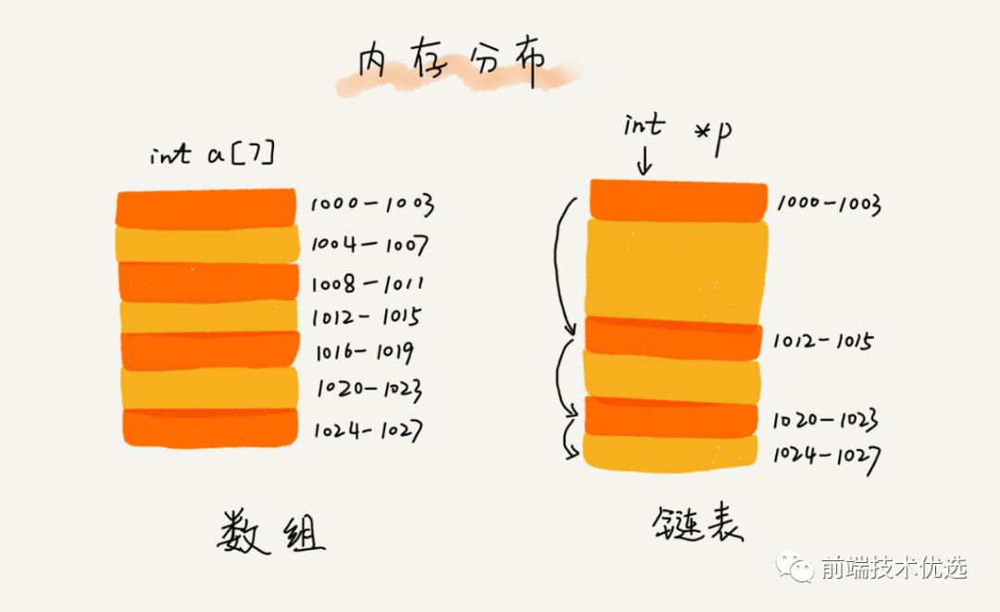
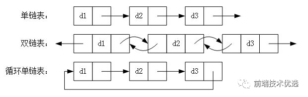
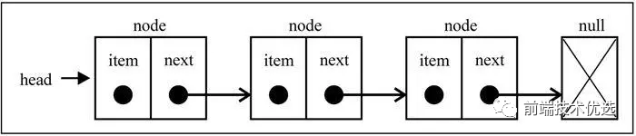
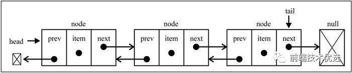
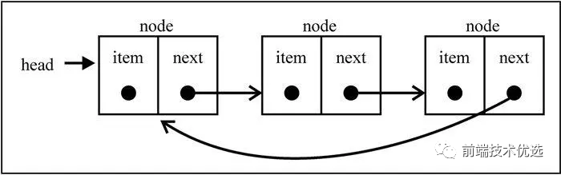
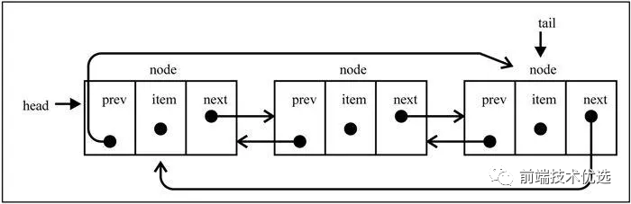
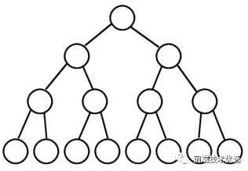
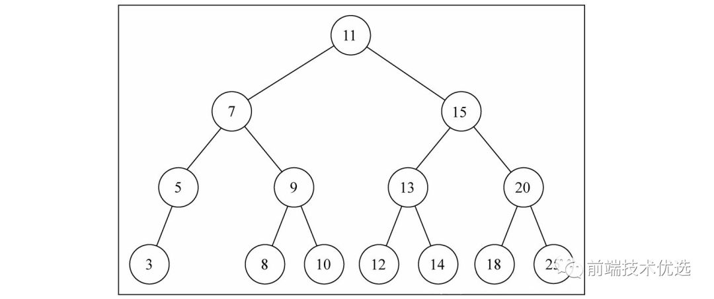
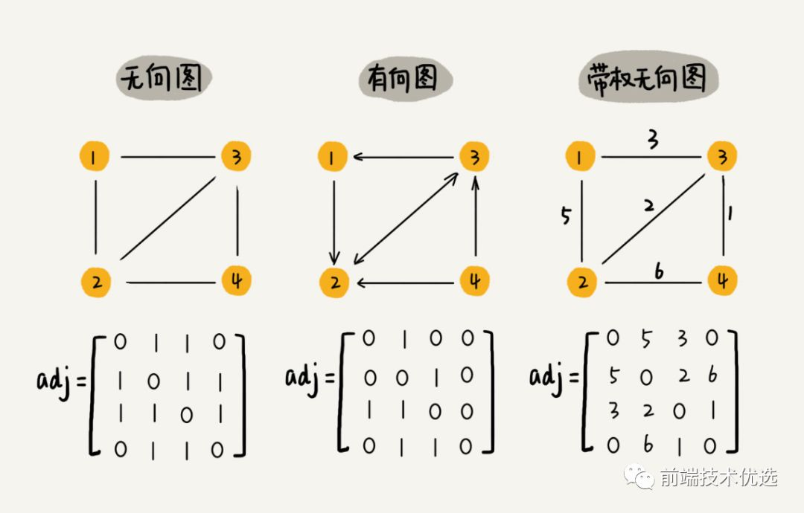
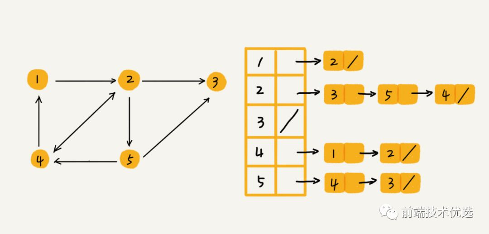

<!-- 递归  分治 贪心 动态规划 回溯算法 枚举 -->
## 大O表示法
大O表示法全称大O时间复杂度表示法，表示代码执行时间随数据规模增长的变化趋势。大O表示法用于粗略的估计算法的执行效率。所以大O表示法制关注量级最大的那段代码(一般就是循环执行次数最多的那段代码)

- O(1):代码中不存在循环语句、递归语句，即使千行万行，复杂度也是O(1)；
- O(n):代码中存在循环语句、递归语句如下

    ```js
    const print = n => {
        for(let i = 0; i < n; i++) {
            console.log(i)
        }
    }
    ```
    该方法中, print 方法中 for 循环执行了 n 次，所以时间复杂度为O(n);
- O(logn) 代码中存在循环，但是循环条件为：

    ```js
    const print = n => {
        let i = 1;
        while(i <= n) {
            i = i * 2;
            console.log(i);
        }
    }
    ```
    代码中循环条件变量 i 每循环一次就乘以2，当 i 大于 n 时循环条件结束。所以代码循环的次数就是下图中的x

    

    估计大多数人都已忘了高中所学的等比数列，更忘了什么是对数

    

    在对数阶时间复杂度的表示方法里,我们忽略对数的"底",统一表示为 O(logn).

    如果 print 方法在循环中执行了 n 次，那么时间复杂度就是 O(nlogn) 。

## 数组
:::tips
数组是一种线性数据结构。它用一组连续的内存空间,来存储一组具有相同类型的数组。---数据结构与算法之美
:::
js 原本没有真正的数组,因为js的数组可以存放不同类型的数据,不同数据类型存储所需要的空间大小不同，这就导致用来存放数组的内存地址不可能是连续的。所以js得数组按照类似焊锡映射的方法存储的，这种方式的数组读写操作相对低效

V8引擎对数组做了优化，如果一个数组中所有的类型都是一样的，那么就在内存中开辟一个连续的空间来存储数组。但是如果数组中又添加了一个不同的类型，那么V8引擎就会按之前的老办法将数组重建，这时反而会更低效。

ES6新增了 ArrayBuffer，它可以创建内存空间连续的数组。显而易见，对通过 ArrayBuffer 创建的数组进行遍历操作，速度更快

数组是编程中极重要的一种数据结构，大部分语言都原生实现了数组数据结构。js的数组更加灵活，而且原生实现了众多数组的操作方法，这些方法要经常使用务必做到烂熟于心


除了上表中的方法，数组还有 Array.prototype.flat()、Array.of()、Array.form()等。


## 栈数据结构
栈和队列本质也是数组，是较为特殊的两种。

栈是一种后入先出的集合，例如js的执行栈

新添加的元素放入栈顶，要删除的元素也必须只能从栈顶删除，就如同只有一个端口的筒：


### 栈的实现
书中作者用 es6 的 WeakMap 写一个栈函数

本质上是利用实例 this 作为获取栈的桥梁。

```js
let Stack = (function(){
  let items = new WeakMap()
  class Stack {
    constructor () {
      items.set(this, [])
    }
    pop () { // 出栈
      return items.get(this).pop()
    }
    push (v) { // 入栈
      items.get(this).push(v)
    }
    peek () { // 获取当前栈顶
      return items.get(this)[items.get(this).length - 1]
    }
    size () { // 栈长度
      return items.get(this).length
    }
    isEmpty () { // 栈是否为空
      return items.get(this).length === 0
    }
    clear () { // 清空栈
      items.get(this).length = 0
    }
  }
  return Stack
})()
```
<span style="color: red"> 先介绍下 es6 的 WeakMap.WeakMap只接受对象类型作为键名，并且键名是弱引用类型的。弱引用是一种容易被垃圾回收机制回收的类型，只要垃圾回收机制发现一个对象只被弱引用,那么这个对象就会被回收。上面代码中的this本身是一种强引用类型，但是this又被当做 WeakMap 的弱引用键名。因此当 this 实例被销毁的时候,this原先所指向的对象的内存地址只存在WeakMap的弱引用了。所以 WeakMap 中对应的键值对都会在垃圾回收机制运行的时候被销毁</span>

仍旧没看明白 WeakMap 的弱引用的在看看这篇文章

这个栈函数就是一个利用 WeakMap 弱引用的绝佳例子

```js
let Stack = (function(){
  let items = new WeakMap()
  class Stack {
    constructor () {
      items.set(this, [])
    }
    pop () { // 出栈
      return items.get(this).pop()
    }
    push (v) { // 入栈
      items.get(this).push(v)
    }
    peek () { // 获取当前栈顶
      return items.get(this)[items.get(this).length - 1]
    }
    size () { // 栈长度
      return items.get(this).length
    }
    isEmpty () { // 栈是否为空
      return items.get(this).length === 0
    }
    clear () { // 清空栈
      items.get(this).length = 0
    }
    getItems() {
        return items;
    }
  }
  return Stack
})()

var a = new Stack();
var b = new Stack();
b = null;
console.log(a.getItems());
setTimeout(() => {
    console.log(a.getItems())
}, 1000)

// WeakMap {Stack => Array(1), Stack => Array(1)}
// WeakMap {Stack => Array(1)}
```
<span style="color: red">如图所示，变量a、b创建了两个栈实例,并分别往各自栈里添加了一个数字元素。这时闭包items中存在两个栈的。**然后把变量b设为null,这时变量 b 所创建的栈实例对象失去了强引用，只剩下 WeakMap 键名的弱引用，但是打印出来的 items 中扔然存在两个栈，因此此时垃圾回收机制没有运行。过了十秒之后，Chrome浏览器的拦击回收机制触发，便把 items 中失效的栈清楚了，此时打印出来 items 中只剩下一个栈了。(P.S.经测试发现目前版本的V8引擎垃圾回收机制至少十秒就清一次)**</span>

### 栈的应用
十进制转二进制是将十进制除以2，每次的结果向下取整继续除以2，直到结果为0为止。然后每次除余的结果组成的数组倒序就是二进制结果

```js
10 / 2 => 5...0
5 / 2 => 2...1
2 / 2 => 1...0
1 / 2 => 0...1
// 二进制转换最终结果为 1010
```
以下为实现，不能用于转16进制，因为16进制含字母

```js
function baseConverter(number, base = 2) {
    let remStack = new Stack();
    let baseResult = '';
    while(number > 0) {
        remStack.push(number % base); // 将除余结果存入执行栈中
        number = Math.floor(number / base);
    }
     while (!remStack.isEmpty()) {
        baseResult += remStack.pop() // 删除栈顶并存入字符串拼接
    }
    return baseResult
}
baseConverter(10, 2) // 1010
```
以上就是栈数据结构的应用。我们前端日常撸码中很难遇到要用栈来处理的数据结构，因为原生数组基本都够用了。但如果遇到了需要【先进先出】的数据结构，为了严谨性和表现出你的专业精神，请用队列

## 队列的数据结构
队列数据结构是遵循先进先出的有序集合，例如js的任务队列

栈和队列相比，栈像一个筒，只有一个端口，后进先出；而队列就像一个管道，有两个端口，一端进另一端出。

顾名思义，js 中的任务队列就是队列数据结构。

还有我们日常生活中的排队就是队列，排队靠前的先接受服务先出列，如同收银、上洗手间等：

### 正常队列
```js
let Queue = (function() {
  let items = new WeakMap()
  class Queue {
    constructor () {
      items.set(this, [])
    }
    enqueue (v) { // 入列
      items.get(this).push(v)
    }
    dequeue () { // 出列
      return items.get(this).shift()
    }
    front () { // 获取当前队列首位
      return items.get(this)[0]
    }
    size () { // 栈长度
      return items.get(this).length
    }
    isEmpty () { // 栈是否为空
      return items.get(this).length === 0
    }
    clear () { // 清空栈
      items.get(this).length = 0
    }
  }
  return Queue
})()
```
实现方式跟栈数据结构一样，只是实现的具体的方法不同。出栈实现的是数组的pop，出列实现的是数组的shift

### 优先队列
优先队列是指按照登记进行排队的数据结构。比如机场排队普通票排在普通队列后面，vip 则排在 vip 队列后面，且普通队列排在 vip 队列后面。

```js
// 该例 level 越小等级越高： 0 > 1 > 2
let PriorityQueue = (function() {
    let items = new WwakMap();
    let QueueElement = function(value, level) {
        this.value = value;
        this.level = level;
    }
    class PriorityQueue {
        constructor() {
            items.set(this, [])
        }
        enqueue (value, level) { // 入列
            let queueElement = new QueueElement(value, level)
            let arr = items.get(this)
            let added = arr.some((item, index) => {
                if (level < item.level) { // 如果要添加的元素的level低于item的，就添加到该节点之前
                arr.splice(index, 0, queueElement)
                return true
                }
            })
            if (!added) arr.push(queueElement)
        }
        dequeue () { // 出列
            return items.get(this).shift()
        }
        front () { // 获取当前队列首位
            return items.get(this)[0]
        }
        size () { // 栈长度
            return items.get(this).length
        }
        isEmpty () { // 栈是否为空
            return items.get(this).length === 0
        }
        clear () { // 清空栈
            items.get(this).length = 0
        }
    }
    return Queue
})()
```
### 队列应用
下面用普通队列实现一个击鼓传花的游戏。击鼓传花是指所有人围城一个圈，游戏开始时把❀尽快传给挨着的人，游戏结束时花在谁手中谁就出局。直到剩下最后一个人就是赢家

```js
function hotPotato (nameList) {
  let queue = new Queue()
  nameList.map(name => queue.enqueue(name))
  return function (num) {
    if (queue.isEmpty()) {
      console.log('游戏已经结束')
      return
    }
    for (let i = 0; i < num; i++) {
      queue.enqueue(queue.dequeue())
    }
    let outer = queue.dequeue()
    console.log(outer + '出局了')
    if (queue.size() === 1) {
      let winner = queue.dequeue()
      queue = null // 让垃圾回收机制能自动清除弱引用内存
      console.log(winner + '获胜')
      return winner
    } else {
      return outer
    }
  }
}
let nameList = ['鼠', '牛', '虎', '兔', '龙', '蛇', '马', '羊', '猴', '鸡', '狗', '猪']
let game = hotPotato(nameList)
game(12) // 鼠出局了
game(22) // 牛出局了
...
game(32) // 龙获胜
```
无论栈还是队列，本质上都是利用数组实现的变种。通过封装只暴漏出结构该有的方法，保证了数据结构的稳定性和安全性

## 链表
<span style="color: red">尽管数组在元素的访问上很方便，但是在数组的起点和中间插入或移除元素的成本却很高,因为数组是一块连续的内存空间存储的，插入一个节点要改变插入节点及后面所有元素的位置。当数组元素足够多的时候，插入一个元素的成本就会显现出来。</span>

**相对于传统的数组,链表的一个好处在于，添加或移除元素的时候不需要移动其他元素。** 链表同样是存储有序的元素的集合,但链表中元素在内存的位置并非连续放置的，而是有一个指针指向相邻的下一个元素。所以链表虽然插入移除节点很快，但是查询节点却很慢，因为要从头到尾遍历查询。而数组则是查询节点很快，但是移除节点慢



链表有很多种：



### 单向链表
顾名思义，单向链表是指只有 next 没有 prev 的链表数据结构。单向链表详细实现如下



```js
const LinkedList = (function() {
    const Node = function(element) { // 构造新节点
        this.element = element;
        this.next = null;
    }
    append (element) { // 从尾部添加节点
        let newNode = new Node(element);
        if(!this.head) { // 没有头节点，就将新节点设为头节点
            this.head = newNode;
        } else { // 存在头节点，就在链表尾部添加新节点
            let current = this.head;
            while(current.next) {
                current = current.next;
            }
            current.next = newNode;
        }
        this.length++;
    }
    insert(position, element) { // 按位置插入节点
        if(position < 0 || position > this.length) {
            return false;
        }
        let newNode = new Node(element);
        if(position === 0) { // 往量表首部添加新节点
            newNode.next = this.head;
        } else { // 非链表首部添加新节点
            let index = 0, previous, current = this.head; // index 索引判断是否是当前
            while(index++ < position) { // 如果 index 小于 position, 递增并将变量移动到下一个节点
                previous = current;
                current = current.next;
            }
            newNode.next = current;
            previous = newNode;
        }
        this.length++;
        return true;
    }
    removeAt (position) { // 按照位置删除节点
        if(position < 0 || position > this.length) return null;
        let index = 0, previous, current = this.head;
        if(position === 0) {
            this.head = current.next;
        } else {
            while(index++ < position) {
                previous = current;
                current = current.next;
            }
            previous.next = current.next;
        }
        this.length--;
        return current.element;
    }
    toString() { // 将链表的值字符串化
        let current = this.head, str = '';
        while(current) {
            str += current.element;
            current = current.next;
            if(current) {
                str += symbol ? symbol : ','
            }
        }
        return str;
    }
    indexOf (element) { // 找到值第一次出现的位置
        let current = this.head, index = 0;
        while(current) {
            if(current.element === element) {
                return index;
            }
            current = current.next;
            index++;
        }
        return -1;
    }
    find(element) { // 找到第一次出现该值得节点
        let current = this.head;
        while(current) {
            if(current.element === element) {
                return current;
            }
            current = current.next;
        }
        return false;
    }
    isEmpty() {
        return this.length === 0;
    }
    size() {
        return this.length;
    }
    getHead() {
        return this.head;
    }
})()
```
### 双向链表
双向链表中节点除了有next指向下一个节点，还有 prev 指向前一个节点。双向链表的优点在于能够从头到尾迭代，也能够从尾到头迭代。如果从头到尾遍历到中间为止的时候，想反向从尾到头进行遍历，也是可以办到的。

双向链表虽然比单向链表站来更多的内存，但是双向链表最大的好处是删除给定指针操作时不用在遍历一遍找到其prev指向的节点，所以此时的删除操作单向链表时间复杂度是 O(n)，双向链表的时间复杂度是 O(1)。



```js
const DoubleLinkedList = (function() {
    let Node = function() {
        this.element = element;
        this.prev = this.next = null;
    }
    class DoubleLinkedList {
        constructor() {
            this.head = this.tail = null;
            this.length = 0;
        }
        append(element) {
            let newNode = new Node(element);
            if(!this.head) {
                this.head = this.tail = newnode;
            } else {
                let current = this.head;
                while(current) {
                    current = current.next;
                }
                current = this.tail;
                current.prev = this.tail = newNode;
                newNode.prev = current;
            }
        }
        insert(position, element) {
            if(position < 0 || position > this.length) {
                return false;
            }
            let newNode = new Node(element);
            let previous, current = this.head, index = 0;
            if(position === 0) {
                if(!this.head) {
                    this.head = this.tail = newNode;
                } else {
                    newNode.next = current;
                    current.prev = newNode;
                    this.head = newNode;
                }
            } else if (position === this.length) {
                this.tail.next = newNode;
                newnode.prev = this.tail;
                this.tail = newNode;
            } else {
                while(index++ < position) {
                    previous = current;
                    current = newNode;
                }
                previous.next = newNode;
                newNode.prev = previous;
                newNode.next = current;
                current.prev = newNode;
            }
            this.length++;
            return true;
        }
        removeAt(position) {
            if(position < 0 || position >= this.length) {
                return false;
            }
            let previous, current = this.head, index = 0;
            if (position === 0) {
                this.head = current.next;
                if(this.length === 1) {
                    this.tail = null; // 若只有一项，则 current.next 为 null，，所以只需要将尾部设为 null
                } else {
                    this.head.prev = null;
                }
            } else if( position === this.length - 1) {
                current = this.tail;
                this.tail = current.prev;
                this.tail.next = null;
            } else {
                while(index++ < position) {
                    previous = current;
                    current = current.next;
                }
                previous.next = current.next;
                current.next.prev = previous;
            }
            this.length--;
            return current.element;
        }
        // 删除指定节点
        removeByNode(node) {
            if(!node.prev) {
                this.head = node.next;
                this.head.prev = null;
                return;
            }
            if(!node.next) {
                return;
            }
            let prev = node.prev;
            let next = node.next;
            prev.next = next;
            next.prev = prev;
        }
        // 其他方法实现和单线链表相同
    }
    return DoubleLinkedList
})()
```
### 循环链表
循环链表是指链表的头部和尾部之间存在相互引用，形成了一个循环

单向循环链表


单向循环链表的实现方法和单向链表几乎一样，但是在增加头部、尾部节点的时候需要注意设置 current.next = this.head;

双向循环链表



双向循环链表的实现方法和双向链表也大同小异，这里也不再累述。

<span style="color: blue">链表是 js 中没有原声实现的一种数据结构，相比数组，链表在添加和移除元素的时候效率更高。因此在需要添加和移除大批量元素的时候，最好的选择就是链表。</span>

## 集合和字典
集合和字典用于存储不重复的值。集合和字典的元素可以是任意类型

### 集合
集合是由一组无序且唯一的元素组成的数据结构，由于不会重复，所以集合中键就是值。

和数学中的集合一样，js中的集合可以进行"并集"、"差集"、"子集"操作。

并集是两个集合的元素合到一块，交集是两个集合中共有的元素，差集是另一个集合中没有的元素，子集是a中的元素b中都有。

由于es6原生实现了集合 Set 类，所以我们可以利用继承在 Set类的基础上实现集合的四种操作

```js
class MySet extends Set {
    constructor(...args) {
        super(...args);
    }
    union(otherSet) { // 并集
        return new MySet([...this, ...otherSet]);
    }
    intersection(otherSet) { // 交集
        // return new Set([...this].filter(x => otherSet.has(x))); // 标记aa
        let newSet = new MySet();
        for(let a of this) {
            if(otherSet.has(a)) {
                newSet.add(a);
            }
        }
        return newSet;
    }
    difference(otherSet) { // 差集
        // return new Set([...this].filter(x => !otherSet.has(x))); // 标记bb
        let newSet = new MySet();
        for(let x of this) {
            if(!otherSet.has(x)) {
                newSet.add(x);
            }
        }
        return newSet;
    }
    isSubOf(otherSet) { // 子集
        if(this.size > otherSet.size) {
            return false;
        } else {
            // return [...this].every(item => otherSet.has(item)) // 标记 cc
            for(let x of this) {
                if(!otherSet.has(ite)) {
                    return false;
                }
            }
        }
        return true;
    }
}
var a = new MySet([1, 2, 3, 4])
var b = new MySet([3, 4, 5, 6])
var c = new MySet([1,2])
a.intersection(b) // Set(2) {3, 4}
a.difference(b) // Set(2) {1, 2}
a.union(b) // Set(6) {1, 2, 3, 4, 5, 6}
c.isSubOf(a) // true
c.isSubOf(b) // false
```
上面代码中标记的“aa bb cc”三处一行代码就可以实现其功能，但是其时间复杂度为 O(n²)，相比之下其下面的代码时间复杂度为 O(n)。因为 [...this] 先遍历集合中所有元素转为数组，然后用every遍历数组中的元素。

### 字典
顾名思义字典就是根据键来查询值的数据结构，也就是我们常说的"键值对"。

字典数据结构在es6的实现为Map。Map和Object 一样是由键值对组成的，键值都不能重复。但是不同之处在于 Object的键只能是字符串，且是无序的；而Map的键可以是任何类型的值，包括对象，且是有序的。

```js
let o = {2:2, 1:1}
Object.keys(o); // ['1', '2'] 键只能是无序的字符串

let map = new Map();
map.set(o, 1)
map.set(2,2);

for(let key of map) {
    console.log(key); // [{…}, 1] [2, 2]  键可以是任意类型，且根据添加的顺序遍历
}
```
> 注意由于集合和字典中的元素可以任意类型,如果如果添加了一个没有引用的对象的话，就在也取不到这个对象了

```js
let a = new MySet()
a.add({})
a.has({}) // false

let b = new Map()
b.set({}, 1)
b.get({}) // undefined
```
### WeakSet 和 WeakMap
在栈和队列的实现中我们用到了 WeakMap 类，其实 WeakMap WeakSet类几乎和 Map 、Set类一样 只是以下少许不同

- 只能用对象作为键
- 键是弱引用类型的
- WeakMap WeakSet 没有遍历器，所以不能调用 keys()、values()、entries()方法，也没有size属性 和clear()方法，最有四个增删改查方法 get()、set()、has()、delete()

## 树
树是一种分层数据抽象模型，是本文介绍的第一种非顺序的数据结构



树由"根节点、子节点、叶子节点"组成。根节点是位于树顶部的节点，**根节点没有父节点；有父节点的叫子节点，没有子节点的节点叫叶子节点**。

树的子节点可以有很多个，最常用的二叉树最多只能有两个子节点：左侧子节点和右侧子节点。

### 二叉搜索树
二叉搜索树是二叉树的一种，它只允许你在左侧存储比父节点小的值，在右侧存储比父节点大的值。这样的定义对于向树的节点中查找/插入/删除节点非常高效



下面我们来实现一个二叉搜索树

```js
const BinarySearchTree = (function(){
  const Node = function (key) {
    this.key = key
    this.left = null
    this.right = null
  }
  const insertNode = function (node, newNode) { // 插入节点辅助函数
    if (newNode.key < node.key) {
      if (node.left) {
        insertNode(node.left, newNode)
      } else {
        node.left = newNode
      }
    } else {
      if (node.right) {
        insertNode(node.right, newNode)
      } else {
        node.right = newNode
      }
    }
  }
  const searchNode = function (node, key) { // 搜索节点辅助函数
    if (!node) {
      return false
    }
    if (key < node.key) {
      return searchNode(node.left, key)
    } else if (key > node.key) {
      return searchNode(node.right, key)
    } else {
      return true
    }
  }
  const minNode = function (node) { // 找到最小节点并返回key
    if (!node) {
      return null
    }
    if (node.left) {
      return minNode(node.left)
    } else {
      return node.key
    }
  }
  const maxNode = function (node) { // 找到最大节点并返回key
    if (!node) {
      return null
    }
    if (node.right) {
      return maxNode(node.right)
    } else {
      return node.key
    }
  }
  const findMinNode = function (node) { // 找到最小节点并返回node对象
    if (!node) {
      return null
    }
    if (node.left) {
      return findMinNode(node.left)
    } else {
      return node
    }
  }
  const removeNode = function (node, key) { // 移除节点并返回传入的 node
    if (node === null) {
      return null
    }
    if (key < node.key) { // 这种情况需要更新node.left，然后返回更新了node.left的新的node
      node.left = removeNode(node.left, key)
      return node
    } else if (key > node.key) { // 这种情况需要更新node.right，然后返回更新了node.right的新的node
      node.right = removeNode(node.right, key)
      return node
    } else { // 这种情况需要更新node.key或者其他更新手段(包括直接将node变为null, 或更新node.right)，返回的也是更新后的node
      // 情况1，被移除的是叶子节点
      if (node.left === null && node.right === null) {
        node = null
        return node
      }
      // 情况2，被移除的是只有一个子节点的节点
      if (node.left === null) { // 只有右子节点
        node = node.right
        return node
      } else if (node.right === null) {//只有左子节点
        node = node.left
        return node
      }
      // 情况3，被移除的是有两个子节点的节点
      const aux = findMinNode(node.right) // 找到子树中的最小节点，它肯定是一个叶子节点
      node.key = aux.key // 将node的key设置为aux的key，达到删除效果，但此时有两个一样的key
      node.right = removeNode(node.right, aux.key) // 移除以node.right为root的树上的重复的叶子节点aux.key
      return node
    }
  }
  class BinarySearchTree {
    constructor () {
      this.root = null
    }
    insert (key) { // 插入节点
      let newNode = new Node(key)
      if (!this.root) {
        this.root = newNode
      } else {
        insertNode(this.root, newNode)
      }
    }
    serach (key) { // 搜索节点，返回布尔值
      return searchNode(this.root, key)
    }
    min () { // 最小节点
      return minNode(this.root)
    }
    max () { // 最大节点
      return maxNode(this.root)
    }
    remove (key) { // 删除节点
      this.root = removeNode(this.root, key)
    }
  }
  return BinarySearchTree
})()
```

## 图
图是网状结构的抽象模型，由边和顶点组成。对于地图来说，顶点就是地点，边就是链接两个地点之间的路线；对于微信QQ来说，顶点就是用户，边就是两个用户价了好友建立了关系。

图分为有向图和无向图，有向图就是单向的，比如微博粉丝和微博大V，粉丝关注了大V，但大V没有关注粉丝。无向图是就是顶点与顶点之间是的没有方向的，比如微信好友之间就是无向图。

图的一种存储方式是 “邻接矩阵”。邻接矩阵就是一个二维数组，A[i][j] === A[j][i]。



邻接矩阵记录了所有顶点之间的关系，但其实很多顶点之间是没有关系的，所有这就造成了存储空间的浪费。但是邻接矩阵在获取两个顶点之间的关系时很高效。

图的另一种存储方式是 “邻接表”。邻接表中每个顶点对应一条链表，指向该顶点所指向的顶点。这样表中就没有了没有关系的顶点，节省了储存空间。但是相对的，查询相邻的顶点也就比较耗时。




[前端数据结构与算法入门](https://mp.weixin.qq.com/s/yKVXFF9V4S_gGGrHenBvCg)