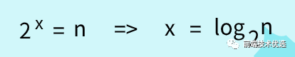
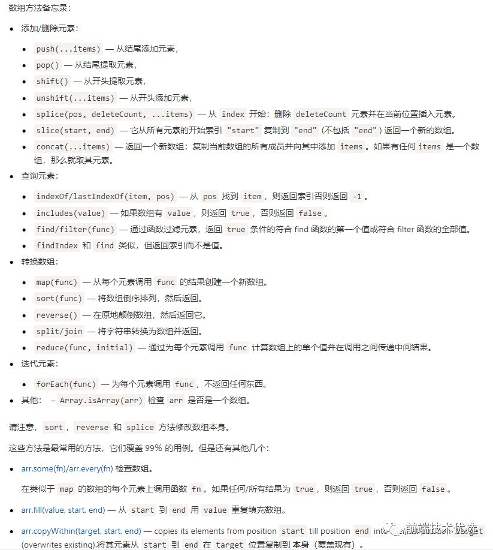
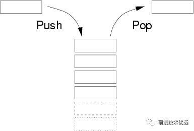

<!-- 递归  分治 贪心 动态规划 回溯算法 枚举 -->
## 大O表示法
大O表示法全称大O时间复杂度表示法，表示代码执行时间随数据规模增长的变化趋势。大O表示法用于粗略的估计算法的执行效率。所以大O表示法制关注量级最大的那段代码(一般就是循环执行次数最多的那段代码)

- O(1):代码中不存在循环语句、递归语句，即使千行万行，复杂度也是O(1)；
- O(n):代码中存在循环语句、递归语句如下

    ```js
    const print = n => {
        for(let i = 0; i < n; i++) {
            console.log(i)
        }
    }
    ```
    该方法中, print 方法中 for 循环执行了 n 次，所以时间复杂度为O(n);
- O(logn) 代码中存在循环，但是循环条件为：

    ```js
    const print = n => {
        let i = 1;
        while(i <= n) {
            i = i * 2;
            console.log(i);
        }
    }
    ```
    代码中循环条件变量 i 每循环一次就乘以2，当 i 大于 n 时循环条件结束。所以代码循环的次数就是下图中的x

    

    估计大多数人都已忘了高中所学的等比数列，更忘了什么是对数

    

    在对数阶时间复杂度的表示方法里,我们忽略对数的"底",统一表示为 O(logn).

    如果 print 方法在循环中执行了 n 次，那么时间复杂度就是 O(nlogn) 。

## 数组
:::tips
数组是一种线性数据结构。它用一组连续的内存空间,来存储一组具有相同类型的数组。---数据结构与算法之美
:::
js 原本没有真正的数组,因为js的数组可以存放不同类型的数据,不同数据类型存储所需要的空间大小不同，这就导致用来存放数组的内存地址不可能是连续的。所以js得数组按照类似焊锡映射的方法存储的，这种方式的数组读写操作相对低效

V8引擎对数组做了优化，如果一个数组中所有的类型都是一样的，那么就在内存中开辟一个连续的空间来存储数组。但是如果数组中又添加了一个不同的类型，那么V8引擎就会按之前的老办法将数组重建，这时反而会更低效。

ES6新增了 ArrayBuffer，它可以创建内存空间连续的数组。显而易见，对通过 ArrayBuffer 创建的数组进行遍历操作，速度更快

数组是编程中极重要的一种数据结构，大部分语言都原生实现了数组数据结构。js的数组更加灵活，而且原生实现了众多数组的操作方法，这些方法要经常使用务必做到烂熟于心


除了上表中的方法，数组还有 Array.prototype.flat()、Array.of()、Array.form()等。



## 栈数据结构
栈和队列本质也是数组，是较为特殊的两种。

栈是一种后入先出的集合，例如js的执行栈

新添加的元素放入栈顶，要删除的元素也必须只能从栈顶删除，就如同只有一个端口的筒：



### 栈的实现
书中作者用 es6 的 WeakMap 写一个栈函数

本质上是利用实例 this 作为获取栈的桥梁。

```js
let Stack = (function(){
  let items = new WeakMap()
  class Stack {
    constructor () {
      items.set(this, [])
    }
    pop () { // 出栈
      return items.get(this).pop()
    }
    push (v) { // 入栈
      items.get(this).push(v)
    }
    peek () { // 获取当前栈顶
      return items.get(this)[items.get(this).length - 1]
    }
    size () { // 栈长度
      return items.get(this).length
    }
    isEmpty () { // 栈是否为空
      return items.get(this).length === 0
    }
    clear () { // 清空栈
      items.get(this).length = 0
    }
  }
  return Stack
})()
```
<span style="color: red"> 先介绍下 es6 的 WeakMap.WeakMap只接受对象类型作为键名，并且键名是弱引用类型的。弱引用是一种容易被垃圾回收机制回收的类型，只要垃圾回收机制发现一个对象只被弱引用,那么这个对象就会被回收。上面代码中的this本身是一种强引用类型，但是this又被当做 WeakMap 的弱引用键名。因此当 this 实例被销毁的时候,this原先所指向的对象的内存地址只存在WeakMap的弱引用了。所以 WeakMap 中对应的键值对都会在垃圾回收机制运行的时候被销毁</span>

仍旧没看明白 WeakMap 的弱引用的在看看这篇文章

这个栈函数就是一个利用 WeakMap 弱引用的绝佳例子

```js
let Stack = (function(){
  let items = new WeakMap()
  class Stack {
    constructor () {
      items.set(this, [])
    }
    pop () { // 出栈
      return items.get(this).pop()
    }
    push (v) { // 入栈
      items.get(this).push(v)
    }
    peek () { // 获取当前栈顶
      return items.get(this)[items.get(this).length - 1]
    }
    size () { // 栈长度
      return items.get(this).length
    }
    isEmpty () { // 栈是否为空
      return items.get(this).length === 0
    }
    clear () { // 清空栈
      items.get(this).length = 0
    }
    getItems() {
        return items;
    }
  }
  return Stack
})()

var a = new Stack();
var b = new Stack();
b = null;
console.log(a.getItems());
setTimeout(() => {
    console.log(a.getItems())
}, 1000)

// WeakMap {Stack => Array(1), Stack => Array(1)}
// WeakMap {Stack => Array(1)}
```
<span style="color: red">如图所示，变量a、b创建了两个栈实例,并分别往各自栈里添加了一个数字元素。这时闭包items中存在两个栈的。**然后把变量b设为null,这时变量 b 所创建的栈实例对象失去了强引用，只剩下 WeakMap 键名的弱引用，但是打印出来的 items 中扔然存在两个栈，因此此时垃圾回收机制没有运行。过了十秒之后，Chrome浏览器的拦击回收机制触发，便把 items 中失效的栈清楚了，此时打印出来 items 中只剩下一个栈了。(P.S.经测试发现目前版本的V8引擎垃圾回收机制至少十秒就清一次)**</span>

### 栈的应用
十进制转二进制是将十进制除以2，每次的结果向下取整继续除以2，直到结果为0为止。然后每次除余的结果组成的数组倒序就是二进制结果

```js
10 / 2 => 5...0
5 / 2 => 2...1
2 / 2 => 1...0
1 / 2 => 0...1
// 二进制转换最终结果为 1010
```
以下为实现，不能用于转16进制，因为16进制含字母

```js
function baseConverter(number, base = 2) {
    let remStack = new Stack();
    let baseResult = '';
    while(number > 0) {
        remStack.push(number % base); // 将除余结果存入执行栈中
        number = Math.floor(number / base);
    }
     while (!remStack.isEmpty()) {
        baseResult += remStack.pop() // 删除栈顶并存入字符串拼接
    }
    return baseResult
}
baseConverter(10, 2) // 1010
```
以上就是栈数据结构的应用。我们前端日常撸码中很难遇到要用栈来处理的数据结构，因为原生数组基本都够用了。但如果遇到了需要【先进先出】的数据结构，为了严谨性和表现出你的专业精神，请用队列

## 队列的数据结构
队列数据结构是遵循先进先出的有序集合，例如js的任务队列

栈和队列相比，栈像一个筒，只有一个端口，后进先出；而队列就像一个管道，有两个端口，一端进另一端出。

顾名思义，js 中的任务队列就是队列数据结构。

还有我们日常生活中的排队就是队列，排队靠前的先接受服务先出列，如同收银、上洗手间等：

### 正常队列
```js
let Queue = (function() {
  let items = new WeakMap()
  class Queue {
    constructor () {
      items.set(this, [])
    }
    enqueue (v) { // 入列
      items.get(this).push(v)
    }
    dequeue () { // 出列
      return items.get(this).shift()
    }
    front () { // 获取当前队列首位
      return items.get(this)[0]
    }
    size () { // 栈长度
      return items.get(this).length
    }
    isEmpty () { // 栈是否为空
      return items.get(this).length === 0
    }
    clear () { // 清空栈
      items.get(this).length = 0
    }
  }
  return Queue
})()
```
实现方式跟栈数据结构一样，只是实现的具体的方法不同。出栈实现的是数组的pop，出列实现的是数组的shift

### 优先队列
优先队列是指按照登记进行排队的数据结构。比如机场排队普通票排在普通队列后面，vip 则排在 vip 队列后面，且普通队列排在 vip 队列后面。

```js
// 该例 level 越小等级越高： 0 > 1 > 2
let PriorityQueue = (function() {
    let items = new WwakMap();
    let QueueElement = function(value, level) {
        this.value = value;
        this.level = level;
    }
    class PriorityQueue {
        constructor() {
            items.set(this, [])
        }
        enqueue (value, level) { // 入列
            let queueElement = new QueueElement(value, level)
            let arr = items.get(this)
            let added = arr.some((item, index) => {
                if (level < item.level) { // 如果要添加的元素的level低于item的，就添加到该节点之前
                arr.splice(index, 0, queueElement)
                return true
                }
            })
            if (!added) arr.push(queueElement)
        }
        dequeue () { // 出列
            return items.get(this).shift()
        }
        front () { // 获取当前队列首位
            return items.get(this)[0]
        }
        size () { // 栈长度
            return items.get(this).length
        }
        isEmpty () { // 栈是否为空
            return items.get(this).length === 0
        }
        clear () { // 清空栈
            items.get(this).length = 0
        }
    }
    return Queue
})()
```
### 队列应用
下面用普通队列实现一个击鼓传花的游戏。击鼓传花是指所有人围城一个圈，游戏开始时把❀尽快传给挨着的人，游戏结束时花在谁手中谁就出局。直到剩下最后一个人就是赢家

```js
function hotPotato (nameList) {
  let queue = new Queue()
  nameList.map(name => queue.enqueue(name))
  return function (num) {
    if (queue.isEmpty()) {
      console.log('游戏已经结束')
      return
    }
    for (let i = 0; i < num; i++) {
      queue.enqueue(queue.dequeue())
    }
    let outer = queue.dequeue()
    console.log(outer + '出局了')
    if (queue.size() === 1) {
      let winner = queue.dequeue()
      queue = null // 让垃圾回收机制能自动清除弱引用内存
      console.log(winner + '获胜')
      return winner
    } else {
      return outer
    }
  }
}
let nameList = ['鼠', '牛', '虎', '兔', '龙', '蛇', '马', '羊', '猴', '鸡', '狗', '猪']
let game = hotPotato(nameList)
game(12) // 鼠出局了
game(22) // 牛出局了
...
game(32) // 龙获胜
```
无论栈还是队列，本质上都是利用数组实现的变种。通过封装只暴漏出结构该有的方法，保证了数据结构的稳定性和安全性

## 链表
尽管数组在元素的访问上很方便，但是在数组的起点和中间插入或移除元素的成本却很高,因为数组是一块连续的内存空间存储的，


[前端数据结构与算法入门](https://mp.weixin.qq.com/s/yKVXFF9V4S_gGGrHenBvCg)