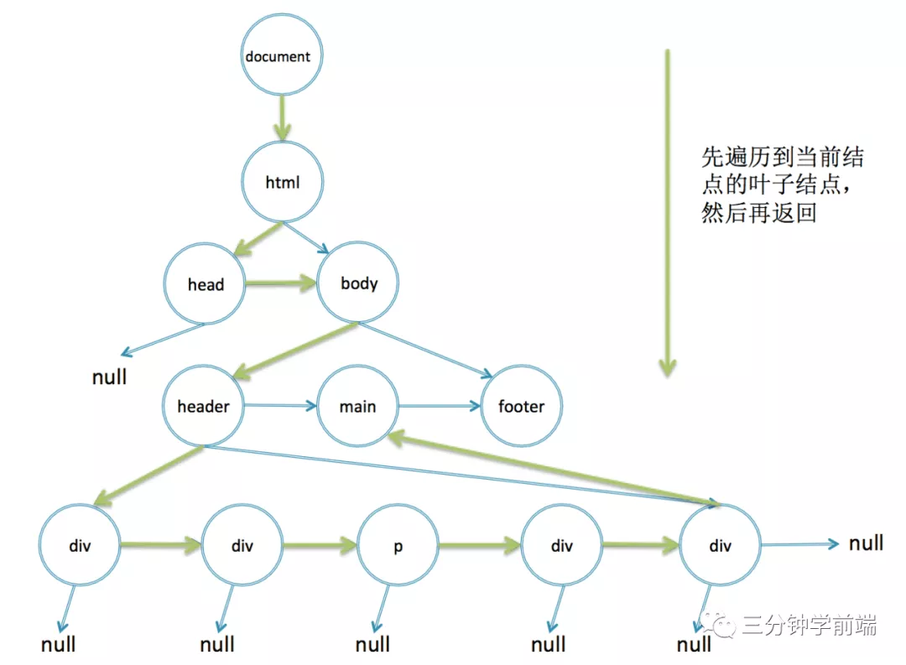
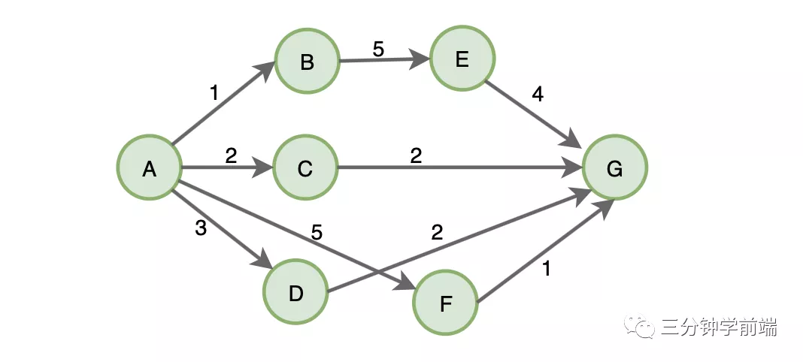
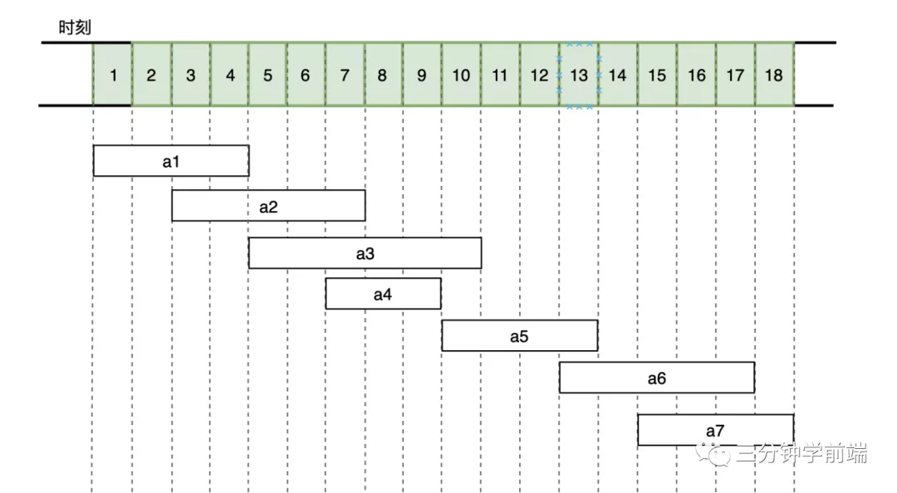
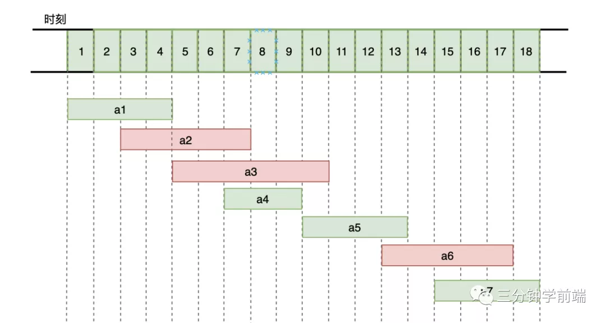
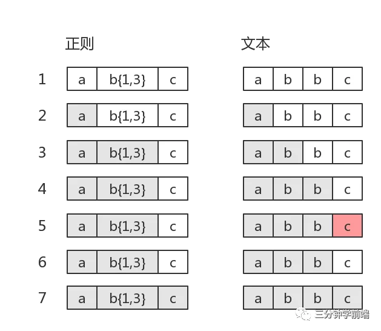
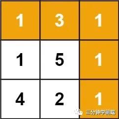

算法思想是解决问题的核心，万丈高楼起于平底，在算法中也是如此，95%的算法都是基于这6个算法思想

## 递归算法

### 算法策略
递归算法是一种直接或者间接调用自身函数或者方法的算法

递归算法的实质是把问题分解成规模缩小的同类问题的子问题，然后递归调用方法来表示问题的解。递归算法对解决一大类问题很有效，它可以使算法简洁和易于理解

优缺点
1. 优点:实现简单易上手
2. 缺点: 递归算法对常用的算法如普通循环等，运行效率低；并且在递归调用的过程当中系统为每一层的返回点、局部量等开辟了栈来存储，递归太深，容易发生溢出

### 使用场景
递归算法一般用于解决三类问题
- 数据的定义是按递归定义的.(斐波那契数列)
- 问题解法按递归算法实现(回溯)
- 数据的结构定义是按递归定义的(树遍历，图的搜索)

**递归的解题策略**
1. 第一步:明确你这个函数输入输出，先不管函数里面的代码什么，而是要先明白，你这个函数输入的是什么，输出是什么，功能是什么，要完成什么样的一件事
2. 第二步:寻找递归结束条件，我们需要找出什么时候递归结束，之后把结果返回
3. 第三步:明确递归关系式，怎么通过各种递归调用来组合解决当前问题

### 使用递归算法求解的一些经典问题
- 斐波那契额数列
- 汉诺塔问题
- 树的遍历以及相关操作

### Dom树为例
以下以DOM树为例，实现一个document.getElementById功能

由于DOM是一棵树，而树的定义本身就是用的递归定义，所以用递归的方法处理树，会非常的简单自然

#### 第一步
从DOM树根节点一层层往下递归，判断当前节点的id是否是我们要寻找的id='d-cal'

输入:DOM树根节点document，我们要寻找的id='d-cal'

输出：返回满足id='sisteram'的子节点
```
function getElementById(node, id)()
```
#### 寻找递归结束条件
从document开始往下找，对所有节点递归查找他们的子节点，一层一层的往下查找
- 如果当前节点的id符合查找条件，则返回当前节点
- 如果已经到了叶子节点了还没有找到，则返回null
```
function getElementById(node, id) {
    // 当前节点不存在，已经到了叶子节点了还没有找到返回null
    if (!node) return null;
    // 当前节点的id符合查找条件，返回当前节点
    if (node.id === id) return node;
}
```
#### 明确递归关系
当前终点的id不符合查找条件，递归查找它的每一个子节点
```
function getElementById(node, id) {
    if(!node) return null;
    if (node.id === id) return node;
    for (var i = 0; i < node.childNodes; i++) {
        // 递归查找它的每一个子节点
        var found = getElementById(node.childNodes[i], id);
        if (found) return found;
    }
    return null;
}
```
就这样，我们的一个document.getElementById功能已经实现了
```
function getElementById(node, id) {
    if (!node) return null;
    if (node.id === id) return node;
    for(var i = 0; i < node.childNodes; i++) {
        var found = getElementById(node.childNodes[i], id);
        return found;
    }
    return null;
}
getElementById(documet, 'd-cal')
```

使用递归的有点是代码简单易懂，缺点是效率比不上非递归的实现。Chrome浏览器是使用非递归实现的，非递归要怎么实现呢？

```
function getElementById(node, id) {
    // 遍历所有node
    while(node) {
        if (node.id === id) return node;
        node = nextElement(node);
    }
    return null;
}
```
还是依次遍历所有的DOM节点，只是这一次改成一个while循环，函数nextElement负责找到下一个节点，所以关键在于这个nextElement如何实现非递归找到节点功能
```
// 深度遍历
function nextElement(node) {
    // 先判断是否有子节点
    if(node.children.length) {
        // 有则返回第一个子节点
        return node.children[0];
    }
    // 在判断是否有相邻节点
    if(node.nextElementSibling) {
        // 有则返回它的下一个相邻节点
        return node.nextElementSibling;
    }
    // 否则，网上返回它的父节点的下一个相邻元素，相当于上面递归实现里面的for循环的i加1
    while(node.parentNode) {
        if (node.parentNode.nextElementSibling) {
            return node.parentNode.nextElementSibling;
        }
        node = node.parentNode;
    }
    return null;
}
```
同样也可以正确的输出结果。不管是非递归还是递归，他们都说深度优先遍历，这个过程如下


实际上getElementById浏览器是用的一个哈希map存储的，根据id直接映射到DOM节点，而getElmentsByClassName就是这样的非递归查找。

## 分治算法
### 算法策略
在计算机科学中，分治算法是一个很重要的算法，快速排序、归并算法等都是基于分治策略进行实现的，所以，建议理解掌握它

分治，顾名思义，就是**分而治之**，将一个复杂的问题，分成两个或多个相似的子问题，再把子问题分成更小的子问题，直到更小的子问题可以简单求解，分解子问题，则原问题的解则为子问题的合并

### 使用场景
当出现满足一下条件的问题，可以尝试只用分治策略进行求解
- 原始问题可以分成多个相似的子问题
- 子问题可以很简单的求解
- 原始问题的解是子问题解的合并
- 各个子问题是相互独立的，不包含相同的子问题

**分治的解题策略**
- 第一步:分解，将原问题分解成若干个规模较小，相互独立，与原问题形式相同的子问题
- 第二步:解决，解决各个子问题
- 第三步: 合并，将各个子问题的解合并为原问题的解

### 使用分治求解的一些经典问题
- 二分查找
- 归并排序
- 快速排序
- 汉诺塔问题
- React时间分片

### 二分查找
也成为折半查找算法，它是一种简单易懂的快速查找算法。例如我随机写0-100之间的一个数字，让你猜我写的是什么?你每猜一次，我就会告诉你猜的大了还是小了，直到猜中为止

#### 第一步分解
每次猜拳都把上一次的结果分出大的一组和小的一组，两组相互独立
- 选择数组中的中间数
    ```
    function binarySearch(items, item) {
        // low、mid、high将数组分成两组
        var low = 0, 
            high = items.length - 1,
            mid = Math.floor((low + high) / 2),
            elem = item[mid]
        //...
    }
    ```
#### 解决子问题
查找数与中间数对比
- 比中间数低，则去中间数左边的子数组中寻找
- 比中间数搞，则去中间数右边的子数组中寻找
- 想等则返回查找成功
```
while(low < high) {
    if (elem < item) {
        low = mid + 1;
    } else if (elem > item) {
        high = mid -1;
    } else {
        return mid;
    }
}
```
#### 合并
```
function binarySearch(items, item) {
    let low = 0,
        hight = items.length - 1,
        mid, elem;
    while(low < high) {
        mid = Math.floor((low + high) / 2);
        elem = item[mid];
        if (elem < item) {
            low = mid + 1;
        } else if (elem > item) {
            hig = mid - 1;
        } else {
            return mid;
        }
    }
    return -1
}
```
最后，二分法只能应用于数组有序的情况，如果数组无序，二分查找就不起作用了
```
function binarySearch(items, item) {
    // 快排
    quickSort(items);
    let low = 0,
        high = item.length - 1,
        mid,elem;
    while(low < high) {
        mid = Math.floor((low + hight) / 2);
        elem = items[mid];
        if (elem < item) {
            low = mid + 1;
        } else if (elem > item) {
            high = mid = 1;
        } else {
            retur mid;
        }
    }
    return -1;
}
// 测试
var arr = [2,3,1,4];
binarySearch(arr, 3);
// 2

binarySearch(arr, 5);
// -1
```

## 贪心算法
### 算法策略
贪心算法，顾名思义，总是做出当前的最优选择，即希望通过局部的最优选择获得整体的最优选择。

某种意义上说，贪心算法是很贪婪、很目光短浅的，它不从整理考虑，仅仅是关注当前的最大利益，所以说它做出的选择仅仅是某种意义上的局部最优，但是贪心算法在很多问题上还是能够拿到最优解或较优解，所以它的存在还是有意义的

### 使用场景
在日常生活中，我们使用贪心算法的时候还是挺多的，例如：

从100张面值不等的钞票中，抽出10张，怎样才能获得最多的价值？

我们只需每次都选择剩下的钞票中最大的面值，最后一定拿到的就是最优解，这就是使用的贪心算法，并且最后得到了整体的最优解。

但是，我们仍然需要明确的是，期望通过局部的最优选择获得整体的最优选择，仅仅是期望而已，也可能最终得到的结果并不一定是整体的最优解

例如，求取A到G的最短路径



根据贪心算法总是选择当前最优选择，所以它首先选择路径是AB,然后BE、EG,所以得到的路径总厂为1+5+4 = 10,然而这并不是最短路径，最短路径A->C->G:2+2=4,所以说贪心算法得到的并不一定是最优解。

那么一般什么时候可以尝试选择贪心算法呢？

当满足以下条件时，可以使用：
- 原问题复杂度过高
- 求全局最优解的数学模型难以建立或计算量过大
- 没有太大必要一定一定求出全局最优解， 比较优就可以

如果使用贪心算法求最优解，可以按照以下**步骤求解**
1. 首先，我们要明确什么是最优解(期望)
2. 然后把问题分成多个步骤，每一步都需要满足
    - 可行性:每一步都满足问题的袁术
    - 局部最优:每一步都做出一个局部最优的选择
    - 不可取消，选择一旦做出，在后面遇到任何情况都不可取消
3. 最后叠加所有步骤的最优解，就是全局最优解

### 经典案例: 活动选择问题
使用贪心算法求解的经典问题
- 最小生成树算法
- 单源最短路径的dijkstra算法
- Huffman压缩编码
- 背包问题
- 活动选择问题等

其中活动选择问题是最简单的，这里详细介绍这个

活动选择问题是"算法导论"上的例子，也是一个非常经典的问题。有N个活动 (a1, a2,...an)需要使用它同一个资源(教室)，再远在某个时刻只能供一个活动使用。每个活动ai都有一个开始时间si和结束时间fi，一旦被选择后，活动ai就占据半开时间区域[si,fi]。如果[si,fi]和[sj,fj]互不重叠，ai和aj两个活动就可以被安排在这一天。

该问题就是要安排这些活动，使得尽量多的活动不能冲突的举行。例如下图活动集合s，其中各项活动按照结束时间单调递增排序




共有7个活动，他们在18个小时需要占用的时间如上图，如果选择活动，能让这间教室利用率最高(能够举办更多的活动)？

贪心算法对这个问题的解决很简单，它开始时刻开始选择，每次选择开始时间与已选择活动不冲突，结束时间又比较靠前的活动，这样会让剩下的区间更长



1. 首先a1活动的结束时间最早，选择a1活动
2. a1结束后，a2有时间冲突不可选择，a3,a4都可以选择，但a4结束时间最早，选择a4
3. 一次选择时间没有冲突的，又结束时间最早的活动

最终选择活动为a1,a4,a5, a7 为最优解

## 回溯算法
### 算法策略
回溯算法是一种搜索法，试探法，它会在每一步做出选择，一旦发现这个选择无法得到期望的结果，就回溯回去，重新做出选择。深度优先搜索利用的就是回溯算法思想

### 使用场景
回溯算法很简单，它就是不断的尝试，直到拿到解。它的这种算法思想，使它通常用于解决广度搜索问题，即从一组开始解中，选择一个满足要求的解。

### 使用回溯算法的经典案例
- 深度优先搜索
- 0-1背包问题
- 正则表达式匹配
- 八皇后
- 数独
- 全排列
等等，深度优先搜索我在图哪一张已经介绍过，这里以正则表达式陪陪为例介绍

```
var string = "abbc"

var regex = /ab{1,3}c/

console.log( string.match(regex) )

// ["abbc", index: 0, input: "abbc", groups: undefined]
```
它的匹配过程



从第5步匹配失败，此时b{1,3}已经匹配到了两个b正在尝试第3个b，结果发现接下来是c。此时需要回溯到上一步，b{1,3}匹配完毕(匹配到了bb)，然后在匹配c，匹配到c结束

## 动态规划
### 算法策略
动态规划也是将复杂问题分解成小问题求解的策略，与分治算法不同的是，分治算法要求各个问题是相互独立的，而动态规划各子问题是相互关联的。

所以，动态规划适用于子问题重叠的情况，即不同的子问题具有公共的子子问题，在这种情况下，分治策略会做出很多不必要的工作，它会反复求解那些公共子子问题，而动态规划会对每个子子问题求解一次，然后保存在表格中，如果遇到一致的问题，从表格中获取即可，所以它无需要求解每一个子子问题，避免大量的不必要的操作

### 使用场景
动态规划适用于最优解问题，比如，从面额不定的100个硬币中任意选取多个凑成10元，求怎样选取硬币才可以使最后选取的硬币数最小又刚好凑够了10元。这就是一个典型的动态规划问题。它可以分成一个个子问题(每次选取硬币)，每个子问题又有公共的子子问题(选取硬币)，子问题之间相互关联(已选取的硬币总额不能超过10元)，边界条件最终选取的硬币总额为10元

针对上栗，也许你可以说，我们可以使用回溯算法的，不断地去试探，但回溯算法是使用与求解广度的解(满足要求的解)，如果是用回溯算法，我们需要尝试去找所有满足条件的解，然后找到最优解，时间复杂度为O(2^n^)，这性能相当差。大多数适应于动态规划的问题，都可以使用回溯算法，只是使用回溯算法的时间复杂度比较高而已。

最后总结一下，我们使用动态规划求解问题时，需要遵循一下几个重要步骤：
- 定义子问题
- 实现需要反复执行解决的子子问题部分
- 识别并求解出边界条件

### 使用动态规划求解的一些经典问题
- 爬楼梯问题:假设你正在爬楼梯。需要 n 阶你才能到达楼顶。每次你可以爬 1 或 2 个台阶。你有多少种不同的方法可以爬到楼顶呢？
- 背包问题: 给出一些资源（有总量及价值），给一个背包（有总容量），往背包里装资源，目标是在背包不超过总容量的情况下，装入更多的价值
- 硬币找零：给出面额不定的一定数量的零钱，以及需要找零的钱数，找出有多少种找零方案
- 图的全源最短路径：一个图中包含 u、v 顶点，找出从顶点 u 到顶点 v 的最短路径
- 最长公共子序列：找出一组序列的最长公共子序列（可由另一序列删除元素但不改变剩下元素的顺序实现）
### 爬楼梯问题
这里以动态经典问题爬楼梯问题为例，介绍求解动态规划问题的步骤

#### 第一步定义子问题
如果用dp[n]表示n级台阶的方案数，并且由题知:最后一步可能迈2个台阶，也可能迈1个台，即第n级台阶的方案等于第n-1级台阶方案加上第n-2台阶的方案

#### 第二步实现需要反复执行解决的子子问题部分
```
dp[n] = dp[n - 1] + dp[n -2]
```
#### 第三步识别并求出边界条件
```
// 第0级1种方案
dp[0] = 1;
// 第1级也是1中方案
dp[1] = 1
```
#### 最后一步，把尾码翻译成代码，处理一些边界情况
```
let climbStarir = function(n) {
    let dp = [1,1];
    for (let i = 2; i <= n; i++) {
        dp[i] = dp[i - 1] + dp[i - 2];
    }
    return dp[n]
}
```
复杂度分析

- 时间复杂度O(n)
- 空间复杂度O(n)

#### 优化空间复杂度
```
let climStairs = function(n) {
    let res = 1, n1 = 1, n2 = 1;
    for (let i = 2; i <= n; i++) {
        res = n1 + n2;
        n1 = n2;
        n2 = res;
    }
    return res;
}
```

## 枚举算法
### 算法策略
每次算法的思想是：将问题的所有可能的答案一一列举，然后根据条件判断此答案是否合适，保留合适的，丢弃不合适的。

### 解题思路
- 确定枚举对象、枚举范围和判定条件
- 逐一列举可能的解，验证每个解是否是问题的解。

## 刷题
### 爬楼梯
```
let climbStaris = function(n) {
    let dp = [1,1];
    for (let i = 2; i <= n; i++) {
        dp[i] = dp[i - 1] + dp[i - 2]
    }
    return dp[n]
}
// 优化空间复杂度
let climStairs = function(n) {
    let res = 1, n1 = 1, n2 = 1;
    for (let i = 2; i <= n; i++) {
        res = n1 + n2;
        n1 = n2;
        n2 = res;
    }
    return res;
}
```
### 使用最小花费爬楼梯
数组的每个索引作为一个阶梯，第i个阶梯对应着非负数的体力花费值const[i](索引从0开始)

每当你爬上一个接地你都要花费对应的体力花费值，然后你可以选择爬一个阶梯或者爬两个阶梯

你需要找到爬到楼层顶部的最低花费。再开始时，你可以选择从索引你为0或者1的元素作为初始阶梯

示例
```
输入: cost = [10, 15, 20]
输出: 15
解释: 最低花费是从cost[1]开始，然后走两步即可到阶梯顶，一共花费15。

输入: cost = [1, 100, 1, 1, 1, 100, 1, 1, 100, 1]
输出: 6
解释: 最低花费方式是从cost[0]开始，逐个经过那些1，跳过cost[3]，一共花费6。
```
#### 解法动态规划
理解题意
- 第i级台阶是第i-1级台阶的阶梯顶部
- 踏上第i级台阶花费const[i]，直接迈一大步跨过而不踏上去不用花费
- 楼梯顶部在数组之外，如果数组长度为len，那么楼顶就在下标为len

#### 第一步：定义子问题
踏上第i级台阶的体力消耗为到达前两个阶梯的最小体力消耗加上本层体力消耗
- 最后迈1步踏上第i级台阶: dp[i - 1] + cost[i]
- 最后迈2步踏上第i级台阶: dp[i - 2] + cost[i]

#### 第二步:实现需要反复执行解决的子子问题部分
所以踏上第i级台阶的最小花费为
```
dp[i] = min(dp[i - 2], dp[i - 1] + cost[i])
```
#### 识别并求解出边界条件
```
// 第0级const[0]中方案
dp[0] = cost[0]
// 第1级，有两种情况
//1.分别踏上第0级与第1级台阶，花费cost[0] + cost[1]
//2.直接从地面开始迈两步直接踏上第1级台阶，花费const[1]
dp[1] = min(cost[0] + cost[1], cost[1]) = cost[1]
```

#### 最后一步，把尾码翻译成代码，处理一些边界情况
```
let minCostClimbingStairs = function(cost) {
    cost.push(0)
    let dp = [], n = cost.length
    dp[0] = cost[0]
    dp[1] = cost[1]
    for(let i = 2; i < n; i++){
        dp[i] = Math.min(dp[i-2] , dp[i-1]) + cost[i]
    }
    return dp[n-1]
}
```
复杂度分析
- 时间复杂度O(n)
- 空间复杂度O(n)
```
// 优化
let minCostClimbingStairs = function(cost) {
    let n = cost.legth,
        n1 = cost[0]，
        n2 = cost[1];
    for(let i = 2; i < n; i++) {
        let tmp = n2;
        n2 = Math.min(n1, n2) + cost[i];
        n1 = tmp;
    }
    return Math.min(n1, n2);
}
```
- 时间复杂度：O(n)
- 空间复杂度：O(1)

### 最大序数和
给定一个整数数组nums，找到一个具有最大和的连续子数组(子数组最少包含一个元素)，返回其最大和。

```
输入: [-2,1,-3,4,-1,2,1,-5,4]
输出: 6
解释: 连续子数组 [4,-1,2,1] 的和最大，为 6。
```
如果你已经实现了复杂度为O(n)的解法，尝试使用更为精妙的分治求解

#### 第一步：定义子问题
动态规划是将整个数组归纳考虑，假设我们已经知道了以第 i-1 个数结尾的连续子数组的最大和 dp[i-1]，显然以第i个数结尾的连续子数组的最大和的可能取值要么为 dp[i-1]+nums[i]，要么就是 nums[i] 单独成一组，也就是 nums[i] ，在这两个数中我们取最大值

#### 第二步：实现需要反复执行解决的子子问题部分
```
dp[n] = Math.max(dp[n−1]+nums[n], nums[n])
```
#### 第三步：识别并求解出边界条件
```
dp[0]=nums[0]

```
#### 最后一步：把尾码翻译成代码，处理一些边界情况
因为我们在计算 dp[i] 的时候，只关心 dp[i-1] 与 nums[i]，因此不用把整个 dp 数组保存下来，只需设置一个 pre 保存 dp[i-1] 就好了。
```
let maxSubArray = function(nums) {
    let max = nums[0], pre = 0;
    for(const num of nums) {
        if (pre > 0) {
            pre += num;
        } else {
            pre = num;
        }
        max = Math.max(max, pre);
    }
    return max;
}
```
### 买卖股票的最佳时机
动态规划
```
let maxProfit = function(prices) {
    let max = 0, minprice = prices[0];
    for (let i = 1; i < prices.length; i++) {
        minprice = Math.min(prices[i], minprice);
        max = Math.max(max, prices[i] - minprice);
    }
    return max;
}
```
复杂度分析：

- 时间复杂度：O(n)
- 空间复杂度：O(1)

### 回文串
给定一个字符串，你的任务是计算这个字符串中有多少个回文子串。

具有不同开始位置或结束位置的子串，即使是由相同的字符组成，也会被视作不同的子串。

示例
```
输入："abc"
输出：3
解释：三个回文子串: "a", "b", "c"

输入："aaa"
输出：6
解释：6个回文子串: "a", "a", "a", "aa", "aa", "aaa"
```
#### 解法一：暴力法

```
let countSubstring = function(s) {
    let count = 0;
    for (let i = 0; i < s.length; i++) {
        for (let j = i; j < s.length; j++) {
            if (isPalindrome(s.subString(i, j+ 1)));
            count++;
        }
    }
    return count;
}
function isPalindrome = function(s) {
    let i = 0; j = s.length - 1;
    while(i < j) {
        if (s[i] !== s[j])  return false;
        s++;
        j--
    }
    return true;
}
```
复杂度分析：

- 时间复杂度：O(n^3^)
- 空间复杂度：O(1)
#### 动态规划
一个字符串是回文串，它的收尾字符相同，且剩下子串也是一个回文串。其中，剩下子串是否为回文串，就是规模小一点的子问题，它的结果影响大问题的结果

我们怎么描述子问题呢？

显然，一个子串由两端的i,j指定确定，就是描述子问题的变量，子串s[i...j]（dp[i][j]）是否是回文串，就是子问题

我们用二维数组计算的子问题的结果，从base case出发，像调表一样递推出每个子问题的解
```
    j
    a  a  b  a
i a ✅
  a    ✅  
  b       ✅
  a          ✅
```
注意i <=j 只需要半张表，竖向扫描

所以
```
i === j: dp[i][j] = true;
j - i === 1 && s[i] === s[j]: dp[i][j] = true；
j - i > 1 && s[i] === s[j] && dp[i + 1][j - 1] : dp[i][j] = true
```
即：
```
s[i] === s[j] && (j - i <=1 || dp[i+ 1][j - 1]): dp[i][j] = true;
```
否则为false

代码实现
```
let countSubstrings = function(s) {
  const len = s.length
  let count = 0
  const dp = new Array(len)

  for (let i = 0; i < len; i++) {
    dp[i] = new Array(len).fill(false)
  }
  for (let j = 0; j < len; j++) {
    for (let i = 0; i <= j; i++) {
      if (s[i] == s[j] && (j - i <= 1 || dp[i + 1][j - 1])) {
        dp[i][j] = true
        count++
      } else {
        dp[i][j] = false
      }
    }
  }
  return count
}
```
代码优化

```
let countSubstrings = function(s) {
    const len = s.length;
    let count = 0;
    const dp = new Array(len);
    for (let j = 0; j < len;j++) {
        for (let i = 0; i <= j; i++) {
            if (s[i] === s[j] && (j - i <=1 || dp[i + 1])) {
                dp[i] = true;
                count++;
            } else {
                dp[i] = false;
            }
        }
    } 
    return count;
}
```
复杂度分析：

- 时间复杂度：O(n^2^)
- 空间复杂度：O(n)

### 最长回文子串
#### 第一步:定义状态
d[i][j]表示子串s[i...j]是否为回文子串，这里子串s[i...j]定义为左闭右闭区间，可以取到s[i]和s[j];

#### 第二步:思考状态转移方程
对于一个子串而言，如果它是回文串，那么在它的首尾增加一个相同字符，它仍然是个回文串
```
dp[i][j] = (s[i] === s[j]) && dp[i + 1][j - 1];
```
#### 第三步:初始状态
```
dp[i][j] = true; // 单个字符是回文串
if(s[i] === s[i + 1]) dp[i][i+ 1] - true; // 连续两个字符是回文串
```
#### 代码实现
```
const longestPalindrome = (s) => {
    if(s.length < 2) return s;
    // res 最长回文子串
    let res = s[0], dp = [];
    for (let i = 0; i < s.length; i++) {
        dp[i][i] = true;
    }
    for (let j = 1; j < s.length; j++) {
        for (let i = 0; i < j; i++) {
            if(j - i === 1 && s[i] === s[j]) {
                dp[i][j] = true;
            } else if (s[i] === s[j] && dp[i+ 1][j - 1]) {
                dp[i][j] = true;
            }
            // 获取当前最长回文串
            if(dp[i][j] && j - i + 1 > res.length) {
                res = s.substring(i, j+1);
            }
        }
    }
    return res;
}
```
### 最小路径和
给定一个包含非负整数的m*n网格grid,请找出一条从左上角到右下角的路径，使得路径上的数字总和为最小

说明每次只能向下或者向右移动一步


示例
```
输入：grid = [[1,3,1],[1,5,1],[4,2,1]]
输出：7
解释：因为路径 1→3→1→1→1 的总和最小。

输入：grid = [[1,2,3],[4,5,6]]
输出：12
```
1. DP方程 当前项最小路径和= 当前项值+上线或左项中的最小值grid[i][j] += Math.min(grid[i - 1][j], grid[i][j -1]);
2. 处理边界 grid的第一行与第一列，分别没有上项和左项，故单独处理计算起项最小路径和计算第一行
    ```
    for (let j = 1; j < col; j++) grid[i][j] += grid[0][j - 1];
    // 计算第一列
    for(let i = 1; i < row; i++) grid[i][0] += grid[i - 1][0]
    ```
3. 代码实现
```
var minPathSum = function(grid) {
    let row = grid.length, col = grid[0].length

    // calc boundary
    for(let i = 1; i < row; i++)
        // calc first col
        grid[i][0] += grid[i - 1][0]

    for(let j = 1; j < col; j++)
        // calc first row
        grid[0][j] += grid[0][j - 1]

    for(let i = 1; i < row; i++)
        for(let j = 1; j < col; j++)
            grid[i][j] += Math.min(grid[i - 1][j], grid[i][j - 1])
    
    return grid[row - 1][col - 1]
};
```

### 全排列问题
给定一个 没有重复 数字的序列，返回其所有可能的全排列。

示例
```
输入: [1,2,3]
输出:
[
  [1,2,3],
  [1,3,2],
  [2,1,3],
  [2,3,1],
  [3,1,2],
  [3,2,1]
]
```
解法：回溯算法
```
let permute = function(nums) {
    // 使用一个数组保存所有可能的全排列
    let res = [];
    if (nums.length === 0) {
        return res;
    }
    let used = {}, path = [];
    dfs(nums, nums.length, 0, path, used, res);
    return res;
}
let dfs = function(nums, len, depth, path, used, res) {
    // 所有数都填完了
    if(depth === len) {
        res.push([...path]);
    }
    for (let i = 0; i < len; i++) {
        if (!used[i]) {
            // 动态维护数组
            path.push(nums[i]);
            used[i] = true;
            // 继续递归填下一个数
            dfs(nums, len, depth + 1, path, used, res);
            // 撤销操作
            used[i] = false;
            path.pop();
        }
    }
}
```

## 资料
[原文](https://mp.weixin.qq.com/s/YGxsibd5auNEmXgPBUnwmA)