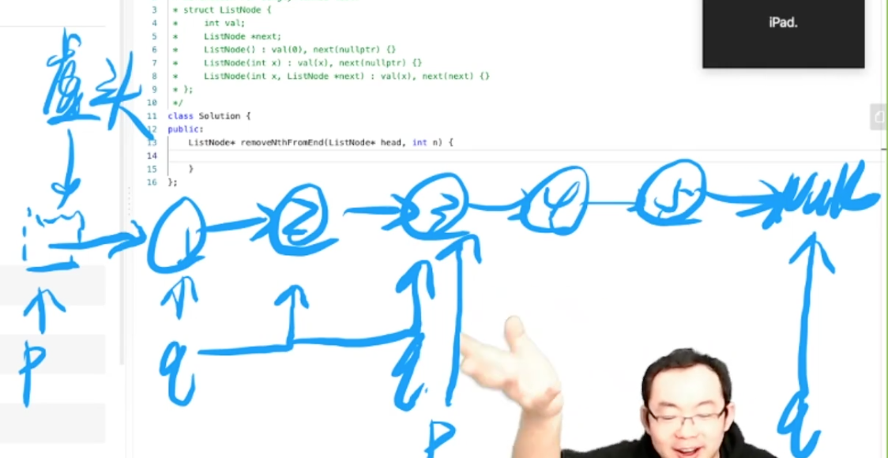
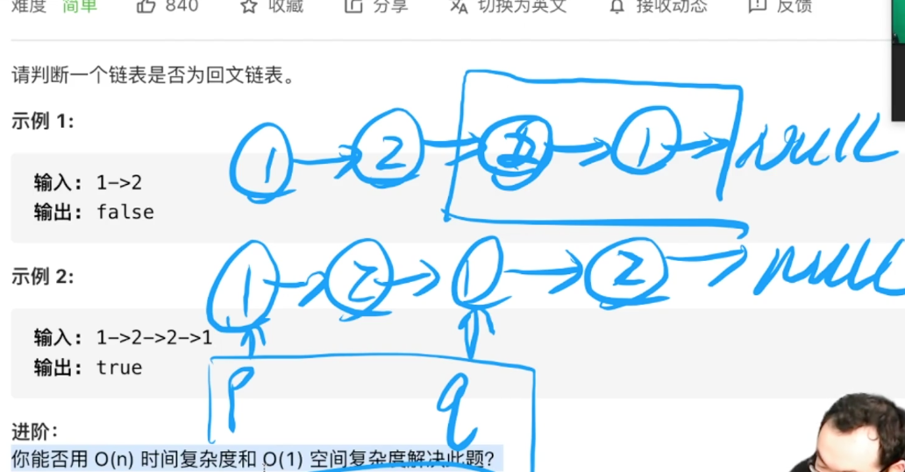
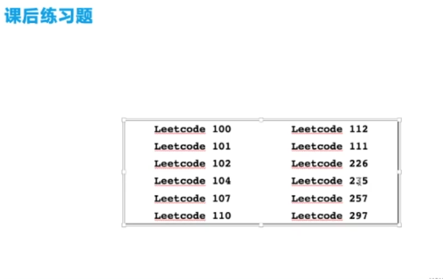

算法逻辑思维？

大厂工程师的自我修改
- 新手篇：在基础数据解构与算法中精进
    - 线性表基础
    - 树结构基础
    - 排序算法
    - 查找与搜索
- 高手篇：数据结构与算法进阶
- 极客：走进伟大的算法思想


线性表基础--链表
树结构--简单的树结构题（遍历，相等 ，二叉树反转操作）
排序--快排、归并排序(相关优化)调用排序算法
查找与搜索--二分查找、hash(哈希)表（一个算法，一个结构） 搜索--深搜、广搜


时间复杂度 |链表 | 数组
---|---|---
插入| O(n) | O(1)
删除| O(1) | O(n )
查找| O(1) | O(n)

## 链表
### 删除链表中的倒数第N个节点

虚拟头节点-- 删除头节点？



```
class Solution {
public: 
    ListNode* removeNthFromEnd(ListNode* head, init i) {
        listNode ret, *p, *q;
        ret.next = head;
        p = &ret; q = head;
        while(n--) q = q -> next;
        whidle(q)  p = p -> next, q = q-> next;
        p -> next = p -> next -> next;
        return ret. next;
    }
}
```

### 判断链表是否为回文链表

1-> 2 false 

1-> 2->2 -> 1 true



```
class Solution {
public: 
    init getLen(ListNode *head) {
        ListNode *p = head;
        int l = 0;
        while (p) p = p -> next, l += 1;
        return l
    }

    ListNode * reverse(listNode, *head) {
        listNode ret, *p, *q;
        ret.next = nullptr;
        p = head;
        while(p) {
            q = p -> next;
            p-> next = ret.next;
            ret.next = p;
            p = q;
        }
        return ret.next;
    }

    bool inPalindrome(ListNode* head) {
        int = n = getLen(head);
        int m = n / 2;
        listNode ret, *p, * q;
        ret.next = head;
        p = &ret, q = head;
        while(m--) q = q -> next;
        while (q) p = p -> next, q = q.next;
        p -> next = reverse(p -> next);
        p = p -next;
        q = head;
        while(p) {
            if(p -> val - q ->val)  return false;
            p = p -> next;
            q = q -> next;
        }
        return false;
    }
}
```


## 二叉树

### 二叉树的层序遍历

1. 广度遍历  
2. 深搜实现

```
class Solution {
public: 
    void dfs(ThreeNode *root, int k, vector<vector<int>> &ret) {
        if (root === nullptr) return;
        if (ret.size() === k) ret.push_back(vector<int>()); // 新的数组  动态扩容数组
        ret[k].push_back(root -> val);
        dfs(root-> left, k + 1, ret);
        dfs(root -> right, k + 1, ret);
        return;
    }
    vector<vector<int>> levelOrder(ThreeNode* root) {
        vector<vector<int>> ret;
        dfs(root, 0, ret);
        return ret;
    }
}
```

### 平衡二叉树
```
class Solution {
public: 
    int getHeight(TreeNode *root) {
        if (root == nullprt) return 0;
        int l = getHeight(root->left);
        int r = getHeight(root->right);
        if (l < 0 || r < 0) return -2;
        if (abs(l - r) > 1) return -2;
        return max(l, r) + 1;
    }
    bool isBalanced(TreeNode* root) {
        int h = getHeight(root);
        return h >= 0;
    }
}
```

