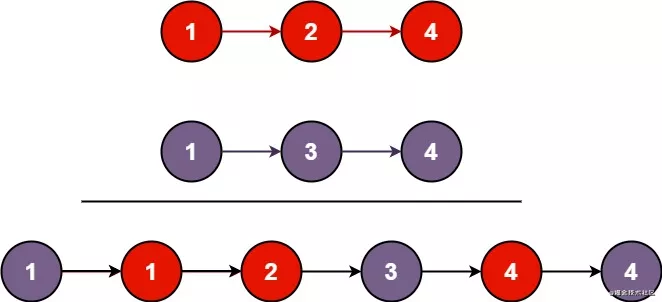
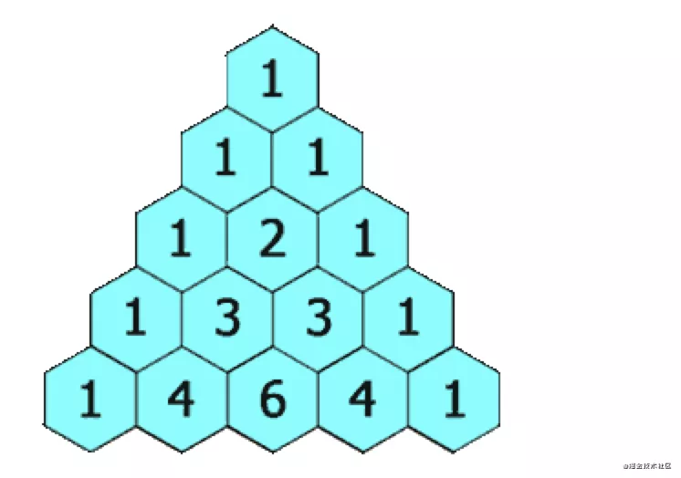
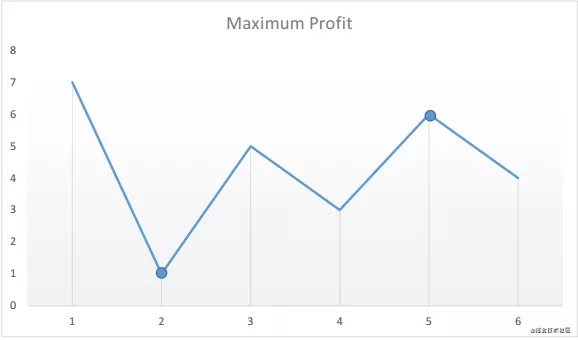
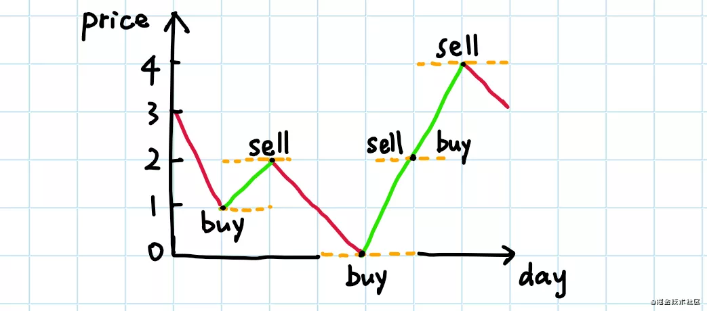
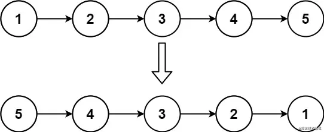
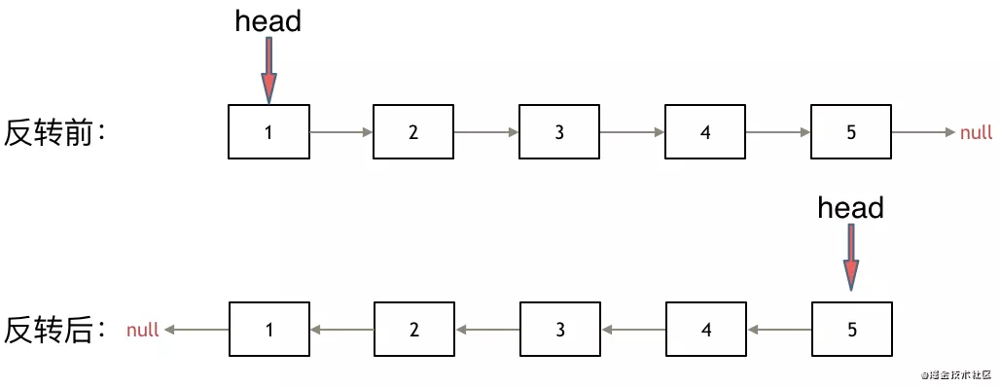
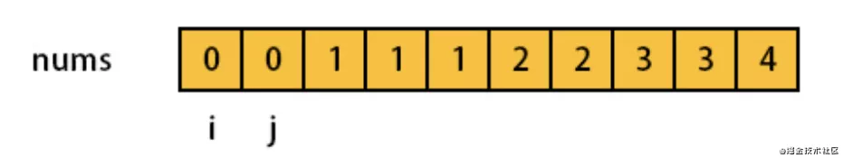
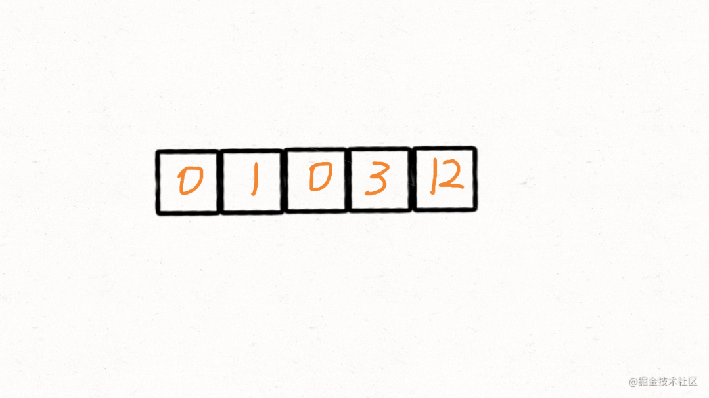

为了帮助大家快速刷题，通过将**数据结构+题型**的方式总结出来，比如说哈希表拥有记数的功能，如果题目中包含字眼*至少xx次，至多xx次**等等字眼，可以联想用哈希表来解决，刷个3-4类似的题，就会养成一种条件反射

### 存在重复元素
题目描述如下：

给定一个整数数组，判断是否存在重复元素

如果存在一值在数组中出现至少两次，函数返回true.如果数组中每个元素都不同相同，则返回false
```bash
示例1:

输入: [1,2,3,1],
输出: true

示例2：

输入: [1,2,3,4];
输出: false
```
这题一看就是技术问题，题目中**如果存在一值在数组中出现至少两次**，这句话就告诉我们几率每一个数字出现的次数就能解决问题

**解题思路**
我们遍历数组时，经过数组中每一项就往map中添加，比如[1,2,3,1]

- 第一项:遍历第一个1时，对象返回{1:1}代表出现1次
- 第二项:遍历到2时，返回{1:1, 2:1}
- 第三项:遍历到3时，返回{1:1,2:1, 3: 1}
- 第四项:遍历到第二个1时，发现原来对象里已经有1了，返回true

```js
const containsDuplicate = function(nums) {
    let map = new Map();
    for (let i of nums) {
        if (map.has(i)) {
            return true;
        } else {
            map.set(i, 1);
        }
    }
    return false;
}
```
## 哈希表+计数类型
除了上面的那道题，在最热门的简单题型中还有一些计数类型的题，我们一一解答，这是一类题型

### 字符串中的第一个唯一字符
一看题目，唯一，条件反射，计数题啊，map走起，我们先看下题目

给定一个字符串，找到它的第一个不重复的字符，并返回它的索引。如果不存在，则返回-1

```bash
示例：

s= 'leetcode';
返回0

s = 'loveleetcode';
返回2
```
思路：
    - 遍历字符串
    - 用一个对象{}来计数，出现一次就+1
    - 遍历完毕，在遍历字符串，看他们在之前的对象里的值，是否是1，是就返回下标，不是返回-1
```js
var firstUniqchar = funtion(s) {
    cosnt map = {};
    for (let v of s) map[v] = (map[v] || 0) + 1;
    for (let i = 0; i < s.length; i++) if (map[s[i]] === 1) return i;
    return -1;
}
```
### 有效的字符异同词
给定两个字符串s和t,编写一个函数来判断t是否是s的字母异同词

注意: 若s和t中每个字符出现的次数都相同，则s和t互为异同词
```bash
示例1：

输入：s = "anagram", t = "nagaram"
输出：true
示例：2

输入：s = 'rat', t = 'car';
输出：false
```
思路:这个题是一看字眼，出现次数相同，次数不就是计数吗？计数题型 map走起！

- 声明计数器，一个对象const obj = {};
- 遍历s字符串，如果遍历到字符串'a'字母，去看obj[a]是否存在
- 不存在说明第一次遍历到'a'字母，那么初始化obj[a] = 1;
- 如果存在则obj[a] += 1;
- t字符串同理，他每次减1
- 遍历完s字符串后，遍历obj对象，看它的每一对key:value，是否value都是0

```js
var isAnagram = function(s, t) {
    const sLen = s.length;
    const tLen = t.length;
    if (sLen !== tLen) {
        return false;
    }
    const obj = {};
    for (let i = 0; i < sLen; i++) {
        const currentS = s[i];
        const currentT = t[i];
        obj[currentS] ? obj[currentS]++ : obj[currentS] = 1;
        obj[currentT] ?  obj[currentT]-- : obj[currentT] = -1
    }
    return Object.values(obj).every(v => v === 0)
}
```
### 多数元素
我们先看题目(题目里有次数连个字，又是计数题型，map继续走起)

给定一个大小为n的数组，找到其中的多数元素。多数元素是指数组中出现次数大于[n / 2]的元素

你可以假设舒服是费控的，并且给定的数组总是存在多数元素
```bash
示例1

输入: [3,2,3]
输出：3
示例：2

输入：[2,2,1,1,1,2,2]
输出:2
```
思路:
- 声明一个计数器，也就是一个对象const map = {};
- 遍历字符串，开始计数，如果字符串的字母第一次碰见，map[第一次碰见的字母] = 1；
- 如果map已经记录过这个字母，则map[记录过的字符] +=1；
- 遍历过程中看map[记录过的字母]是否大于数组总长度/2
```js
var majortityElement = function(nums) {
    const map = {};
    const n = num.length >> 1; // >>是右移运算符，意思是除以2
    for (let i = 0; i< nums.length; i++) {
        map[nums[i]] = map[nums[i]] !== undefined ? map[nums[i]] + 1 : 1;
        if (map[nums[i]] > n)  return nums[i]
    }
}
```
### 只出现一次的数字
这个题一看，出现一次，map走起，但是呢，这个题比较巧的是，因为题目的一些限制条件，可以有更好的解法，我们先看题

给定一个非空整数数组，除了某个元素只出现一次以外，其余每个元素均出现两次。找出那个只出现一次的元素

```bash
示例1：

输入: [2, 2,1]
输出：1，

示例2
输入:[4,1,2,1,2]
输出：4
```
这里我们用map记录一遍，类似这样的代码
```js
function fn(arr) {
    const map = {};
    for (let i = 0; i < arr.length; i++) {
        map[arr[i]] ? map[arr[i]]++ : map[arr[i]] = 1;
    }
    for (let i = 0; i < Object.keys(map).length; i++) {
        if(map[i] === 1) return i
    }
}
// 在遍历一遍map，然后看谁的次数是1，就解决了
```
但是这套题有另一种解法，用异或运算符，首先我们看看异或运算符有啥用：

异或运算符(^)，我们了解下，这个运算符的功能
- 任何数和自己做异或运算结果为0，即使a⊕a = 0;
- 任何数和0做异或运算，结算还是自己即a⊕0 = a;
- 异或运算中，满足交换律和结合律，也就是a⊕b⊕a=b⊕a⊕a=b⊕(a⊕a)=b⊕0=b

所以 出现两字的字母异或运算的0， 跟出现一次的字母异或运算得到自己
```js
var singleNumber = function(nums) {
    let init = nums[0];
    for (let i = 1; i < nums.length; i++) {
        init ^= nums[i];
    }
    return init;
}
```
### 位1的个数

编写一个函数，输入是一个无符号证书(以二进制串的形式)，返回其二进制表达式中数字位数为1的个数(也被成为汉明重量)

```bash
示例 1：

输入：00000000000000000000000000001011
输出：3
解释：输入的二进制串 00000000000000000000000000001011 中，共有三位为 '1'。

示例 2：

输入：00000000000000000000000010000000
输出：1
解释：输入的二进制串 00000000000000000000000010000000 中，共有一位为 '1'。
```
思路：

计算个数，按照我们之前的思路，把整数数字转成字符串，类似这样
```bash
数字 0001 => String(0001) => '0001' => 遍历看1的个数
```
然后直接遍历计算就可以了，但是我为什么把它归为计数类别的原因，当然也可以把它归为数学类，我们用数学的算法来接，先看答案
```js
var hammingWeight = function(n) {
    let ret = 0;
    while(n) {
        n &= (n - 1);
        ret++;
    }
    return ret;
}
```
每执行一次x = x & (x-1)，会将x用二进制表示时最右边的一个1变为0，因为x-1将会将该位(x用二进制表示时最右边的一个1)变为0。因此，对 x 重复该操作，直到 x 变成 0，则操作次数即为 x 的二进制数中的 1 的数目。

接下来，我们把其他类型的哈希表题也介绍了（相同的题型没那么多）

### 数组形式多少数对
给你一个下标从 0 开始的整数数组 nums 。在一步操作中，你可以执行以下步骤：

从 nums 选出 两个 相等的 整数
从 nums 中移除这两个整数，形成一个 数对
请你在 nums 上多次执行此操作直到无法继续执行。

返回一个下标从 0 开始、长度为 2 的整数数组 answer 作为答案，其中 answer[0] 是形成的数对数目，answer[1] 是对 nums 尽可能执行上述操作后剩下的整数数目。
```js
// 输入：nums = [1,3,2,1,3,2,2]
// 输出：[3,1]
// 解释：
// nums[0] 和 nums[3] 形成一个数对，并从 nums 中移除，nums = [3,2,3,2,2] 。
// nums[0] 和 nums[2] 形成一个数对，并从 nums 中移除，nums = [2,2,2] 。
// nums[0] 和 nums[1] 形成一个数对，并从 nums 中移除，nums = [2] 。
// 无法形成更多数对。总共形成 3 个数对，nums 中剩下 1 个数字。
var numberOfPairs = function(nums) {
    let map = new Map();
    let res = 0;
    for(let num of nums) {
        map.set(num, !map.get(num) || false);
        if(!map.get(num)) {
            res++;
        }
    }
    return [res, nums.length - res * 2];
}
```
[数组能形式多少数对](https://leetcode.cn/problems/maximum-number-of-pairs-in-array/description/?languageTags=javascript)
### 最好的扑克手牌
给你一个整数数组 ranks 和一个字符数组 suit 。你有 5 张扑克牌，第 i 张牌大小为 ranks[i] ，花色为 suits[i] 。

下述是从好到坏你可能持有的 手牌类型 ：

"Flush"：同花，五张相同花色的扑克牌。
"Three of a Kind"：三条，有 3 张大小相同的扑克牌。
"Pair"：对子，两张大小一样的扑克牌。
"High Card"：高牌，五张大小互不相同的扑克牌。
请你返回一个字符串，表示给定的 5 张牌中，你能组成的 最好手牌类型 。

注意：返回的字符串 大小写 需与题目描述相同。
```js
// 输入：ranks = [13,2,3,1,9], suits = ["a","a","a","a","a"]
// 输出："Flush"
// 解释：5 张扑克牌的花色相同，所以返回 "Flush" 。
const bestHand = function(ranks, suits) {
    let suitsSet = new Set();
    for(let suit of suits) {
        suitSet.add(suit);
    }
    if(suitSet.size === 1) {
        return 'Flush';
    }
    let h = new Map();
    for(let rank of ranks) {
        h.set(rank, (h.get(rank) || 0) + 1);
    }
    if (h.size === 5) {
        return "High Card";
    }
    for (const value of h.values()) {
        if (value > 2) {
            return "Three of a Kind";
        }
    }
    return "Pair";
}
```
[最好的扑克手牌](https://leetcode.cn/problems/best-poker-hand/description/?languageTags=javascript)
## 哈希表+ 映射功能

哈希表有一个非常常见的功能就是建立映射关系，比如说设计模式里的**策略模式？**，思路是一样，映射表常常见于后端的枚举类型，typeScript也是一样我们举个例子
```js
// 后端只会返回0， 1，，2
const TYPE = {
    2: 'orange',
    1: 'res',
    0: 'blue'
}

// 然后前端会这样用
TYPE[后端返回的数字0或1或2]
```
### 对应题目有
1. 两数之和
2. 两个数组的交集

### 两数之和
给定一个整数数组nums和一个整数目标值target，请你在该数组中找出和为目标值target的那两个整数，并返回他们的下标

你可以假设每种输入只会对应一个答案。但是，数组中同一个元素在答案里不能重复出现。

你可以按任意顺序返回答案
```bash
示例 1：

输入：nums = [2,7,11,15], target = 9
输出：[0,1]
解释：因为 nums[0] + nums[1] == 9 ，返回 [0, 1] 。

示例 2：

输入：nums = [3,2,4], target = 6
输出：[1,2]

示例 3：

输入：nums = [3,3], target = 6
输出：[0,1]
```
用hashMap存储遍历过的元素和对应的索引。每遍历一个元素，看看hashMap中是否存在满足要求的目标数字。所有事情都再一次遍历中完成(用空间换时间)
```js
var twoSum = function(nums, target) {
    const map = new Map();
    for (let i = 0, len = arr.length; i < len; i++) {
        if (map.get(nums[i]) !== undefined) {
            return [map.get(nums[i]), i];
        } else {
            map.set(target - nums[i], i);
        }
    }
    return [];
}
```
### 两个数组交集
给定两个数组，编写一个函数计算他们的交集
```bash
示例 1：

输入：nums1 = [1,2,2,1], nums2 = [2,2]
输出：[2]

示例 2：

输入：nums1 = [4,9,5], nums2 = [9,4,9,8,4]
输出：[9,4]
 

说明：

输出结果中的每个元素一定是唯一的。
我们可以不考虑输出结果的顺序。
```
这个题可以用set，很简单，但是空间复杂度和时间成本都太高，不太优雅
```js
var intersection = function(num1, num2) {
    return result = [...new Set(num1)].filter(item => new Set(num2).has(item))
}
```
可以用map来做，时间和空间复杂度都低 很多，思路
- 用一个map去存nums1数组里的每一项，类似 map[nums1[i]] = true;
- 然后去遍历nums2,如果在map中已经存在值，类似map[nums2[i]],就把它push到一个数组里
- 并且将map【nums2[i]】设置false,后面相同的值就不会push到数组里了
```js
var intersection = function(nums1, nums2) {
    const map = {};
    const ret = [];
    for (var i = 0; i< nums1.length; i++) {
        map[nums1[i]] = true;
    }
    for (var i = 0; i< nums2.length; i++) {
        if (map[nums2[i]]) {
            ret.push(nums2[i]);
            this.map[nums2[i]] = false;
        }
    }
    return ret;
}
```

## 找规律

这类题一般画个图或者稍微分析一下就能得到答案

### 罗马数字转整数
这个题，我来简单描述一下，罗马数字对应我们阿拉伯数组的map如下
```js
    I: 1,
    V: 5,
    IV: 4,
    IX: 9,
    X: 10,
    XL: 40,
    XC: 90,
    L: 50,
    C: 100,
    CD: 400,
    CM: 900,
    D: 500,
    M: 1000,
```
题目是给定一个罗马数字，将其转换成整数。输入确保在1到3999的范围内
```bash
示例1
输入：'III'
输出：3，

示例2
输入: 'IV'
输出4，

示例 3:
输入: "IX"
输出: 9

示例 4:

输入: "LVIII"
输出: 58
解释: L = 50, V= 5, III = 3.
```
解题思路就是我们发现这些案例的规律，就是把map表里面对应数字加起来就行了，比如说

"LVIII" = 'L'（对应map表50）+ 'V'（对应map表5）+ 'I'（对应map表1） + 'I'对应map表1） + 'I'（对应map表1）

所以解答就很简单了，就是遍历数字把对应的值加起来，如下：

```js
var romanToInt = function(s) {
    const map = {
        I: 1,
        V: 5,
        IV: 4,
        IX: 9,
        X: 10,
        XL: 40,
        XC: 90,
        L: 50,
        C: 100,
        CD: 400,
        CM: 900,
        D: 500,
        M: 1000,
    }
    let res = 0;
    let index = 0;
    let len = s.length;
    while(index < len) {
        if (index + 1 < len && map[s.slice(index, index + 2)]) {
            res += map[s.slice(index, index + 2)];
            index += 2;
        } else {
            res += map[s.slice(index, index + 1)];
            index += 1;
        }
    }
    return res;
}
```
### 最长公共前缀
编写一个函数来查找字符串数组中的最长公共前缀

如果不存在公共前缀，返回空字符串''
```bash
示例1
输入: strs = ['flower', 'flow', 'flight'],
输出：'fl',

示例 2：
输入：strs = ["dog","racecar","car"]
输出：""
解释：输入不存在公共前缀。
 

提示：
0 <= strs.length <= 200
0 <= strs[i].length <= 200
strs[i] 仅由小写英文字母组成
```
思路：这个题的思路就是，假如你求数组里三个元素的最长公共前缀
- 你先拿前两个比较，求出他们的最长公共前缀
- 然后上面求出的结果去跟第三个元素求最长公共前缀
- n个元素就怎么reduce下去
```js
// 这个是求出两个元素公共前缀的方法
var longestCommonPrefix = function(strs) {
    if (strs.length === 0) return '';
    if (strs.length === 1) return strs[0];
    return strs.reduce(getSameStr, strs[0]);
}
function getSameStr(a, b) {
    let res = '';
    for (let j = 0; j < a.length; j++) {
        if (a[j] === b[j]) {
            res += a[j]
        } else {
            return res;
        }
    }
    return res;
}
```

### 合并两个有序链表
这个题简而言之是就是看图找规律，就是合并为升序链表

讲两个升序链表合并为一个新的升序链表并返回。新链表是通过拼接给定的两个链表的所有节点组成



```bash
示例 1：


输入：l1 = [1,2,4], l2 = [1,3,4]
输出：[1,1,2,3,4,4]

示例 2：
输入：l1 = [], l2 = []
输出：[]

示例 3：
输入：l1 = [], l2 = [0]
输出：[0]
 

提示：
两个链表的节点数目范围是 [0, 50]
-100 <= Node.val <= 100
l1 和 l2 均按 非递减顺序 排列
```
思路：那就挨个遍历，按顺序谁小拼接水，接着进入下一轮循环，看代码更清晰些

```js
// 链表定义函数
function ListNode(val, next) {
    this.val = (val === undefined ? 0 : val);
    this.next (next === undefined ?  null : next)
}
var mergeTwoLists = function(l1, l2) {
    const dummppy = node = new ListNode();
    while(l1 && l2) {
        if (l1.val >= l2.val) {
            node.next = l2;
            node = node.next;
            l2 = l2.next;
        } else {
            node.next = l1;
            node = node.next;
            l1 = l1.next;
        } 
    }
    node.next = l1 || l2;
    return dummppy.next;
}
```

### 实现str()
实现strStr()函数

给你两个字符串haystack和needle，请你在haystack字符串中找出needle字符串出现的第一个位置(下面从0开始)，如果不存在返回-1

```bash
示例 1：

输入：haystack = "hello", needle = "ll"
输出：2

示例 2：
输入：haystack = "aaaaa", needle = "bba"
输出：-1

示例 3：
输入：haystack = "", needle = ""
输出：0
 

提示：
0 <= haystack.length, needle.length <= 5 * 104
haystack 和 needle 仅由小写英文字符组成
```
思路

**本来这道题最佳算法是KMP**,这个算法理解起来对我来说有难度，所以自己换了另一种思路

- 遍历字符串是否有和需要照的字符串第一个字母相同
- 如果相同，就截取字符串跟需要照的字符串长度的字符串相比，
- 相同就返回下标，不同就继续遍历原字符串
```js
var strStr = function(haystack, needle) {
    if (needle === '') return 0;
    for (var i = 0; i < haystack.lenht; i++) {
        if (haystack[i] === needle[0]) {
            if (haystack.substring(i, i + needle.length) === needle) return i;
        }
    }
    return -1
}
```
### 杨辉三角
这个可是找规律的代表题，并且这道题 可以训练一下你的对二维数组转代码的能力



在杨辉三角中，每个数都是它左上方和右上方的数的和

示例
```bash
输入：5
输出：
[
     [1],
    [1,1],
   [1,2,1],
  [1,3,3,1],
 [1,4,6,4,1]
]
```
思路：
- 看到上图可以发现，生成杨辉三角numRows行，数组就有numRows行
- 每一行，它的数组第一个位置和最后一个位置都是1
- 每一行，除了第一个和最后一个位置，其他位置的值等于上一上的两个值相加

把思路翻译成代码即可
```js
var generate = function(numRows) {
    if (numRows === 0) {return []};
    const result = Array.from(new Array(numRows), () => []);
    for (let i = 0; i < numRows; i++) {
        result[i][0]= 1; result[i][i] = 1;
        for (let j = 1; j < i; j++) {
            result[i][j] = result[i - 1][j - 1] + result[i - 1][j]
        }
    }
    return result;
}
```

### 买卖股票的最佳时机
接下来这道题 你简单看下题目就行，解答原理超级简单，看图说话，找规律

给定一个数组prices, 它的第i个元素prices[i]表示一支给定股票第i天的价格。

你只能选择某一天买入这只股票，并选择在未来的某一天不同的日子卖出该股票。设计一个算法来计算你能获取的最大利润

返回你可以从这笔交易中获取的最大利润。如果不能获取任何利润，返回0
```md 
示例1
输入：[7,1,5,3,6,4]
输出：5
解释:在第2天(股票价格=1)的时候买入，在第5天(股票价格 = 6)的时候卖出，最大利润是 6-1= 5.
    注意利润能是7-1 = 6，因为卖出价格需要大于买入价格，同时不能在买入前卖出股票

示例 2：
输入：prices = [7,6,4,3,1]
输出：0
解释：在这种情况下, 没有交易完成, 所以最大利润为 0。
 

提示：
1 <= prices.length <= 105
0 <= prices[i] <= 104
```
解题思路：我们先看一张图，假设给定的数组为[7, 1, 5, 3, 6, 4]



- 第一天是7,我们记录一下,因为还没到第二天不知道这个价格是高还是低，标记最小值是7
- 第二天是1，比7小，那么只要当前天数的值比前面小，就说明不能卖，因为他是最小值，标记最小值是1
- 第三天是5，5比前一天大，说明比最小值要大，那么可以卖，利润就是5-1 = 4；
- 第四天发现是3，比5小，还是一样的道理，比之前小，最小值要变为当前值，啥也不干标记最小值是3
- 第五天发现是6... 第六天发现是4，规律是一样的

意思是只要今天比昨天低，就可以用今天减去最小值，就是利润，然后每次都比较这个利润是不是最大就行了

```js
var maxRrofit = function(prices) {
    var res = 0;
    var min = prices[0];
    for (let i = 0; i < prices.length; i++) {
        if (prices[i] < min) {
            min = prices[i];
        } else {
            res = Math.max(prices[i]- min, res);
        }
    }
    return res;
}
```

### 买卖股票的最佳时机2
有一道看书说话题目，走起

给定一个数组prices，其中prices[i]是一直给定股票第i天的价格。

设计一个算法计算你能获取的最大利润。你可以尽可能的完成更多的交易(多次买卖一直股票)

注意: 你不能同事参与多笔交易(你必须在购买前出售掉之前的股票)
```md
示例 1:
输入: prices = [7,1,5,3,6,4]
输出: 7
解释: 在第 2 天（股票价格 = 1）的时候买入，在第 3 天（股票价格 = 5）的时候卖出, 这笔交易所能获得利润 = 5-1 = 4 。
     随后，在第 4 天（股票价格 = 3）的时候买入，在第 5 天（股票价格 = 6）的时候卖出, 这笔交易所能获得利润 = 6-3 = 3 。
    
示例 2:
输入: prices = [1,2,3,4,5]
输出: 4
解释: 在第 1 天（股票价格 = 1）的时候买入，在第 5 天 （股票价格 = 5）的时候卖出, 这笔交易所能获得利润 = 5-1 = 4 。
     注意你不能在第 1 天和第 2 天接连购买股票，之后再将它们卖出。因为这样属于同时参与了多笔交易，你必须在再次购买前出售掉之前的股票。

示例 3:
输入: prices = [7,6,4,3,1]
输出: 0
解释: 在这种情况下, 没有交易完成, 所以最大利润为 0。
```
思路，看图马上思路就出来了



我们的利润就跟上图绿色部分显示一样，也就是说只要今天减去昨天，是整数的利润，简单吧
```js
var maxProfit = function(prices) {
    var result = 0;
    for (let i = 1; i < prices.length; i++) {
        if (prices[i] > prices[i - 1]) {
            result += prices[i] - prices[i - 1]
        }
    }
    return result;
}
```
### 反转链表
这个题必须掌握牢实，是解很多链表题的基础的基础

给你单链表的头节点head，请你反转链表，并返回反转后的链表


```md
输入: head= [1,2,3,4,5]
输出：【5，4，3，2，1】
```
解决思路依然是看图找规律，下图是，我们把链表签名加一个null，这样反转前和反转后就一致了



```js
var reverseList = funtion(head) {
    var [prev, cur] = [null, head];
    while(cur) {
        const next = cur.next;
        cur.next = prev;
        prev = cur;
        cur = next;
    }
    return prev;
}
```

## 双指针
双指针是解数组类型题最常见的解法

- 比如有头尾分别有指针，然后依次向中间靠拢的双指针
- 还有一种是快慢指针，两个指针都是从左边开始，一个走的快，一个走的慢，

具体细节还是需要从题里体会，我们现在开始

### 删除数组中重复的项

给你一个有序数组nums，请你原地删除重复出现的元素，使每个元素只出现一次，返回删除后数组的心长度

不要使用额外的数组空间，你必须在原地修改输入数组，并在使用O(1)额外空间的条件下完成

```md
示例 1：
输入：nums = [1,1,2]
输出：2, nums = [1,2]
解释：函数应该返回新的长度 2 ，并且原数组 nums 的前两个元素被修改为 1, 2 。不需要考虑数组中超出新长度后面的元素。

示例 2：
输入：nums = [0,0,1,1,1,2,2,3,3,4]
输出：5, nums = [0,1,2,3,4]
解释：函数应该返回新的长度 5 ， 并且原数组 nums 的前五个元素被修改为 0, 1, 2, 3, 4 。不需要考虑数组中超出新长度后面的元素。
 

提示：
0 <= nums.length <= 3 * 104
-104 <= nums[i] <= 104
nums 已按升序排列
```
初始状态


- 慢指针是i，快指针是j
- 如果nums[i]等于nums[j]说明是相同的元素，j继续走，i还在原位
- 如果nums[i]不等于nums[j]说明是不相同的元素，那么nums[i++] = nums[j], j继续往前走

依次类推，就相当于i指针保证它与前面的数字都是不重复的，j就是一个遍历器
```js
var removeDuplicates = function(nums) {
    let i = 0;
    for (let j = 1; j < nums.length; j++) {
        if (num[j] !== nums[i]) {
            nums[i + 1] = num[j];
            i++;
        }
    }
    return i + 1;
}
// 写法二
const removeDuplicates = nums => {
    let i = j = 0;
    while(i < nums.length){
        if(nums[i] !== nums[j]) {
            nums[j + 1] = nums[i];
            j++;
        }
        i++
    }
    return nums.slice(0, j + 1)
}
console.log(removeDuplicates([1,1,2]))
```
### 合并两个有序数组

给你两个有序整数数组nums1和nums2，请你将nums2合并到nums1中，使nums1成一个有序数组

初始化nums1和nums2的元素数量分别为m和n。你可以假设nums1的空间大小等于 m+ n,这样它就有足够的空间保存nums2的元素
```bash
示例 1：

输入：nums1 = [1,2,3,0,0,0], m = 3, nums2 = [2,5,6], n = 3
输出：[1,2,2,3,5,6]

示例 2：
输入：nums1 = [1], m = 1, nums2 = [], n = 0
输出：[1]
 

提示：
nums1.length == m + n
nums2.length == n
0 <= m, n <= 200
1 <= m + n <= 200
-109 <= nums1[i], nums2[i] <= 109
```
这道题大家很容易想到，新创建一个数组，然后分别比较这两个数组里的每一项，push进去就行了

然而因为是有序数组，第一个数组还有正好满足假如第二数组的空间，所以这里可以采取双指针来解答，从后往前遍历

```js
var merge = function(nums1, m, nums2, n) {
    let len = m + n - 1;
    m--, n--;
    while(m >=0 && n>= 0) {
        if (nums1[m] > nums2[n]) {
            nums1[len] = nums1[m--];
        } else {
            nums1[len] = nums2[n--];
        }
        len--;
    }
    if (m === -1) {
        return nums1.splice(0, len+1, ...nums2.slice(0, n + 1));
    }
    if (n === -1) {
        return nums1;
    }
}
```
### 验证回文串
给定一个字符串，验证它是否是回文串，只考虑字母和数字字符，可以忽略大小写

说明，本题中，我们将空字符串定义为有效回文串
```bash
输入: "A man, a plan, a canal: Panama"
输出: true
解释："amanaplanacanalpanama" 是回文串

示例 2:
输入: "race a car"
输出: false
解释："raceacar" 不是回文串
```
这个题太简单了，以至于不用写思路，看代码就知道，就是用双指针向中间靠拢的解法

```js
var isPalindrome = function(s) {
    s = s.replace(/[^a-zA-Z0-9]/g, '').toLowerCase();
    let left = 0;
    let right = s.length - 1;
    while(right > left) {
        if (s[left++] === s[right--]) {
            continue;
        } else {
            return false;
        }
    }
    return true;
}
```
### 回文链表
这题思路跟上面一样的，都是双指针对比，但是主要是这个题写起来麻烦，要用到我们之前说的翻转链表

解题思路
- 先用快慢指针的手法，让我们知道这个链表的中点是哪，然后从中截断
- 然后阶段的分成两个链表，把后面的链表翻转
- 然后依次去判断这两个链表是否相同

关键点:如何从中点阶段这个链表，让一个指针每次走一步，另一个指针每次都两步，这样他们每次走的倍数就是相差2倍
```js
let fast = head;
let slow = head;
let prev;
while(fast && fast.next) {
    prev = slow;
    slow = slow.next;
    fast = fast.next.next;
}
prev.next = null; // 断成两个链表
```
接着我们需要翻转链表
```js
// 翻转后半段
let head2 = null;
while(slow) {
    const next = slow.next;
    slow.next = head2;
    head2 = prev;
    slow = next;
}
```
具体对比下面具体代码
```js
const isPalindrome = head => {
    if (head === null || head.next === null) {
        return true;
    }
    let fast = head;
    let slow = head;
    let prev;
    while(fast && fast.next) {
        prev = slow;
        slow = slow.next;
        fast = fast.next.next;
    }
    prev.next = null; // 断成两个链表
    // 翻转后半段
    let head2 = null;
    while(slow) {
        const next = slow.next;
        slow.next = head2;
        head2 = slow;
        slow = next;
    }
    // 比对
    while(head && head2) {
        if (head.val !== head2.val) {
            return false;
        }
        head = head.next;
        head2 = head2.next;
    }
    return true;
}
```

### 删除链表中的节点
请编写一个函数，使其可以删除某个链表中给定的(非末尾的节点)。传入函数的唯一参数为要被删除的节点
```md
示例 1：
输入：head = [4,5,1,9], node = 5
输出：[4,1,9]
解释：给定你链表中值为 5 的第二个节点，那么在调用了你的函数之后，该链表应变为 4 -> 1 -> 9.

示例 2：
输入：head = [4,5,1,9], node = 1
输出：[4,5,9]
解释：给定你链表中值为 1 的第三个节点，那么在调用了你的函数之后，该链表应变为 4 -> 5 -> 9.
 

提示：
链表至少包含两个节点。
链表中所有节点的值都是唯一的。
给定的节点为非末尾节点并且一定是链表中的一个有效节点。
不要从你的函数中返回任何结果。
```
这个题很简单，其实这个node是个引用类型，你只需要把node的val编程node.next的val，然后node的next指向node.next.next,就移花接木了完成任务了
```js
function deleteNode = functon(node) {
    node.val = node.next.val;
    node.next = node.next.next;
}
```

### 移动0
给定一个数组nums，编写一个函数将所有0移动到数组的末尾，同事保持非零元素的相对位置
```md
示例:

输入: [0,1,0,3,12]
输出: [1,3,12,0,0]
说明:

必须在原数组上操作，不能拷贝额外的数组。
尽量减少操作次数。
```
如动画所示，我们可以用快慢指针来解答，具体不好用语言叙述，看动图



```javascript
var moveZeroes = function(nums) {
    let i = j = 0;
    while(i < nums.length) {
        if (nums[i] !== 0) {
            [nums[i], nums[j]] = [nums[j], nums[i]];
            j++;
        }
        i++;
    }
    return nums;
}
```
###  反转字符串
编写一个函数，其作用是将输入的字符串反转过来，输入字符串以字符数组char[]的形式给出

不要给另外的数组分配额外的空间，你必须原地修改输入数组、使用O(1)的额外空间接着这个问题
```md
示例 1：
输入：["h","e","l","l","o"]
输出：["o","l","l","e","h"]

示例 2：

输入：["H","a","n","n","a","h"]
输出：["h","a","n","n","a","H"]
```
简单，知道用收尾双指针即可
```javascript
var serverString = function(s) {
    let l = 0; 
    let r = s.length - 1;
    while(l < r) {
        [s[l], s[r]] = [s[r], s[l]];
        l++, r--
    }
    return s;
}
```

### 两个数组的交集II
给定两个数组，编写一个函数计算他们的交集
```md
示例 1：

输入：nums1 = [1,2,2,1], nums2 = [2,2]
输出：[2,2]
示例 2:

输入：nums1 = [4,9,5], nums2 = [9,4,9,8,4]
输出：[4,9]

说明：

输出结果中每个元素出现的次数，应与元素在两个数组中出现次数的最小值一致。
我们可以不考虑输出结果的顺序。
```
- 如果两个数组是有序的，则可以使用双指针的方法德奥两个数组交集
- 首先对两个数组排序，然后使用两个指针遍历两个数组
    - 初始时，两个指针分别指向两个数组的头部。每次比较两个指针指向两个数组中的数字，如果两个数字不相等，则将指向较小的数字指针右移以为，如果两个数字想等，将数字添加到答案，并将两个指针都右移一位。当至少有一个指针超出数组范围时，遍历结束

```javascript
var intersect = function(nums1, nums2) {
    nums1 = nums1.sort((a, b) => a -b);
    nums2 = nums2.sort((a, b) => a -b);
    let l1 = 0;
    let l2 = 0;
    const nums1len = nums1.length;
    const nums2len = nums2.length;
    const ret = [];
    while (l1 < nums1len && l2 < nums2len) {
        if (nums1[l1] === nums2[l2]) {
            ret.push(num1[l1]);
            l1++;
            l2++;
        }
        if (nums1[l1] > nums2[l2]) l2++;
        if (nums1[l1] < nums2[l2]) l1++;
    }
    return ret;
}
```

剩下20道题 参考[Leetcode 最常见的 150 道前端面试题 （简单题 -下](https://juejin.cn/post/6989031479753834504)
- 栈
- 动态规划
- 数学问题
- 环问题

## 资料
[Leetcode 最常见的 150 道前端面试题 （简单题 -上）](https://mp.weixin.qq.com/s/wgLdV6ilRTapD5aRRZqAAA)
[Leetcode 最常见的 150 道前端面试题 （简单题 -下）](https://juejin.cn/post/6989031479753834504)

[Leetcode 最常见的150道前端面试题(中等题2)](https://juejin.cn/post/6992775762491211783#heading-0)