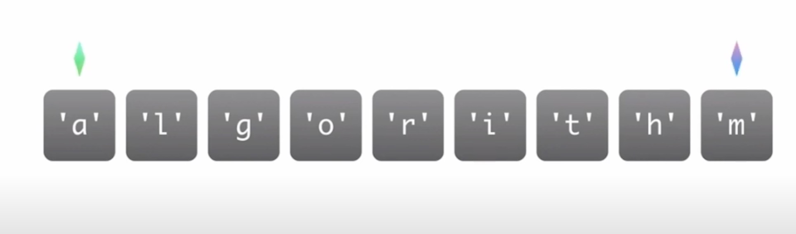
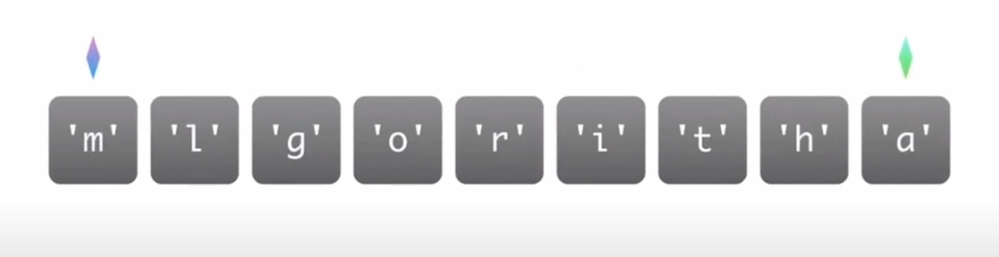

## 前言

- 数组、字符串/Array & String
- 链表/Linked-list
- 栈/Stack
- 队列/Queue
- 双端队列/Deque
- 树/Tree

## 数组、字符串/Array & String
举例 翻转字符串
1.第一个指针指向第一个字符，另一个指针指向最后一个字符

  

2. 互相交换

  

3. 交换之后两个指针向中央位置各自靠拢交换 

  

4. 直至两个指针相遇为止

```javascript
// 翻转字符串
var str = 'algorithm'

function reverseArr(str) {
  var strArr = str.split('');
  let len = strArr.length;
  let l = 0;
  let r = len - 1;
  while(l < r) {
    [strArr[l], strArr[r]] = [strArr[r], strArr[l]]
    r--;
    l++;
  }
  return strArr;
}
reverseArr(str)
```

- 优点

  构建一个数组非常简单，能让我们在O(1)的时间里根据数组下标(index)查询某个元素

- 缺点

  构建时候必须分配一个连续空间。

  查询某个元素是否存在时需要遍历整个数组，耗费O(n)的时间(其中，n是元素个数)

  删除和添加某个元素时，同样需要耗费O(n)的时间

**demo:有效的字母异位词**

[解题参考](/front-end/Code/stady-02.html#有效的字符异同词)