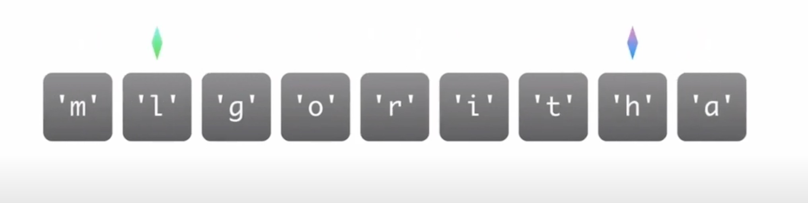
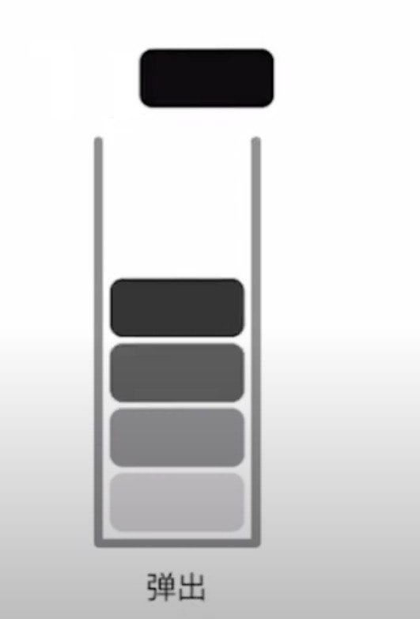

## 前言

- <span style="color: blue">数组、字符串/Array & String</span>
- <span style="color: blue">链表/Linked-list</span>
- <span style="color: blue">栈/Stack</span>
- <span style="color: blue">队列/Queue</span>
- <span style="color: blue">双端队列/Deque</span>
- <span style="color: blue">树/Tree</span>

## 数组、字符串/Array & String
### 翻转字符串
1.第一个指针指向第一个字符，另一个指针指向最后一个字符

  

2. 互相交换

  

3. 交换之后两个指针向中央位置各自靠拢交换 

  

4. 直至两个指针相遇为止

```javascript
// 翻转字符串
var str = 'algorithm'

function reverseArr(str) {
  var strArr = str.split('');
  let len = strArr.length;
  let l = 0;
  let r = len - 1;
  while(l < r) {
    [strArr[l], strArr[r]] = [strArr[r], strArr[l]]
    r--;
    l++;
  }
  return strArr;
}
reverseArr(str)
```


- 优点

  <span style="color: blue">构建一个数组非常简单，能让我们在O(1)的时间里根据数组下标(index)查询某个元素</span>

- 缺点

  - <span style="color: blue">构建时候必须分配一个连续空间。</span>

  - <span style="color: blue">查询某个元素是否存在时需要遍历整个数组，耗费O(n)的时间(其中，n是元素个数)</span>

  - <span style="color: blue">删除和添加某个元素时，同样需要耗费O(n)的时间</span>
### demo:有效的字母异位词
1. 两个长度都为26的数组，来统计每个字符串中小写字母出现的次数，然后对比两个数组是否相等
2. 方案二

  
  
  
  最终每个数组中都为0

[解题参考](/front-end/Code/stady-02.html#有效的字符异同词)

## 链表
链表的出现是为了避免数组的一大缺陷即分配一段连续的内存空间，牺牲数组的优点：不能通过下标查询


- 优点
  - <span style="color: blue">灵活分配内存空间</span>
  - <span style="color: blue">能O(1)时间诶删除或者添加元素</span>
- 缺点
  - <span style="color: blue">查询元素需要O(n)时间</span>
:::tip
  数组元素不确定 经常插入删除--链表
  
  数组元素大小确定，删除插入操作不多-- 数组
:::

### 解题技巧
- 利用快慢指针(有时候用到三个指针)
- 构建一个虚假的链表头

例如：
- 两个排序链表，进行整合排序
- 将链表的奇偶数按原定顺序分离，生成前半部分为奇数，后半部分为偶数

创建一个空的链表头，然后连接 返回空链表的下一个(next)

### K个一组翻转链表


## 栈
特点
- 后进先出(LIFO)

算法基本思想
- 可以用一个单链表来实现
- 只关心上一次的操作(最近的操作)
- 处理完上一次操作后，能在O(1)时间内查找到更前一次的操作




### 有效的括号
往栈里压入左括号  遇到右括号 就把栈顶的左括号弹出来，最后判断栈里是否还有左括号


### 每日温度


## 队列
特点
- 先进先出

## 双端队列
基本实现
- 可以利用一个双链表
- 队列的头尾两端能在O(1)的时间内进行数据的查看、添加和删除


常用场景
- 实现一个长度动态变化的窗口或者连续空间


### 滑动窗口最大值
## 树
树的共性
- 结构直观
- 通过树问题来考察**递归算法**掌握的熟练程度

面试始终常考的树的形状有
- 普通二叉树
- 平衡二叉树
- 完全二叉树
- 二叉搜索树
- 四叉树
特殊的树：红黑树、自平衡二叉搜索树

遍历
- 前序遍历
- 中序遍历
- 后续遍历

### 二叉搜索中第K小的元素

## 资料
[[力扣&拉勾网 300分钟搞定算法面试] 第01讲：常用的数据结构](https://www.youtube.com/watch?v=apuclMi4CrM&list=PLFOgdf0iZ6uskTJam3P2BZwpdAGGG0e24&index=2)