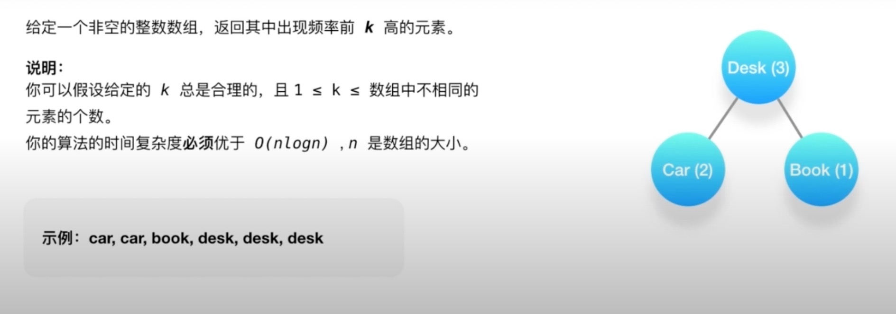

## 前言
- 优先队列
- 图
- 前缀树
- 线段树
- 树状数组

## 优先队列
### 与普通队列的区别
- 保证每次取出的元素是队列中优先级最高的
- 优先级别可自定义

### 常用的场景
- 从杂乱无章的数据中按照一定的顺序(或者优先级)刷选数据

### 本质
二叉堆结构，堆在英文里叫Binary Heap

利用一个数组结构来实现完全二叉树

### 特性
数组里的每一个元素array[0]拥有最高的优先级，给定一个下标i，那么对于元素array[i]而言
- 父节点对应的下标是(i - 1) / 2;
- 右侧子节点对应的元素下标是2 * i+ 1；
- 左侧对应的元素的下标是 2* i + 2;
数组中每个元素的优先级都必须要高于两侧的子节点

### 其基本操作为一下两个
- 向上筛选--新增节点放在最后，沿着节点向上爬
- 向下筛选- 不断执行向下筛选的操作，该元素和它的两个孩子节点对比，发现那个优先级别最高，如果孩子节点级别高，然后直接交换；沿着树的高度往下爬

** 另一个重要的时间复杂度：优先队列初始化(O^n)**

### 前K个高频元素

## 图
最基本的知识点
- 阶、度
- 树、森林、环
- 有向图、无向图、完全有向图、完全无向图
- 连通图、连通分量
- 图的存储和表达方式:邻接矩阵、邻接链表

围绕图的算法也是各式各样
- 图的遍历：深度优先、广度优先
- 环的检测：有向图、无向图
- 拓扑排序
- 最短路径算法
- 连通性相关算法： Kosarauju、Tarjan、求解孤岛的数量、判断是否为树
- 图的着色、旅行商问题等

必须熟练掌握的知识点
- 图的存储和表达方式：邻接矩阵、邻接链表
- 图的遍历：深度优先、广度优先
- 二部图的检测、树的检测、环的检测：有向图、无向图
- 拓扑排序
- 联合-查找算法
- 最短路径

### 判断二分图

## 前缀树
**也称字典树**

这种数据结构被广泛地运用在字典查询当中

**什么是字典查找？**

例如：给定一系列构成字典的字符串，要求在字典当中找出所有以『ABC』开头的字符串
- 暴露搜索法 --- O(M * n)
- 前缀树--O(m)

### 经典应用
搜索框输入搜索文字，会罗列以搜索词开头的相关搜索

汉字拼音输入法

### 重要性质
每个节点至少包含两个基本属性
- children：数组或者集合，罗列出每个分支当中包含的所有字符
- isEnd：布尔值，表示该节点是否为某字符串的几位

根节点是空的--只利用节点的children属性

除了根节点，其他所有节点都可能是单词的结尾，叶子节点一定都是单词的结尾

### 基本操作
1. 创建

  **方法**

  遍历一遍输入的字符串，对每个字符串的字符进行遍历

  从前缀树的根节点开始，将每个字符加入到节点的childrend字符集当中

  如果字符集已经包含了这个字符，跳过

  如果当前字符是字符串的最后一个，把当前节点的isEnd标记为真

2. 搜索

  从前缀树的根节点触发，逐个匹配输入的前缀字符

  如果遇到了，继续下一层搜索

### 单词搜索贰

## 线段树
### 一个例题
假设我们有一个数组array[0...n - 1],里面有n个元素，现在我们要经常对这个数组做两个事
1. 更新数组元素的数值
2. 求数组任意一段去区间里元素的总和(或者平均值)

- 方法一：遍历一遍数组 (O(n))
- 线段树(O(logn))

### 什么是线段树

### 计算右侧小宇当前元素的个数

判断在那个区间，对应区间+1

## 树状数组
### 一个例题
假设我们有一个数组array[0...n -1],里面有n个元素，我们要经常对这个数组做两件事
1. 更新数组元素的数组
2. 求数组前K个元素总和(或平均值)

- 线段树(Ologn)
- 树状数组（Ologn）

### 重要的基本特征
利用数组来表述多叉树的结构，和优先队列有些类似

优先队列是用数组来表示完全二叉树，而树状数组是多叉树

树状数组的第一个元素是空节点

如果节点tree[k]是tree[x]的父节点，那么需要满足y= x - (x & (-x))

## 结束

